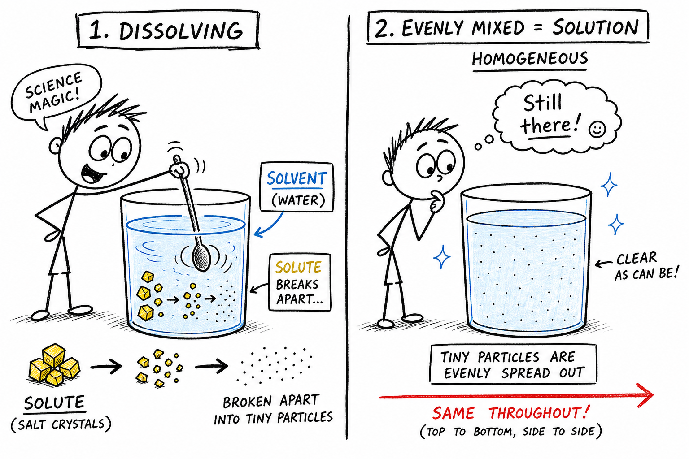
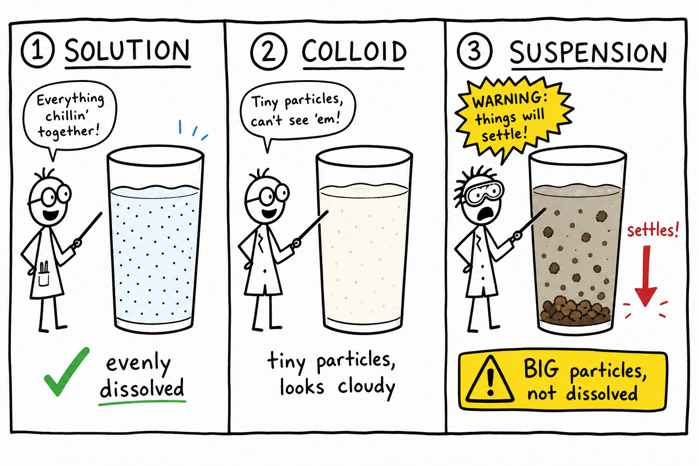
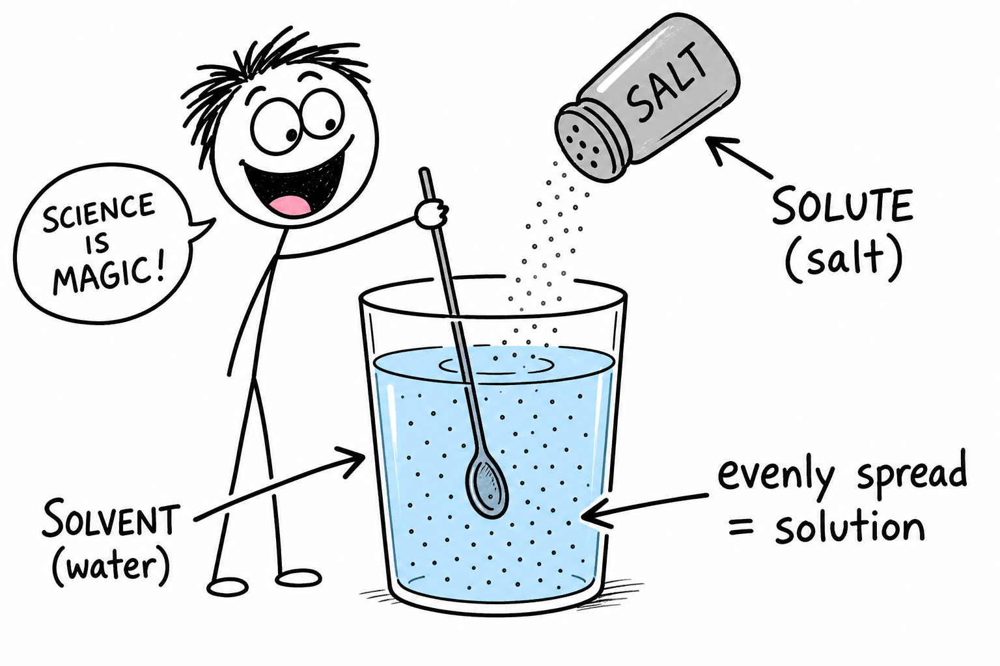
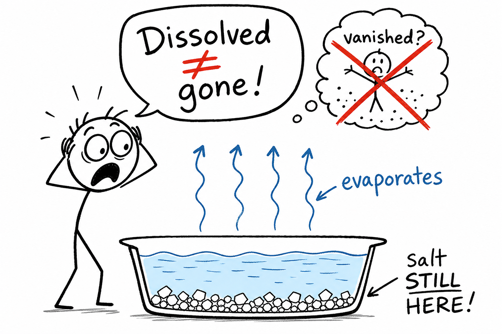
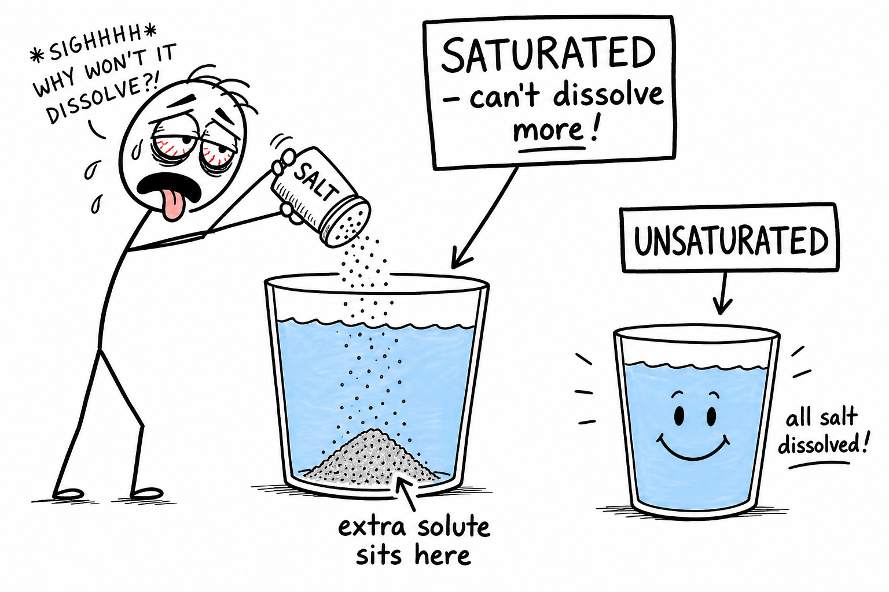
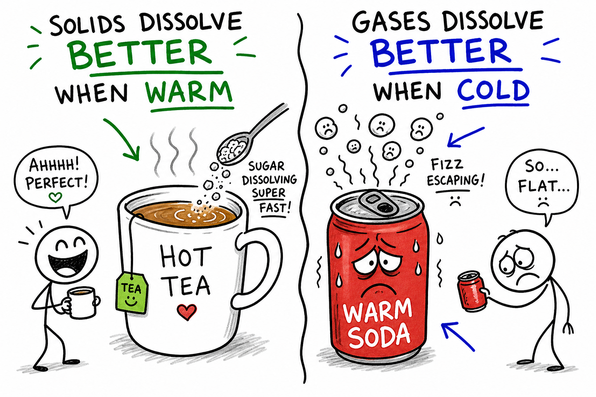
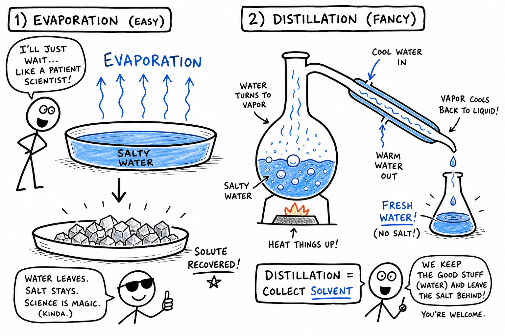

# Solution

You shake a sports drink before a game and the powder vanishes into the liquid. You watch pool chlorine dissolve in a bucket of water. You crack open a cold soda and bubbles rush out. You swim in the ocean and taste salt on your lips even though the water looks clear.

None of those moments look the same. But each one involves a **solution** — a homogeneous mixture in which one substance is evenly dissolved in another.

Stir a spoonful of salt into a glass of water. After a little while, the salt seems to disappear. The water looks clear again. It did not vanish. It **dissolved**.

That is the power of a solution.

**A solution is a homogeneous mixture in which one substance is evenly dissolved in another.**

Solutions are everywhere: salt water, sugar water, vinegar, lemonade, air, brass, soda, medicine, ocean water, and many fluids in your body. Understanding solutions helps explain cooking, oceans, plants, blood, cleaning, medicine, pollution, and chemistry.

As you learned in the chapter on **mixtures**, matter can combine physically without forming a new compound. A solution is a special kind of mixture — the kind where dissolved particles are spread so evenly that the mixture looks uniform throughout.

## A Solution Is a Mixture

A **mixture** is matter made of two or more substances physically combined.

A solution is a special kind of mixture.

It is **homogeneous**, which means it has the same composition throughout.

If salt is completely dissolved in water and well stirred, a small sip from the top would have about the same saltiness as a small sip from the bottom. The particles are spread evenly.

This even spreading is what makes a solution different from many other mixtures — such as muddy water (a suspension) or milk (a colloid), which you met in the **mixture** chapter.

| Type | Evenly spread? | Settles? | Example |
|------|----------------|----------|---------|
| Solution | Yes, dissolved | No | Salt water, air |
| Colloid | Partly, tiny particles | Slowly or not | Milk, fog |
| Suspension | No, larger particles | Often yes | Muddy water |

## Homogeneous Means Same Throughout

**Homogeneous** means the same throughout.

A solution looks uniform because its particles are mixed at a very small scale.

Sugar water may look like plain water, but sugar molecules are spread through it.

Air looks like one substance, but it is a solution of gases, mostly nitrogen and oxygen.

Brass looks like one metal, but it is a solid solution made mostly of copper and zinc.

Solutions can be liquid, gas, or solid.

## Solute and Solvent

Every solution has a **solute** and a **solvent**.

The **solute** is the substance being dissolved.

The **solvent** is the substance doing the dissolving.

| Solution | Solute | Solvent |
|----------|--------|---------|
| Salt water | Salt | Water |
| Sugar water | Sugar | Water |
| Soda | Carbon dioxide (and flavors) | Water |
| Air | Oxygen, argon, CO2, others | Nitrogen (main gas) |
| Brass | Zinc | Copper (main metal) |

The solvent is usually the substance present in the larger amount.

## Dissolving

**Dissolving** happens when particles of a solute separate and spread evenly among particles of a solvent.

When salt dissolves in water, the salt crystal breaks apart into tiny charged particles called **ions**. Water molecules surround and pull these ions away from the crystal.

When sugar dissolves in water, sugar molecules separate from the crystal and spread among the water molecules.

In both cases, the solute particles become too small and evenly spread out for your eyes to see. They are still present.

## Dissolved Does Not Mean Gone

One common mistake is thinking a dissolved substance has disappeared.

It has not.

If salt water is left in a shallow dish, the water can evaporate and salt crystals may be left behind.

If sugar dissolves in tea, the tea tastes sweet because sugar molecules are still there.

If carbon dioxide is dissolved in soda, it can bubble out when the bottle is opened.

**Dissolved** means spread out among solvent particles, not destroyed.

That is why evaporation can recover salt from salt water — proof the salt was there all along.

## Water as a Solvent

Water is one of the most important solvents on Earth.

It dissolves many substances, including many salts, sugars, acids, bases, and gases.

Because water dissolves so many substances, it is sometimes called the **universal solvent**.

This nickname is useful but not perfect.

Water does not dissolve everything. Oil, wax, sand, and many plastics do not dissolve well in water.

Still, water's ability to dissolve many substances is essential for life, weathering, soil, oceans, blood, plants, and chemistry.

## Solubility

**Solubility** is how much solute can dissolve in a certain amount of solvent at a certain temperature.

Some substances are very soluble in water. Sugar and table salt dissolve easily.

Some substances have low solubility. Sand does not dissolve much in water. Oil does not dissolve well in water.

Solubility depends on the solute, the solvent, and the temperature.

The phrase **"like dissolves like"** is often used in chemistry. It means substances with similar particle attractions often dissolve one another better. Polar substances such as salt tend to dissolve in polar solvents such as water. Nonpolar substances such as oil tend to dissolve better in nonpolar solvents.

## Concentration, Dilute, and Concentrated

**Concentration** tells how much solute is dissolved in a certain amount of solution.

A **concentrated** solution has a lot of solute compared with the amount of solution.

A **dilute** solution has a small amount of solute compared with the amount of solution.

Very salty seawater is more concentrated with salt than slightly salty water.

Strong lemonade may be more concentrated with sugar and lemon flavor than weak lemonade.

If you add more water to juice, you **dilute** it.

If water evaporates from salt water, the remaining solution becomes more concentrated.

Dilute and concentrated are comparison words. They make sense when you compare one solution with another.

In science, concentration can be measured with numbers, but the basic idea is simple: how much solute is present compared with the whole solution.

Concentration matters in medicine, cooking, cleaning, farming, swimming pools, and laboratories. A small change in concentration can matter greatly — especially with medicine or pool chemicals.

## Saturated, Unsaturated, and Supersaturated

How much solute can a solution hold? That depends on conditions.

| Type | Meaning | Classroom clue |
|------|---------|----------------|
| **Unsaturated** | Can still dissolve more solute | All added solid dissolves; more could go in |
| **Saturated** | Holding as much dissolved solute as it can at that temperature | Extra solid sits at the bottom undissolved |
| **Supersaturated** | More dissolved solute than normal at that temperature; often unstable | Advanced demo; may crystallize when disturbed |

If you keep adding salt to water and stirring, eventually some salt may stop dissolving and remain at the bottom. At that point, the solution may be **saturated**. The water has dissolved all the salt it can under those conditions.

If you add a small amount of sugar to water and it all dissolves easily, the solution is probably **unsaturated** — more sugar could still dissolve.

A **supersaturated** solution contains more dissolved solute than it normally should at a certain temperature. This can happen when a hot saturated solution cools carefully without the extra solute crystallizing out. Supersaturated solutions are unstable. If disturbed, they may suddenly form crystals. Rock candy can be made from a supersaturated sugar solution.

If the temperature changes, the amount that can dissolve may change too.

## Temperature and Solubility

Temperature often affects solubility.

Many solids dissolve better in warmer liquids.

Sugar dissolves more easily in hot tea than in cold tea. More sugar can dissolve in hot water than in cold water.

For gases, the pattern is often different.

Gases often dissolve better in cold liquids than in warm liquids.

Cold soda usually holds carbon dioxide better than warm soda. Warm soda goes flat faster.

## What Affects How Fast Dissolving Happens

Stirring does not always change how much solute can dissolve, but it can change **how fast** dissolving happens.

Stirring brings fresh solvent into contact with the solute. A sugar cube dissolves faster if the water is stirred.

**Crushing** the solute into smaller pieces can also speed dissolving because more **surface area** touches the solvent. Granulated sugar dissolves faster than a large sugar cube. Powdered drink mix dissolves faster when its tiny particles spread through water.

**Heating** can speed dissolving too.

These factors affect **rate** — how quickly something happens — not always the final limit set by solubility.

Surface area matters in dissolving, chemical reactions, digestion, and weathering. The more contact between particles, the faster many processes can happen.

## Solutions of Gases and Solids

Gases can form solutions too.

**Air** is a solution of gases. Nitrogen is the main gas in air. Oxygen, argon, carbon dioxide, water vapor, and other gases are mixed through it.

Gases can also dissolve in liquids.

Fish use oxygen dissolved in water.

Carbon dioxide dissolves in soda under pressure. When a soda bottle is opened, pressure decreases and carbon dioxide bubbles out.

Some solutions are **solid**.

An **alloy** is a solid mixture of a metal with one or more other elements.

Brass is a solid solution made mostly of copper and zinc.

Steel is made mostly of iron with carbon and sometimes other elements.

The atoms of the added elements are spread through the metal.

Solid solutions show that "solution" does not always mean liquid. Many classroom examples are liquids because they are easy to see and make.

## Electrolytes

Some solutions conduct electricity.

An **electrolyte** is a substance that forms ions in solution and allows the solution to conduct electric current.

Salt water conducts electricity better than pure water because dissolved salt forms ions.

Sports drinks contain electrolytes such as sodium and potassium compounds.

The human body needs ions dissolved in body fluids for nerve signals, muscle action, and many cell processes.

Do not test conductivity with household electricity. Use only safe classroom equipment if conductivity is demonstrated.

## Acids and Bases in Solution

Many acids and bases are studied in water solutions.

Vinegar is a solution containing acetic acid.

Lemon juice contains citric acid dissolved in water.

Baking soda can dissolve in water to form a mildly basic solution.

Acids and bases can react with each other. They can also irritate skin or eyes, especially if concentrated.

The next chapters will study **acids**, **bases**, and **salts** more deeply.

## Separating Solutions

Solutions can often be separated, but not by ordinary filtering.

If salt is dissolved in water, the salt particles pass through most filters with the water.

| Method | What happens | Best for |
|--------|--------------|----------|
| **Evaporation** | Solvent becomes gas; solute left behind | Recovering dissolved solid (salt from salt water) |
| **Distillation** | Solvent boiled, vapor condensed | Collecting pure solvent (fresh water from salt water) |
| **Crystallization** | Crystals form as solvent leaves or solution cools | Purifying solids; rock candy |

The best method depends on whether you want the dissolved substance, the solvent, or both.

### Evaporation

Evaporation can separate a dissolved solid from a liquid.

If salt water is placed in a shallow dish, the water evaporates and salt crystals remain. This happens naturally in salt ponds along coasts.

Evaporation is simple, but the solvent is lost into the air unless it is captured. It works because water changes to gas at ordinary temperatures while salt does not.

### Distillation

**Distillation** separates substances by differences in boiling point.

To separate salt water by distillation, the water is heated until it becomes vapor. The vapor is then cooled and condensed back into liquid water. The salt stays behind.

Distillation can produce fresh water from salt water. It can also separate some liquid mixtures.

Distillation uses heat and glassware, so it should be done only with proper equipment and adult supervision.

### Crystallization

**Crystallization** is the formation of solid crystals from a solution.

If water evaporates from a saltwater solution, salt crystals can form.

If a hot sugar solution cools slowly, sugar crystals may form.

Crystallization can purify substances and create beautiful crystal shapes. Rock candy is made by crystallizing sugar from a solution.

Crystals show that dissolved particles can come back together in orderly patterns — a topic the next chapter on **crystals** explores further.

## Solutions Everywhere

### In Living Things

Living things depend on solutions.

Blood plasma is mostly water with dissolved salts, nutrients, gases, wastes, and proteins.

Cells contain watery solutions where chemical reactions happen.

Plant roots absorb minerals dissolved in water.

Digestive fluids dissolve and carry nutrients.

Sweat is a solution containing water, salts, and small amounts of other substances.

Life depends on substances dissolving, moving, and reacting in solution.

### In the Environment

Natural water is usually a solution.

Rainwater can contain dissolved gases.

River water contains dissolved minerals.

Seawater contains dissolved salts.

Groundwater dissolves minerals as it moves through rocks and soil.

Pollutants can also dissolve in water, making them harder to remove.

Understanding solutions helps scientists study drinking water, oceans, lakes, soil, and pollution.

### In Daily Life

Solutions are part of ordinary life.

Tea, coffee, lemonade, vinegar, soda, salt water, mouthwash, cleaning sprays, swimming pool water, contact lens solution, and many medicines are solutions.

Cooking often involves dissolving salt, sugar, spices, acids, and flavors.

Cleaning often uses solutions that dissolve grease, dirt, minerals, or stains.

Medicine depends on carefully measured solutions. A small change in concentration can matter greatly.

## Common Misconceptions

One mistake is thinking a solution must be a liquid. Some solutions are gases, such as air, and some are solids, such as alloys.

Another mistake is thinking dissolved substances disappear. They are still present as particles spread through the solvent.

A third mistake is thinking all mixtures are solutions. Only homogeneous mixtures with evenly dissolved substances are solutions.

A fourth mistake is thinking stirring always lets more solute dissolve. Stirring often speeds dissolving, but **solubility** sets a limit.

A fifth mistake is thinking clear liquids are always pure. Clear liquids can contain dissolved substances.

## Solution Safety

Solutions can be safe, useful, irritating, poisonous, flammable, corrosive, or medically powerful.

Good safety habits include:

- Do not taste solutions during science activities.
- Do not smell unknown solutions directly.
- Do not mix household cleaners or chemicals without adult instruction.
- Wear goggles when mixing, heating, or pouring solutions.
- Keep solutions away from electrical devices unless the activity is designed for it.
- Use heat only with adult supervision.
- Label all containers clearly.
- Wash hands after handling experiment materials.
- Clean spills with adult guidance.
- Follow teacher instructions for disposal.

Many dangerous substances are invisible once dissolved, so **clear does not always mean safe**.

## The Big Idea

A solution is a homogeneous mixture in which one substance is evenly dissolved in another.

The solute is dissolved, and the solvent does the dissolving. Solutions can be liquid, gas, or solid. Concentration tells how much solute is present, and solubility tells how much can dissolve under certain conditions. Temperature, stirring, and particle size can affect how fast dissolving happens. Solutions are important in living things, oceans, weather, cooking, cleaning, medicine, and industry.

If you remember only one sentence, remember this:

**A solution is an evenly mixed mixture in which solute particles are spread throughout a solvent.**

## Study Questions

1. What is a solution?
2. What kind of mixture is a solution?
3. What does homogeneous mean?
4. Why does sugar water look the same throughout when well mixed?
5. What is a solute?
6. What is a solvent?
7. In salt water, which substance is the solute and which is the solvent?
8. What happens when a substance dissolves?
9. Why does dissolved not mean gone?
10. Why is water an important solvent?
11. Does water dissolve everything? Give examples.
12. What is solubility?
13. What is concentration?
14. What is the difference between dilute and concentrated?
15. What is a saturated solution?
16. What is an unsaturated solution?
17. What is a supersaturated solution?
18. How does temperature often affect the solubility of solids in liquids?
19. How does temperature often affect the solubility of gases in liquids?
20. How can stirring affect dissolving?
21. Why do smaller particles often dissolve faster?
22. Give two examples of gas solutions or gases dissolved in liquids.
23. What is a solid solution?
24. What is an electrolyte?
25. Why does salt water conduct electricity better than pure water?
26. Why can ordinary filtering not separate salt from salt water?
27. How can evaporation separate a solution?
28. What is distillation?
29. Name two common misconceptions about solutions.
30. What are three safety rules for studying solutions?
31. In your own words, explain why understanding solutions helps you make sense of something you use or see often — from sports drinks to oceans to medicine.
