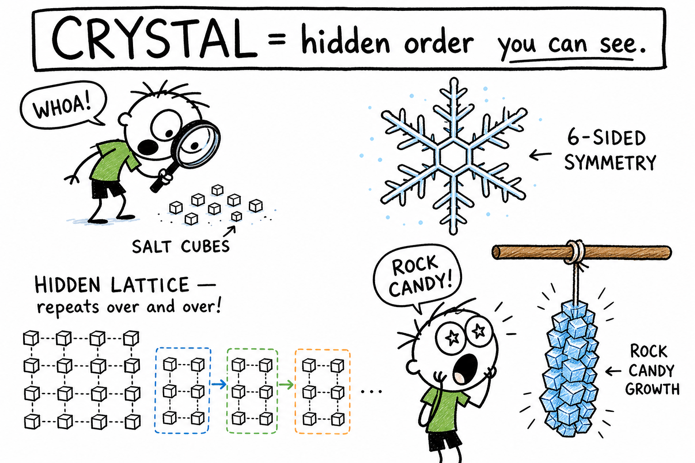
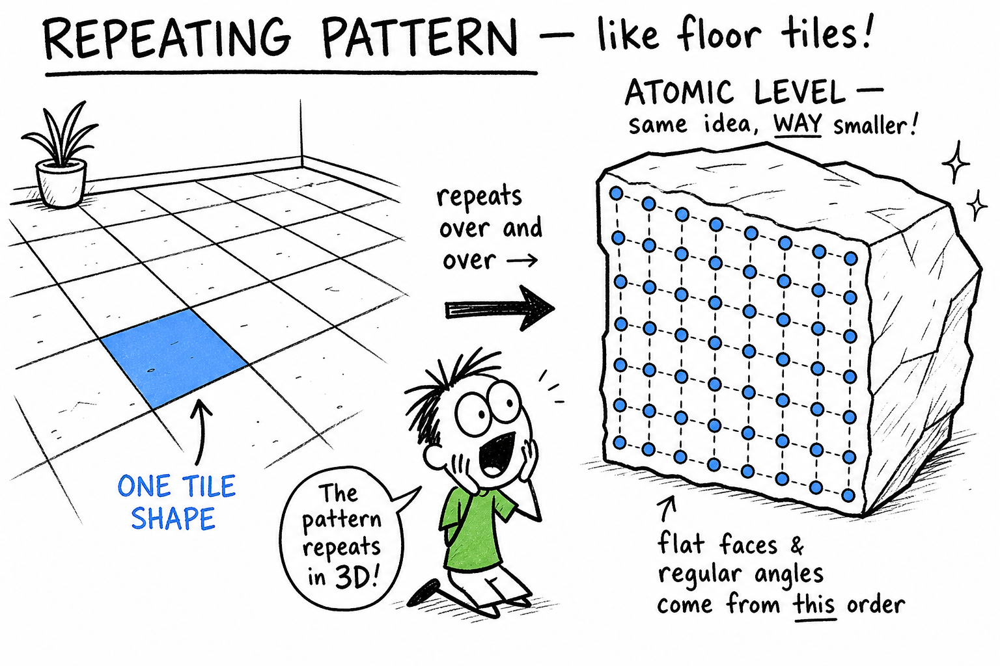
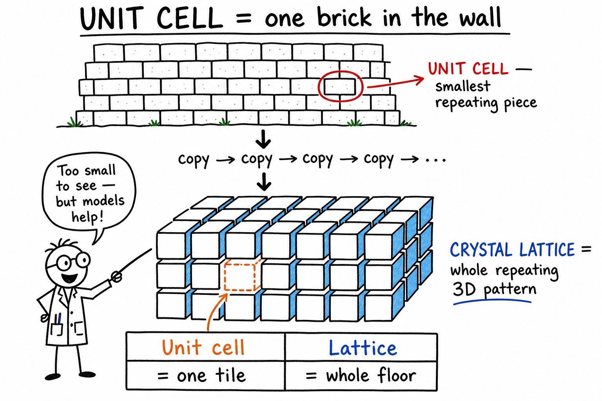
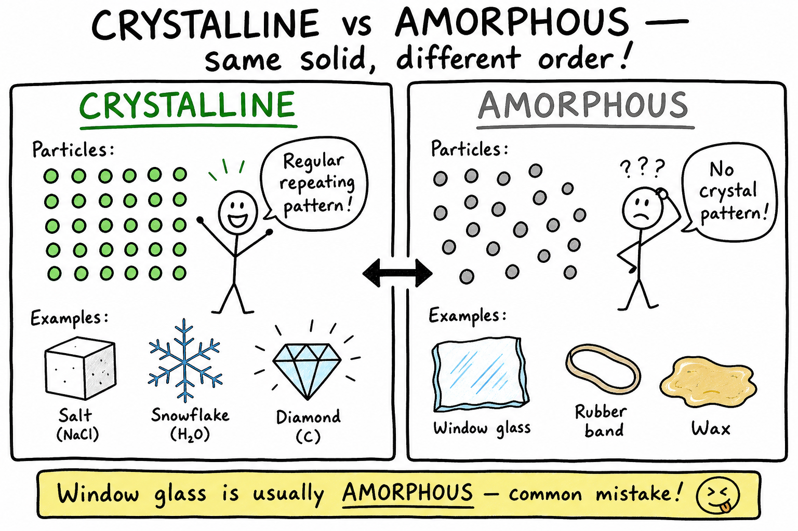
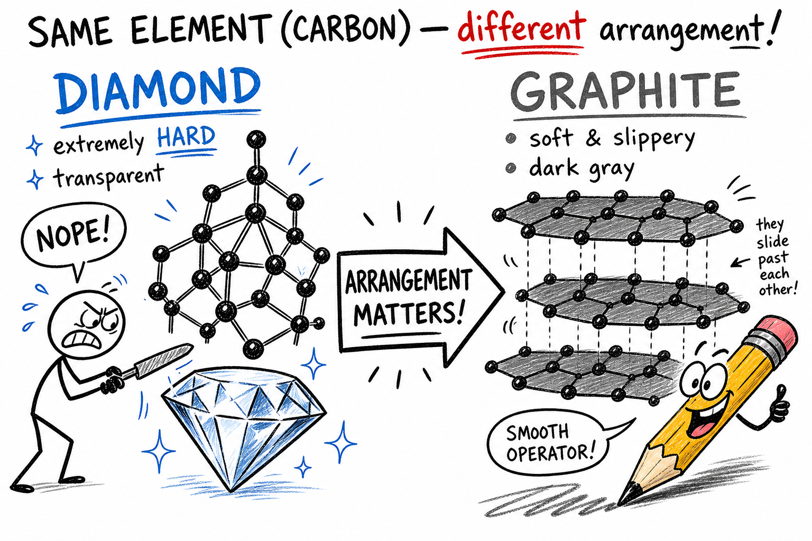
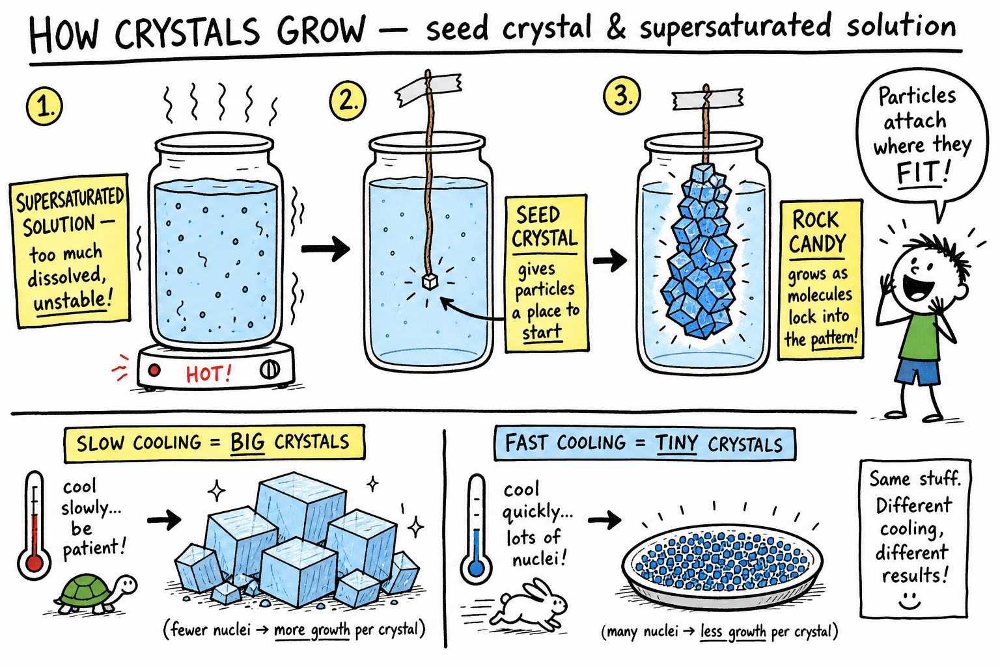

# Crystal

You pour salt on fries and the grains look like plain white dust. You hang a string in hot sugar water and watch rock candy slowly grow. You catch a snowflake on your glove and see six arms before it melts. You tap the screen on a phone or game controller and never think about the tiny crystal inside that helps it keep time.

None of those moments look the same. But each one involves the same hidden idea.

**A crystal is a solid whose particles are arranged in a regular repeating pattern.**

That hidden order is the power of a crystal. It can produce cube-shaped salt grains, sparkling sugar, six-sided snowflakes, hard quartz, blazing diamonds, orderly metal, computer chips, medicines, and minerals inside rocks.

Crystals are everywhere: salt, sugar, snowflakes, quartz, diamonds, metals, minerals, rocks, computer chips, medicines, and even some parts of living things. They show that the tiny world of atoms, ions, and molecules can create visible order you can actually see — if you know what to look for.

As you learned in the chapter on **solids**, a solid has definite shape and volume. As you learned in the chapter on **solutions**, dissolved particles can leave a liquid and come back together as solids during **crystallization**. This chapter zooms in on the solids whose particles line up in repeating patterns.

## Crystals Are Solids

A crystal is a kind of solid.

A **solid** is a state of matter with a definite shape and a definite volume.

In solids, particles are close together and mostly vibrate in place.

In a crystal, those particles are not arranged randomly. They are arranged in an orderly repeating pattern.

The particles may be **atoms**, **ions**, or **molecules** — the same tiny building blocks you met in earlier chapters on matter, atoms, and molecules.

This hidden pattern helps explain the shape, hardness, melting point, cleavage, color, and other properties of a crystal.

## The Repeating Pattern

The key idea in a crystal is repetition.

A crystal's particles are arranged in a pattern that repeats over and over in three dimensions.

It is a little like floor tiles. One tile has a shape, and the same shape repeats across the floor.

In a crystal, the repeating pattern is much smaller than a floor tile. It happens at the atomic or molecular level.

Because the pattern repeats, the crystal may grow with flat faces and regular angles.

The outside shape can give clues about the inside pattern.

## Crystal Lattice and Unit Cell

A **crystal lattice** is the regular three-dimensional arrangement of particles in a crystal.

The word *lattice* means a framework or pattern.

A **unit cell** is the smallest repeating part of that lattice.

Imagine a brick wall. One brick is not the whole wall, but repeating bricks make the wall. In a crystal, the unit cell repeats again and again to build the whole structure.

| Term | Meaning | Think of it as… |
|------|---------|-----------------|
| **Crystal lattice** | The full repeating 3D particle pattern | The whole tiled floor |
| **Unit cell** | The smallest repeating piece of the lattice | One tile that repeats |

Unit cells are far too small to see with your eyes. Scientists use models, mathematics, and special instruments to study them. The unit cell helps explain why crystals often have predictable shapes and angles.

### Examples of Different Lattices

In table salt, sodium ions and chloride ions alternate in a regular lattice.

In diamond, carbon atoms are bonded in a strong three-dimensional network.

In metals, atoms are packed in orderly patterns that allow some electrons to move.

Different lattices produce different properties.

## Crystal Faces, Angles, and Symmetry

The flat surfaces of a crystal are called **crystal faces**.

Crystal faces form because particles add to the growing crystal in an orderly way.

Salt crystals often have cube-like faces. Quartz crystals often have six-sided prisms with pointed ends. Snowflakes often show six-sided symmetry.

The angles between crystal faces are related to the particle pattern inside the crystal.

**Symmetry** means a balanced or repeated arrangement. A snowflake has six-sided symmetry because of the way water molecules arrange themselves as ice.

Not every crystal is perfect or large enough to show obvious symmetry, but the internal order is still present.

A crystal's beauty is the visible result of invisible order.

## Crystalline and Amorphous Solids

Not all solids are crystals.

| Type | Particle arrangement | Examples |
|------|---------------------|----------|
| **Crystalline solid** | Regular repeating pattern | Salt, sugar, quartz, diamond, snowflakes, many metals |
| **Amorphous solid** | No regular crystal pattern | Glass, rubber, many plastics, wax, some gels |

Both are solids with definite shape and volume under ordinary conditions. The difference is how the particles are arranged — and that difference affects properties.

Ordinary window glass is usually amorphous, not crystalline. That is a common point of confusion.

## Ions, Atoms, and Molecules in Crystals

Crystals can be built from different kinds of particles.

| Built from | Example | Notes |
|------------|---------|-------|
| **Ions** | Table salt (NaCl) | Positive sodium ions and negative chloride ions alternate |
| **Atoms** | Diamond, many metals | Carbon atoms in a network; metal atoms in orderly packs |
| **Molecules** | Sugar, ice | Sucrose molecules or water molecules in repeating patterns |

Same kinds of particles can form very different crystals if they arrange differently. Carbon is the famous example.

## Salt Crystals

Table salt is sodium chloride. Its formula is NaCl.

Salt crystals often form tiny cubes. Inside the crystal, positive sodium ions and negative chloride ions alternate in a regular pattern. Opposite charges attract, which helps hold the lattice together.

Salt dissolves in water because water molecules can pull sodium and chloride ions away from the crystal — the same dissolving idea you studied in the **solution** chapter.

If salt water evaporates, salt crystals can form again. Dissolving and crystallizing are partners.

## Sugar Crystals and Rock Candy

Sugar can form crystals too.

Table sugar is sucrose, a compound made of carbon, hydrogen, and oxygen. Sugar crystals are made of sugar molecules arranged in an orderly pattern.

**Rock candy** is made by growing large sugar crystals from a sugar solution. As water evaporates or as a hot solution cools, sugar molecules leave the solution and join the growing crystal where they fit the pattern.

The crystal grows when molecules attach in the right places. That is crystallization in action — and it is one of the best hands-on ways to see hidden order become visible.

## Quartz Crystals

Quartz is a common mineral made of silicon and oxygen. Its formula is SiO₂.

Quartz often forms six-sided crystals with pointed ends. It is hard, durable, and common in many rocks.

Quartz is used in glassmaking, watches, electronics, and many industrial materials. Tiny quartz crystals can vibrate at very regular rates, which makes them useful in timekeeping. Your phone or game device may depend on crystal timing you never see.

This is one example of how crystal properties power modern technology.

## Diamond and Graphite: Same Element, Different Structure

Diamond and graphite are both made of carbon atoms. Yet they are very different.

| Property | Diamond | Graphite |
|----------|---------|----------|
| Hardness | Extremely hard | Soft and slippery |
| Appearance | Transparent | Dark gray, used in pencil "lead" |
| Structure | Strong 3D network of bonded carbon atoms | Flat layers that slide past one another |

Same element. Different crystal structure. Very different properties.

That is one of the most important lessons in materials science: **arrangement matters**.

## Snowflakes

Snowflakes are ice crystals.

They form when water vapor in cold air changes into ice. Water molecules arrange themselves in patterns that often produce six-sided shapes.

No two large snowflakes are likely to be exactly alike because each one travels through different temperatures, humidity, and air currents as it grows.

Snowflakes show how tiny molecular arrangements can create delicate visible forms. They are crystals falling from the sky.

## Minerals and Gemstones

A **mineral** is a naturally occurring solid with a definite chemical composition and an orderly crystal structure.

Most rocks are made of minerals. Examples include quartz, feldspar, mica, calcite, halite, and diamond.

Geologists identify minerals using properties such as color, streak, hardness, luster, cleavage, crystal shape, density, and reaction with acid.

Many **gemstones** are crystals valued for beauty, hardness, color, rarity, and durability: diamond, ruby, sapphire, emerald, amethyst, topaz, and garnet.

Color often comes from tiny amounts of other elements inside the crystal. Ruby and sapphire are both forms of the mineral corundum. Ruby is red because of traces of chromium. Sapphire can be blue because of traces of iron and titanium.

Tiny impurities can make a crystal more beautiful — and more valuable.

## Crystal Growth and Crystallization

Crystals grow when particles join a regular pattern.

**Crystallization** is the process by which crystals form.

Crystal growth can happen from:

- Cooling melted material
- Evaporating a solution
- Cooling a hot solution
- Deposition from gas
- Slow formation inside rocks

The growing crystal is like a building under construction. Particles attach where they fit the pattern.

If conditions are steady and there is enough space, larger and better-shaped crystals may form. If growth is fast or crowded, crystals may be smaller or irregular.

### From Solutions: Saturated, Supersaturated, and Seed Crystals

Crystals often grow from solutions — connecting back to the **solution** chapter.

A **saturated solution** holds as much dissolved solute as it can at a certain temperature. If more solute is added, it may not dissolve.

A **supersaturated solution** holds more dissolved solute than it normally should at that temperature. Supersaturated solutions are unstable. If a seed crystal is added, or if the solution is disturbed, crystals may suddenly grow.

A **seed crystal** is a small crystal used to start or guide crystal growth. Particles from a solution attach to it. Rock candy often starts with sugar crystals on a string or stick. The seed gives dissolved particles a place to begin building the pattern.

Without a seed, crystals can still form, but they may start in many places and grow smaller.

### Cooling Speed and Crystal Size

The speed of cooling affects crystal size.

| Cooling | Typical result |
|---------|----------------|
| **Slow** | Larger crystals — particles have more time to arrange |
| **Fast** | Smaller crystals — particles locked in place quickly |
| **Very fast** (lava at surface) | May form volcanic glass (amorphous, not crystalline) |

This idea is important in geology. Igneous rocks that cool slowly underground often have larger mineral crystals. Lava that cools quickly at Earth's surface often has smaller crystals.

## Cleavage, Fracture, and Hardness

Some crystals break along flat planes. This is called **cleavage**.

Cleavage happens because bonds may be weaker in certain directions inside the crystal lattice. Mica splits into thin sheets. Halite (rock salt) can break into cube-like pieces.

If a mineral breaks in irregular shapes instead of flat planes, that is called **fracture**.

**Hardness** is resistance to being scratched. Diamond is extremely hard because of its strong carbon bonding network. Talc is very soft. Quartz is hard enough to scratch glass.

Geologists often use scratch tests to help identify minerals. Cleavage, fracture, and hardness all depend on particle type and bond arrangement in the crystal.

## Defects and Color

Real crystals are rarely perfect.

A **crystal defect** is a place where the regular pattern is interrupted — a missing particle, an extra particle, a different atom in place of the usual one, or a shifted row.

Defects can change a crystal's color, strength, electrical behavior, and other properties. In some technologies, carefully controlled defects are extremely useful.

Crystals can be colorful. Sometimes color comes from the main elements. Sometimes it comes from tiny impurities. Amethyst is purple quartz. Ruby is red corundum with chromium. Emerald is green beryl with small amounts of chromium or vanadium.

Small changes in composition can make large changes in appearance.

## Crystals in Technology, Food, and Life

Crystals are not only pretty. They are useful.

| Area | Examples |
|------|----------|
| **Technology** | Quartz in watches and clocks; silicon in computer chips and solar cells; crystals in lasers, sensors, and medical imaging |
| **Food** | Sugar and salt crystals; ice in frozen foods; cocoa butter crystals in chocolate; ice crystal size in ice cream |
| **Living things** | Calcium phosphate crystals in bones and teeth; calcium carbonate in shells and coral; tiny crystals used for balance in some animals |

Many medicines are manufactured and studied as crystals. Modern technology depends on understanding crystal structure.

In ice cream, small ice crystals make a smoother texture; large ice crystals make it feel grainy. Food science is full of crystals.

## X-Ray Crystallography and Light

Scientists can study crystals using X-rays.

**X-ray crystallography** is a method that uses X-rays to learn the arrangement of atoms in a crystal. When X-rays pass through a crystal, they scatter in patterns scientists can analyze. This method has helped reveal the structures of minerals, metals, medicines, proteins, DNA, and many other substances.

Crystals can also interact with light in special ways — bending it, splitting it, sparkling from many faces, glowing under ultraviolet light, or passing through as transparent, translucent, or opaque materials.

The arrangement of particles affects how light moves through or reflects from the crystal. That is why crystals matter in lenses, lasers, jewelry, and instruments.

## Common Misconceptions

One mistake is thinking all crystals are rare gemstones. Salt, sugar, snowflakes, metals, and many minerals are crystals too.

Another mistake is thinking crystals are alive because they grow. Crystal growth is not life; it is particles adding to a repeating pattern.

A third mistake is thinking all shiny rocks are crystals. Some shiny materials are not crystals, and some crystals are not shiny.

A fourth mistake is thinking glass is a crystal. Ordinary glass is usually amorphous, not crystalline.

A fifth mistake is thinking bigger crystals are always better or purer. Crystal size depends on growth conditions; purity depends on composition.

## Crystal Safety

Crystal activities can be safe and beautiful when done carefully.

Good safety habits include:

- Do not taste crystals or crystal-growing solutions during science activities.
- Do not use unknown minerals or powders without adult permission.
- Wear goggles when heating solutions or handling chemicals.
- Use hot water only with adult supervision.
- Wash hands after handling minerals, salts, or solutions.
- Keep small crystals away from young children and pets.
- Do not grow crystals from dangerous household chemicals.
- Label containers clearly.
- Do not pour unknown solutions down the drain unless instructed.
- Handle sharp crystals, glass, and broken mineral pieces carefully.

Beautiful does not always mean safe. Treat crystals as scientific materials.

## The Big Idea

A crystal is a solid whose particles are arranged in a regular repeating pattern.

That pattern forms a crystal lattice and gives many crystals flat faces, regular angles, symmetry, cleavage, hardness, color, and other properties. Crystals can be made of atoms, ions, or molecules. They can grow from solutions, melts, gases, or slow natural processes. Crystals occur in minerals, gemstones, snowflakes, salt, sugar, metals, foods, living things, and modern technology.

If you remember only one sentence, remember this:

**A crystal is a solid with hidden particle order that repeats again and again, often producing regular shapes and special properties.**

## Study Questions

1. What is a crystal?
2. Why is a crystal considered a solid?
3. What makes a crystal different from an amorphous solid?
4. What is a crystal lattice?
5. What is a unit cell?
6. What are crystal faces?
7. Why do some crystals have flat faces and regular angles?
8. What kinds of particles can make up crystals?
9. What particles make up table salt crystals?
10. What shape do salt crystals often form?
11. What are sugar crystals made of?
12. What is quartz made of?
13. How are diamond and graphite alike?
14. Why are diamond and graphite so different?
15. Why do snowflakes often have six-sided shapes?
16. What is a mineral?
17. Give four examples of minerals.
18. Why are many gemstones crystals?
19. What is crystallization?
20. Name three ways crystals can grow.
21. What is a saturated solution?
22. What is a supersaturated solution?
23. What is a seed crystal?
24. How can cooling speed affect crystal size?
25. What is cleavage?
26. What is hardness?
27. What is a crystal defect?
28. Give three ways crystals are used in technology or daily life.
29. Name two common misconceptions about crystals.
30. What are three safety rules for crystal activities?
31. In your own words, explain how a crystal you have seen or used — salt, sugar, snow, rock candy, a mineral, or a device — shows hidden order on the inside.
