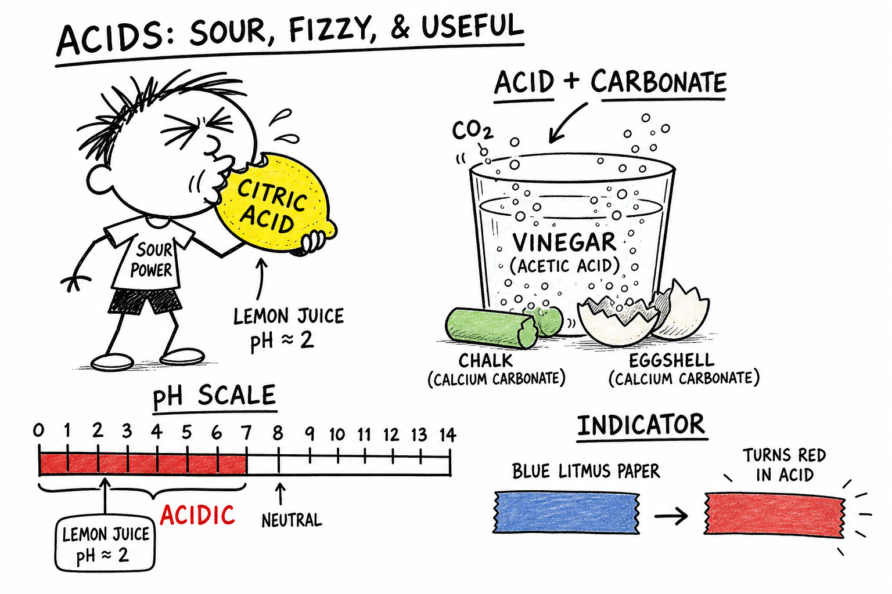

# Acid

You bite into a lemon after a game and your whole face scrunches. You pour vinegar on baking soda and foam shoots up the bowl. You crack open a cold soda and taste that sharp tang. You hear a coach warn swimmers not to get pool chemicals in their eyes.

Different moments — same chemistry idea.

**An acid is a substance that produces hydrogen ions in water or donates protons in chemical reactions.**

Acids can be mild and familiar, or strong and dangerous. They help explain sour taste, digestion, cleaning, rust, rocks, batteries, pollution, medicine, and countless chemical reactions. Understanding acids is one of the keys to real chemistry.

As you learned in the chapter on **solutions**, many acids are studied dissolved in water. As you learned in the chapter on **compounds**, most acids are pure substances made of two or more elements joined in fixed ratios.

## Acids in Water

Many acids are studied as **solutions** in water.

A **solution** is a homogeneous mixture in which one substance is evenly dissolved in another.

When some acids dissolve in water, they produce **hydrogen ions**, often written as **H+**.

The more hydrogen ions an acidic solution has, the more acidic it is.

This does not mean every acid solution is safe. Some acid solutions are very dangerous even though they look like clear water.

## Protons and Acids

In chemistry, a hydrogen ion (H+) is basically a **proton**.

An ordinary hydrogen atom has one proton and one electron. If it loses its electron, only the proton remains.

That is why acids are sometimes described as **proton donors**.

A **proton donor** is a substance that can give a proton, or H+, to another substance.

For this chapter, remember:

**Acids increase hydrogen ions in water and can donate protons in reactions.**

## Sour Taste

Many weak acids taste sour.

| Acid | Where you find it |
|------|-------------------|
| Citric acid | Lemons, oranges, sports drinks |
| Acetic acid | Vinegar, pickles |
| Malic acid | Apples, green candy |
| Lactic acid | Yogurt, sourdough, tired muscles |
| Carbonic acid | Fizzy drinks |

Sour taste can be a clue that food contains acid. In science, though, taste is **not** a safe test.

**Never taste an unknown substance** to find out whether it is an acid. Unknown acids may be poisonous, corrosive, or harmful.

## Acids Are Compounds

Most acids are chemical **compounds** — pure substances made of two or more elements chemically joined in a fixed ratio.

| Acid | Elements involved |
|------|-------------------|
| Hydrochloric acid | Hydrogen, chlorine |
| Sulfuric acid | Hydrogen, sulfur, oxygen |
| Nitric acid | Hydrogen, nitrogen, oxygen |
| Acetic acid | Carbon, hydrogen, oxygen |

The atoms and bonds in an acid determine how it behaves. The acid in an orange is not the same danger as the acid in a car battery.

## Strong and Weak Acids

Acids can be **strong** or **weak**.

| Term | Meaning |
|------|---------|
| **Strong acid** | Separates almost completely into ions in water |
| **Weak acid** | Separates only partly into ions in water |

Hydrochloric acid is a strong acid. Acetic acid in vinegar is a weak acid.

**Strong and weak do not mean concentrated and dilute.**

| Idea | What it describes |
|------|-------------------|
| **Strength** | How completely the acid forms ions in water |
| **Concentration** | How much acid is dissolved in a certain amount of solution |

A weak acid can be concentrated. A strong acid can be diluted.

## Concentrated and Dilute Acids

A **concentrated** acid solution has a lot of acid dissolved in it.

A **dilute** acid solution has less acid compared with the amount of solution.

Diluting an acid means adding solvent, usually water, to lower its concentration.

Dilute acids can still be dangerous depending on the acid and amount. Concentrated acids are often very dangerous. They can burn skin, damage eyes, react with metals, destroy cloth, or release harmful fumes.

**Only trained adults should handle strong or concentrated acids.**

## The pH Scale

Scientists use the **pH scale** to describe how acidic or basic a solution is.

The pH scale usually runs from 0 to 14.

| pH range | Type of solution | Examples |
|----------|------------------|----------|
| Below 7 | Acidic | Lemon juice, vinegar, stomach acid |
| 7 | Neutral | Pure water (at room temperature) |
| Above 7 | Basic | Soap solution, baking soda in water |

The pH scale helps compare solutions more carefully than just saying "sour" or "slippery."

## pH Is Logarithmic

The pH scale is not an ordinary counting scale. It is **logarithmic**.

A change of **1 pH unit** represents a **tenfold** change in acidity.

- pH 3 is ten times more acidic than pH 4
- pH 2 is one hundred times more acidic than pH 4

You do not need advanced mathematics yet. Just remember: **small pH number changes can mean large acidity changes.**

## Indicators

An **indicator** is a substance that changes color depending on acidity or basicity.

Indicators help detect acids and bases without tasting or guessing.

**Litmus paper** is a common indicator:

- Blue litmus paper turns **red** in an acid
- Red litmus paper stays **red** in an acid

**Universal indicator** can show a range of colors for different pH values.

Indicators are useful because many acids and bases look like plain water.

## Natural Indicators

Some natural substances can act as indicators.

**Red cabbage juice** is a common classroom example. It changes color in acidic and basic solutions.

| Solution type | Red cabbage indicator often looks |
|---------------|-----------------------------------|
| Acidic | Pink or red |
| Basic | Greenish, bluish, or yellowish (depending on strength) |

Natural indicators are useful for safe demonstrations with household substances, but they still require teacher guidance.

## Acids and Metals

Some acids react with metals.

When an acid reacts with certain metals, **hydrogen gas** may be produced and the mixture may bubble or fizz.

For example, hydrochloric acid can react with zinc to produce hydrogen gas and a zinc compound.

Not all metals react the same way. Gold is very unreactive with most acids. Magnesium and zinc react more easily.

Acid-metal reactions can produce **flammable hydrogen gas**, so they require careful safety controls. This is not a casual garage experiment.

## Acids and Carbonates

Acids react with **carbonates** to produce **carbon dioxide gas**.

Carbonates are compounds containing the carbonate group. **Calcium carbonate** is found in chalk, limestone, marble, seashells, coral, and eggshells.

When vinegar reacts with chalk or eggshell, bubbles of carbon dioxide can form.

That fizzing reaction is one of the safest classroom ways to observe an acid in action — when done with mild vinegar and teacher guidance.

Geologists also use acid tests to identify carbonate minerals in the field.

## Acids and Bases

Acids and **bases** often react with each other.

A **base** is a substance that can accept protons or produce hydroxide ions in water. (You will study bases in the next chapter.)

When an acid and a base react, they can **neutralize** each other. This is called **neutralization**.

Many neutralization reactions produce water and a **salt**.

For example, hydrochloric acid and sodium hydroxide can react to form water and sodium chloride.

Neutralization matters in medicine, agriculture, cleaning, and environmental protection.

## Salts

In chemistry, a **salt** is an ionic compound often formed from an acid-base reaction.

Table salt (sodium chloride) is one example — but chemistry has many salts besides the salt on food.

Calcium carbonate, copper sulfate, potassium nitrate, and magnesium chloride are also salts.

When acids react with bases, salts can form. The word **salt** in chemistry is broader than ordinary table salt.

## Stomach Acid

Your stomach contains **hydrochloric acid**.

This acid helps break down food and helps kill many harmful microbes. The stomach lining is protected by mucus and other defenses.

If stomach acid irritates the wrong places, it can cause pain or health problems.

**Antacids** are medicines that contain mild bases. They can neutralize some excess stomach acid.

Never take medicine without adult guidance.

## Acid Rain

**Acid rain** is rain, snow, fog, or other precipitation that is more acidic than normal because of pollution.

Burning fossil fuels can release sulfur dioxide and nitrogen oxides into the air. These gases can react with water and oxygen to form acids.

Acid rain can harm lakes, forests, soils, buildings, and statues. It can dissolve minerals and damage stone — especially limestone and marble.

Reducing air pollution helps reduce acid rain.

## Acids and Rocks

Acids can react with some rocks and minerals.

Limestone and marble contain calcium carbonate. Acids can dissolve calcium carbonate and produce carbon dioxide gas.

That is why acid rain can damage marble statues and limestone buildings.

It is also one way **caves** form. Slightly acidic groundwater can slowly dissolve limestone underground. Over long periods, tiny chemical reactions can shape huge landscapes.

## Acids in Batteries

Some batteries contain acids.

**Lead-acid car batteries** contain **sulfuric acid** — strong and dangerous. It can burn skin, damage eyes, and react with many materials.

Car batteries also store large amounts of electrical energy.

**Never open, tip, or tamper with a car battery.** Battery acid is a serious hazard, not a classroom material.

## Acids in Industry

Acids are used in many industries. They help make fertilizers, plastics, medicines, metals, dyes, cleaners, paper, and batteries.

| Acid | Industrial use |
|------|----------------|
| Sulfuric acid | One of the most widely produced industrial chemicals |
| Nitric acid | Fertilizers, explosives |
| Hydrochloric acid | Metal cleaning, chemical manufacturing |

Industrial acids are useful because they react strongly. That same reactivity makes them dangerous in the wrong hands.

## Acids and Cleaning

Some cleaners contain acids.

Mild acidic cleaners can help remove mineral deposits, rust stains, and hard-water scale. Vinegar can dissolve some mineral buildup because it contains acetic acid.

Stronger acidic cleaners can be dangerous and must be used only as directed by adults.

**Never mix acidic cleaners with other cleaners** unless the label and a trained adult say it is safe. Mixing cleaners can release poisonous gases.

## Acids and Teeth

Acids can affect teeth.

**Tooth enamel** is a hard mineral surface. Acids from foods, drinks, or bacteria in the mouth can slowly weaken enamel.

Sugary foods can feed bacteria that produce acids. That can lead to **tooth decay**.

Good tooth care includes brushing, flossing, drinking water, and limiting frequent sugary or acidic snacks.

Your mouth is a small chemistry lab. Your teeth are part of the experiment — treat them like equipment worth protecting.

## Organic and Inorganic Acids

Some acids are **organic** — they contain carbon. Citric acid, acetic acid, lactic acid, and ascorbic acid (vitamin C) are organic acids.

Some acids are **inorganic**. Hydrochloric acid, sulfuric acid, and nitric acid are inorganic acids.

Both kinds can be useful. Both can be dangerous depending on concentration and conditions. The name does not tell you everything about safety.

## Diluting Acids

Diluting acids must be done carefully.

In professional laboratories, the rule is:

**Add acid to water, not water to acid.**

Mixing acid and water can release heat. If water is poured into concentrated acid, it may splash dangerously.

Students should not dilute strong acids themselves. This rule is here so you understand why trained adults follow careful procedures.

## Common Misconceptions

One mistake is thinking **all acids are extremely dangerous**. Some acids in foods are mild, but unknown acids must still be treated carefully.

Another mistake is thinking acids can be **identified by taste**. Tasting unknown substances is unsafe and not scientific.

A third mistake is confusing **strength with concentration**. Strength describes ion formation; concentration describes how much acid is dissolved.

A fourth mistake is thinking **pH changes are small** because the numbers look close. The pH scale is logarithmic — one unit is a tenfold change.

A fifth mistake is thinking **neutralization always makes a solution perfectly safe**. The products, heat, leftover acid or base, and concentration still matter.

## Acid Safety

Acids must be treated with respect.

Good safety habits include:

- Do not taste acids or unknown substances.
- Do not smell acids directly.
- Wear goggles when working with acid solutions.
- Keep acids away from eyes, skin, clothing, and metal objects unless instructed.
- Use only teacher-approved dilute acids in classroom activities.
- Never mix acids with household cleaners.
- Use heat only with adult supervision.
- Wash hands after acid activities.
- Report spills immediately.
- Follow teacher instructions for neutralizing, cleaning, storing, and disposing of acids.

If acid gets on skin or in eyes, tell an adult immediately and rinse with plenty of water as instructed.

## The Big Idea

An acid is a substance that produces hydrogen ions in water or donates protons in reactions.

Acids can be weak or strong, dilute or concentrated, natural or industrial. They often taste sour in foods, turn blue litmus red, have pH values below 7, react with some metals and carbonates, and can neutralize bases to form salts and water. Acids matter in digestion, food, rocks, weathering, batteries, industry, cleaning, medicine, and the environment — but they must be handled carefully.

If you remember only one sentence, remember this:

**An acid is a proton-donating substance that increases hydrogen ions in water and reacts in characteristic ways.**

## Study Questions

1. What is an acid?
2. What is a solution?
3. What hydrogen ion symbol is often used in chemistry?
4. Why is a hydrogen ion often described as a proton?
5. What does it mean to call an acid a proton donor?
6. Why is taste not a safe test for acids?
7. Give four examples of common acids and where they are found.
8. What is the difference between a strong acid and a weak acid?
9. What is the difference between a concentrated acid and a dilute acid?
10. What is the difference between acid strength and acid concentration?
11. What does the pH scale measure?
12. What pH values are acidic?
13. What pH is neutral?
14. Why is the pH scale called logarithmic?
15. What is an indicator?
16. What happens to blue litmus paper in an acid?
17. What natural indicator is often used in classrooms?
18. What gas may be produced when some acids react with metals?
19. What gas is produced when acids react with carbonates?
20. What is neutralization?
21. What is a salt in chemistry?
22. What acid is found in the stomach?
23. How can antacids help with excess stomach acid?
24. What is acid rain?
25. How can acid rain harm buildings or statues?
26. What dangerous acid is found in lead-acid car batteries?
27. Why can acids be useful in industry?
28. How can acids affect teeth?
29. What is the laboratory rule for diluting acids?
30. Name two common misconceptions about acids.
31. What are three safety rules for working with acids?
32. In your own words, explain why understanding acids helps you make sense of something you use, eat, or see often — from sports drinks to batteries to caves.
