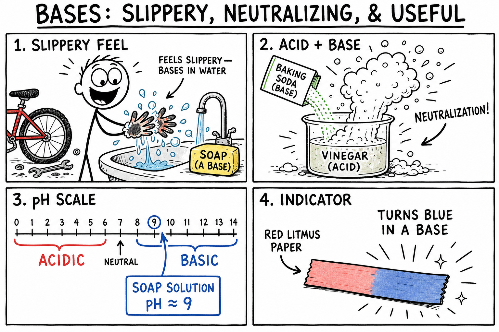

# Base

You finish washing your hands after working on a greasy bike chain. The soap feels slick between your fingers. That slipperiness is a clue: soap is a base.

At a science fair, someone pours vinegar into a cup of baking soda. The mixture fizzes and bubbles like a mini volcano. Baking soda is a base. The vinegar is an acid. When they meet, they neutralize each other.

After a spicy meal, an antacid tablet can calm an upset stomach. The tablet contains a mild base that reacts with excess stomach acid.

Bases are everywhere—in soap, cleaners, baking soda, antacids, soil treatments, factories, and your own body. Some are mild and useful. Others are so strong they can burn skin or damage eyes on contact.

**A base is a substance that can accept protons or produce hydroxide ions in water.**

To understand bases, it helps to remember their chemical partner: acids.

## Bases and Acids: The Other Half of the Story

An **acid** can donate protons or produce hydrogen ions (H+) in water.

A **base** can accept protons or produce hydroxide ions in water.

Think of it like a trade:

**Acids donate protons. Bases accept protons.**

When an acid and a base react, they often **neutralize** each other. Their sharp acidic and basic properties are reduced. That does not always mean the final mixture is perfectly safe—but the reaction itself is one of the most important ideas in chemistry.

Acids and bases are best learned together. If you have already studied acids, you are halfway there.

## Hydroxide Ions

Many bases release **hydroxide ions** when they dissolve in water.

A hydroxide ion is written as **OH-**.

When sodium hydroxide (NaOH) dissolves in water, it produces sodium ions and hydroxide ions. The more hydroxide ions in a solution, the more basic it tends to be.

Some bases do not start with hydroxide in the formula but still act as bases. **Ammonia** (NH3) can accept a proton from water and produce ammonium ions and hydroxide ions. That is why chemists describe bases in two useful ways: as **proton acceptors** and as substances that can produce hydroxide ions in water.

## Basic Solutions and the pH Scale

When a base dissolves in water, the result is often a **basic solution**.

The **pH scale** measures how acidic or basic a solution is. It usually runs from 0 to 14:

- **pH below 7** — acidic (like lemon juice or vinegar)
- **pH 7** — neutral (pure water is close to this)
- **pH above 7** — basic (like baking soda solution or soap)

The farther above 7 the pH climbs, the more basic the solution. A solution at pH 9 is mildly basic. A solution at pH 13 is strongly basic—and often dangerous.

Here is a detail that surprises many students: the pH scale is **logarithmic**. Each whole pH step is a tenfold change. pH 13 is not just a little more basic than pH 12—it is ten times more basic by the measure chemists use.

Many bases taste bitter and feel slippery. Soap feels slick because it is basic and interacts with oils on your skin. **Never use taste or touch to test an unknown substance.** Some bases damage tissue on contact. Use indicators and safe lab procedures instead.

## Indicators: Color Clues Without Risk

An **indicator** is a substance that changes color depending on whether a solution is acidic or basic.

Indicators let you gather evidence safely.

- **Red litmus paper** turns blue in a base.
- **Blue litmus paper** stays blue in a base.
- **Universal indicator** shows a range of colors across the pH scale.
- **Red cabbage juice** works as a natural indicator—often turning green or blue in basic solutions.

Different indicators work best in different pH ranges. Scientists pick the tool that fits the job—just like choosing the right wrench for a bolt.

## Common Bases You Already Know

Common bases include:

- **Baking soda** — cooking, cleaning, and science demos; mild and useful in class with supervision
- **Soap** — hand washing and showers; mild in normal use
- **Milk of magnesia** — medicine for upset stomach; a mild antacid
- **Ammonia** — some glass and floor cleaners; irritating, and **never mix with bleach**
- **Washing soda** — laundry boosters; stronger than baking soda; handle with care
- **Sodium hydroxide** (lye, caustic soda) — drain cleaners, soap making, and industry; **very strong and caustic**
- **Calcium hydroxide** (lime) — soil treatment and construction; strong; used carefully by adults

Knowing something is a base is only the start. You also need to know its **strength**, **concentration**, and **intended use**.

## Strong, Weak, Concentrated, and Dilute

Students often mix up four different ideas. Keep them separate:

**Strong base** — separates almost completely into ions in water (or strongly produces hydroxide ions). Example: sodium hydroxide.

**Weak base** — reacts only partly with water and produces fewer hydroxide ions. Example: ammonia.

**Concentrated** — a lot of base dissolved in the solution.

**Dilute** — less base in the same amount of solution.

A weak base can be concentrated. A strong base can be diluted. **Strength** describes chemical behavior. **Concentration** describes how much is dissolved.

Concentrated strong bases are among the most dangerous chemicals in a typical home. They can burn skin, damage eyes, dissolve hair, and react violently with grease and oils—including the oils in your skin.

## Caustic: When "Basic" Means Dangerous

Some strong bases are called **caustic**—able to burn, corrode, or destroy living tissue by chemical action.

Sodium hydroxide is also known as **caustic soda**. Potassium hydroxide is similarly caustic. These substances power through grease, hair, and organic matter. That is why they appear in heavy-duty drain cleaners and industrial processes. It is also why they demand adult handling, goggles, gloves, and careful storage.

If a base contacts skin or eyes, tell an adult immediately and rinse with plenty of water as instructed.

## Bases at Work: Cleaning, Soap, and Grease

Why does soap cut through bike grease and kitchen oil?

Strong bases can react with **fats and oils**. In traditional soap making, fats react with a strong base such as sodium hydroxide in a process called **saponification**. The product—soap—helps water mix with oily dirt so it rinses away.

Many household cleaners are basic for the same reason: bases attack grease and some stains. Baking soda deodorizes and scrubs gently. Ammonia appears in some glass cleaners. Oven and drain cleaners may contain much stronger bases.

**Never mix cleaners.** Combining products can release poisonous gases or trigger violent reactions.

## Neutralization and Salts

When a base reacts with an acid, the reaction is called **neutralization**.

In many cases, the products are **water** and a **salt**.

In chemistry, a **salt** is an ionic compound often formed from an acid-base reaction—not just table salt (sodium chloride). Calcium carbonate, magnesium chloride, and potassium nitrate are salts too.

Example: hydrochloric acid plus sodium hydroxide can form water and sodium chloride.

Neutralization is useful in medicine, industry, and the lab—but it must be controlled. Reactions can release heat, splash, or leave extra acid or base if amounts are not balanced. **Neutral does not always mean harmless.**

## Antacids and Your Body

Your stomach produces hydrochloric acid to help digest food. Too much acid can cause discomfort.

An **antacid** is a medicine containing a mild base—such as calcium carbonate, magnesium hydroxide, or sodium bicarbonate—that neutralizes some excess stomach acid. Use antacids only as directed by an adult or doctor.

Your whole body depends on careful acid-base balance. Blood stays within a narrow pH range. Many enzymes work only at specific pH levels. The pancreas releases basic fluid into the small intestine to help neutralize stomach acid as food moves along. Life runs on chemistry kept in balance.

## Bases Beyond the Bathroom

**Soil.** Different plants prefer different soil pH. If soil is too acidic, farmers and gardeners may add **lime** (containing basic calcium compounds) to raise pH and improve growth for some crops.

**Water treatment.** If water is too acidic, controlled amounts of basic substances can adjust pH, reduce pipe corrosion, and improve safety—always with careful measurement.

**Industry.** Sodium hydroxide helps make paper, soap, and textiles. Ammonia helps make fertilizers. Calcium hydroxide appears in construction and water treatment. These bases are powerful tools—and powerful hazards without training.

## A Reaction Worth Respecting: Bases and Metals

Some strong bases react with certain metals. Aluminum, for example, can react with sodium hydroxide and produce **hydrogen gas**, which is flammable.

That is one reason you never pour drain cleaner onto metal you do not understand, or mix unknown chemicals "just to see what happens." A base safe for one job can be dangerous in another.

## Common Misconceptions

One mistake is thinking all bases are safe because baking soda and soap are mild. **Sodium hydroxide and other caustic bases can cause severe chemical burns.**

Another mistake is using slippery feel as a test. Strong bases can feel slick because they are reacting with the oils in your skin—that is a warning, not a game.

A third mistake is confusing **strong** with **concentrated**. They describe different things.

A fourth mistake is assuming neutralization always produces a harmless mixture. The result may still be hot, corrosive, or contain harmful dissolved substances.

A fifth mistake is thinking only acids are dangerous. **Strong bases can be just as hazardous as strong acids.**

## Base Safety Rules

Treat every unknown substance as dangerous until an adult says otherwise.

- Do not taste bases or unknown chemicals.
- Do not touch unknown bases to test slipperiness.
- Do not sniff ammonia or cleaners directly—waft gently only if a teacher instructs you.
- Wear goggles when working with base solutions in the lab.
- Use only teacher-approved, dilute bases in classroom activities.
- Never mix bases with other cleaners or unknown chemicals.
- Report spills immediately and follow disposal instructions.

## The Big Idea

A base accepts protons or produces hydroxide ions in water. Bases usually have pH above 7, turn red litmus blue, and can neutralize acids. From mild baking soda to caustic sodium hydroxide, bases shape cleaning, medicine, agriculture, industry, and life itself—but strength and concentration always matter.

If you remember only one sentence, remember this:

**A base accepts protons, often produces hydroxide ions in water, and can neutralize acids—so know its strength before you use it.**

## Study Questions

1. What is a base?
2. How does a base relate to an acid?
3. What is a hydroxide ion, and what is its chemical symbol?
4. What does it mean to call a base a proton acceptor?
5. Why are taste and touch unsafe ways to test for bases?
6. What does the pH scale measure, and which values are basic?
7. Why does each step on the pH scale represent a tenfold change?
8. What is an indicator, and what happens to red litmus in a base?
9. Name four common bases and describe whether each is mild or strong.
10. What is the difference between a strong base and a weak base?
11. What is the difference between a concentrated base and a dilute base?
12. What does caustic mean, and why are caustic bases dangerous?
13. How can bases help with cleaning and soap making?
14. What is neutralization, and what two products do many acid-base reactions form?
15. What is a salt in chemistry?
16. How do antacids help with excess stomach acid?
17. Why does the human body need acid-base balance?
18. How can bases be used in soil or water treatment?
19. Name two industrial uses of bases.
20. Why can the reaction between a strong base and some metals be hazardous?
21. Give two common misconceptions about bases.
22. List three safety rules for working with bases in the lab.
