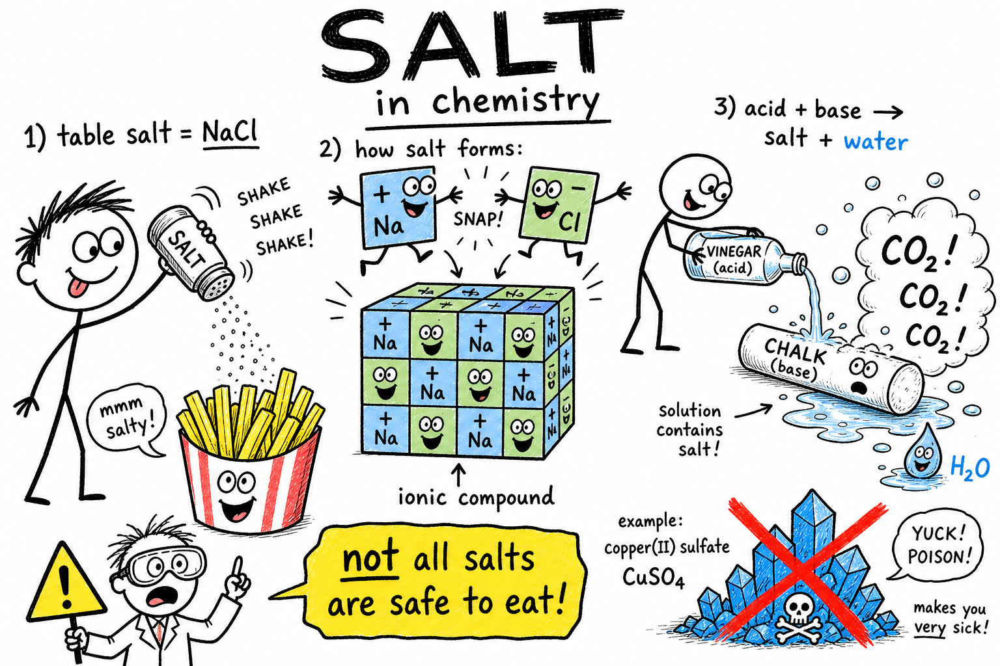

# Salt

You shake crystals onto hot fries. You taste the ocean after wiping out on a bodyboard. You watch road crews spread white grains on an icy sidewalk so cars do not slide. You crack open a sports drink after a long practice and read "electrolytes" on the label.

Different moments — same chemistry idea.

When most people hear **salt**, they picture the white shaker on the kitchen table. That familiar **table salt** matters — but in chemistry the word **salt** means something much bigger.

**A salt is an ionic compound often formed when an acid reacts with a base.**

Salts show up in oceans, rocks, soil, food, medicine, batteries, fireworks, caves, shells, bones, and living cells. Some are safe in small amounts. Some are poisonous. Some dissolve easily in water. Some barely dissolve at all.

As you learned in the chapters on **acids** and **bases**, many salts form when acids and bases **neutralize** each other. As you learned in the chapter on **crystals**, many salts grow as solids with repeating ion patterns. This chapter ties those ideas together.

## Salts Are Ionic Compounds

A **salt** is built from charged particles called **ions**.

An **ion** is an atom or group of atoms with an electric charge.

| Term | Charge | Example |
|------|--------|---------|
| **Cation** | Positive (+) | Sodium ion (Na+) |
| **Anion** | Negative (−) | Chloride ion (Cl−) |

An **ionic compound** is made of positive and negative ions held together by electric attraction.

In a salt, cations and anions attract each other. Their charges **balance** so the compound is neutral overall — not positively or negatively charged as a whole.

That is why table salt feels ordinary even though it is made of charged pieces locked in a crystal.

## Table Salt: The One You Know Best

Table salt is **sodium chloride**.

Its formula is **NaCl**.

It is made of sodium ions (Na+, positive) and chloride ions (Cl−, negative). They attract each other and lock into a **crystal lattice** — a regular three-dimensional pattern of ions.

| Fact | Detail |
|------|--------|
| Formula | NaCl |
| Ions | Na+ and Cl− |
| Ratio | One sodium for every chloride |
| Common uses | Food, preservation, medicine, water softening, road de-icing |

Sodium chloride is only **one** salt. Chemistry includes hundreds more.

## Salt in Chemistry — Not Just the Shaker

In everyday speech, "salt" usually means sodium chloride.

In chemistry, a **salt** is any ionic compound made of balanced positive and negative ions — often from an acid-base reaction, but not always.

| Salt | Formula | Notes |
|------|---------|-------|
| Sodium chloride | NaCl | Table salt; edible in small amounts |
| Calcium carbonate | CaCO₃ | Limestone, chalk, eggshells |
| Magnesium sulfate | MgSO₄ | Epsom salt |
| Sodium bicarbonate | NaHCO₃ | Baking soda |
| Potassium nitrate | KNO₃ | Fertilizer; handle with care |
| Copper sulfate | CuSO₄ | Bright blue crystals; **not safe to eat** |

Some salts are useful in food. Some are used in farming, medicine, or construction. Some are dangerous. **Do not assume a substance is safe because it is called a salt.**

## Acids, Bases, and Neutralization

Many salts form when an **acid** and a **base** react.

An **acid** can donate protons or produce hydrogen ions (H+) in water.

A **base** can accept protons or produce hydroxide ions (OH−) in water.

When they meet, they can **neutralize** each other — reduce their sharp acidic and basic properties. That reaction is called **neutralization**.

Many neutralization reactions produce **water** and a **salt**.

Example: hydrochloric acid (HCl) plus sodium hydroxide (NaOH) can form water and sodium chloride (NaCl).

The sodium comes from the base. The chloride comes from the acid.

### Neutralization Is Not Always "Perfectly Safe"

The word **neutralization** can trick people.

It does **not** always mean the final mixture is perfectly neutral, perfectly harmless, or ready to taste.

| Situation | What can happen |
|-----------|-----------------|
| Too much acid left | Mixture may still be acidic |
| Too much base left | Mixture may still be basic |
| Heat released | Mixture can get hot |
| Harmful salt formed | Product may still be dangerous |

Neutralization is powerful chemistry. It belongs in the lab or under adult control — not in random mixing at home.

## Salt Formulas and Charge Balance

Salt formulas show the **ratio of ions** needed so charges balance to zero.

| Salt | Formula | What it means |
|------|---------|---------------|
| Sodium chloride | NaCl | 1 Na+ balances 1 Cl− |
| Calcium chloride | CaCl₂ | 1 Ca²⁺ balances 2 Cl− |
| Magnesium sulfate | MgSO₄ | 1 Mg²⁺ balances 1 SO₄²⁻ |

Positive and negative charges must add up to **zero overall**. That is why formulas look the way they do.

## Crystal Lattices

Many salts form **crystals** — solids whose particles sit in a regular repeating pattern.

In sodium chloride, sodium and chloride ions alternate in a lattice that extends in all directions. That hidden order is why salt grains often look **cube-shaped**.

Different salts form different crystal shapes because their ions pack differently. If you studied **crystals** already, you have seen this idea from another angle: the shape you see comes from the arrangement you cannot.

## Dissolving Salts

Many salts dissolve in water.

When sodium chloride dissolves, water molecules pull Na+ and Cl− ions away from the crystal. The ions spread through the water.

The salt has **not** disappeared. It is present as **dissolved ions** — too small to see, but still there.

If the water evaporates, crystals can form again. That is how salt is recovered from seawater in **salt ponds** and how ancient seas left salt deposits behind.

## Solubility

Not all salts dissolve equally well.

**Solubility** is how much solute can dissolve in a certain amount of solvent at a certain temperature.

| Salt | In water |
|------|----------|
| Sodium chloride | Dissolves fairly well |
| Calcium carbonate | Dissolves poorly in pure water |
| Silver chloride | Dissolves very little |
| Potassium nitrate | Dissolves much better in hot water than cold |

Solubility depends on the salt, the solvent, and the temperature.

## Electrolytes

Dissolved salts can make water conduct electricity.

An **electrolyte** is a substance that forms ions in solution and allows the solution to conduct electric current.

Pure water conducts poorly. **Salt water** conducts much better because moving ions carry charge.

Your body uses dissolved salts as electrolytes. Sodium, potassium, calcium, magnesium, chloride, and phosphate ions help nerves, muscles, cells, and body fluids work. Sweat tastes salty because it carries dissolved salts — but tasting sweat is not a science test.

Electrolytes matter. Too much or too little can be harmful. Sports drinks and medical fluids are designed around that balance — not around "more salt is always better."

## Salts in the Body and Diet

The human body needs salts.

- **Sodium and chloride** help maintain fluid balance.
- **Potassium** supports nerves and muscles.
- **Calcium** salts help build bones and teeth.
- **Magnesium and phosphate** play roles inside cells.

Table salt is useful, but too much **sodium** in the diet can be unhealthy for many people. High sodium intake can contribute to high blood pressure in some individuals. Many processed foods contain added salt.

The body needs the **right balance**, not simply more. Follow family, doctor, and nutrition guidance about diet.

## Salts in Food

Salts shape food in several ways.

**Flavor.** Table salt sharpens taste.

**Preservation.** Salt can make conditions harder for many microbes — which is why people have salted meat and fish for centuries.

**Rising.** Baking soda (sodium bicarbonate, NaHCO₃) is a salt that acts as a mild base. When it reacts with an acid in batter, **carbon dioxide** gas forms and helps muffins and quick breads rise. Vinegar plus baking soda produces the same gas — the classic fizz demo.

**Texture.** Calcium salts can firm some foods. Mineral salts occur naturally in many vegetables and grains.

Food chemistry is salts, acids, bases, water, heat, and living ingredients working together.

## Salts in the Ocean

Seawater holds many dissolved salts.

The most common is sodium chloride, but seawater also contains magnesium, calcium, potassium, sulfate, carbonate, and other ions.

The saltiness of water is called **salinity**.

Rivers carry dissolved minerals from rocks toward the ocean. Water evaporates from the ocean surface, but most dissolved salts stay behind. Over long time, that helps make oceans salty.

## Salts in Rocks and Minerals

Many minerals are salts or salt-like ionic structures.

| Mineral | Salt type | Where you see it |
|---------|-----------|------------------|
| Halite | Sodium chloride | Rock salt, salt mines |
| Calcite | Calcium carbonate | Limestone, marble, chalk, shells |
| Gypsum | Calcium sulfate | Drywall, cave deposits |
| Fluorite | Calcium fluoride | Crystals, industrial uses |

Geology and chemistry meet in these solids.

## Families of Salts

Chemists group many salts by their negative ion.

### Carbonates

**Carbonates** contain the carbonate ion (CO₃²⁻).

Calcium carbonate appears in limestone, marble, chalk, seashells, coral, and eggshells.

Many carbonates react with acids to produce **carbon dioxide** gas. That is why vinegar bubbles on chalk or eggshell.

### Nitrates

**Nitrates** contain the nitrate ion (NO₃⁻).

Nitrate salts are used in **fertilizers** because plants need nitrogen. Too much nitrate washing into rivers and lakes can fuel algal blooms and harm ecosystems.

Some nitrates appear in fireworks and explosives. Useful chemistry must be handled responsibly.

### Sulfates

**Sulfates** contain the sulfate ion (SO₄²⁻).

Magnesium sulfate is **Epsom salt**. Calcium sulfate is in **gypsum**. Copper sulfate forms bright blue crystals used in some labs and agriculture — but it can be harmful and should not be handled casually.

## Salt and Ice

Salt can **lower the freezing point** of water.

That is why salt is spread on icy roads and sidewalks. Salt does not create heat. It changes how ice melts and water freezes.

Salt water can stay liquid below 0 °C. The same idea appears in old-fashioned ice-cream makers: ice plus salt can get very cold.

Salt-ice mixtures can injure skin if handled carelessly. Treat them with respect.

## Hard Water

**Hard water** contains dissolved minerals, especially calcium and magnesium salts.

It can leave **scale** in pipes, kettles, and appliances and make soap less effective. **Water softening** removes or exchanges some of those ions.

Hard water is not always unsafe, but it can be inconvenient — another way dissolved salts affect daily life.

## Salts in Medicine and Industry

Many medicines are prepared as **salts** so they dissolve, absorb, or store better.

**Saline solution** is carefully prepared salt water for medical rinsing or fluid replacement — only under proper guidance.

Salts are industrial workhorses: glass, soap, paper, fertilizers, dyes, metals, batteries, and cleaning products. Sodium chloride is used to produce chlorine and sodium hydroxide. Calcium carbonate goes into cement and agriculture. Potassium salts feed crops.

Salts do quiet, enormous work behind the scenes.

## Precipitation Reactions

Sometimes two solutions mix and form a solid salt that does not dissolve well.

The solid is called a **precipitate**.

A **precipitation reaction** happens when dissolved ions combine to form an insoluble product.

Example: solutions containing silver ions and chloride ions can form solid **silver chloride** — a cloudy or white solid that shows a new substance has formed.

Precipitation reactions matter in water treatment, chemical analysis, and laboratory testing.

## Salt Is Not Always Safe

Table salt is familiar. That familiarity can fool you.

Many salts are poisonous, corrosive, or harmful to the environment. Some irritate skin or eyes. Some are reactive or oxidizing.

| Examples requiring caution | Risk |
|----------------------------|------|
| Copper sulfate | Harmful if swallowed or mishandled |
| Lead and mercury salts | Poisonous |
| Many nitrate salts | Oxidizing; used in explosives |

**Do not assume a substance is safe because it is called a salt.** Colorful crystals and cool names do not prove safety.

## Common Misconceptions

One mistake is thinking **all salts are table salt**. Sodium chloride is only one member of a large family.

Another mistake is thinking **all salts are safe to eat**. Many are poisonous or harmful.

A third mistake is thinking salts form by **carelessly mixing any acid and base**. Correct substances, amounts, and safety controls matter — as do heat and leftover reactants.

A fourth mistake is thinking **dissolved salt disappears**. It is still present as ions in solution.

A fifth mistake is thinking **neutralization always produces a harmless mixture**. Extra acid, extra base, heat, or a dangerous salt can remain.

## Salt Safety

Salts must be handled carefully in science.

Good safety habits include:

- Do not taste salts during science activities.
- Do not touch unknown crystals or powders without permission.
- Do not smell unknown substances directly.
- Wear goggles when an activity requires them.
- Keep salts and powders away from eyes and lungs.
- Wash hands after handling salt samples or solutions.
- Do not mix acids and bases unless instructed by a teacher.
- Label containers clearly.
- Follow teacher instructions for storage and disposal.
- Treat colored, heavy-metal, nitrate, and unknown salts as potentially hazardous.

Familiar table salt belongs in the kitchen. Unknown laboratory salts belong under teacher control.

## The Big Idea

A salt is an ionic compound made of balanced positive and negative ions, often produced when an acid reacts with a base.

Salts form crystals, dissolve in water, and can conduct electricity when dissolved because they produce moving ions. Table salt is sodium chloride, but chemistry includes carbonates, nitrates, sulfates, bicarbonates, and mineral salts in oceans, rocks, food, bodies, medicine, farming, and industry.

If you remember only one sentence, remember this:

**A salt is an ionic compound of balanced ions — often from acid-base reactions — and not every salt belongs on your fries.**

## Study Questions

1. What is a salt in chemistry?
2. Why is table salt only one example of a salt?
3. What is an ionic compound?
4. What is the difference between a cation and an anion?
5. Why is sodium chloride neutral overall even though it contains charged ions?
6. What is the formula for sodium chloride, and which ions does it contain?
7. How can an acid and a base form a salt?
8. What is neutralization?
9. Why does neutralization not always mean the final mixture is perfectly safe?
10. What do salt formulas show, and why must charges balance?
11. What is a crystal lattice, and why do salt grains often look cube-shaped?
12. What happens when sodium chloride dissolves in water?
13. What is solubility?
14. What is an electrolyte, and why does salt water conduct electricity better than pure water?
15. Name three ions important in the human body.
16. Why can too much sodium in the diet be unhealthy for many people?
17. What is salinity, and why are oceans salty?
18. What are carbonates, and what gas forms when many carbonates react with acids?
19. What is baking soda, and what gas can it produce when reacting with acids?
20. How does salt affect the freezing point of water?
21. What is a precipitate?
22. Name two common misconceptions about salts.
23. What are three safety rules for studying salts?
24. In your own words, explain how salts connect something you eat, something in nature, and something from the acid-base chapters you have studied.
