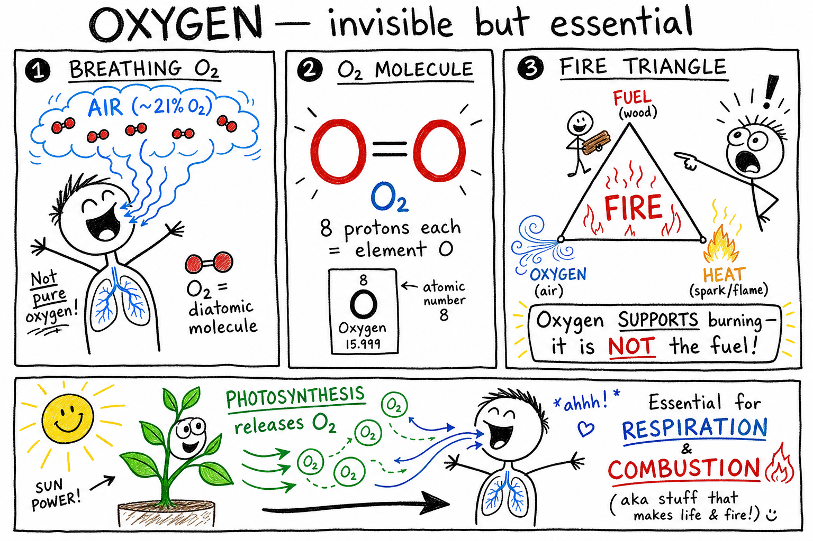

# Oxygen

Take a deep breath. You cannot see the gas entering your lungs, but part of that air is oxygen. Your body needs it every minute. A candle flame needs it too. Rusting iron uses it slowly. Plants release it into the air.

Oxygen is quiet, invisible, and absolutely important.

**Oxygen is a chemical element, usually found as a gas, that is essential for respiration and supports combustion.**

Oxygen is one of the most important elements on Earth. It is in the air, water, rocks, rust, living things, and many compounds. It helps animals release energy from food, helps fires burn, and joins with many elements in chemical reactions.

To understand oxygen, we must begin with elements.

## Oxygen Is an Element

An **element** is a pure substance made of only one kind of atom.

Oxygen is an element because it is made of oxygen atoms.

Every oxygen atom has 8 protons in its nucleus.

That means oxygen's atomic number is 8.

Change the number of protons, and the atom would no longer be oxygen.

Oxygen's chemical symbol is **O**.

On the periodic table, oxygen is a nonmetal.

## Oxygen Atoms and Oxygen Molecules

An oxygen atom is written as O.

But oxygen gas in the air is usually not single oxygen atoms floating alone.

Most oxygen gas is made of oxygen molecules.

An oxygen molecule contains two oxygen atoms bonded together.

Its formula is **O2**.

This is called a **diatomic molecule**, meaning a molecule made of two atoms.

When you breathe in oxygen, you are mostly breathing in O2 molecules mixed with nitrogen and other gases.

## Oxygen in Air

Air is a mixture of gases.

Dry air near Earth's surface is mostly nitrogen and oxygen.

Oxygen makes up about one-fifth of dry air, or about 21 percent.

Nitrogen makes up most of the rest.

Air also contains argon, carbon dioxide, water vapor, and small amounts of other gases.

This means every breath contains oxygen, but air is not pure oxygen.

That is fortunate. Pure oxygen can make fires burn much more intensely.

## Oxygen and Respiration

Humans and many other living things need oxygen for **respiration**.

Respiration is the process cells use to release energy from food.

In your body, oxygen helps break down food molecules such as glucose.

This releases energy your cells can use.

Carbon dioxide and water are produced as waste products.

This is why you breathe in oxygen and breathe out more carbon dioxide than you breathed in.

Breathing is not just moving air. It supplies oxygen for cell chemistry.

## Oxygen in the Blood

When you inhale, oxygen enters your lungs.

In the lungs, oxygen passes into the blood.

Red blood cells contain a protein called hemoglobin.

Hemoglobin carries oxygen through the bloodstream.

Your heart pumps this oxygen-rich blood to cells throughout the body.

Cells use oxygen to release energy from food.

Without oxygen, the brain and other organs can be harmed quickly.

## Oxygen and Combustion

Oxygen supports **combustion**.

Combustion is a chemical reaction in which a substance reacts with oxygen and releases energy, often as heat and light.

A candle flame needs oxygen from the air.

Wood burning in a campfire needs oxygen.

Gasoline burning in an engine needs oxygen.

Oxygen itself is not fuel. It helps fuel burn.

This distinction is important:

**Oxygen supports burning, but oxygen is not the thing being burned.**

## The Fire Triangle

Fire needs three main things:

- Fuel
- Oxygen
- Heat

These three parts are often called the **fire triangle**.

Remove one part, and the fire goes out.

Water can remove heat from a fire.

A fire blanket can block oxygen.

Removing fuel can stop a fire from spreading.

Understanding oxygen helps explain fire safety.

## Oxidation

**Oxidation** is a chemical process in which a substance combines with oxygen or loses electrons.

Burning is fast oxidation.

Rusting is slower oxidation.

When iron reacts with oxygen and water, rust forms.

When food spoils, oxidation can change its color, smell, or flavor.

When a sliced apple turns brown, oxygen is involved in chemical changes on the cut surface.

Oxygen is reactive. It joins with many elements and compounds.

## Oxides

An **oxide** is a compound of oxygen with another element.

Rust is mostly iron oxides.

Carbon dioxide is an oxide of carbon.

Silicon dioxide, or quartz, is an oxide of silicon.

Aluminum oxide can form a protective coating on aluminum.

Many rocks and minerals contain oxygen in oxide compounds.

Oxygen is extremely common in Earth's crust because it combines with many elements.

## Oxygen in Water

Water contains oxygen.

The formula for water is **H2O**.

Each water molecule has two hydrogen atoms and one oxygen atom.

The oxygen in water is chemically bonded to hydrogen.

This is different from oxygen gas, O2, dissolved or mixed in air.

Fish do not breathe the oxygen atom locked inside water molecules. They use oxygen gas dissolved in water.

That difference matters.

## Dissolved Oxygen

Oxygen gas can dissolve in water.

Fish and many aquatic animals use dissolved oxygen for respiration.

Cold water can usually hold more dissolved oxygen than warm water.

Fast-moving streams often contain more dissolved oxygen because water mixes with air.

Pollution can reduce dissolved oxygen if microbes use oxygen while breaking down wastes.

Low dissolved oxygen can harm fish and other aquatic life.

Oxygen is important in water as well as air.

## Photosynthesis

Plants, algae, and some bacteria produce oxygen during **photosynthesis**.

Photosynthesis is the process by which plants use sunlight, carbon dioxide, and water to make sugar.

Oxygen is released as a product.

In simple form:

Carbon dioxide plus water plus light energy can produce sugar and oxygen.

Photosynthesis is one reason Earth's atmosphere contains so much oxygen.

Plants do not make oxygen for animals on purpose. Oxygen is released as part of their own food-making process.

## The Oxygen Cycle

Oxygen moves through the environment in a cycle.

Plants and algae release oxygen during photosynthesis.

Animals, plants, fungi, and many microbes use oxygen in respiration.

Combustion uses oxygen.

Rusting and other oxidation reactions use oxygen.

Oxygen atoms also move through water, carbon dioxide, rocks, minerals, and living things.

The **oxygen cycle** is the movement of oxygen through air, water, living things, and rocks.

## Ozone

Ozone is a form of oxygen.

An ozone molecule has three oxygen atoms.

Its formula is **O3**.

Ozone high in the atmosphere helps protect life by absorbing much of the Sun's harmful ultraviolet radiation.

Ozone near the ground is different. It can be an air pollutant that irritates lungs and harms plants.

The same element can behave differently depending on its molecular form and location.

O2 and O3 are both made of oxygen atoms, but they have different properties.

## Oxygen and the Atmosphere

Earth's early atmosphere did not always have as much oxygen as it has today.

Long ago, photosynthetic microbes began releasing oxygen.

Over immense time, oxygen built up in the atmosphere.

This changed Earth's chemistry and allowed more complex oxygen-using life to develop.

Oxygen also helped form the ozone layer.

The air you breathe is the result of a long history of life and chemistry.

## Oxygen in Rocks

Oxygen is one of the most abundant elements in Earth's crust.

It is found in many minerals.

Quartz contains silicon and oxygen.

Limestone contains oxygen in carbonate compounds.

Clay minerals contain oxygen with silicon, aluminum, hydrogen, and other elements.

Iron ores often contain iron and oxygen.

Although oxygen gas is invisible, oxygen atoms are locked into many solid materials under your feet.

## Oxygen in the Body

Oxygen is one of the most abundant elements in the human body.

Much of that oxygen is in water.

Oxygen is also found in proteins, fats, carbohydrates, DNA, bones, and many other substances.

The oxygen you breathe is used in cell respiration.

The oxygen atoms already in your body are part of the compounds that make you.

Oxygen is both a gas you need and an element built into your body.

## Liquid Oxygen

Oxygen is a gas at ordinary room temperature.

If cooled enough, oxygen can become a pale blue liquid.

Liquid oxygen is extremely cold.

It is used in rockets, industry, medicine, and scientific work.

Liquid oxygen can make materials burn fiercely because it supplies concentrated oxygen.

It must be handled only by trained people with special equipment.

The same oxygen that supports life can be dangerous when concentrated or very cold.

## Oxygen Tanks

Oxygen tanks are used in hospitals, ambulances, aircraft, diving, welding, and some industries.

The tanks contain oxygen under pressure.

Pressurized oxygen can support breathing when people need medical help.

It can also make fires burn much faster.

Oxygen tanks must be kept away from flames, sparks, grease, oil, and careless handling.

Never play with oxygen equipment.

Medical oxygen is medicine and must be used under proper supervision.

## Oxygen and Metals

Oxygen reacts with many metals.

Iron can rust.

Copper can form greenish compounds over time.

Aluminum reacts with oxygen to form aluminum oxide.

Aluminum oxide forms a thin protective layer that helps prevent deeper corrosion.

Some metals burn brightly in oxygen when heated strongly.

Metal-oxygen reactions are important in corrosion, welding, fireworks, minerals, and manufacturing.

## Oxygen and Food

Oxygen affects food.

Cut apples, bananas, and potatoes can turn brown when exposed to oxygen.

Fats and oils can become rancid through oxidation.

Food packaging sometimes limits oxygen to keep food fresh longer.

Vacuum packaging removes much of the air.

Some packages use nitrogen gas instead of oxygen to slow spoilage.

Oxygen helps life, but it can also help food spoil.

## Oxygen and Medicine

Oxygen is essential in medicine.

Doctors may give oxygen to patients who cannot get enough through ordinary breathing.

Oxygen is used during surgery, emergency care, lung disease treatment, and high-altitude or aircraft situations.

But too much oxygen can also be harmful in certain situations.

Medical oxygen must be given at the correct flow and concentration.

This is another example of a scientific rule: the dose and conditions matter.

## Oxygen and Space Travel

Spacecraft must carry or produce oxygen for astronauts.

Humans need oxygen to breathe, and spacecraft cabins must maintain a safe atmosphere.

Rocket engines may use liquid oxygen to help fuel burn powerfully.

In rockets, oxygen acts as an oxidizer.

An **oxidizer** supplies oxygen or otherwise helps fuel burn.

Space travel depends on careful control of oxygen for both life support and engines.

## Discovering Oxygen

Oxygen was identified in the 1700s by scientists including Joseph Priestley, Carl Wilhelm Scheele, and Antoine Lavoisier.

Priestley produced oxygen gas and studied how it affected flames and animals.

Scheele also prepared oxygen around the same period.

Lavoisier helped explain oxygen's role in combustion and gave it its name.

Before modern chemistry, people did not understand burning and air the way we do now.

The discovery of oxygen helped transform chemistry.

## Common Misconceptions

One mistake is thinking oxygen is the same as air. Air is a mixture, and oxygen is only part of it.

Another mistake is thinking oxygen is fuel. Oxygen supports combustion, but fuel is the substance that burns.

A third mistake is thinking all oxygen is O2. Oxygen can also occur in compounds and as ozone, O3.

A fourth mistake is thinking water's oxygen is the same as dissolved oxygen gas. Oxygen atoms in H2O are chemically bonded; dissolved oxygen gas is O2 in the water.

A fifth mistake is thinking more oxygen is always safer. Concentrated oxygen can make fires much more dangerous and can harm people in some medical conditions.

## Oxygen Safety

Oxygen is necessary for life, but it must be respected.

Good safety habits include:

- Do not play with oxygen tanks or medical oxygen equipment.
- Keep flames, sparks, oil, and grease away from oxygen equipment.
- Do not inhale gases from tanks, balloons, or unknown sources.
- Do not try to make oxygen gas without teacher supervision.
- Use goggles for any oxygen-related demonstration.
- Treat liquid oxygen as extremely cold and dangerous.
- Keep oxygen cylinders secured so they cannot fall.
- Follow fire safety rules whenever oxygen, fuels, or flames are involved.
- Do not assume a gas is safe because it is invisible.
- Follow adult instructions in laboratories, hospitals, workshops, and welding areas.

Oxygen supports life, but concentrated oxygen can turn a small fire into a serious danger.

## The Big Idea

Oxygen is a chemical element with atomic number 8.

It is commonly found as O2 gas in air, where it supports respiration and combustion. Oxygen forms many compounds, including water, carbon dioxide, oxides, minerals, and biological molecules. Plants and algae release oxygen during photosynthesis, while animals and many other organisms use it in respiration. Oxygen is essential for life, important in Earth systems and technology, and dangerous when concentrated or mishandled.

If you remember only one sentence, remember this:

**Oxygen is an element found in air and many compounds, essential for respiration and powerful in reactions such as combustion and oxidation.**

## Study Questions

1. What is oxygen?
2. What is an element?
3. What is oxygen's chemical symbol?
4. How many protons does every oxygen atom have?
5. What is oxygen's atomic number?
6. What is the formula for oxygen gas in air?
7. What does diatomic molecule mean?
8. About what fraction or percent of dry air is oxygen?
9. Why is air not the same thing as oxygen?
10. What is respiration?
11. How does the human body use oxygen in respiration?
12. What protein in red blood cells carries oxygen?
13. What is combustion?
14. Does oxygen burn as fuel? Explain.
15. What are the three parts of the fire triangle?
16. What is oxidation?
17. Give two examples of oxidation.
18. What is an oxide?
19. What is the formula for water?
20. Why can fish not use the oxygen atom locked inside water molecules for breathing?
21. What is dissolved oxygen?
22. Why is dissolved oxygen important in lakes and streams?
23. What is photosynthesis?
24. How does photosynthesis add oxygen to the atmosphere?
25. What is the oxygen cycle?
26. What is ozone, and what is its formula?
27. Why can ozone be helpful high in the atmosphere but harmful near the ground?
28. Name three uses of oxygen in medicine, industry, or technology.
29. Name two common misconceptions about oxygen.
30. What are three safety rules for oxygen?
