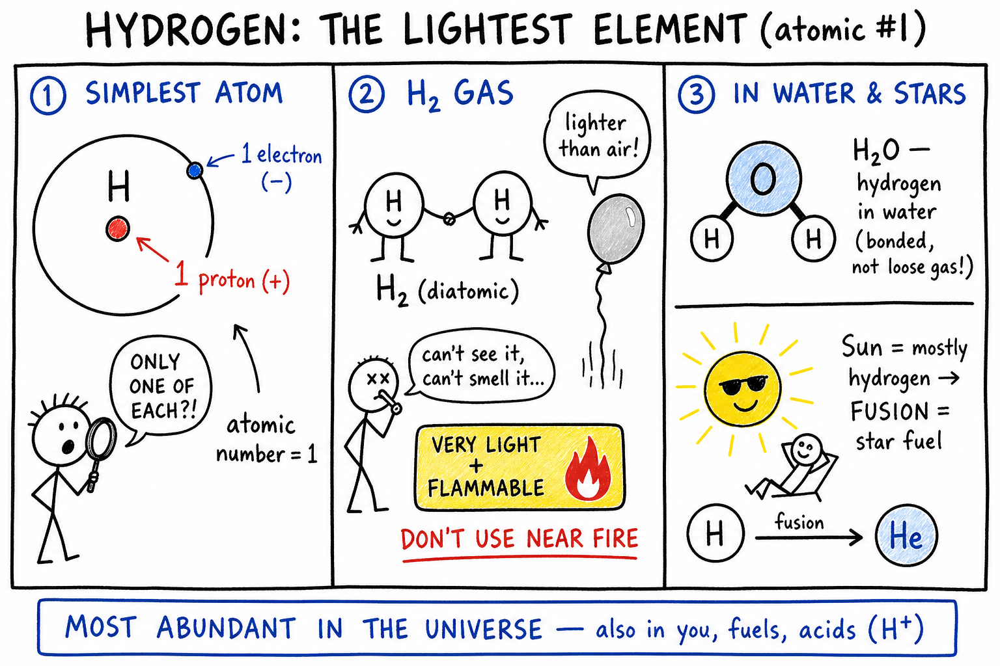
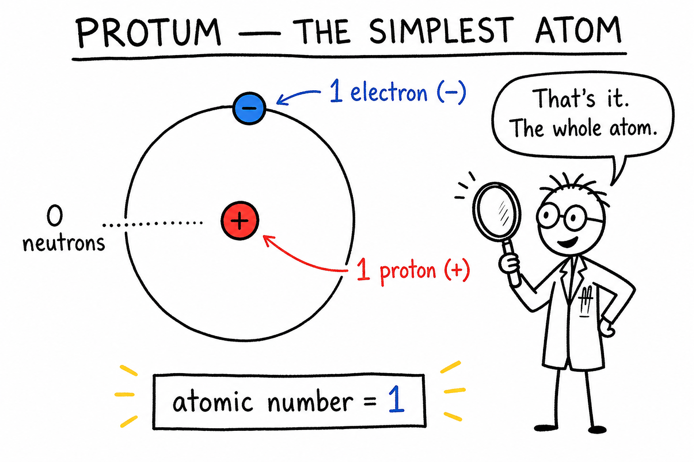
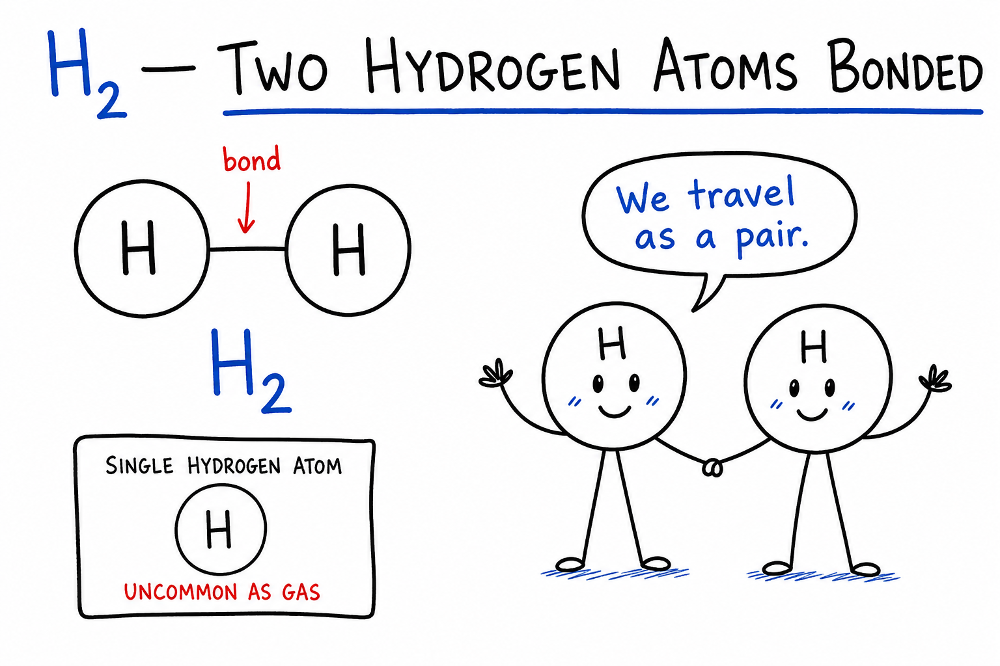
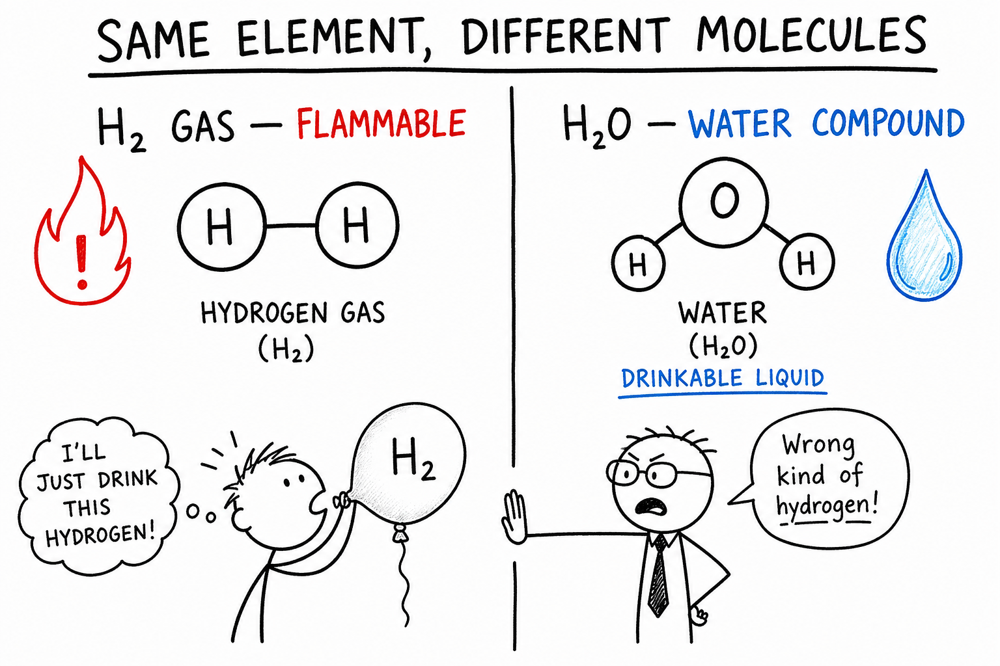
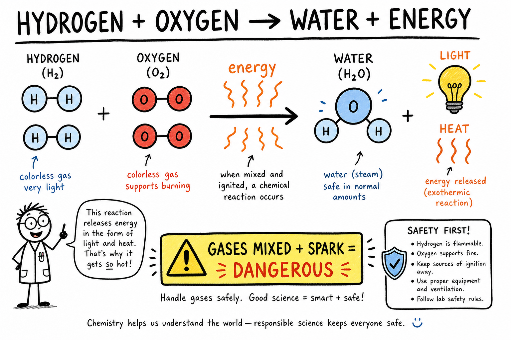
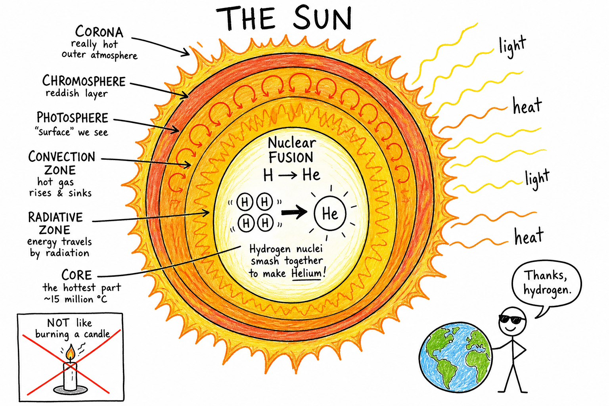
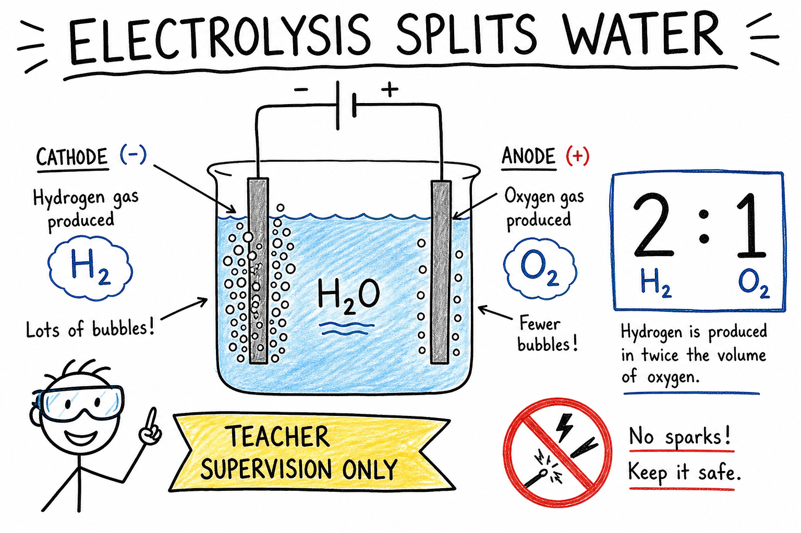
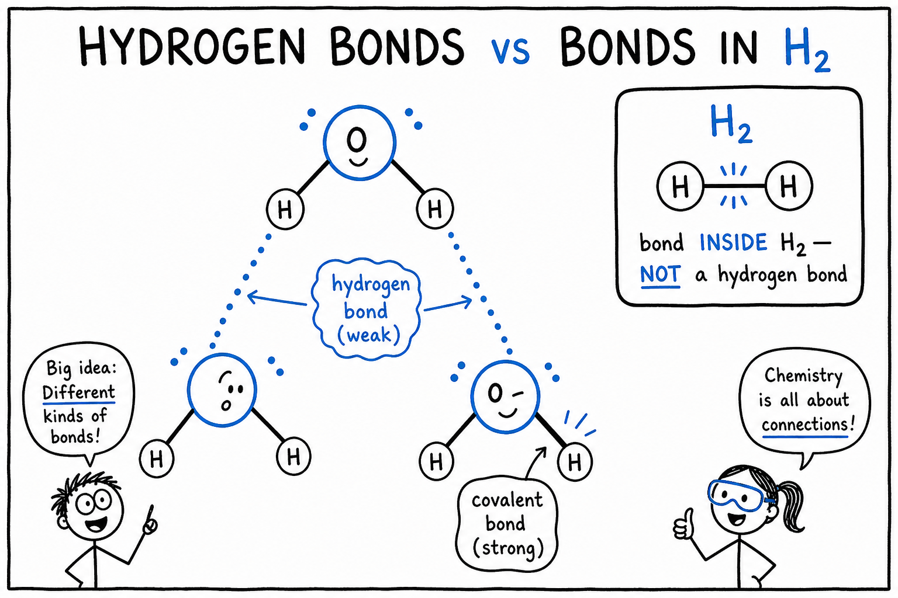

# Image briefs — 072 Hydrogen

Use when creating `072_Hydrogen_02.png` through `072_Hydrogen_08.png`. Each file is referenced in `072_Hydrogen.md` at the placement noted below.

`072_Hydrogen_01.png` already exists at the chapter top. Brief below for consistency if it is ever redrawn.

**Style** (from `_create_more_images.md`): crude, funny, hand-drawn explainer cartoon; stick-figure characters; rough black outlines; mostly white background; selective flat accent colors. Labels, arrows, exaggerated faces, simple metaphors. Minimalist, humorous, concept-first, intentionally rough. Color sparingly: **red** = danger, **yellow** = warning, **blue** = water/oxygen/systems, **orange** = heat/energy/Sun, **gray** = machinery/tanks. Vary panel width/height — not every image the same aspect ratio. Ages 11–13; rockets, stars, balloons, and lab demos are fair game — always show safe supervision for anything hazardous.

---

## 072_Hydrogen_01.png — Chapter opener (existing)

**Placement:** Top of chapter (after title).

**Scene:** Stick-figure kid holding a glass of water, looking up at a stylized Sun, with a small rocket trail in the corner. Speech bubble: “Hydrogen everywhere — you just can’t see the gas!”

**Labels (optional):** H in water; Sun; rocket.

**Caption in chapter:** ``

---

## 072_Hydrogen_02.png — Protium, the simplest atom

**Placement:** End of “The Simplest Atom” (before “Hydrogen Gas — H2”).

**Scene:** Large cartoon diagram of one hydrogen atom (protium).

- Tiny nucleus labeled **1 proton (+)**
- One electron in a simple orbit or dot labeled **1 electron (−)**
- Optional note: **0 neutrons**

**Humor:** Stick-figure scientist with magnifying glass: “That’s it. The whole atom.”

**Aspect:** Square or slightly tall (~1:1).

**Caption idea:** Protium — the simplest atom.

---

## 072_Hydrogen_03.png — H2 diatomic molecule

**Placement:** End of “Hydrogen Gas — H2” (after the property table, before “Hydrogen in Water”).

**Scene:** Two hydrogen circles (labeled **H**) sharing electrons — simple overlap or line between them labeled **bond**. Label: **H2**.

**Compare (small inset or arrow):** Single **H** atom floating alone with label “uncommon as gas.”

**Humor:** Two stick-figure H atoms holding hands: “We travel as a pair.”

**Aspect:** Wide (~2:1).

**Caption idea:** H2 — two hydrogen atoms bonded together.

---

## 072_Hydrogen_04.png — H2 gas vs H2O water molecule

**Placement:** End of “Hydrogen in Water” (before “Hydrogen and Oxygen React”).

**Scene:** Split panel (unequal widths OK).

| Left — H2 gas | Right — H2O (water) |
|---------------|---------------------|
| Two H atoms bonded to each other | One **O** bonded to two **H** atoms (bent shape OK) |
| Label: Hydrogen **gas** — flammable | Label: Water **compound** — liquid, drinkable |
| Red small warning icon on H2 side | Blue water drop on H2O side |

**Humor:** Stick-figure tries to drink H2 from a balloon — teacher stick-figure blocks: “Wrong kind of hydrogen!”

**Key text:** Same element, **different molecules**.

**Aspect:** Wide (~2:1).

**Caption idea:** H2 gas vs H2O — same element, different molecules.

---

## 072_Hydrogen_05.png — Hydrogen + oxygen → water + energy

**Placement:** End of “Hydrogen and Oxygen React” (before “Light Enough to Lift”).

**Scene:** Simple reaction cartoon.

- Left: **H2** + **O2** (molecules as circles with labels)
- Arrow labeled **energy** (orange wavy lines or “BOOM” in small red box only if showing **unsafe** gas mix — pair with warning)
- Right: **H2O** + energy released (heat/light icons)

**Safety note in image:** Small yellow banner: “Gases mixed + spark = dangerous” — do not glorify explosions; show controlled vs careless as two tiny panels if needed.

**Aspect:** Wide horizontal.

**Caption idea:** Hydrogen plus oxygen can form water and release energy.

---

## 072_Hydrogen_06.png — Nuclear fusion in the Sun

**Placement:** End of “Hydrogen Powers Stars” (before “Hydrogen in the Universe”).

**Scene:** Cutaway cartoon Sun.

- Core: several small circles labeled **H** smashing together → larger **He** (helium)
- Orange rays outward labeled **light** and **heat**
- Earth tiny in corner receiving sunlight

**Labels:** Nuclear **fusion**; H → He; **Not** the same as burning a candle (small crossed-out candle in corner).

**Humor:** Stick-figure on Earth with sunglasses: “Thanks, hydrogen.”

**Aspect:** Tall vertical (~3:4) or square.

**Caption idea:** Nuclear fusion in the Sun — hydrogen becomes helium.

---

## 072_Hydrogen_07.png — Electrolysis of water

**Placement:** End of “Making Hydrogen — Electrolysis” (before “Hydrogen and Metals”).

**Scene:** Simple electrolysis cell (beaker + two electrodes + battery or power symbol).

- Water labeled **H2O**
- **Cathode** side: bubbles labeled **H2** (twice as many bubbles as oxygen side)
- **Anode** side: bubbles labeled **O2**
- Ratio label: **2 : 1** (hydrogen : oxygen)

**Safety:** Teacher stick-figure with goggles; yellow banner: **Teacher supervision only**.

**Colors:** Blue water; gray electrodes; small red “no sparks” icon.

**Aspect:** Wide (~2:1).

**Caption idea:** Electrolysis splits water — twice as much hydrogen as oxygen.

---

## 072_Hydrogen_08.png — Hydrogen bonds in water

**Placement:** End of “Hydrogen Bonds — A Special Attraction” (before “Hydrogen in Fuels”).

**Scene:** Three water molecules (bent H–O–H shapes) with **dotted lines** between them labeled **hydrogen bond** (weak attraction).

- **Solid line** between H and O **inside** one molecule labeled **covalent bond** (strong)

**Contrast box:** Small H2 molecule with label “bond **inside** H2 — not a hydrogen bond.”

**Humor:** Stick-figure molecules “holding hands” loosely with dotted lines vs H2 “arm-wrestling” with solid line.

**Aspect:** Square or wide.

**Caption idea:** Hydrogen bonds between water molecules — not the same as bonds inside H2.

---

## Quick reference — filenames and captions

```markdown








```
