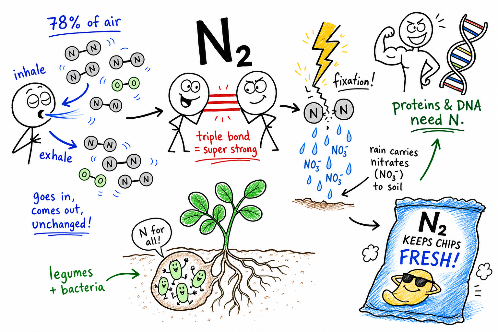
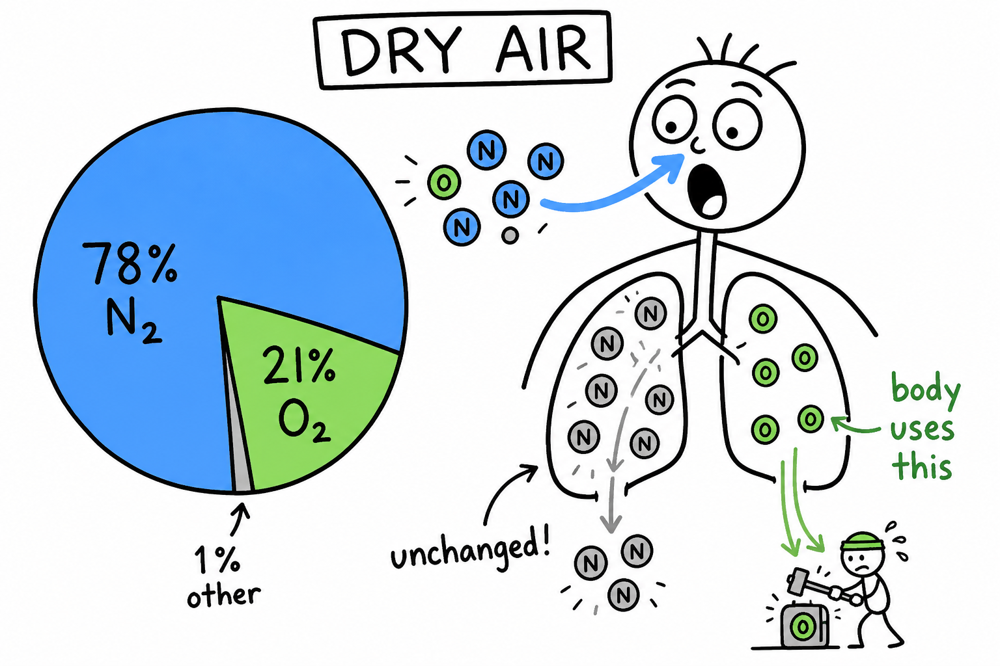
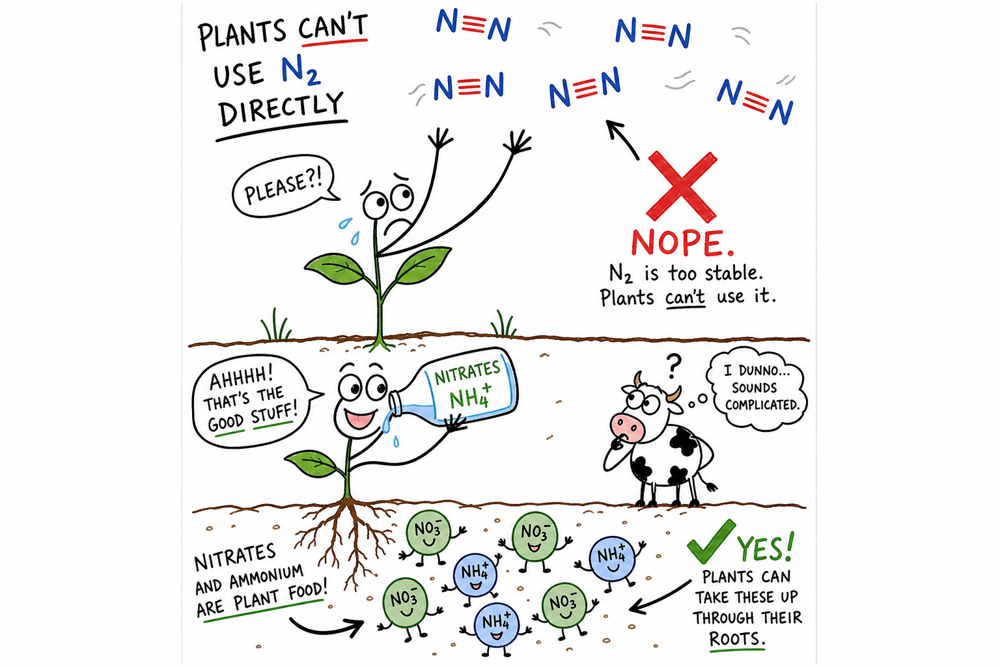
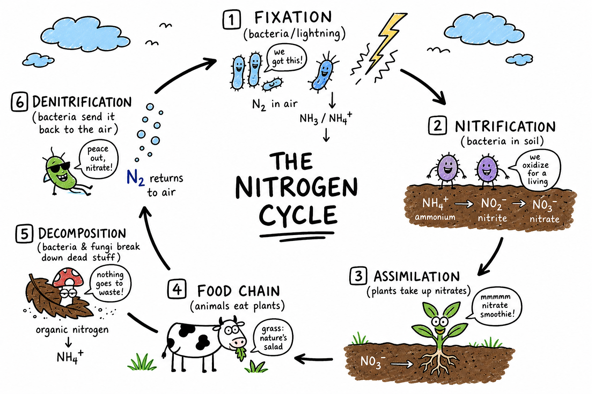
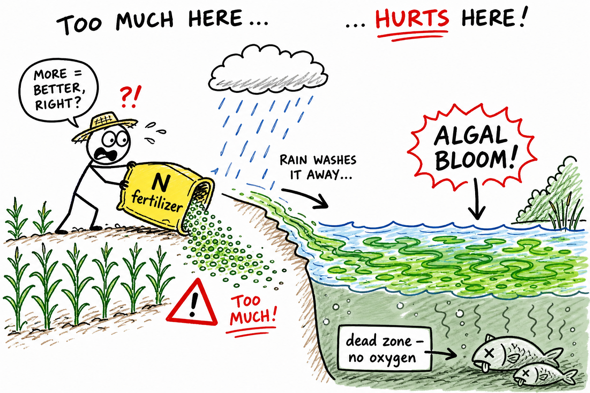
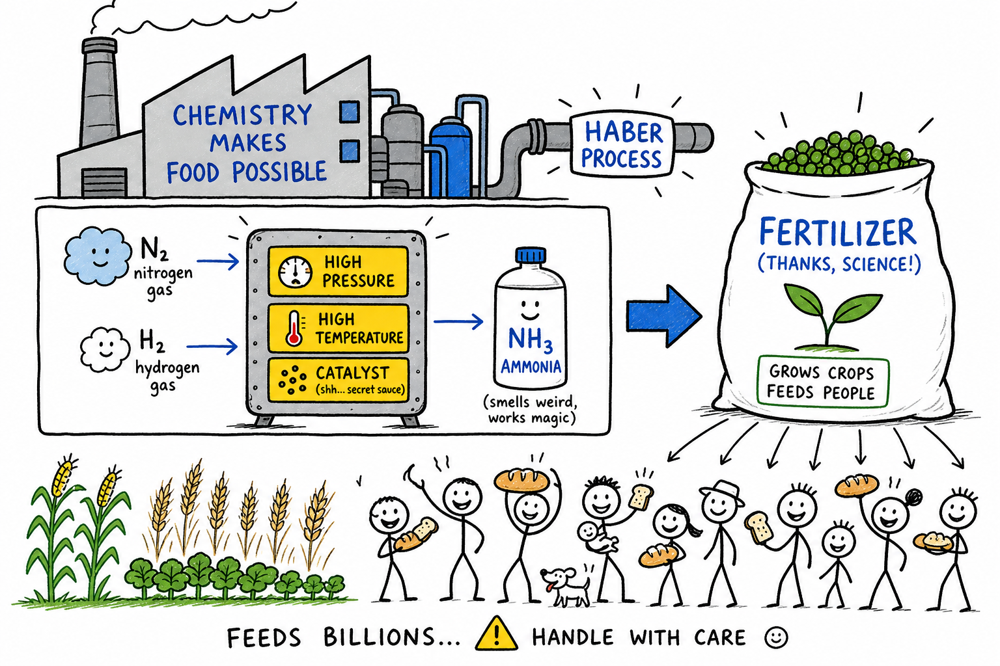
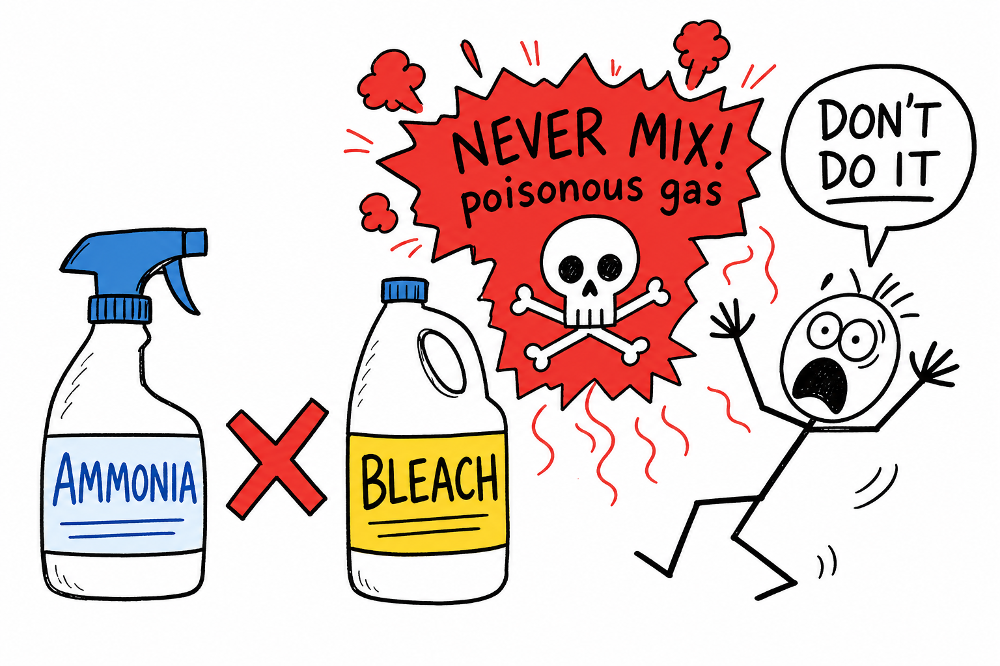
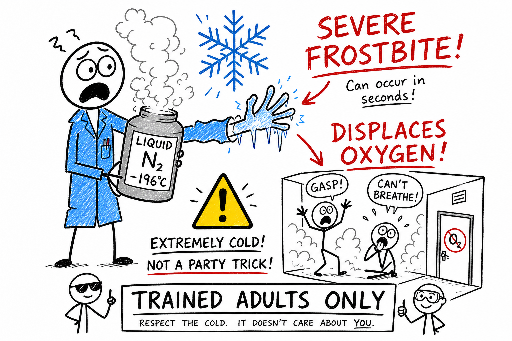

# Nitrogen

You sprint the last stretch of a mile and bend over, gasping. Your chest burns for oxygen — but most of what you just pulled into your lungs was not oxygen at all. About four out of every five breaths were **nitrogen gas**, going in and coming back out almost unchanged.

Crack open a bag of chips. It feels puffy, almost like a tiny pillow. That is not an accident. Food companies often flush bags with nitrogen gas because it is fairly unreactive and helps keep chips from going stale or getting crushed.

Walk past a garden or a farm field after rain. The green leaves look calm, but underground a hidden chemistry story is running. Plants need nitrogen to build proteins and DNA — yet they cannot simply drink nitrogen gas from the air the way you drink water from a hose.

Then a summer thunderstorm rolls in. Lightning flashes. Thunder cracks. In that split second of extreme energy, nitrogen in the sky can be torn apart and rebuilt into new compounds that rain carries toward the soil.

**Nitrogen is a chemical element, found mostly as N2 gas in air, and needed by living things to build proteins and DNA.**

Nitrogen is quiet in the atmosphere but powerful in living things, soil, industry, and chemistry. It is one of the key elements of life — and one of the trickiest for organisms to use.

As you learned in the chapter on **elements**, an element is a pure substance made of only one kind of atom. As you learned in the chapter on **molecules**, atoms can bond into larger groups. Nitrogen is element number 7 on the periodic table, and in air it usually travels as **N2** — two nitrogen atoms locked together in an extremely strong bond.

## Nitrogen Is an Element

**Nitrogen** is an element because every nitrogen atom is the same kind of atom.

Every nitrogen atom has **7 protons** in its nucleus. That number is nitrogen's **atomic number**: 7.

Nitrogen's chemical symbol is **N**.

On the periodic table, nitrogen is a **nonmetal**. It can form many important compounds, especially in living things.

| Fact | Value |
|------|-------|
| Name | Nitrogen |
| Symbol | N |
| Atomic number | 7 (7 protons) |
| Common form in air | N2 (nitrogen gas) |

## Nitrogen Gas — N2

In the atmosphere, nitrogen usually exists as **nitrogen gas**.

Its formula is **N2**.

N2 is a **diatomic molecule** — a molecule made of two atoms of the same element.

The two nitrogen atoms share electrons in a **triple bond**: three pairs of electrons holding them together. That bond is one of the strongest in ordinary chemistry.

Because the bond is so strong, nitrogen gas is **fairly unreactive** under normal conditions. It does not catch fire, rust metal, or react with everything around it. That stability is exactly why nitrogen can make up most of the air without causing chaos.

**Important:** N2 is still an **element**. Every atom in the molecule is a nitrogen atom. The element chapter explained that oxygen also commonly exists as O2 — same idea.

## Nitrogen in Air

Air is a **mixture** of gases, not a single compound.

Dry air near Earth's surface is roughly:

| Gas | About % of dry air |
|-----|-------------------|
| Nitrogen (N2) | 78% |
| Oxygen (O2) | 21% |
| Argon and others | 1% |

Carbon dioxide, water vapor, and trace gases are also present in smaller amounts.

**Nitrogen is the main gas in the air around you.**

When you inhale, you pull in a great deal of nitrogen. When you exhale, most of that nitrogen leaves unchanged. Your body uses oxygen for cellular respiration, but it does not use nitrogen gas directly for energy the way it uses oxygen.

That fact surprises many people — and it leads to one of the biggest puzzles in biology.

## The Nitrogen Problem

Earth's atmosphere is packed with nitrogen gas. Yet most living things **cannot use N2 directly**.

- **Plants** need nitrogen for proteins, DNA, and chlorophyll — but they cannot simply pull N2 from the air and build those molecules.
- **Animals** need nitrogen too — but they get it by eating plants or other animals, not by breathing nitrogen gas.

Before most organisms can use nitrogen, it must be changed into compounds such as **ammonia**, **ammonium**, **nitrates**, or **nitrites**.

This conversion is a central part of the **nitrogen cycle** — the movement of nitrogen through air, soil, water, and living things.

## Why Nitrogen Gas Is So Stable

Nitrogen gas is stable because the **triple bond** in N2 is very hard to break.

A **triple bond** is a covalent bond in which two atoms share **three pairs** of electrons.

Breaking that bond takes a lot of energy. Most plants and animals lack the tools to break it on their own.

That is why bacteria, lightning, and human industry matter so much. They are some of the main ways nitrogen gas gets converted into usable forms.

## Nitrogen and Life

Living things need nitrogen in many molecules:

| Molecule | Why nitrogen matters |
|----------|---------------------|
| **Proteins** | Build muscles, skin, hair, enzymes, and body structures |
| **DNA** | Store genetic instructions |
| **RNA** | Help cells use genetic instructions |
| **Chlorophyll** | Let plants capture light for photosynthesis |
| **Vitamins** | Support many body processes |

**Proteins** are large molecules built from smaller units called **amino acids**. Every amino acid contains nitrogen.

**DNA** stores genetic instructions using nitrogen-containing **bases**. RNA does similar work.

Without nitrogen, living things could not build many of their most important molecules. Your strength after training, the green of a lawn, and the instructions in every cell all depend on nitrogen chemistry — just not on nitrogen *gas* breathed straight from the air.

## Nitrogen Fixation — Unlocking the Air

**Nitrogen fixation** is the process of changing nitrogen gas (N2) into nitrogen compounds that living things can use.

### Bacteria: Earth's Hidden Nitrogen Workers

Some **bacteria** can fix nitrogen. They produce special **enzymes** that break the strong N2 bond and build usable compounds.

- Some nitrogen-fixing bacteria live freely in **soil**.
- Others live inside **root nodules** — small swellings on the roots of certain plants.

Nitrogen fixation is one of the most important biological processes on Earth. Without it, life as we know it would look very different.

### Legumes and Root Nodules

**Legumes** are plants such as peas, beans, lentils, clover, and alfalfa.

Many legumes form a partnership with nitrogen-fixing bacteria in root nodules:

| Partner | What it provides |
|---------|------------------|
| Plant | Sugars and a safe home on the root |
| Bacteria | Fixed nitrogen compounds the plant can use |

This close partnership is called **symbiosis** — different kinds of living things working together for mutual benefit.

Farmers have known for centuries that planting legumes can improve soil. Now you know the chemistry behind the tradition.

### Lightning: Storm Chemistry

**Lightning** can also help fix nitrogen.

A lightning bolt carries enormous energy. It can break apart nitrogen and oxygen molecules in the air. The atoms may recombine as **nitrogen oxides**, dissolve in rain, and reach the soil.

Lightning does not supply most of the world's usable nitrogen — bacteria do far more — but it is a real natural pathway. Storms are not only weather. They are also chemistry.

## The Nitrogen Cycle

The **nitrogen cycle** is the movement of nitrogen through air, soil, water, and living things.

Think of it as a loop, not a vocabulary list:

| Step | What happens |
|------|--------------|
| **Nitrogen fixation** | N2 becomes ammonia, ammonium, or related compounds |
| **Nitrification** | Soil bacteria change ammonia/ammonium into nitrites and nitrates |
| **Assimilation** | Plants absorb nitrogen compounds and build proteins, DNA, and more |
| **Food chains** | Animals get nitrogen by eating plants or other animals |
| **Decomposition** | Dead organisms and wastes return nitrogen compounds to soil |
| **Denitrification** | Certain bacteria change nitrogen compounds back into N2 gas |

Nitrogen moves from air → soil compounds → living things → soil → and sometimes back to air. The cycle keeps nitrogen available for life.

### Nitrification

**Nitrification** is when soil bacteria change ammonia or ammonium into **nitrites** and **nitrates**.

Many plants absorb **nitrates** through their roots. Without helpful bacteria, much soil nitrogen would not be in the best form for plant growth.

### Assimilation

**Assimilation** happens when plants take in nitrogen compounds and use them to build molecules such as proteins and DNA.

Animals then get nitrogen by eating plants — or by eating animals that ate plants.

The nitrogen in your muscles may once have been in soil, in a bean plant, or in the air long before bacteria fixed it. Life is connected by cycles of matter.

### Decomposition

When plants and animals die, **decomposers** (bacteria, fungi, and other organisms) break down remains and return nitrogen compounds to the soil. Animal wastes add nitrogen too.

Good soil depends on this recycling step.

### Denitrification

**Denitrification** is when certain bacteria change nitrogen compounds back into **nitrogen gas** (N2), returning it to the atmosphere.

This often happens in wet or low-oxygen soils. It completes the loop from soil back to air.

## Fertilizers and Farms

**Fertilizers** often contain nitrogen compounds because plants need nitrogen to grow.

Common types include ammonium compounds, nitrate compounds, and **urea**.

Used wisely, fertilizers help crops produce food for billions of people. Used carelessly, excess fertilizer can wash into rivers, lakes, and oceans — feeding **algal blooms**.

In an algal bloom, algae grow explosively, then die. Decomposers break them down and use oxygen from the water. Fish and other aquatic life can suffocate. **Dead zones** — areas with little aquatic life — can form.

Nitrogen is necessary for life. Too much in the wrong place can cause serious harm. Useful nitrogen must be managed carefully.

## The Haber Process — Industry Meets Agriculture

For most of history, usable nitrogen limited how much food farmers could grow. Then chemists solved a huge problem.

The **Haber process** is an industrial method for making **ammonia** (NH3) from nitrogen gas and hydrogen:

- High **pressure**
- High **temperature**
- A **catalyst** — a substance that speeds up a reaction without being used up

The Haber process made it possible to produce enormous amounts of fertilizer. That helped feed many more people. It also created responsibility: excess fertilizer can pollute water and disrupt ecosystems.

Powerful inventions often bring both benefits and duties.

## Important Nitrogen Compounds

### Ammonia — NH3

**Ammonia** is a compound of nitrogen and hydrogen. Its formula is **NH3**.

It has a sharp smell and appears in fertilizers, refrigeration, cleaning products, and chemical manufacturing.

Ammonia can act as a **base** (as you learned in the chapter on **bases**). Concentrated ammonia is irritating and dangerous. It can harm eyes, skin, and lungs.

**Never smell ammonia directly. Never mix ammonia cleaners with bleach or other cleaners** — the reaction can release poisonous gas.

### Nitrates

**Nitrates** are compounds containing the nitrate ion (nitrogen and oxygen). Many dissolve in water. Plants use them as a nitrogen source.

Nitrates appear in fertilizers and in the nitrogen cycle. Some nitrates are used in fireworks and explosives because they can supply oxygen in rapid reactions. Handle all such materials responsibly and only under adult supervision.

### Nitrogen Oxides

When nitrogen combines with oxygen, **nitrogen oxides** form — in lightning, engines, power plants, and fires.

Some nitrogen oxides contribute to **smog**, **acid rain**, and air pollution. Controlling vehicle and factory emissions matters for air quality and connects to chapters on **combustion** and **oxidation**.

## Nitrogen Gas in Daily Life

### Combustion and Fire Safety

Nitrogen gas does not support ordinary burning the way oxygen does. In fact, nitrogen in air **dilutes** oxygen and slows combustion. That is one reason ordinary air is less fire-intense than pure oxygen.

At very high temperatures, however, nitrogen can react with oxygen to form nitrogen oxides — as in engines and lightning.

### Food Packaging

Because N2 is fairly unreactive, food companies use nitrogen gas in some packaging. Replacing much of the oxygen with nitrogen can slow spoilage and oxidation — the same idea mentioned in the chapter on **oxidation**, where chip bags are flushed with nitrogen to protect fats from going rancid.

The gas in a chip bag is not just "extra air." It is often part of food preservation.

### Liquid Nitrogen

Cool nitrogen gas to about **-196 °C**, and it becomes **liquid nitrogen** — extremely cold.

Uses include freezing biological samples, industrial cooling, and science demonstrations. Liquid nitrogen can cause **severe frostbite** and can **displace oxygen** in closed spaces as it boils away.

Liquid nitrogen is for **trained adults** with proper equipment and ventilation only.

## Nitrogen in Explosives — Same Element, Different Arrangement

Some nitrogen-rich compounds store enormous chemical energy and can react very rapidly. Certain nitrates and other nitrogen compounds appear in explosives.

Explosives must never be treated casually.

The same element that helps plants grow can appear in dangerous materials when atoms are arranged differently. **Properties depend on how atoms are bonded and arranged.**

Nitrogen in air is calm. Nitrogen in some compounds can be powerful.

## Nitrogen and Your Body

Your body does not use nitrogen gas from the air directly.

But your body contains nitrogen in proteins, DNA, RNA, and many other molecules. You get that nitrogen from **food**:

- Beans, eggs, meat, fish, nuts, and dairy are protein-rich sources.
- Your body breaks down dietary proteins into amino acids and rebuilds its own proteins.

Nitrogen is part of growth, repair, and every cell's chemistry.

## Nitrogen Deficiency in Plants

Plants without enough usable nitrogen often grow poorly. Leaves may turn pale green or yellow. Plants may stay small or weak because nitrogen is needed for **chlorophyll** and **proteins**.

Farmers and gardeners test soil and may add fertilizer or compost. Too little nitrogen limits growth. Too much can pollute waterways.

## Common Misconceptions

One mistake is thinking **oxygen** is the main gas in air. **Nitrogen** is actually the largest part of dry air.

Another mistake is thinking nitrogen is useless because we do not "breathe it for energy." Nitrogen is essential in **proteins** and **DNA**.

A third mistake is thinking plants can use **N2 directly** from the air. Most need nitrogen compounds such as nitrates or ammonium.

A fourth mistake is thinking all nitrogen compounds are safe because nitrogen gas is unreactive. Some compounds are **toxic**, **polluting**, or **explosive**.

A fifth mistake is thinking fertilizer is always good. **Too much** can damage waterways and ecosystems.

## Nitrogen Safety

Nitrogen is common, but it still requires care.

- Do not inhale gases from tanks, bags, balloons, or unknown sources.
- Do not handle **liquid nitrogen** without trained adult supervision.
- Keep liquid nitrogen away from skin and eyes; use good ventilation; never seal it in a closed container.
- **Never mix ammonia cleaners with bleach** or other cleaners.
- Do not smell ammonia directly.
- Treat nitrate compounds and unknown powders as potentially hazardous.
- Wear goggles when a teacher requires them for demonstrations.
- Follow teacher instructions for fertilizers, ammonia, and disposal.

Nitrogen gas in ordinary air is safe to breathe as part of air. **Concentrated** nitrogen in a closed space can displace oxygen and cause suffocation.

## The Big Idea

Nitrogen is element number 7. It makes up most of the air as **N2**, a stable diatomic molecule held together by a strong triple bond. Living things need nitrogen for proteins, DNA, and many other molecules, but most organisms cannot use nitrogen gas directly. The **nitrogen cycle** — fixation, nitrification, assimilation, decomposition, and denitrification — moves nitrogen through air, soil, and life. Human industry, especially the **Haber process**, changed agriculture forever. Nitrogen compounds also appear in food packaging, pollution, and materials that demand respect.

If you remember only one sentence, remember this:

**Nitrogen is the main gas in air and an essential element of life, but it must be changed into usable compounds for most organisms.**

## Study Questions

1. What is nitrogen?
2. What is nitrogen's chemical symbol and atomic number?
3. What is the formula for nitrogen gas in air, and what does *diatomic molecule* mean?
4. About what percent of dry air is nitrogen? Why does most inhaled nitrogen leave the body unchanged?
5. Why is nitrogen gas fairly unreactive under ordinary conditions?
6. What is a triple bond?
7. Why can most plants and animals not use nitrogen gas (N2) directly from the air?
8. Name three important molecules in living things that contain nitrogen.
9. What is nitrogen fixation, and what kinds of organisms can do it?
10. How do legumes and root nodules relate to nitrogen fixation?
11. How can lightning help change nitrogen gas into usable compounds?
12. List the main steps of the nitrogen cycle and explain what each step does in plain language.
13. What is nitrification? What is assimilation? What is denitrification?
14. Why are nitrogen fertilizers useful, and how can too much fertilizer harm water ecosystems?
15. What is the Haber process, and why is it historically important?
16. What is ammonia (formula and one use), and why must ammonia cleaners never be mixed with bleach?
17. What are nitrates, and why are they important for plants?
18. What are nitrogen oxides, and why can they be an environmental problem?
19. How does nitrogen in air affect ordinary combustion compared with pure oxygen?
20. Why is nitrogen gas used in some food packaging?
21. What is liquid nitrogen, and what are two dangers of using it?
22. Why can the same element appear in calm air and in powerful or dangerous compounds?
23. Name two common misconceptions about nitrogen.
24. List three safety rules for nitrogen or nitrogen compounds.
