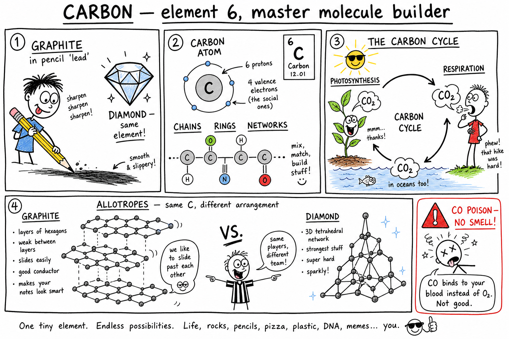

# Carbon

You sharpen a pencil and leave a gray-black streak on paper. That streak is mostly **graphite** — a form of carbon, not metal lead.

Hold a diamond up to light and it throws back sharp sparkles. Diamond is also carbon. Same element, wildly different look and feel.

Bite into an apple or a slice of pizza. The sugars, fats, and proteins in your food are built around carbon atoms. So is the wood in a desk, the rubber in sneakers, the plastic on a phone case, and the gasoline that powers many cars.

After a hard workout you breathe harder. Part of what you push out is **carbon dioxide** — carbon linked to oxygen, returning to the air.

Carbon is everywhere, yet easy to overlook because it hides inside molecules instead of shouting its name.

**Carbon is a chemical element with atomic number 6, famous for forming many compounds and serving as a basic element of life.**

Carbon forms the backbone of living molecules, fuels, plastics, medicines, foods, and countless materials. It can be soft graphite, hard diamond, invisible carbon dioxide, or part of the DNA inside your cells.

As you learned in the chapter on **elements**, an element is a pure substance made of only one kind of atom. As you learned in the chapter on **atoms**, every atom has a nucleus of protons and neutrons with electrons around it. As you learned in the chapter on **molecules**, atoms can bond into larger groups. Carbon is element number 6 — and one of the greatest "builders" in all of chemistry.

## Carbon Is an Element

**Carbon** is an element because every carbon atom is the same kind of atom.

Every carbon atom has **6 protons** in its nucleus. That number is carbon's **atomic number**: 6.

Carbon's chemical symbol is **C**.

On the periodic table, carbon is a **nonmetal**. It is not the most abundant element in Earth's crust, but it is one of the most important for life and chemistry.

| Fact | Value |
|------|-------|
| Name | Carbon |
| Symbol | C |
| Atomic number | 6 (6 protons) |
| Valence electrons | 4 |
| Common forms | Graphite, diamond, CO2, organic compounds |

## Carbon Atoms and Four Valence Electrons

A neutral carbon atom has **6 electrons** — the same number as protons, so the charges balance.

Most carbon atoms also have **6 neutrons**, though some **isotopes** have different neutron counts (more on that later).

The electrons that matter most for bonding sit in the outer shell. Carbon has **4 valence electrons**.

**Valence electrons** are outer electrons involved in bonding.

Because carbon has four valence electrons, it can form up to **four covalent bonds** — sharing electrons with hydrogen, oxygen, nitrogen, other carbons, and many more elements.

That bonding ability is the secret behind carbon's importance. Carbon is like a construction set for molecules: it can link into chains, rings, branches, sheets, and giant networks. Few elements can build such variety.

## Covalent Bonds — Sharing Electrons

Carbon usually forms **covalent bonds** — bonds in which atoms **share** electrons.

| Compound | What carbon bonds to | Simple idea |
|----------|----------------------|-------------|
| **Methane** (CH4) | 4 hydrogen atoms | One carbon, four H |
| **Carbon dioxide** (CO2) | 2 oxygen atoms | One carbon, two O |
| **Glucose** (C6H12O6) | H, O, and other C | Sugar in food |

Living molecules often contain carbon covalently bonded to hydrogen, oxygen, nitrogen, phosphorus, sulfur, and other carbon atoms. That shared-electron chemistry makes complex life possible.

## Organic Compounds — Carbon's Chemistry Kingdom

Many carbon-containing compounds are called **organic compounds**.

Organic compounds include:

- Sugars, fats, and proteins
- DNA and vitamins
- Fuels, plastics, and many medicines
- Wood, rubber, and many fabrics

**Organic chemistry** is the branch of chemistry that studies carbon compounds.

Not every carbon compound counts as organic in the classroom sense. **Carbon dioxide** (CO2) and **carbonates** (such as limestone) are usually treated as **inorganic** carbon compounds. Even so, carbon is the central element of organic chemistry and of life on Earth.

**Important:** In chemistry, **organic** does **not** mean "safe," "natural," or "good for you." Some organic compounds are harmless; others are poisonous. The word describes chemistry, not grocery-store marketing.

## Carbon and Life

Living things are built from carbon compounds.

Your body holds carbon in proteins, fats, sugars, DNA, and thousands of other molecules. Plants store carbon in cellulose, starches, oils, and proteins. Animals get carbon by eating plants — or by eating animals that ate plants.

Carbon can form **long chains** and **complex shapes**, which makes it ideal for building the large molecules life needs. Scientists often call Earth life **carbon-based life**.

### Carbon in Food

When you eat, you take in carbon compounds. **Carbohydrates**, **fats**, and **proteins** all contain carbon.

Your cells break some of these molecules apart and use them for energy, growth, and repair.

**Glucose**, a common sugar, has the formula **C6H12O6** — six carbons, twelve hydrogens, six oxygens.

During **respiration**, cells use **oxygen** (from the chapter on **oxygen**) to release energy from glucose, producing **carbon dioxide** and water. Carbon moves through your body every day.

## Carbon Dioxide — A Molecule With a Huge Job

**Carbon dioxide** is a compound of one carbon atom and two oxygen atoms. Its formula is **CO2**.

At ordinary temperatures it is a **gas**. Animals breathe it out. Plants take it in during **photosynthesis**. Burning many fuels produces it. It dissolves in oceans, fizzes in soda, and acts as a **greenhouse gas** in the atmosphere.

The next chapter, **Carbon dioxide**, goes deeper into CO2 — air, oceans, safety, and climate. For now, remember: carbon does not disappear when you exhale. It leaves as CO2, ready to move through the **carbon cycle**.

## Photosynthesis and Respiration — Opposite Partners

Plants, algae, and some bacteria use carbon dioxide in **photosynthesis**:

- **Inputs:** carbon dioxide, water, light energy
- **Outputs:** sugar (stored energy) and oxygen

In plain words: CO2 plus water plus sunlight can become sugar and oxygen. That process stores solar energy in carbon compounds.

**Respiration** (in cells) runs the other direction for many organisms:

- **Inputs:** glucose and oxygen
- **Outputs:** carbon dioxide, water, and usable energy

That is why you breathe in oxygen and breathe out carbon dioxide after exercise.

| Process | Who | Carbon dioxide | Oxygen | Energy |
|---------|-----|----------------|--------|--------|
| **Photosynthesis** | Plants, algae, some bacteria | Takes in | Releases | Stores in sugar |
| **Respiration** | Plants and animals (cells) | Releases | Uses | Releases from food |

Photosynthesis and respiration are connected partners in the carbon cycle — not opposites in a "good vs. bad" sense, but two sides of how carbon and energy move through living things.

## The Carbon Cycle

The **carbon cycle** is the movement of carbon through air, water, living things, rocks, soil, and fuels.

Think of it as a loop, not a single path:

| Pathway | What happens |
|---------|--------------|
| **Photosynthesis** | Plants take in CO2 and build carbon compounds |
| **Eating** | Animals get carbon from food |
| **Respiration** | Organisms release CO2 |
| **Decomposition** | Dead matter returns carbon to soil and air |
| **Fossil fuel burning** | Stored ancient carbon becomes CO2 |
| **Ocean exchange** | Seawater absorbs and releases CO2 |
| **Shells and rocks** | Carbonates store carbon for long periods |
| **Volcanoes** | Release carbon gases from Earth's interior |

Carbon is not used up. It **changes form** and **moves**. The carbon cycle links life, air, oceans, rocks, fuels, and climate.

### Carbon in the Ocean

Oceans hold a huge amount of carbon.

CO2 **dissolves** in seawater. Some becomes **bicarbonate** and **carbonate** ions. Marine organisms use carbonate to build shells and skeletons. When they die, some carbon becomes sediment and rock.

Oceans also **exchange** CO2 with the atmosphere. The ocean is a major piece of the carbon cycle — not a separate world from the air above your school.

### Carbonates — Carbon Locked in Rock

**Carbonates** are compounds containing the **carbonate ion** (carbon and oxygen together).

**Calcium carbonate** (CaCO3) appears in limestone, marble, chalk, seashells, coral, and eggshells.

Carbonates react with acids to produce CO2 gas — which is why **vinegar** bubbles on chalk or eggshell. Carbonates store enormous amounts of carbon in rocks and ocean sediments.

## Fossil Fuels and Climate

**Fossil fuels** — coal, oil, and natural gas — formed from ancient living things over millions of years. They store chemical energy in carbon-rich compounds.

When fossil fuels **burn**, carbon in the fuel reacts with oxygen and forms **carbon dioxide**, releasing energy. That CO2 returns to the atmosphere.

Burning fossil fuels has powered modern industry and transportation, but it also adds CO2 faster than natural cycles alone have handled in recent centuries.

### Greenhouse Gases

**Carbon dioxide** is a **greenhouse gas** — a gas that absorbs and re-emits heat in Earth's atmosphere.

Greenhouse gases help keep Earth warm enough for life. But **adding too much** CO2 can strengthen the greenhouse effect and contribute to **climate change**.

Human activities — burning fossil fuels, cutting forests, and changing land use — can increase atmospheric CO2. Understanding carbon helps explain one of the great environmental challenges of our time. The full CO2 chapter connects these ideas to air, oceans, and safety.

## Black Carbon Materials

Carbon often looks **black** when it is not bonded into clear crystals.

| Material | How it forms | Notes |
|----------|--------------|-------|
| **Charcoal** | Wood heated with limited oxygen | Used for grilling and drawing |
| **Soot** | Incomplete burning | Tiny carbon-rich particles in smoke |
| **Coal** | Ancient plant material compressed over time | A fossil fuel |

These are not always pure carbon, but carbon-rich structures absorb light and look dark. Treat smoke and soot as **unhealthy to breathe**.

## Graphite and Diamond — Same Element, Different Arrangement

### Graphite

**Graphite** is soft, dark, and slippery. Pencil "lead" is mostly graphite mixed with clay — not the metal lead.

Graphite's carbon atoms sit in **flat layers**. Layers can slide past each other, which makes graphite good for writing and lubrication. Graphite can also **conduct electricity** along its layers because some electrons can move.

### Diamond

**Diamond** is another form of carbon. Each carbon atom bonds to **four** other carbons in a strong three-dimensional network.

That arrangement makes diamond **extremely hard**. Pure diamond is transparent and can sparkle when cut. Diamonds appear in jewelry, cutting tools, drill bits, and scientific equipment.

**Same element, different structure, very different properties.** Arrangement controls what a material can do — the same lesson you saw with nitrogen compounds that are calm in air but powerful when bonded differently.

## Allotropes and Modern Carbon Forms

Different forms of the same element in the same state are called **allotropes**.

| Allotrope | Structure (simple) | Properties / uses |
|-----------|-------------------|-------------------|
| **Graphite** | Layered sheets | Soft, writes, conducts a bit |
| **Diamond** | 3D network | Very hard, cuts, jewelry |
| **Graphene** | Single carbon sheet | Strong, research in electronics |
| **Fullerenes** | Cage-like molecules | Nanotechnology research |
| **Carbon nanotubes** | Tiny tubes | Strength, possible future tech |

Scientists and engineers are still discovering uses for these forms. Carbon is not "finished" as a subject — it is an active frontier.

## Carbon in Materials and Technology

Carbon shows up in materials you touch every day:

- **Steel** — iron plus a small amount of carbon; more carbon often means harder steel
- **Carbon fiber** — strong and lightweight
- **Plastics** — large carbon-based molecules
- **Rubber, glues, paints, fuels, medicines** — carbon chemistry throughout

**Activated carbon** traps impurities in water and air filters. **Carbon black** strengthens rubber in tires. Carbon compounds power batteries, electronics, and medical tools.

Modern materials science depends heavily on carbon. If you like building, sports gear, or gadgets, you are already surrounded by carbon engineering.

## Carbon Monoxide — Invisible Danger

**Carbon monoxide** has formula **CO** — one carbon, one oxygen.

Unlike CO2, carbon monoxide is **poisonous**. It can form when fuels burn **without enough oxygen** (incomplete combustion).

| Fact | Why it matters |
|------|----------------|
| No color, no smell | You cannot detect it with your senses |
| Binds to blood | Stops blood from carrying oxygen properly |
| Indoor risk | Grills, engines, heaters in closed spaces are dangerous |

Homes should have **carbon monoxide detectors**. Never run engines, charcoal grills, or fuel-burning heaters in closed garages, tents, or rooms without ventilation. The chapter on **combustion** connects fuel burning to both CO2 and CO.

## Carbon Isotopes and Radiocarbon Dating

**Isotopes** are atoms of the same element with different numbers of neutrons.

| Isotope | Neutrons (typical) | Notes |
|---------|-------------------|-------|
| **Carbon-12** | 6 | Most common; stable |
| **Carbon-13** | 7 | Stable; less common |
| **Carbon-14** | 8 | Radioactive; decays over time |

**Carbon-14** forms naturally in the atmosphere. Living things take in carbon while alive. After death, new carbon-14 stops arriving, and the C-14 already present slowly decays.

**Radiocarbon dating** measures remaining carbon-14 to estimate the age of once-living materials — wood, bone, cloth, charcoal. Archaeologists and geologists use it to place ancient objects in time. It works only for certain materials and age ranges, but it is one of carbon's coolest detective tools.

## Common Misconceptions

One mistake is thinking carbon is only black charcoal or pencil graphite. Carbon also appears in diamond, CO2, sugars, proteins, plastics, and living things.

Another mistake is thinking carbon dioxide is always bad. CO2 is **necessary** for photosynthesis; problems come when **too much** builds up in the atmosphere over time.

A third mistake is thinking diamond and graphite are different elements. They are both carbon — arranged differently.

A fourth mistake is thinking **organic** means safe or natural. Organic compounds can be safe, harmful, natural, or synthetic.

A fifth mistake is thinking carbon **disappears** when fuel burns. Carbon atoms become CO2, CO, soot, or other products — matter is conserved, as you will explore further in chapters on **chemical reaction** and **conservation of matter**.

## Carbon Safety

Carbon substances vary widely in safety. Good habits:

- Do not breathe smoke, soot, or dust from carbon materials.
- Never use grills, engines, or fuel-burning heaters in closed spaces.
- Install and test **carbon monoxide detectors** at home.
- Do not taste unknown carbon compounds.
- Wear goggles when experiments require them.
- Keep fuels and solvents away from flames.
- Handle graphite, charcoal, and powders carefully to avoid dust.
- Treat carbon monoxide as extremely dangerous even though it cannot be seen or smelled.
- Use adult supervision for combustion demonstrations.
- Follow disposal instructions for fuels, plastics, solvents, and chemical samples.

Carbon is essential to life, but some carbon compounds — especially CO and many solvents — can be deadly.

## The Big Idea

Carbon is element number 6 with four valence electrons. It forms covalent bonds and builds chains, rings, sheets, and networks. Carbon is the backbone of organic compounds and living things. It appears in CO2, carbonates, fossil fuels, foods, graphite, diamond, steel, plastics, and countless technologies. The **carbon cycle** moves carbon through air, water, organisms, rocks, and fuels — linking life, industry, and climate.

If you remember only one sentence, remember this:

**Carbon is element 6, a master builder of molecules and materials because it can bond in many strong and varied ways.**

## Study Questions

1. What is carbon?
2. What is carbon's chemical symbol and atomic number?
3. How many valence electrons does carbon have, and why does that matter?
4. What is a covalent bond?
5. What are organic compounds? Name four examples.
6. Why is carbon important for living things?
7. What is the formula for glucose?
8. What is carbon dioxide (formula), and what will the next chapter explore about it?
9. How do photosynthesis and respiration differ regarding carbon dioxide and oxygen?
10. What is the carbon cycle? Name four pathways carbon takes.
11. How do oceans store or move carbon?
12. What are carbonates? Where is calcium carbonate found?
13. Why does burning fossil fuels add CO2 to the atmosphere?
14. What is a greenhouse gas?
15. How do graphite and diamond differ if both are carbon?
16. What are allotropes? Name three besides graphite and diamond.
17. Give two everyday uses of carbon in materials or technology.
18. What is carbon monoxide, and why is it dangerous?
19. What are carbon isotopes? How is carbon-14 used in radiocarbon dating?
20. Name two common misconceptions about carbon.
21. List three safety rules related to carbon or carbon compounds.
