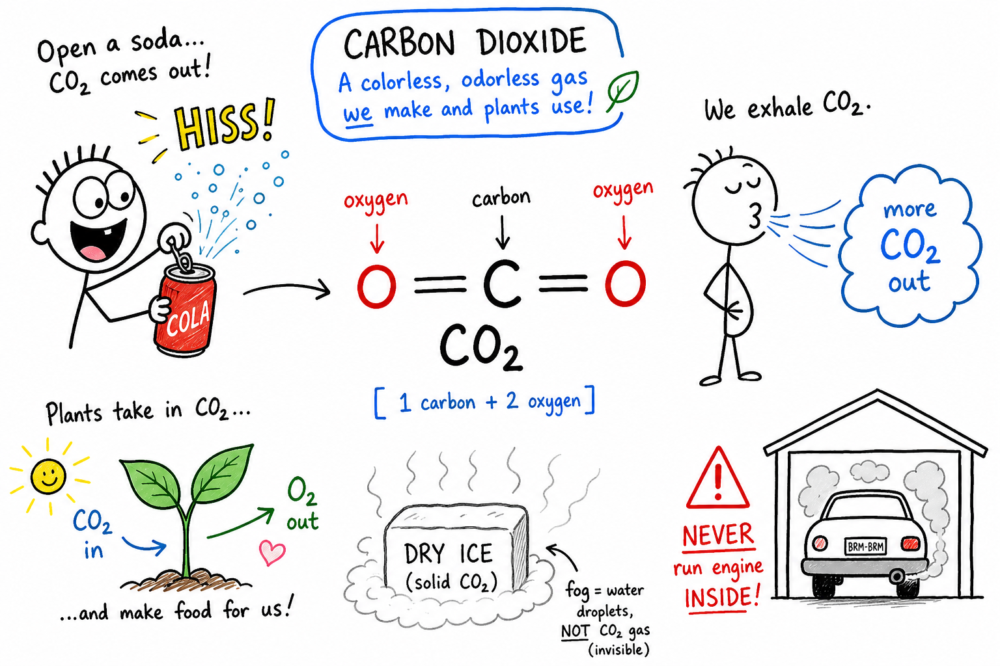

# Carbon dioxide

You crack open a cold soda after practice. The hiss is loud. Bubbles race up the glass. You take a sip and feel that sharp, tingly bite on your tongue.

You cannot see the gas doing the work. You cannot smell much of it in a normal room. But carbon dioxide is everywhere — in your breath, in plants, in fires, in caves, in oceans, and in the air above your school.

**Carbon dioxide is a compound made of one carbon atom and two oxygen atoms.**

Its chemical formula is **CO2**. That small molecule connects breathing, photosynthesis, burning fuel, fizzy drinks, dry ice fog, limestone caves, and Earth's climate. Carbon dioxide is necessary for life. It is also powerful and sometimes dangerous when too much builds up in the wrong place.

## The Formula CO2

Scientists write carbon dioxide as **CO2**.

- **C** = carbon (one atom)
- **O** = oxygen (two atoms — the small **2** means "two of them")

So one molecule of carbon dioxide contains:

| Part | Count |
|------|-------|
| Carbon atoms | 1 |
| Oxygen atoms | 2 |

Carbon dioxide is a **compound** because two different elements are chemically joined in a fixed ratio. It is not a mix you could separate by filtering. The atoms are bonded together.

## A Molecule You Cannot See

A **molecule** is a group of atoms held together by chemical bonds.

In a CO2 molecule, the carbon atom sits in the middle and the two oxygen atoms are on the ends. The molecule is straight — scientists call that **linear**.

The atoms share electrons in **covalent bonds**. You will not draw every electron in this chapter, but remember the big idea: CO2 is a small, stable molecule that plays a huge role in chemistry and biology.

## Carbon Dioxide Is a Gas

At ordinary room temperature and pressure, carbon dioxide is a **gas**.

- No color
- No strong smell at normal outdoor levels
- Naturally present in air in small amounts

CO2 is **denser than air**, so a large release can sink and collect in low places — basements, ditches, caves, or the bottom of a tank. That matters for safety. Too much carbon dioxide can **crowd out oxygen**, which is what your lungs need.

Invisible does not mean harmless.

## A Small Slice of Air — With a Big Job

Dry air is mostly **nitrogen** and **oxygen**. Carbon dioxide is only a **small fraction** of the atmosphere.

Small does not mean unimportant.

Plants use CO2 in **photosynthesis**. CO2 helps trap heat as a **greenhouse gas**. It moves through the **carbon cycle** between air, water, living things, and rocks.

Some gases change the world even when they make up only a tiny part of the air.

## Respiration: Your Cells on the Clock

After sprints, stairs, or a tough match, your breathing speeds up. Part of the reason is that your cells need oxygen — and they produce carbon dioxide as a waste product.

**Respiration** is the process cells use to release energy from food.

In many organisms, glucose reacts with oxygen to produce carbon dioxide, water, and usable energy. You breathe in oxygen. You breathe out air that contains **more CO2** than you breathed in.

Carbon dioxide is a waste product for your cells, but plants can use it. Nothing in nature stays "waste" for long if another living thing can recycle it.

## What Actually Leaves Your Lungs

CO2 from your cells enters your **blood**. Your blood carries it to your **lungs**. When you exhale, carbon dioxide leaves your body.

You do **not** breathe out pure CO2. Exhaled air is still mostly nitrogen. It still contains oxygen, water vapor, and other gases. But the CO2 level is **much higher** than in fresh air.

That difference is evidence that chemistry is running inside you right now — even while you read this.

## Photosynthesis: Plants Flip the Script

Plants, algae, and some bacteria run the opposite chemistry during **photosynthesis**.

They use **sunlight**, **carbon dioxide**, and **water** to make **sugar** and **oxygen**.

In simple words:

**Carbon dioxide + water + light → sugar + oxygen**

Photosynthesis stores energy in carbon compounds such as glucose. It pulls CO2 out of the air and feeds the food web. Every apple, every blade of grass, every tree trunk — photosynthesis helped get the carbon there.

## Combustion: Fire and Engines

Burning often makes carbon dioxide.

**Combustion** is a chemical reaction in which a fuel reacts with oxygen and releases energy as heat and light.

When carbon-containing fuels burn **completely**, carbon in the fuel combines with oxygen to form CO2.

Examples:

- Wood in a campfire
- Gasoline in an engine
- Natural gas on a stove
- Coal in a power plant
- A candle flame

If oxygen is limited, burning may produce **carbon monoxide (CO)** or **soot** instead of only CO2. Complete burning with plenty of oxygen favors CO2.

## Carbon Dioxide and Fire

Fire needs **fuel**, **heat**, and **oxygen**.

Carbon dioxide does **not** support ordinary burning the way oxygen does. It can help put out some fires by pushing oxygen away from the flame.

That is why some **fire extinguishers** spray CO2 gas. They are useful for certain **electrical fires** because they do not leave a wet mess.

But CO2 extinguishers are **not for every fire**, and they must be used correctly. The gas comes out very cold. In a small room, it can reduce breathable oxygen. Only trained people should use extinguishers in real emergencies.

## Fizzy Drinks and Pressure

Soda, sparkling water, and some sports drinks are **carbonated** — they have CO2 dissolved under pressure.

While the can or bottle is sealed, pressure keeps extra gas dissolved in the liquid. When you open it, pressure drops. CO2 escapes as **bubbles**.

Warm soda goes flat faster because gases usually dissolve **less well** in warm liquid. Cold soda holds bubbles longer. That is not magic — it is chemistry you can test in your kitchen with adult permission.

## Carbonic Acid: The Sharp Taste

When CO2 dissolves in water, some of it forms **carbonic acid** — a weak acid.

That helps explain the tangy bite of fizzy drinks. In the atmosphere and oceans, CO2 and water also interact to form carbonic acid and related ions. That connects rainwater, cave formation, shell chemistry, and ocean health.

Carbon dioxide is not only a gas. It is part of **solution chemistry** too.

## Oceans: Giant Carbon Storage

Oceans absorb CO2 from the atmosphere.

Some dissolves as gas. Some becomes carbonic acid, **bicarbonate**, and **carbonate** ions. Marine organisms use carbonate to build shells and skeletons.

The ocean stores an enormous amount of carbon. But extra CO2 from human activity can make seawater more acidic — **ocean acidification**. That can make life harder for corals, shellfish, and other organisms that build **calcium carbonate** shells.

Divers and snorkelers see beautiful reefs; chemists see carbonate chemistry under stress.

## Carbonates: Rock, Shells, and Bubbles

**Carbonates** are compounds containing the **carbonate ion**.

**Calcium carbonate** shows up in:

- Limestone and marble
- Chalk
- Seashells and coral
- Eggshells

Many carbonates react with acids to produce **CO2 gas**. That is why vinegar bubbles on chalk or eggshell — you are watching an acid–carbonate reaction release carbon dioxide.

## Caves and Limestone

Rainwater picks up CO2 from air and soil, forming weak carbonic acid. Over long periods, that acidic water can slowly dissolve limestone (calcium carbonate) and carve **caves**.

Inside caves, dissolved minerals can later form **stalactites** and **stalagmites**. Carbon dioxide helped shape underground worlds you might only see on a field trip — or in a documentary with a good headlamp.

Tiny chemistry, enormous time, huge spaces.

## Dry Ice and Sublimation

**Dry ice** is solid carbon dioxide.

At normal air pressure, dry ice does not melt into a puddle. It goes straight from solid to gas. That change is called **sublimation**.

Dry ice is **extremely cold** and can cause frostbite. In a closed room, sublimating dry ice can fill the space with CO2 and reduce oxygen. The spooky white "fog" you sometimes see is **not** CO2 gas itself (the gas is invisible). The fog is mostly tiny **water droplets** cooled by the cold gas.

Handle dry ice only with **adult supervision**, ventilation, and proper gloves or tongs. Never seal it in a closed container — pressure can build dangerously.

## The Greenhouse Effect

CO2 is a **greenhouse gas**. Greenhouse gases absorb and re-emit heat in Earth's atmosphere.

They help keep Earth warm enough for liquid water and life. Without them, Earth would be much colder.

The problem is **balance**. Adding too much CO2 from burning fossil fuels and other human activities can strengthen the greenhouse effect and contribute to **climate change**.

Carbon dioxide is natural and necessary. **The amount** still matters.

## Where Extra CO2 Comes From

Human activities add CO2 faster than natural systems alone have handled in recent centuries.

Major sources include:

- Burning coal, oil, and natural gas
- Gasoline and diesel engines
- Cement production
- Cutting and burning forests

**Fossil fuels** contain carbon from ancient living things. When they burn, that carbon combines with oxygen and becomes CO2 in the air — carbon that was stored underground for millions of years is released in years or decades.

Natural sources — respiration, decomposition, volcanoes, wildfires, ocean exchange — are part of the normal **carbon cycle**. The concern is the **extra** load from human activity.

## Carbon Sinks: Earth's Balancing Act

A **carbon sink** absorbs more carbon than it releases.

Examples:

- Growing forests taking in CO2
- Oceans dissolving CO2
- Soils storing organic matter
- Rocks holding carbonate minerals

Protecting forests, wetlands, and oceans is one way people try to slow the rise of atmospheric CO2. Sinks are not unlimited, but they are part of Earth's balancing systems.

## Measuring What You Cannot See

Scientists measure atmospheric CO2 in **parts per million (ppm)** — how many CO2 molecules exist per million molecules of dry air.

Even tiny fractions can have large effects on climate and chemistry. **CO2 sensors** are used in labs, greenhouses, buildings, and climate research.

Measuring beats guessing. Your eyes cannot see gas concentration — instruments can.

## Classrooms, Gyms, and Stale Air

People exhale CO2. In a crowded room with poor ventilation, CO2 levels can rise. High CO2 can make air feel stuffy and may cause sleepiness or headaches for some people.

**Ventilation** brings in fresh air. Opening windows, using HVAC systems, and taking breaks outdoors help.

CO2 is not the only measure of air quality, but it is a useful clue that a space needs more fresh air.

## Houseplants Are Helpful — Not Magic

Plants use CO2 in photosynthesis, but a few pots on a windowsill will not replace ventilation in a closed bedroom.

In sunlight, plants take in CO2 and release oxygen. In darkness, they also **respire** — using oxygen and releasing CO2.

Plants matter. They are not air-purifying machines that cancel out a sealed room. You still need fresh air exchange.

## Carbon Dioxide vs. Carbon Monoxide

These names sound alike. The compounds are **not** the same.

| | Carbon dioxide | Carbon monoxide |
|---|----------------|-----------------|
| Formula | CO2 | CO |
| Oxygen atoms | 2 | 1 |
| Smell at dangerous levels | Not a reliable warning | No color, no smell |
| Main danger | Displaces oxygen at high levels | Binds to blood; blocks oxygen transport |
| Common sources | Breath, combustion, soda, dry ice | Incomplete burning, faulty heaters, engines in closed spaces |

**Carbon monoxide** is far more poisonous in small amounts because it binds to hemoglobin and prevents blood from carrying oxygen properly.

Both gases can hurt you. For different reasons. Learn the formulas and the risks.

## Common Misconceptions

One mistake is thinking CO2 is always bad. It is essential for photosynthesis and part of natural cycles.

Another is confusing **CO2** with **CO** or with breathable **O2**. The oxygen inside a CO2 molecule is bonded to carbon — it is not the same as oxygen gas you breathe.

Some people think the fog around dry ice **is** CO2 gas. The gas is invisible; the fog is mostly cooled water droplets.

Others think a small amount of gas cannot matter. A trace gas can still change climate and ocean chemistry.

## Safety Rules That Matter

- Do not play with dry ice.
- Use dry ice only with adult supervision, ventilation, and insulated gloves or tongs.
- Never seal dry ice in a closed container.
- Do not put dry ice in your mouth or touch it to bare skin.
- Never run engines, grills, or generators indoors or in garages with doors closed.
- Do not enter tanks, silos, caves, or pits where heavy gas may collect.
- Ventilate crowded indoor spaces.
- Follow instructions on fire extinguishers and gas tanks.
- Leave the area and tell an adult if you suspect a gas leak or air-quality emergency.

Carbon dioxide is familiar in everyday life. Concentrated CO2 or dry ice in the wrong place is not a game.

## The Big Idea

Carbon dioxide is **CO2**: one carbon atom and two oxygen atoms in a small, linear molecule. It is a colorless gas at room conditions, produced by respiration and combustion, used by plants in photosynthesis, dissolved in fizzy drinks, linked to carbonates and caves, stored in oceans, and measured in parts per million. It is a greenhouse gas Earth needs in balance — and a gas that can displace oxygen when too much collects in an enclosed space.

If you remember only one sentence, remember this:

**Carbon dioxide is CO2 — a carbon-and-oxygen gas essential to life and the carbon cycle, powerful in small amounts, and risky when it builds up where you breathe.**

## Study Questions

1. What is carbon dioxide?
2. What does the formula CO2 tell you about the atoms in one molecule?
3. Why is carbon dioxide called a compound?
4. What state is carbon dioxide in at ordinary room temperature and pressure?
5. Why can too much carbon dioxide in a closed, low space be dangerous?
6. What is respiration, and how does it connect to your breathing?
7. What is photosynthesis, and how do plants use carbon dioxide?
8. What is combustion, and why does burning carbon-containing fuel often produce CO2?
9. Why can carbon dioxide help put out some fires?
10. Why do fizzy drinks bubble when you open the container?
11. What is carbonic acid, and where does it come from?
12. What is ocean acidification?
13. What are carbonates? Give two examples of calcium carbonate in nature.
14. What gas forms when many carbonates react with acids?
15. How can carbon dioxide help form caves in limestone?
16. What is dry ice, and what is sublimation?
17. Why is the white fog around dry ice not the same as CO2 gas?
18. What is a greenhouse gas, and why is CO2 both helpful and a concern?
19. What is a carbon sink? Give one example.
20. What does "parts per million" mean when scientists measure CO2 in air?
21. Why can CO2 levels rise in a crowded, poorly ventilated classroom?
22. How is carbon dioxide different from carbon monoxide?
23. Name two common misconceptions about carbon dioxide.
24. Give three safety rules for dry ice or concentrated CO2.
25. In your own words, explain why carbon dioxide is "small in the air but big in science."
