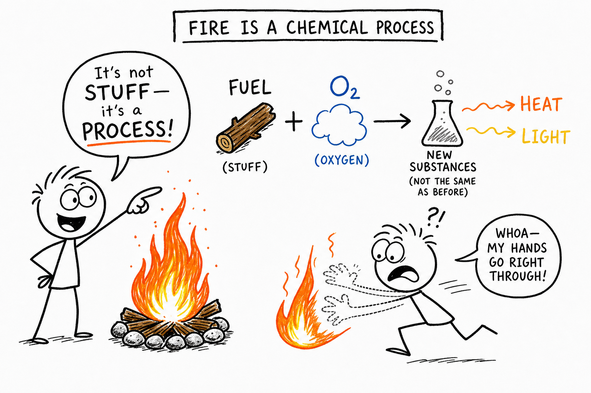
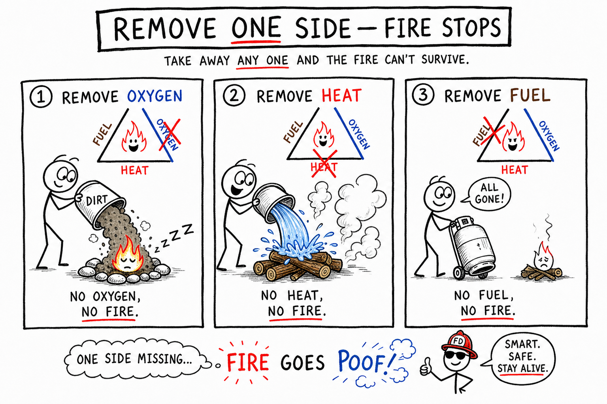
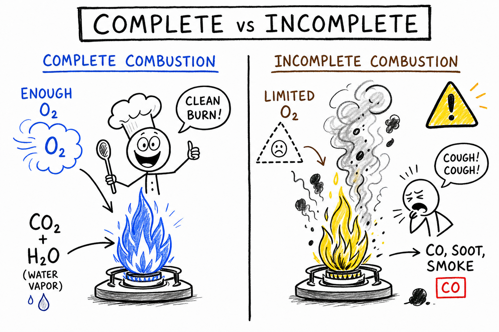
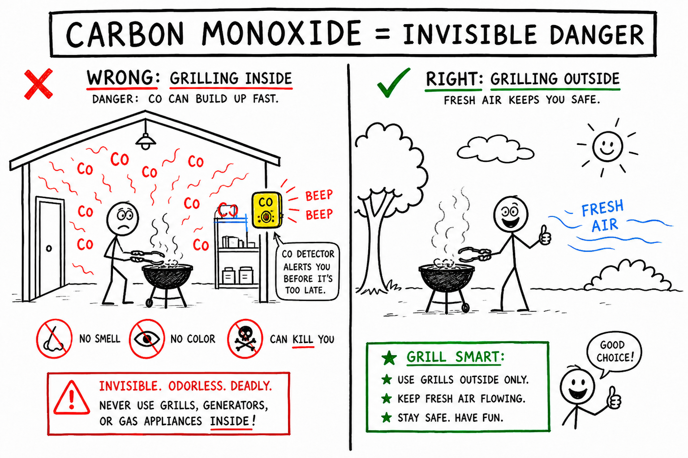
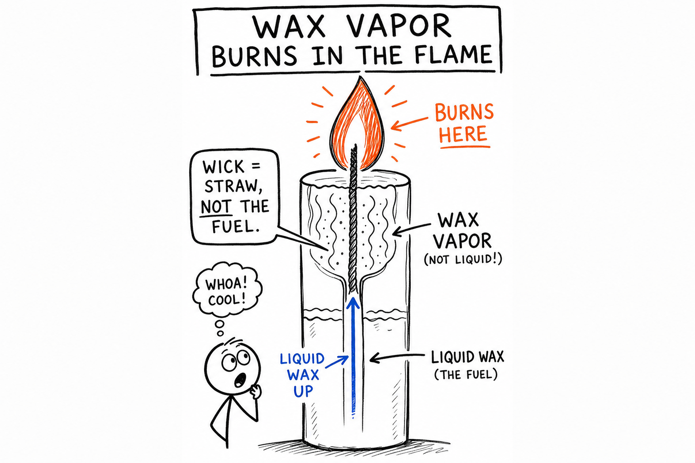
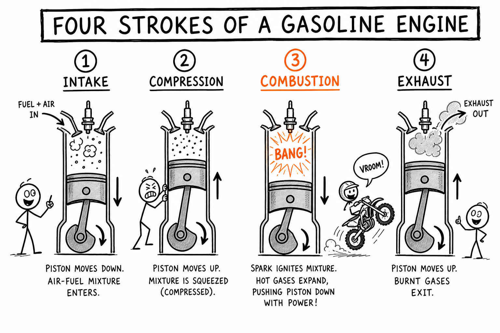

# Combustion

You strike a match and the grill flares to life — burgers sizzling, smoke curling into the evening sky. Down the block, a dirt bike coughs once, then roars away; inside its engine, tiny controlled fires are happening hundreds of times per minute. At a birthday party, wax crawls down a candle while the flame holds steady. On the Fourth of July, sparklers throw showers of white-hot sparks from your hand. On your screen, a rocket climbs on a pillar of orange fire.

Different scenes. Same chemistry underneath.

In every case, a **fuel** is reacting fast with **oxygen**, and energy pours out as **heat** and **light**. That fast reaction is **combustion**.

**Combustion is a chemical reaction in which a fuel reacts with oxygen and releases energy, often as heat and light.**

Combustion cooks food, warms homes, powers engines, launches rockets, and runs much of modern life. It also starts wildfires, fills rooms with smoke, and creates real danger when it is not controlled. Understanding combustion means understanding both power and risk — the same science that roasts marshmallows can also fill a garage with poison gas if you use a grill indoors.

As you learned in the chapter on **oxygen**, oxygen does not burn by itself — but it **supports** combustion. As you learned in the chapters on **carbon** and **carbon dioxide**, many fuels are carbon-rich, and complete burning often produces **CO₂**. Combustion is a **chemical change**: atoms rearrange into new substances. The next chapter on **oxidation** will show that combustion is fast oxidation — chemistry you can often see and feel.

## Combustion at a Glance

| Idea | What to remember |
|------|------------------|
| **Definition** | Fuel + oxygen → new substances + energy (heat and light) |
| **Fire triangle** | Fuel, oxygen, and heat — remove one side, fire stops |
| **Complete burn** | Enough oxygen → mainly CO₂ and water vapor |
| **Incomplete burn** | Limited oxygen → CO, soot, smoke — extra danger |
| **Flame** | Hot gases burning — many fuels must vaporize first |
| **Safety** | Smoke and carbon monoxide can kill even when flames look small |

Keep this anchor phrase in mind:

**Combustion is fast oxidation you can see — fuel reacts with oxygen and releases energy.**

## Fire Is a Chemical Reaction

Fire looks like a thing you can point at. It is not. Fire is a **process** — a chain of chemical steps happening faster than you can blink.

In most ordinary fires, fuel reacts with oxygen from the air. Chemical bonds in the fuel and oxygen break. New bonds form in the products. Energy is released. Some of that energy becomes **heat** you feel on your face. Some becomes **light** you see as a glow. The flame is your proof that chemistry is running at full speed.

What you notice during combustion:

- **Heat** — your hands warm near a campfire; metal near a flame gets too hot to touch
- **Light** — the flame glows yellow, orange, or blue depending on the fuel and oxygen
- **New gases** — carbon dioxide and water vapor drift away (often invisible)
- **Smoke or soot** — when burning is incomplete, particles and gases fill the air

As you learned with **compounds** and **mixtures**, substances can change into new substances with different properties. Combustion is one of the most dramatic examples — reactants become products, and the change is hard to reverse. The wood is gone; the ash and gases are what remain.

## The Fire Triangle

Most ordinary fires need three things at once:

| Side | What it means | Example |
|------|----------------|---------|
| **Fuel** | The substance that burns | Wood, propane, gasoline vapor |
| **Oxygen** | Usually from the air (~21%) | Surrounding air pulled into a flame |
| **Heat** | Enough energy to start and keep the reaction | Spark, match, hot engine part |

Together these form the **fire triangle** (see the chapter diagram at the top).

Remove any one side, and the fire goes out:

- **Smother a campfire with dirt** → you cut off oxygen
- **Soak wood in water** → you remove heat (and block some oxygen)
- **Run out of propane in the tank** → fuel is gone, flame dies
- **Blow out a candle** → you push away hot fuel vapor and cool the wick

Firefighters and engineers think in fire-triangle terms because the idea is simple and powerful. When you troubleshoot a fire — or try to prevent one — ask which side of the triangle you can control.

## Fuel

A **fuel** is a substance that releases energy when it reacts.

Common fuels include:

| Fuel | Where you might see it |
|------|------------------------|
| Wood and paper | Campfires, bonfires, cardboard |
| Wax and charcoal | Candles, grills, smokers |
| Natural gas, propane, gasoline | Stoves, heaters, engines, dirt bikes |
| Coal and oil | Power plants, industry, ships |

Many fuels contain **carbon** and **hydrogen**. When they burn completely, carbon often becomes carbon dioxide and hydrogen often becomes water vapor.

Fuel is not always a solid or liquid. Many fires burn **vapor** or **gas** first. That is why you smell gasoline at the pump — those fumes are vapor ready to ignite near a spark, static shock, or hot engine part. Liquid gasoline in the tank is harder to ignite than the vapor above it. Same rule for propane leaks, paint thinner fumes, and aerosol spray near a flame.

## Oxygen

Oxygen does not burn by itself. It **supports** combustion.

Air is about 21 percent oxygen. A candle flame pulls oxygen from the surrounding air. Cover a candle with a jar, and the oxygen inside runs low — the flame may go out.

Pure oxygen can make fires burn far more intensely than ordinary air. That is why oxygen tanks must stay away from flames, sparks, grease, and oil.

**Important:** A common mistake is calling oxygen the fuel. It is not. The fuel is what actually burns. Oxygen is the partner that helps the fuel react.

## Heat and Ignition

Fuel usually needs heat before it starts burning.

**Ignition** is the start of combustion.

The **ignition temperature** is the temperature at which a substance begins to burn.

Dry paper ignites more easily than a thick log because paper is thin and has lots of **surface area** exposed to heat and oxygen. Gasoline **vapors** ignite more easily than liquid gasoline sitting in a tank. Lint packed in a dryer vent has huge surface area — that is one reason clogged vents are a serious fire hazard in homes.

Heat gives particles enough energy for the reaction to begin. Once combustion starts, the heat released can keep the reaction going on its own — a campfire feeds itself until the wood runs out or someone removes fuel, oxygen, or heat.

## Products of Combustion

Combustion changes substances into new substances. It is a **chemical change** — atoms are rearranged, not destroyed.

When a carbon-containing fuel burns completely, common products include:

| Product | Notes |
|---------|--------|
| Carbon dioxide (CO₂) | Normal product of complete burning |
| Water vapor | From hydrogen in the fuel |
| Heat | Felt on your skin near a flame |
| Light | What makes a flame visible |

For example, **methane** (the main part of natural gas) can burn in oxygen to form carbon dioxide and water. The wax on a candle does the same kind of chemistry on a smaller scale. Combustion does not simply make smoke. It makes new chemical products, many of them invisible gases.

## Complete vs. Incomplete Combustion

| | Complete combustion | Incomplete combustion |
|---|---------------------|----------------------|
| Oxygen supply | Enough oxygen | Not enough oxygen |
| Common products | CO₂, water vapor, heat, light | CO, soot, smoke, unburned fuel |
| Flame clue | Often cleaner, bluer | Often yellow and smoky |
| Energy | More energy released | Less energy released |
| Safety note | Still produces CO₂ | Can produce poisonous CO |

**Complete combustion** happens when fuel burns with enough oxygen. For many carbon-based fuels, the main products are carbon dioxide and water. A clean blue gas flame on a stove often signals more complete combustion.

**Incomplete combustion** happens when oxygen is limited. It can produce carbon monoxide, soot, smoke, and unburned fuel particles — and less useful energy than complete combustion.

## Carbon Monoxide: The Invisible Danger

**Carbon monoxide** (CO) is a poisonous gas with no color and no smell. It can form when fuels burn without enough oxygen.

Carbon monoxide is dangerous because it prevents blood from carrying oxygen properly. Engines, grills, stoves, furnaces, fireplaces, and heaters can produce it if they are not working or venting correctly. That is why homes need **carbon monoxide detectors**.

Never use grills, camp stoves, or fuel-burning engines indoors. Smoke is not the only threat in a fire — carbon monoxide can be deadly even when you cannot see it.

## Carbon Dioxide and Water Vapor

**Carbon dioxide** (CO₂) is a compound of one carbon atom and two oxygen atoms. It is a normal product of complete combustion of carbon-containing fuels. It is not poisonous in the same way CO is, but very high concentrations can displace oxygen. CO₂ is also a **greenhouse gas** — burning fossil fuels adds it to the atmosphere and connects combustion to climate science. (The chapter on **carbon dioxide** goes deeper into CO₂ in air, oceans, and life.)

Combustion of hydrogen-containing fuels often produces **water vapor**. Hydrogen in the fuel combines with oxygen to form water. Hold a cold spoon above a clean candle flame and you may see droplets — that water came from the reaction, not from the air alone.

## Flames

A **flame** is the hot, glowing region where gases are burning. You are not looking at "fire stuff" — you are looking at hot gases and sometimes glowing particles.

Many fuels must become vapor or gas before they burn with a visible flame. In a candle, heat melts wax near the wick. Liquid wax creeps up the wick like oil in a lamp, then vaporizes. **Wax vapor** burns in the flame above the wick. The wick mainly carries fuel upward; the wax is the real fuel. Blow out the candle and you may see a thin thread of smoke — that smoke is unburned wax vapor escaping.

Different parts of a flame can have different temperatures and different amounts of oxygen. The hottest zone is often near the base, where fresh fuel vapor meets air. That is why flame color and shape change when you blow on a candle or open a grill lid.

## Why Flames Glow

Flames glow because hot gases and particles give off light. In a yellow candle flame, tiny soot particles become hot and glow. A blue flame often means the fuel is mixing well with oxygen and burning more completely.

Fireworks get their colors from metal salts and other chemicals that release characteristic colors when heated. Flame color can give clues about what is burning — but interpreting it takes care. Never experiment with flame colors without trained adult supervision.

## Surface Area: Why Dust Can Explode

Surface area strongly affects how fast fuel can burn.

Small pieces burn more easily than large chunks because more surface is exposed to oxygen and heat:

- Wood shavings catch fire more easily than a thick log
- Crumpled paper lights faster than a dense log
- Fine powder mixed with air can burn far faster than a solid block of the same material

**Dust explosions** are a real industrial hazard — not movie magic. Grain dust in a silo, flour dust in a bakery, coal dust in a mine, or sawdust in a workshop can ignite almost like a chain reaction because millions of tiny particles have enormous total surface area. One spark in a dusty room can trigger a disaster. Mills, factories, and workshops control dust for this reason. Same chemistry as a campfire — wildly different scale and speed. Never try to demonstrate dust ignition; learn about it from a safe distance.

## Combustion in Engines

Many engines are combustion machines. If it has a gas tank and a tailpipe, combustion is probably doing the heavy lifting.

In a **gasoline engine**, fuel vapor mixes with air inside a cylinder. A spark plug ignites the mixture. The burn is so fast it acts like a tiny, controlled explosion. Hot expanding gases shove the piston down. The piston turns the crankshaft, which turns gears, chains, or belts — and finally the wheels.

That same cycle repeats over and over:

- **Intake** — fuel-air mixture enters the cylinder
- **Compression** — the piston squeezes the mixture
- **Combustion** — spark ignites the fuel; gases expand violently
- **Exhaust** — burned gases leave through the tailpipe

One "combustion stroke" in a dirt bike or lawn mower. Hundreds per minute in a car on the highway.

**Diesel** engines also use combustion but ignite fuel by compression heat instead of a spark plug. **Jet engines** burn fuel with compressed air and shoot hot gases backward to produce thrust. Whether you are hearing a dirt bike bark, a leaf blower whine, or a jet roar overhead, you are hearing the results of combustion.

Combustion engines turn chemical energy in fuel into motion and heat. They are powerful and useful — and they also produce exhaust gases, including carbon dioxide.

## Combustion in Rockets

Rockets use combustion to produce thrust, but they cannot rely on air for oxygen. There is no air in space — and not much at high altitude either.

A rocket must carry **fuel** and an **oxidizer** — a substance that supplies oxygen or helps the fuel burn. Model rockets use solid fuel in a cardboard tube; big launch vehicles use liquid hydrogen with liquid oxygen, or other carefully chosen pairs. When hydrogen and oxygen burn together, the main product is hot water vapor — and an enormous push backward.

Rocket combustion must be controlled with extreme precision. A small error is not a small problem. Engineers test engines on the ground for years before trusting them with astronauts or expensive satellites.

## Combustion in Cooking

Cooking often uses combustion directly — you are eating food that was heated by a chemical reaction.

- **Gas stoves** burn natural gas or propane under pots and pans
- **Charcoal grills** burn carbon-rich fuel for that smoky backyard flavor
- **Wood fires** cook food over open flame — s'mores, hot dogs, foil packets in the coals
- **Pizza ovens and smokers** use combustion for steady, high heat over hours

Combustion provides the heat that browns meat, boils water, and bakes bread. It also produces gases and smoke. Good ventilation and safe equipment matter. **Never use outdoor grills, camp stoves, or charcoal indoors** — the same combustion that cooks a burger can fill a room with carbon monoxide you cannot see or smell in time.

## Combustion vs. Respiration

Combustion and **respiration** are related but not the same.

Both can involve carbon compounds reacting with oxygen and releasing energy. The difference is speed and control.

| | Combustion | Respiration |
|---|------------|-------------|
| **Where** | Campfire, engine, candle | Inside your cells |
| **Speed** | Fast — heat and light in seconds | Slow and step-by-step |
| **Control** | Often uncontrolled | Enzymes guide each step |
| **Energy** | Escapes as heat and light | Captured for muscles, brain, growth |
| **Example** | Burning wood | Breaking down glucose after a meal |

Sprint the last lap of a mile and you breathe hard. Your cells are working overtime, using oxygen and releasing carbon dioxide — but no flame is involved. In respiration, glucose reacts with oxygen to produce carbon dioxide, water, and usable energy your body can spend.

Your body is not on fire. Respiration is carefully controlled chemistry, not a campfire in your lungs.

## Combustion and Oxidation

Combustion is a kind of **oxidation** — combining with oxygen (or, in broader chemistry, losing electrons).

Burning wood is fast oxidation: heat and light you can see. Rusting iron is slow oxidation: energy released too gradually for a flame. The chapter on **oxidation** explores both speeds — and why the same element can power a campfire or quietly ruin a bike chain.

## Conservation of Matter

Combustion follows the **conservation of matter**. Atoms are not destroyed. They are rearranged.

When a candle burns, wax seems to vanish. Its atoms become carbon dioxide, water vapor, soot, and other products. Many products are gases, so they drift away and are easy to miss. If you could capture every product and weigh them, the total mass would account for the wax that burned.

Fire changes matter. It does not make matter disappear.

## Energy in Combustion

Combustion releases **chemical energy** stored in fuel — energy held in the bonds and arrangements of atoms.

Think of fuel like a stretched rubber band packed with stored energy. Oxygen is the partner that lets that energy go. When fuel reacts with oxygen, new bonds form in products such as carbon dioxide and water. Those products are often lower in chemical energy than the original fuel and oxygen. The difference pours out as heat, light, sound, and motion — which is why you back away from a bonfire and why engine exhaust pipes get hot.

That released energy is why combustion powers civilization. It is also why uncontrolled fire is so dangerous. The same amount of energy that warms a cabin can destroy it if the fire escapes control.

## Wildfires and Smoke

**Wildfires** are large uncontrolled fires in forests, grasslands, or other natural areas. They need fuel, oxygen, and heat — the same fire triangle. Dry plants, wind, drought, and heat can turn a spark into a disaster. Lightning and human activity are common starters.

Some ecosystems depend on occasional natural fire. Uncontrolled wildfires can destroy homes, habitats, and lives.

**Smoke** is a mixture of gases and tiny particles from burning. It can contain soot, ash, water vapor, carbon dioxide, carbon monoxide, and many other substances. Smoke irritates eyes and lungs and spreads fast. In many fires, smoke is more dangerous than the flames themselves because it can carry poisonous gases into places flames never reach.

## Fossil Fuels

**Fossil fuels** — coal, oil, and natural gas — formed from ancient living things over long periods. They are carbon-rich stores of chemical energy.

Burning fossil fuels powers electricity, heating, transportation, and industry. It also adds carbon dioxide and sometimes other pollutants to the air. Energy choices connect directly to air quality, climate, and health.

## Fighting Fire: Extinguishers and Fire Classes

**Fire extinguishers** work by removing part of the fire triangle — cooling the fire, blocking oxygen, or interrupting the chemical reactions in the flame. Different extinguishers are made for different kinds of fires.

Fires are grouped by fuel type:

| Class | Fuel type | Example |
|-------|-----------|---------|
| A | Ordinary solids | Wood, paper, cloth |
| B | Flammable liquids | Gasoline, oil |
| C | Electrical equipment | Wiring, appliances |
| D | Combustible metals | Magnesium, sodium |
| K | Cooking oils and fats | Kitchen grease fires |

Using the wrong method can make a fire worse. Water can spread a **grease fire** or create shock hazards on **electrical fires**. Only trained people should use extinguishers — and everyone should know when to leave and call for help.

## Common Misconceptions

One mistake is thinking **oxygen is fuel**. Oxygen supports combustion; fuel is what burns.

Another is thinking fire **destroys matter**. Combustion rearranges atoms into new products.

A third is thinking **small flames are always safe**. Small flames can start large fires.

A fourth is thinking **smoke is just dirty air**. Smoke can carry poisonous gases and harmful particles.

A fifth is thinking **water puts out every fire**. Water can spread grease fires and create electrical hazards.

## Combustion Safety

Combustion is useful only when controlled. Treat fire like fast chemistry with serious consequences — not a toy.

Important safety habits:

- Never play with matches, lighters, candles, stoves, or fireworks.
- Keep fuel, paper, cloth, hair, and loose clothing away from flames.
- Never use grills, camp stoves, or fuel-burning engines indoors.
- Install and test smoke alarms and carbon monoxide detectors.
- Know two ways out of every room or building.
- **Stop, drop, and roll** if clothing catches fire.
- Stay low under smoke when escaping.
- Leave quickly and call for help — do not stay to fight a fire you cannot handle safely.
- Use fire extinguishers only if trained and escape is clear.
- Follow adult instructions in labs, kitchens, workshops, and at campfires.

## The Big Idea

Combustion is a chemical reaction in which fuel reacts with oxygen and releases energy.

Most ordinary fires need fuel, oxygen, and heat — the fire triangle. Complete combustion of carbon-based fuels produces mainly carbon dioxide and water; incomplete combustion can produce smoke, soot, and poisonous carbon monoxide. Combustion powers dirt bikes, grills, rockets, stoves, and industry — and it creates fire hazards, air pollution, and carbon dioxide emissions. Understanding combustion helps you use energy wisely and stay safe around fire.

If you remember only one sentence, remember this:

**Combustion is fast oxidation: fuel reacts with oxygen, releasing energy and forming new substances.**

## Study Questions

1. What is combustion?
2. Why is fire a chemical reaction rather than a solid object?
3. What are the three parts of the fire triangle?
4. What is fuel? Give four examples.
5. What role does oxygen play in combustion?
6. Why is it wrong to say oxygen is fuel?
7. What is ignition? What is ignition temperature?
8. What are common products of complete combustion of carbon-based fuels?
9. How do complete and incomplete combustion differ?
10. What is carbon monoxide, and why is it dangerous?
11. What is carbon dioxide, and how does it connect to climate?
12. Why can combustion produce water vapor?
13. What is a flame? Why is wax the main fuel in a candle, not the wick?
14. How does surface area affect combustion?
15. Why can dust explosions happen?
16. How does a gasoline engine use combustion?
17. Why do rockets need to carry an oxidizer?
18. How are combustion and respiration alike and different?
19. How is combustion related to oxidation?
20. How does combustion obey conservation of matter?
21. What is smoke, and why can it be more dangerous than flames?
22. Why does burning fossil fuels affect the atmosphere?
23. Why does water not put out every kind of fire safely?
24. Name two fire classes and one example fuel for each.
25. Name two common misconceptions about combustion.
26. What are three important fire safety rules?
27. Name the four strokes of a gasoline engine cycle in order.
28. Why can gasoline vapor at a fuel pump be more dangerous than liquid gasoline in the tank?
