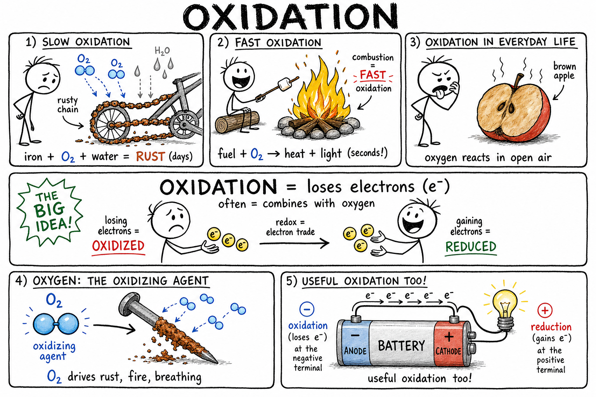

# Oxidation

You leave your bike leaned against the shed after a rainy week. When you finally grab it for a ride, the chain feels gritty. Orange-brown flakes cling to the metal. In the garage, an old wrench on the workbench has the same reddish coating. That evening you light a campfire, and the wood blazes bright. You slice an apple for a snack, set half on the counter, and twenty minutes later the cut side has turned an ugly brown.

Three different scenes. Three different speeds. One big idea connects them all.

**Oxidation is a chemical process in which a substance loses electrons or combines with oxygen.**

Oxidation explains rust on bikes and bridges, burning fuel in engines and campfires, tarnish on silver coins, brown apples in lunch bags, the energy your muscles use during a game, batteries in a flashlight, bleach in a laundry room, and corrosion on ships and stadium railings. Sometimes oxidation destroys things. Sometimes it powers them. Sometimes it is happening quietly inside your own cells right now.

## Oxygen and Oxidation

Oxygen is one of the most reactive elements on Earth. It joins readily with many other elements and compounds. When a substance **combines with oxygen**, chemists call that oxidation in the older, everyday sense of the word.

Iron combines with oxygen to form rust. Carbon in wood or fuel combines with oxygen during burning to form carbon dioxide. Hydrogen combines with oxygen to form water. Many changes you see around a house, a garage, or a campsite involve oxygen from the air.

That oxygen-based picture is a great starting point. Modern chemistry goes further.

## The Electron Meaning

Today, chemists define oxidation more broadly:

**Oxidation is the loss of electrons.**

Electrons are tiny, negatively charged particles. When an atom, ion, or molecule **loses** electrons during a reaction, it has been **oxidized**. Oxygen is often involved — but not always. This electron definition works for rust, fire, batteries, and thousands of other reactions that do not look like "adding oxygen" at first glance.

For this chapter, keep both ideas in mind:

**Oxidation can mean gaining oxygen in many everyday examples, and in modern chemistry it means losing electrons.**

## A Simple Way to Picture Electron Loss

You cannot watch electrons move with your eyes, so a model helps.

Imagine two players trading collectible game pieces during a match. If one player gives away pieces, he ends up with fewer than before. In a chemical reaction, if an atom or molecule gives away electrons, it has lost something important too. That loss is oxidation.

The other player receives the pieces. In chemistry, the substance that **gains** electrons is **reduced**.

This model is not perfect — electrons are not toys, and atoms do not choose to trade. But it captures the main idea:

**Oxidation is the side that loses electrons; reduction is the side that gains them.**

Many students first meet oxidation through oxygen examples like rust and fire. That is the right place to start. The electron definition is the next step because it explains those examples *and* reactions where no oxygen gas is involved at all.

## Oxidation and Reduction

Oxidation almost never happens alone. It is paired with **reduction**, which is the **gain of electrons**.

If one substance loses electrons, another substance usually gains them. This paired process is called a **redox reaction** — the name comes from **red**uction and **ox**idation.

In a redox reaction:

- One substance is oxidized (loses electrons)
- Another substance is reduced (gains electrons)
- Electrons are transferred from one to the other

Combustion, rusting, batteries, and many reactions inside your body are redox reactions. Think of them as a two-sided trade, not a one-sided change.

## Oxidizing Agents

An **oxidizing agent** is a substance that causes another substance to be oxidized. It does this by **accepting electrons** from the other substance.

Oxygen is the most familiar oxidizing agent — it drives rust, fire, and respiration. **Bleach** and **hydrogen peroxide** are oxidizing agents used for cleaning and disinfecting. Some oxidizing agents are useful; they can also be dangerous because they may make fires burn faster or react violently with other materials. Treat strong oxidizers with respect.

## Rusting

**Rusting** is one of the most familiar examples of oxidation. It happens when iron reacts with oxygen and water to form **iron oxides** and related compounds — the crumbly, reddish-brown material we call rust.

Rust is weaker than solid iron. A rusted bike chain can snap. A rusted bolt on playground equipment can fail. Rust damages cars, bridges, tools, pipes, ships, fences, and stadium structures. This is a **chemical change**: the iron has become new substances, not just gotten dirty.

## Why Water Helps Rust

Iron rusts much faster when **water** is present. Water helps charged particles move on the metal surface and allows electrochemical reactions to proceed. **Salt water** speeds rusting even more because dissolved salt helps conduct electric charge — which is why vehicles and bridges near oceans, or roads salted in winter, often corrode faster than dry inland metal.

Oxygen matters. Oxygen plus water — and especially salt — can be brutal on iron.

## Corrosion and Tarnish

**Corrosion** is the gradual destruction of a material by chemical reactions with its environment. Rusting is corrosion of iron. Other metals corrode too: copper can form greenish compounds on statues and roofs; silver can **tarnish**; aluminum forms a thin oxide coating.

**Tarnish** is a thin layer of corrosion on some metals. Silver tarnish often comes from sulfur compounds in air, forming dark silver sulfide. Copper develops a green **patina** over time. Tarnish may look dull or colored. On jewelry or silverware it is usually unwanted. On copper roofs or bronze monuments, a patina can protect the metal underneath or be valued for its look.

Not all oxidation damage looks like red rust — but the chemistry is related.

## Aluminum Oxide: When Oxidation Protects

Aluminum reacts quickly with oxygen, but unlike crumbling iron rust, it forms a thin, hard layer of **aluminum oxide** that sticks tightly to the surface. That layer shields the metal underneath from deeper damage.

That is why aluminum holds up in soda cans, aircraft parts, window frames, and outdoor gear. Oxidation is not always destructive in the same way. Sometimes the first layer of oxide is the best defense.

## Combustion: Fast Oxidation

**Combustion** is fast oxidation. During combustion, fuel reacts with oxygen and releases energy — often as heat and light.

Wood in a campfire, wax in a candle, and gasoline in a car engine are all undergoing oxidation. The difference from rust is **speed** and **energy release**. Rusting is slow oxidation spread over days or years. Burning is fast oxidation that can release huge amounts of energy in seconds.

Both are chemical changes involving oxygen and energy. The speed and effects are worlds apart.

## Oxidation in the Body

Your body uses **controlled** oxidation every second. During **respiration**, cells use oxygen to release energy from food molecules such as glucose. This is not a campfire in your chest — it happens in many careful steps, guided by **enzymes** in your cells.

The overall process produces carbon dioxide, water, and usable energy for running, thinking, and healing. Oxidation in cells keeps you alive. It proves that oxidation is not always bad. Sometimes it is essential.

## Food Browning

Cut an apple, banana, or potato and leave it exposed to air. Oxygen reacts with substances in the damaged cells, often helped by **enzymes**. The result is brown-colored compounds — **enzymatic browning**.

Lemon juice can slow browning because it is acidic and contains **antioxidants** such as vitamin C. Refrigeration slows the reactions too. Pack a sliced apple in a lunch bag without protection and you will see oxidation with your own eyes by recess.

## Rancidity

Fats and oils in chips, nuts, and pantry food can go **rancid** when they react with oxygen and break down. Rancid food smells and tastes off. Heat, light, and air speed the process. Food packaging often limits oxygen exposure; some bags are flushed with nitrogen gas to slow oxidation. Spoilage chemistry shows up at the snack table, not only in a lab.

## Antioxidants

An **antioxidant** is a substance that slows or prevents oxidation. **Vitamin C** and **vitamin E** are antioxidants. Some food preservatives work the same way. They can slow browning, rancidity, or damage from reactive substances. In the body, antioxidants help control certain harmful byproducts of normal chemistry.

The name sounds simple. The full chemistry is not — but the job is clear: **fight back against unwanted oxidation.**

## Oxides

An **oxide** is a compound of oxygen with another element. Common examples include:

- **Carbon dioxide** (from burning and respiration)
- **Iron oxide** (in rust)
- **Aluminum oxide** (protective coating on aluminum)
- **Silicon dioxide** (in quartz and sand)
- **Magnesium oxide**

Many rocks and minerals are oxides. Rust is mostly iron oxides. Quartz is silicon dioxide. Oxidation often produces oxides, though not every oxidation reaction makes a simple oxide compound.

## Preventing Rust

Engineers and homeowners fight rust in many ways:

- **Paint** or **coat** metal to block oxygen and water
- **Oil or grease** moving parts (chains, hinges, tools)
- **Keep metal dry** — cover bikes, store tools inside
- Use **stainless steel** or **galvanized** iron (zinc-coated)
- Apply **sacrificial metals** that corrode first to protect steel

Protecting a bridge or a bike frame is not just about appearance. Weak metal can fail. Rust prevention is a safety issue.

## Galvanizing and Stainless Steel

**Galvanizing** coats iron or steel with **zinc**. Zinc blocks oxygen and water and can act as a sacrificial metal — it oxidizes before the iron underneath does. Galvanized nails, buckets, fences, and pipes resist rust better than plain steel.

**Stainless steel** is an alloy of iron with chromium and other elements. Chromium helps form a thin, tough oxide layer that resists rust. Sinks, kitchen tools, surgical instruments, and building hardware often use stainless steel. It can still corrode under harsh conditions, but it performs far better than ordinary steel in wet environments.

The right material and coating can change how oxidation behaves — from enemy to managed problem.

## Batteries and Oxidation

Batteries depend on redox chemistry. At one electrode, a substance **loses electrons** (is oxidized). At another, a substance **gains electrons** (is reduced). Electrons flow through the external circuit as electric current — that is what powers your flashlight, game controller, or bike light.

A battery is not a box of magic electricity. It is a controlled chemical system using electron transfer. Oxidation at one end and reduction at the other make the current flow.

## Bleach and Disinfection

**Bleach** can act as a strong oxidizing agent. It breaks down colored molecules, which is why it whitens fabrics. It can also damage microbes on surfaces. That makes it useful — and hazardous.

Bleach can irritate skin, eyes, and lungs. **Never mix bleach with ammonia or acids**; dangerous gases can form. Useful oxidizers deserve the same caution as fire: powerful tools, not casual experiments.

## Oxidation and Color

Oxidation often changes color — and color change can be a clue that chemistry happened:

- Iron turns reddish-brown (rust)
- Copper turns greenish (patina)
- Silver darkens (tarnish)
- Apples turn brown (enzymatic browning)
- Bleach removes dye color from fabric

Color change alone does not **prove** oxidation; scientists check the full reaction. But in daily life, a new color on metal or fruit is often your first sign that electrons and atoms have been rearranged.

## Oxidation Without Oxygen

Modern oxidation does not require oxygen gas. If a substance loses electrons, it is oxidized — period. Some reactions involving **chlorine** or other elements can oxidize substances without O₂ being involved.

The word **oxidation** comes from oxygen because early chemists studied oxygen reactions first. Science kept the name and expanded the meaning. That is why "oxidation" can happen even when no oxygen is in the room.

## Oxidation States

Chemists assign **oxidation states** — numbers that track how electron control shifts in a compound. When an atom's oxidation state **increases**, it has been oxidized. When it **decreases**, it has been reduced.

This is bookkeeping for electrons — more advanced than everyday rust and fire, but you will meet it in later chemistry. For now, know that oxidation states help chemists balance and understand redox reactions on paper.

## Common Misconceptions

One mistake is thinking oxidation always means **burning**. Burning is only **fast** oxidation.

Another is thinking oxidation always requires **oxygen gas**. The electron definition is broader.

A third is thinking rust is just **dirt** on metal. Rust is a **new substance** formed by chemical reaction.

A fourth is thinking all oxidation is **harmful**. Respiration and batteries depend on useful oxidation.

A fifth is thinking **stainless steel** never corrodes. It resists corrosion well — it is not invincible.

## Oxidation Safety

Oxidation reactions can help you or hurt you. Good habits matter:

- Keep fuels away from flames, sparks, and heat.
- Do not mix bleach with ammonia, acids, or other cleaners.
- Wear goggles when working with oxidizing chemicals.
- Keep strong oxidizers away from paper, cloth, oils, and fuels unless instructed.
- Do not breathe smoke, fumes, or dust from reactions.
- Wash hands after handling chemicals or rusty metal.
- Use adult supervision for fire demos, bleach, peroxide, or metal reactions.
- Store chemicals only as directed.
- Report spills, fumes, heat, or unexpected color changes to an adult.
- Follow disposal instructions for chemicals, metals, and solutions.

Oxidation is everywhere. Strong oxidizers and fast reactions — especially fire — deserve serious respect.

## The Big Idea

Oxidation is a chemical process in which a substance loses electrons or, in many everyday cases, combines with oxygen.

Combustion is fast oxidation; rusting is slow oxidation. Oxidation can produce oxides, change colors, spoil food, corrode metal, power batteries, disinfect surfaces, and help your cells release energy from food. It is usually paired with reduction in redox reactions. It can be harmful, useful, or essential — depending on where, how fast, and how carefully it happens.

If you remember only one sentence, remember this:

**Oxidation is electron loss — often seen in everyday life as substances reacting with oxygen.**

## Study Questions

1. What is oxidation?
2. What is the older everyday meaning of oxidation?
3. What is the modern electron meaning of oxidation?
4. What are electrons?
5. What is reduction, and how does it relate to oxidation?
6. What is a redox reaction?
7. What is an oxidizing agent? Give two examples.
8. What is rusting, and why is it a chemical change rather than just dirt?
9. What substances are usually needed for iron to rust?
10. Why can salt water speed rusting?
11. What is corrosion? How is tarnish related?
12. How can aluminum oxide protect aluminum even though aluminum reacts with oxygen?
13. Why is combustion called fast oxidation? How is it different from rusting?
14. How does the body use controlled oxidation during respiration?
15. Why do cut apples or bananas turn brown? Name one way to slow it.
16. What is rancidity?
17. What is an antioxidant? Give two examples.
18. What is an oxide? Name three examples.
19. Name three ways people prevent rust on iron.
20. What is galvanizing, and how does stainless steel resist rust?
21. How do batteries use oxidation and reduction?
22. Why must bleach be handled carefully?
23. Give two examples of color changes that can be linked to oxidation.
24. Can oxidation happen without oxygen gas? Explain briefly.
25. Name two common misconceptions about oxidation.
26. List three safety rules related to oxidation, fire, or oxidizing chemicals.
