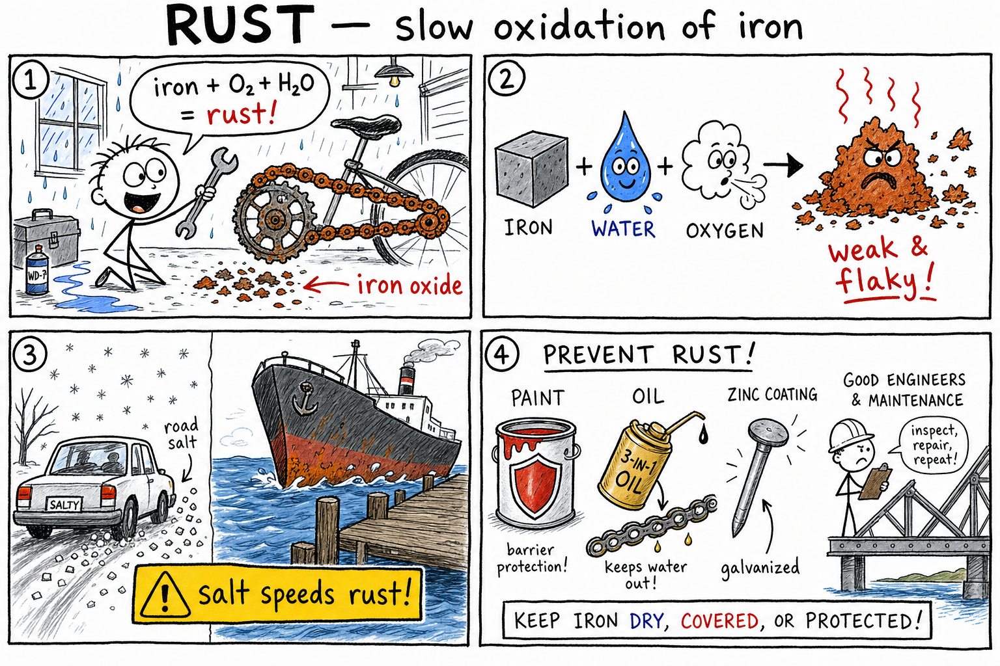

# Rust

You lean your bike against the shed after a muddy ride. Rain drips off the frame. A week later you grab the chain for a ride — and your fingers come away gritty. Orange-brown flakes cling to the metal. The chain feels stiff, almost crunchy.

In the garage, an old wrench on the workbench has the same reddish coating. Outside, the metal gate at the end of the driveway looks rough and weak where the paint chipped years ago. After a snowy winter, white road salt has crusted the family car's wheel wells. By spring, little orange spots are spreading under the paint.

That reddish-brown material is **rust**.

**Rust is a reddish-brown corrosion product that forms when iron reacts with oxygen and water.**

Rust is one of the most familiar chemical changes in everyday life. It damages cars, bridges, tools, ships, pipes, fences, machinery, and buildings. Rust may seem slow and quiet, but over time it can destroy strong metal — and badly rusted railings, ladders, or chains can fail when you need them most.

As you learned in the chapter on **oxidation**, oxidation is a chemical process in which a substance loses electrons or combines with oxygen. **Rusting is slow oxidation of iron.** This chapter zooms in on that one familiar enemy: rust.

## Rust Happens to Iron

Rust is mainly a problem for **iron** and **steel**.

Iron is a chemical element. **Steel** is an alloy made mostly of iron with carbon and sometimes other elements. Because steel contains iron, steel can rust.

Aluminum, copper, silver, and other metals can corrode or tarnish, but their corrosion products are not usually called rust. Strictly speaking, **rust is iron corrosion.**

| Metal | Common surface change | Usually called "rust"? |
|-------|----------------------|-------------------------|
| Iron / steel | Reddish-brown, crumbly flakes | **Yes** |
| Copper | Greenish patina | No |
| Silver | Dark tarnish | No |
| Aluminum | Thin hard oxide layer | No |

## Rust Is Corrosion

**Corrosion** is the gradual destruction of a material by chemical reactions with its environment.

Rusting is the corrosion of iron. When iron rusts, iron atoms react with oxygen and water to form new substances. The rust is not just dirt sitting on the metal — it is a **chemical product**. That means rusting is a **chemical change**, not merely a physical change.

## Rust Is Oxidation

Rusting is a kind of oxidation. In rusting, iron atoms **lose electrons** and become iron ions. Oxygen is involved. **Water** helps the process happen. The final rust contains iron and oxygen, often with water included in its structure.

Combustion in a campfire is **fast** oxidation — heat and light in seconds. Rust on a bike chain is **slow** oxidation — damage over days, months, or years. Same big idea, different speed.

## What Rust Is Made Of

Rust is not one perfectly simple compound. It is a mixture of **iron oxides** and **hydrated iron oxides** (compounds that include water in their structure).

An **oxide** is a compound of oxygen with another element. **Hydrated** means water is part of the structure. That is why rust's color and texture can vary: some rust is orange, some reddish-brown, some dark brown or blackish.

## The Ingredients for Rust

Rust usually needs three important things:

| Ingredient | Where it comes from | Role |
|------------|---------------------|------|
| **Iron** | The metal being changed | Supplies iron atoms for the reaction |
| **Oxygen** | Usually from air | Combines with iron |
| **Water** | Rain, humidity, dew, soil, condensation | Speeds electrochemical rusting |

Without water, rusting is much slower. Without oxygen, ordinary rusting cannot continue in the same way.

## Why Water Matters

Water helps rust form because it allows charged particles to move. Rusting is an **electrochemical process** — it involves chemical reactions and movement of electric charge.

Tiny regions on the iron surface act differently. Some areas lose electrons. Other areas use oxygen and water in reactions. Water helps ions move between these areas. That is why **dry iron rusts much more slowly than wet iron.**

## Why Salt Speeds Rust

**Salt water** often speeds rusting. When salt dissolves in water, it forms ions that help the water **conduct electric charge**. Better charge movement can make the electrochemical rusting process happen faster.

This is why cars may rust faster in areas where roads are salted in winter. It is also why metal near the ocean often rusts faster. Salt does not simply "eat" metal by itself — it **helps rusting reactions proceed.**

## Humidity and Rust

Rust can form even when metal is not sitting in liquid water. **Humid air** contains water vapor that can condense as a thin film of moisture on metal surfaces. That film may be enough to help rusting.

Tools stored in damp basements or garages may rust. Iron left outside overnight may collect dew. **Keeping iron dry** is one of the simplest ways to slow rust.

## Rust Weakens Iron

Iron metal is strong. Rust is crumbly and weak. When iron turns into rust, the strong metal structure is damaged. Rust can flake away, exposing fresh iron underneath — and that fresh iron can rust too.

Over time, rust can eat deeply into metal, making it thinner and weaker. Rust on bridges, cars, ships, and tools is not just ugly. **It can be dangerous.**

## Rust Takes Up More Space

Rust often takes up **more space** than the iron it came from. As rust forms, it can expand — cracking paint, splitting concrete around steel bars, loosening bolts, or breaking apart structures.

In **reinforced concrete**, steel bars inside the concrete can rust if water and oxygen reach them. The expanding rust can crack the concrete. Small chemical changes can create large physical damage.

## Rust in the Real World

### Bridges

Bridges often contain steel. Road salt, rain, snow, and humidity can make rusting worse. Engineers inspect bridges for rust and corrosion. They may paint, seal, repair, or replace parts. **Preventing rust is a matter of public safety** — a rusty bridge is an engineering problem, not just a chemistry lesson.

### Cars

Cars contain steel parts. Water, salt, mud, scratches, and road chemicals can lead to rust. Rust often starts where paint or protective coatings are damaged, then can spread under paint and weaken panels. Washing salt off after winter, repairing scratches, and protecting metal surfaces can slow rust. Engineers also design cars so water does not get trapped in hidden spaces.

### Tools

Garden tools, saws, chisels, pliers, and knives may rust if left wet. Rust can make tools rough, dull, stiff, and weaker. Good care means drying tools after use, storing them in dry places, and sometimes applying a light oil. **Taking care of tools is practical chemistry** — you are controlling the conditions for rust.

### Ships

Ships are surrounded by water, and ocean water contains salt. That makes rust a major problem for steel ships. Ships need coatings, inspections, maintenance, and sometimes **sacrificial anodes** — more reactive metal pieces attached so they corrode first and protect the steel. Chemistry fighting chemistry.

## Preventing Rust

People fight rust by blocking water, blocking oxygen, or using materials that resist or sacrifice themselves. Common strategies:

| Method | How it works | Examples |
|--------|----------------|----------|
| **Keep dry** | Less water → slower rust | Indoor storage, drying tools, shelter from rain |
| **Paint / coatings** | Barrier blocks O₂ and H₂O | Paint, enamel, powder coating, plastic wrap |
| **Oil / grease** | Repels water, blocks oxygen | Chains, hinges, machine parts, garden tools |
| **Galvanizing** | Zinc barrier + sacrificial protection | Galvanized nails, fences, buckets, pipes |
| **Stainless steel** | Chromium forms tough surface oxide | Sinks, kitchen tools, medical instruments |
| **Sacrificial metals** | More reactive metal corrodes first | Zinc or magnesium on ships, pipelines, tanks |

**No water, much slower rust.** **No oxygen reaching the metal, much slower rust.** But barriers must stay unbroken — if paint chips, rust may begin at the exposed spot. Rust painted over carelessly can continue underneath. Good surface preparation matters.

### Galvanizing

**Galvanizing** is coating iron or steel with **zinc**. Zinc forms a barrier against oxygen and water, and because zinc is more reactive than iron, it can corrode first — **sacrificial protection**. The zinc sacrifices itself to protect the iron.

### Stainless Steel

**Stainless steel** is an alloy of iron with chromium and other elements. Chromium helps form a thin, tough **oxide layer** on the surface that protects the metal underneath. Stainless steel resists rust much better than ordinary steel — but it can still corrode under harsh conditions. **Stainless does not mean impossible to rust.**

### Sacrificial Metals

Zinc and magnesium are often attached to pipelines, water heaters, ships, and underground tanks. They are more willing to lose electrons than iron, so they become **sacrificial metals** and corrode first. The sacrificial metal must be replaced when it is used up — like giving rust a different target.

## Rust vs. Tarnish vs. Dirt

**Rust** is corrosion of **iron** — usually crumbly and damaging.

**Tarnish** is a thin corrosion layer on some other metals, such as silver (often involving sulfur compounds) or copper (greenish **patina**). Some patinas can protect the metal underneath. Not every dull or colored metal surface is rust.

**Dirt** can often be washed off without changing the material underneath. **Rust** is a new substance formed from the iron itself. Removing rust may remove part of the original metal because the metal has chemically changed. Badly rusted objects may have pits or holes — the iron did not simply get dirty; it **reacted.**

## Rust Removal

Rust can sometimes be removed by scrubbing, sanding, chemical rust removers, mild acids such as vinegar for small objects, or electrolysis under trained supervision. Badly damaged parts may need replacing.

Removing rust does not automatically restore all lost strength. If rust has eaten deeply into metal, the object may remain weakened. **Rust removal is useful, but prevention is usually better.**

## Rust and Conservation of Matter

Rusting follows the **conservation of matter**. Atoms are not destroyed. Iron atoms combine with oxygen (and often water) to form rust. The rust may have **more mass** than the original iron alone because oxygen from the air has joined the metal. When something rusts, it can **gain mass** from its surroundings — matter is rearranged and added, not vanished.

## Rust and Energy

Rusting releases energy, but very slowly. Combustion releases energy quickly as heat and light. Rusting releases energy so gradually that you do not feel a flame. Both are oxidation reactions — the difference is **speed**. Slow reactions can still make big changes over long periods. Rust is slow chemistry with large consequences.

## Common Misconceptions

One mistake is thinking rust is just **dirt**. Rust is a new substance made by chemical reaction.

Another is thinking any metal corrosion is rust. **Rust specifically involves iron.**

A third is thinking dry iron rusts as quickly as wet iron. **Water greatly speeds rusting.**

A fourth is thinking stainless steel cannot rust. It resists rust well but can corrode under some conditions.

A fifth is thinking removing visible rust makes an object as strong as new. Rust may have already weakened or thinned the metal.

## Rust Safety

Rusty objects can be unsafe. Good safety habits include:

- Do not handle rusty sharp objects without adult permission.
- Wear gloves when cleaning rusty metal.
- Wear goggles when scraping, sanding, or brushing rust.
- Avoid breathing rust dust.
- Wash hands after handling rusty objects.
- Keep tetanus vaccinations up to date as recommended by medical professionals.
- Do not rely on badly rusted tools, ladders, railings, chains, or supports.
- Dispose of rusty nails and sharp scrap safely.
- Use rust removers only with adult supervision.
- Report rust on playground equipment, railings, bridges, or structural parts.

Rust can be a chemistry topic and a safety warning at the same time.

## The Big Idea

Rust is the corrosion of iron. It forms when iron reacts with oxygen and water, producing iron oxides and hydrated iron oxides. Salt, moisture, scratches, and damaged coatings can speed rusting. Rust weakens iron and steel, damages tools, cars, bridges, ships, and buildings, and can create safety hazards. People prevent rust by keeping out water and oxygen, using paint, oil, coatings, galvanizing, stainless steel, and sacrificial metals.

If you remember only one sentence, remember this:

**Rust is slow oxidation of iron, helped by water and oxygen, that changes strong metal into weaker corrosion products.**

## Study Questions

1. What is rust?
2. What metal must be present for true rust to form?
3. Why can steel rust?
4. What is corrosion?
5. Why is rusting a chemical change?
6. How is rust related to oxidation?
7. What is an oxide?
8. What three ingredients are usually needed for rust?
9. Why does water help rust form?
10. Why does salt water speed rusting?
11. How can humidity cause rust even without puddles?
12. Why does rust weaken iron?
13. Why can rust expansion damage paint, concrete, or bolts?
14. Why is rust on bridges a safety concern?
15. How can car owners slow rust?
16. How should steel tools be cared for to reduce rust?
17. Why is rust a major problem for ships?
18. Name three ways people prevent rust on iron.
19. How do paint and coatings slow rust? Why should chipped paint be repaired?
20. How do oil and grease help prevent rust?
21. What is galvanizing, and how does zinc protect iron?
22. Why does stainless steel resist rust? Can it still corrode?
23. What is a sacrificial metal?
24. How is rust different from tarnish and from dirt?
25. Why can a rusting object gain mass?
26. Name two common misconceptions about rust.
27. What are three safety rules for rusty objects or rust removal?
