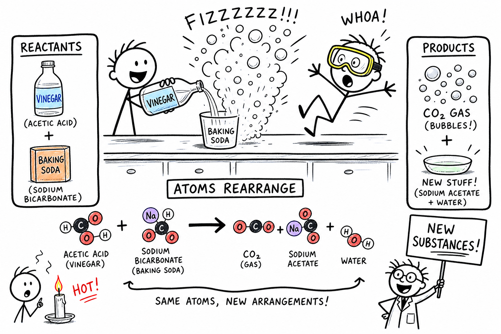

# Chemical reaction

You pour vinegar into a cup of baking soda. Foam shoots up the sides. Bubbles hiss and pop. Your lab partner yelps and steps back — then grins.

Same afternoon, different scene: you leave a wet wrench on the workbench. A week later, reddish-brown flakes cling to the steel. In the evening you light a candle. Wax melts, the wick glows, and smoke drifts toward the ceiling. Saturday morning, bread dough rises in a warm bowl and bakes into something that smells completely different from flour and water.

Four ordinary moments. Four different speeds. One big idea ties them together.

**A chemical reaction is a process in which substances change into new substances by rearranging atoms and chemical bonds.**

Chemical reactions cook food, digest meals, power batteries, burn fuels, form rust, clean stains, grow plants, make medicines, harden cement, and keep your body alive. **Chemistry** is the study of matter and the changes it undergoes — and chemical reactions are at the heart of that story.

As you learned in the chapters on **atom**, **molecule**, **compound**, and **mixture**, matter is built from tiny pieces that can join and separate. As you learned in the chapters on **combustion** and **oxidation**, some reactions release energy fast; others creep along for days. This chapter is the map: what counts as a chemical reaction, how to tell it apart from a physical change, and how scientists describe reactions with equations and names.

## How to Read This Chapter

This chapter is a broad map of chemical reactions. Some parts are the main road; others are side roads you can explore after the big idea is clear.

The main road is this:

- Reactants become products.
- Atoms rearrange.
- New substances form.
- Matter is conserved.
- Evidence of a reaction must be interpreted carefully.
- Safety matters whenever substances are mixed, heated, or allowed to produce gas.

The later sections on reaction types, catalysts, enzymes, and reversible reactions are useful extensions. Do not worry if every reaction name does not stick the first time. A strong student should first understand **what makes a reaction chemical** and **why atoms must still be accounted for** — the next chapter on **conservation of matter** builds directly on that idea.

## Atoms Rearrange

Matter is made of **atoms**.

Atoms can join together in **molecules** and **compounds**.

In a chemical reaction, atoms are **rearranged**. Bonds between atoms may break. New bonds may form. The result is one or more **new substances**.

The atoms themselves are not destroyed in ordinary chemical reactions. They are simply connected in new ways — like rebuilding a LEGO model from the same bricks into a different shape.

## Reactants and Products

The starting substances in a chemical reaction are called **reactants**.

The substances formed by the reaction are called **products**.

| Role | Meaning | Example (hydrogen + oxygen → water) |
|------|---------|-------------------------------------|
| **Reactants** | What you start with | Hydrogen and oxygen |
| **Products** | What you end with | Water |

When hydrogen and oxygen react to form water, hydrogen and oxygen are reactants and water is the product.

In a vinegar-and-baking-soda reaction, vinegar and baking soda are reactants. Carbon dioxide and other substances are products. That foaming volcano in a classroom? Real chemistry — new substances forming while gas escapes.

## Chemical Bonds

A **chemical bond** is an attraction that holds atoms or ions together.

Chemical reactions involve chemical bonds. Some bonds in the reactants break. New bonds form in the products. That is why products can have properties very different from reactants.

Sodium and chlorine can react to form sodium chloride (table salt). Hydrogen and oxygen can react to form water. Iron, oxygen, and water can react to form rust. Same kinds of atoms involved in each case — but connected in new ways, so the result looks and behaves differently.

## New Substances: Chemical vs. Physical Change

The key sign of a chemical reaction is the formation of **new substances**.

If no new substance forms, the change may be **physical** instead.

| Type | What changes | New substance? | Examples |
|------|--------------|----------------|----------|
| **Physical change** | Form, size, shape, or state | Usually no | Melting ice, cutting paper, crushing chalk, freezing water |
| **Chemical change** | Atoms rearrange into new substances | Yes | Burning wood, rusting iron, baking a cake, digesting food, vinegar + baking soda |

Melting ice is physical: ice becomes liquid water, but the substance is still water. Dissolving sugar in water is usually physical: sugar molecules spread through water, but sugar and water are still present. **Burning** sugar is chemical: new substances form.

Chemistry asks one sharp question: **Did the matter become a new substance?**

## Signs of a Chemical Reaction

There are clues that a chemical reaction may be happening. Possible signs include:

- Gas bubbles forming
- A color change
- A temperature change
- Light being produced
- A new odor
- A solid **precipitate** forming
- Sound being produced

These signs are useful — but they are **not perfect proof by themselves**.

**Gas bubbles:** When vinegar reacts with baking soda, carbon dioxide gas forms and bubbles rise. When some acids react with carbonates or certain metals, gas can form too. But boiling water also makes bubbles — that is physical change (water vapor), not a new substance.

**Color change:** Iron turns reddish-brown as rust forms. Apples turn brown after being cut because oxidation reactions occur. Copper can turn greenish in air and water. Yet adding food coloring to water changes color without a chemical reaction.

**Temperature change:** Many reactions release or absorb heat. Combustion warms its surroundings. Some cold packs use processes that absorb heat. Temperature change is a clue, not automatic proof.

**Light:** Burning produces flame. Glow sticks use **chemiluminescence** — light from a chemical reaction. Fireflies and fireworks do something similar. Beautiful — and sometimes dangerous.

**Precipitates:** A **precipitate** is a solid that forms from a solution during a chemical reaction. Imagine mixing two clear liquids and suddenly seeing a cloudy solid appear. That solid is a product — strong evidence that a new substance formed.

Good scientists use several clues together and ask whether **new substances** actually formed.

## Chemical Equations

Scientists use **chemical equations** to describe reactions.

A chemical equation uses formulas and symbols to show reactants and products.

For example, hydrogen and oxygen can form water:

Hydrogen + oxygen → water

In formulas:

H₂ + O₂ → H₂O

That equation is **not balanced yet** — and a correct equation must obey conservation of atoms.

## Conservation of Matter

In ordinary chemical reactions, **matter is conserved**.

Atoms are not created or destroyed. They are rearranged. This rule is called the **conservation of matter**.

If a reaction starts with carbon atoms, those carbon atoms must appear in the products. If it starts with oxygen atoms, those oxygen atoms must appear in the products too. Matter may turn into gas and escape into the air — but it has not vanished. (The chapter on **conservation of matter** goes deeper into closed systems, mass, and why gases count.)

## Balanced Equations

A **balanced equation** has the same number of each kind of atom on both sides.

The water-forming reaction balances like this:

2H₂ + O₂ → 2H₂O

On the left: 4 hydrogen atoms and 2 oxygen atoms. On the right: the same counts. Balanced equations are a way of keeping track of atoms — they show conservation of matter in symbols.

## Coefficients and Subscripts

In chemical equations, numbers matter.

A **subscript** is a small number in a formula that tells how many atoms are in a molecule or formula unit. In H₂O, the 2 means two hydrogen atoms in each water molecule.

A **coefficient** is a number placed **before** a formula in an equation. In 2H₂O, the coefficient 2 means two water molecules.

When balancing equations, change **coefficients**, not subscripts. Changing subscripts changes the substance — you would be describing a different chemical altogether.

## Types of Chemical Reactions

Chemists group many reactions into families. You do not need to memorize every name on day one — but recognizing patterns helps.

| Type | In plain words | Simple example |
|------|----------------|----------------|
| **Synthesis** | Simpler substances combine | Hydrogen + oxygen → water |
| **Decomposition** | One substance breaks into simpler ones | Water → hydrogen + oxygen (electrolysis) |
| **Combustion** | Fuel reacts with oxygen; energy released | Wood burning, gasoline in an engine |
| **Single replacement** | One element replaces another in a compound | Zinc + acid → hydrogen gas + zinc compound |
| **Double replacement** | Parts of two compounds trade places | Many reactions in solution; some form precipitates |
| **Acid-base (neutralization)** | Acid + base → often water + salt | HCl + NaOH → water + sodium chloride |
| **Redox** | Electrons transfer (oxidation + reduction) | Rust, batteries, respiration, combustion |

Below is a little more detail on each — with links to chapters you may have already read.

### Synthesis Reactions

A **synthesis reaction** happens when simpler substances combine to form a more complex substance. Hydrogen and oxygen can combine to form water. Iron and sulfur can combine to form iron sulfide. Synthesis means **putting together**.

### Decomposition Reactions

A **decomposition reaction** happens when one substance breaks down into simpler substances. Water can be broken into hydrogen and oxygen by **electrolysis**. Some compounds decompose when heated. Decomposition means **breaking apart** chemically — not the same as snapping a cracker in half (that is physical).

### Combustion Reactions

**Combustion** is a reaction in which a fuel reacts with oxygen and releases energy — often as heat and light. Many carbon-based fuels produce carbon dioxide and water when they burn completely. Combustion powers fires, engines, stoves, and rockets. It can also produce smoke, soot, carbon monoxide, and pollutants when incomplete. You met combustion as its own chapter; here, remember it as one important **type** of chemical reaction — useful only when controlled.

### Single Replacement Reactions

A **single replacement reaction** happens when one element replaces another in a compound. Some metals replace hydrogen from acids and produce hydrogen gas. Zinc reacting with hydrochloric acid can produce hydrogen gas and a zinc compound. Not every element can replace every other — reactivity matters.

### Double Replacement Reactions

A **double replacement reaction** happens when parts of two compounds trade places. Many reactions in solutions are double replacements. Some produce a precipitate, some produce water, some produce a gas. **Neutralization** between an acid and a base is often a double replacement reaction.

### Acid-Base Reactions

Acids and bases can react with each other. This is called **neutralization**. Many acid-base reactions produce water and a **salt**. For example, hydrochloric acid and sodium hydroxide can react to form water and sodium chloride. Neutralization shows up in antacids, soil treatment, and water treatment. But neutralization does not always make a mixture perfectly safe — extra acid or base may remain, and heat may be released.

### Oxidation-Reduction (Redox) Reactions

An **oxidation-reduction reaction**, or **redox reaction**, involves **electron transfer**. **Oxidation** is loss of electrons. **Reduction** is gain of electrons. Rusting, combustion, batteries, and many body reactions are redox reactions. If you have read the chapter on **oxidation**, you already know that redox is everywhere — fast in fire, slow on a bike chain.

## Energy in Reactions

Chemical reactions involve energy. Bonds in reactants break (which takes energy). Bonds in products form (which releases energy). Whether a mixture warms or cools depends on the balance between energy taken in and energy released.

### Exothermic Reactions

An **exothermic reaction** releases energy to the surroundings. Combustion is exothermic. Many oxidation reactions are exothermic. Some hand warmers use exothermic iron oxidation. If a reaction gives off heat, light, or sound, it may be exothermic — useful, but also able to overheat, burn, or explode if uncontrolled.

### Endothermic Reactions

An **endothermic reaction** absorbs energy from the surroundings. Some chemical cold packs use endothermic processes. **Photosynthesis** is energy-absorbing overall: plants use light energy to build sugar from carbon dioxide and water. Endothermic reactions can make surroundings cooler — proof that chemical changes do not always release heat.

## Reaction Rate

The **reaction rate** is how fast a chemical reaction happens.

Some reactions are fast — lighting a match, an explosion. Some are slow — rust on a gate, tarnish on a coin. Factors that affect rate include:

- **Temperature** — hotter usually means faster (particles collide more often and with more energy)
- **Concentration** — more reactant particles often means faster
- **Surface area** — powdered solids often react faster than chunks (more surface touching reactants)
- **Stirring** — helps particles meet
- **Catalysts** — speed a reaction without being used up
- **Nature of the reactants** — some substances are simply more eager to react

Wood shavings burn faster than a thick log. Crushed effervescent tablets fizz faster than whole ones in water. That is why fine dust near flames can be dangerous — huge surface area exposed to oxygen. Refrigerators slow many reactions by lowering temperature. Cooking uses heat to speed chemical changes in food.

## Catalysts and Enzymes

A **catalyst** is a substance that speeds up a chemical reaction without being used up. Catalysts help reactions happen more easily. Cars use **catalytic converters** to change harmful exhaust gases into less harmful ones. Industry and medicine depend on catalysts every day.

**Enzymes** are biological catalysts made by living things. They help reactions happen fast enough for life. Digestion uses enzymes to break down food. Cells use enzymes to build molecules, release energy, copy DNA, and remove wastes. Enzymes are usually very specific — one enzyme may work on only one kind of reaction or molecule. Life is a network of controlled chemical reactions; enzymes provide the control.

## Reversible Reactions

Some chemical reactions can go forward and backward. These are **reversible reactions**. Products can react to form the original reactants again. Carbon dioxide dissolving in water and forming carbonic acid involves reversible steps. Many reactions in living things and the environment are reversible. Reversible reactions can reach a balance called **equilibrium** — a more advanced topic for later.

## Chemical Reactions in Daily Life

Chemical reactions happen everywhere you look:

| Where | What is reacting (examples) |
|-------|----------------------------|
| Kitchen | Cooking, bread rising, browning |
| Garage | Rust on tools and bikes |
| Campfire | Fuel + oxygen → heat, light, gases |
| Body | Digestion, respiration, muscle energy |
| Devices | Batteries, antacids |
| Outdoors | Photosynthesis in plants |
| Building site | Concrete hardening |

You are surrounded by chemistry every day. The question is not *whether* reactions happen — but whether you can recognize them and handle them safely.

## Chemical Reactions in the Body

Your body is a chemical-reaction factory. **Respiration** releases energy from food. **Digestion** breaks food into smaller molecules. **Enzymes** build and repair materials. Blood carries oxygen and carbon dioxide. Nerves use ions. Cells copy DNA and make proteins. These reactions are controlled, organized, and essential — not random kitchen foams, but chemistry with a plan.

## Common Misconceptions

One mistake is thinking **all changes are chemical**. Melting, freezing, cutting, and dissolving (in many cases) are physical.

Another mistake is thinking **bubbles always prove a chemical reaction**. Boiling can make bubbles without forming a new substance.

A third mistake is thinking **matter disappears** in reactions. Atoms are conserved in ordinary chemical reactions — they may leave as invisible gas, but they are not destroyed.

A fourth mistake is thinking chemical reactions are **always dangerous**. Many are safe, useful, and essential when controlled.

A fifth mistake is thinking **natural means safe** and **lab means dangerous**. Safety depends on the substances and conditions — not the label on the bottle.

## Chemical Reaction Safety

Chemical reactions can be useful, but they must be handled carefully.

Good safety habits include:

- Do not mix unknown substances.
- Do not taste experiment materials.
- Do not smell chemicals directly — waft if your teacher allows it.
- Wear goggles when an activity requires them.
- Use heat only with adult supervision.
- Keep flammable materials away from flames.
- Work in good ventilation when gases may form.
- Never cap a container that is fizzing or heating up — pressure can build.
- Report spills, unexpected heat, fumes, color changes, or pressure buildup.
- Label containers clearly.
- Follow teacher instructions for disposal.

In chemistry, curiosity and caution belong together.

## The Big Idea

A chemical reaction is a process in which substances change into new substances by rearranging atoms and chemical bonds.

Reactants become products. Bonds break and form. Atoms are conserved, so chemical equations must be balanced. Reactions can release or absorb energy, happen quickly or slowly, and be sped up by catalysts. They include synthesis, decomposition, combustion, replacement, acid-base reactions, and redox reactions. They are central to cooking, rusting, batteries, photosynthesis, respiration, industry, medicine, and life.

If you remember only one sentence, remember this:

**A chemical reaction rearranges atoms into new substances while conserving matter.**

## Study Questions

1. What is a chemical reaction?
2. What happens to atoms during an ordinary chemical reaction?
3. What are reactants?
4. What are products?
5. What is a chemical bond?
6. Why can products have different properties from reactants?
7. What is the main difference between a chemical change and a physical change?
8. Give three examples of physical changes.
9. Give three examples of chemical changes.
10. Name five possible signs of a chemical reaction.
11. Why do bubbles not always prove a chemical reaction happened?
12. What is a precipitate?
13. What is a chemical equation?
14. What does conservation of matter mean?
15. What is a balanced equation?
16. What is the difference between a coefficient and a subscript?
17. Why should subscripts not be changed when balancing equations?
18. What is a synthesis reaction?
19. What is a decomposition reaction?
20. What is combustion?
21. What is a single replacement reaction?
22. What is a double replacement reaction?
23. What is neutralization?
24. What is a redox reaction?
25. What is the difference between oxidation and reduction?
26. What is an exothermic reaction?
27. What is an endothermic reaction?
28. Name four factors that affect reaction rate.
29. What is a catalyst? What are enzymes?
30. What are three safety rules for chemical reactions?
