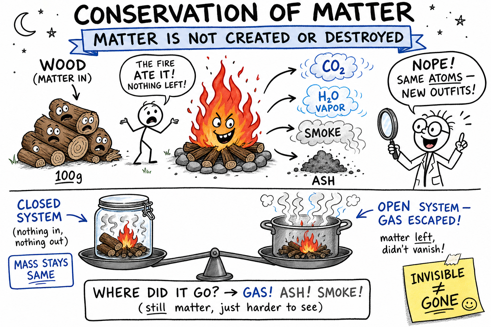
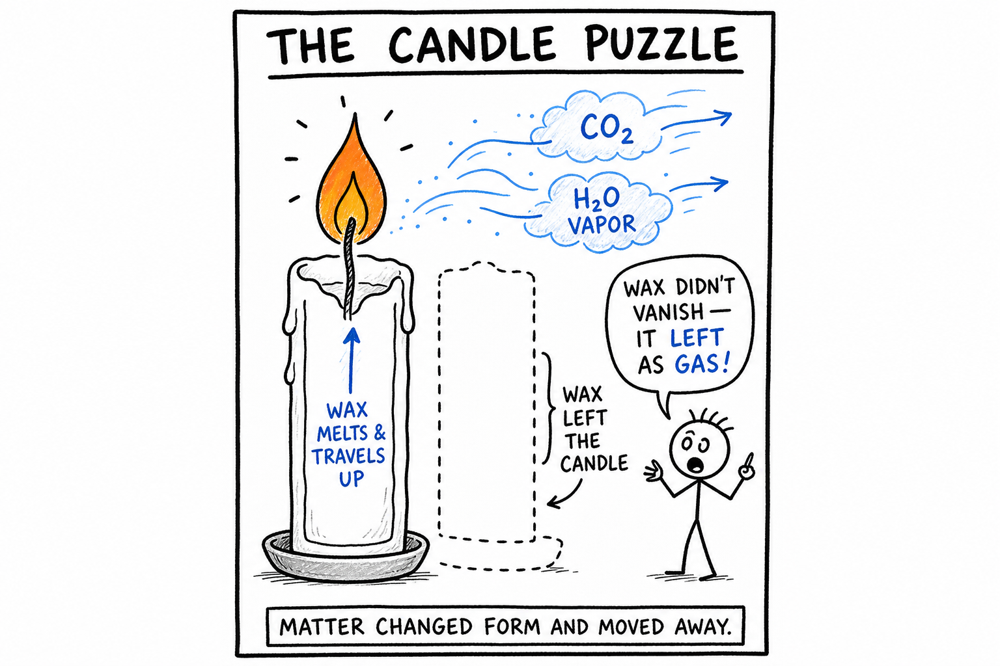
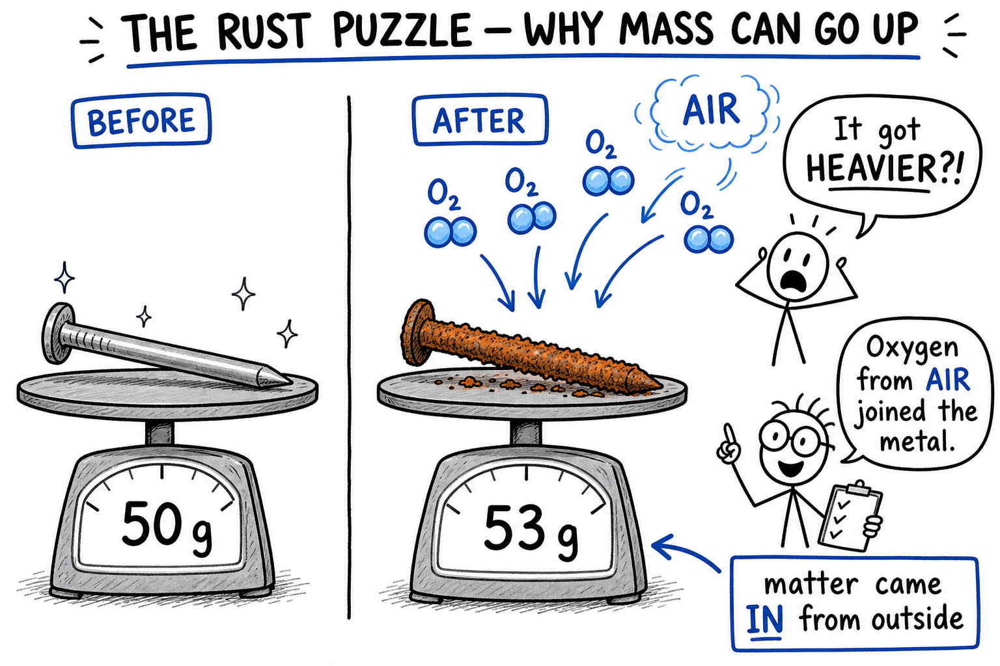
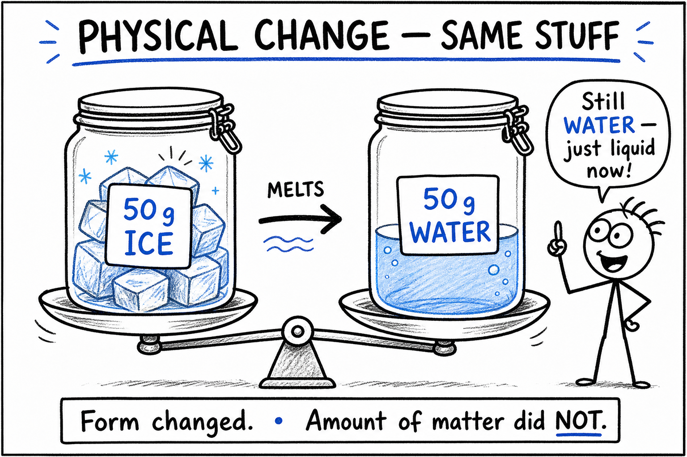
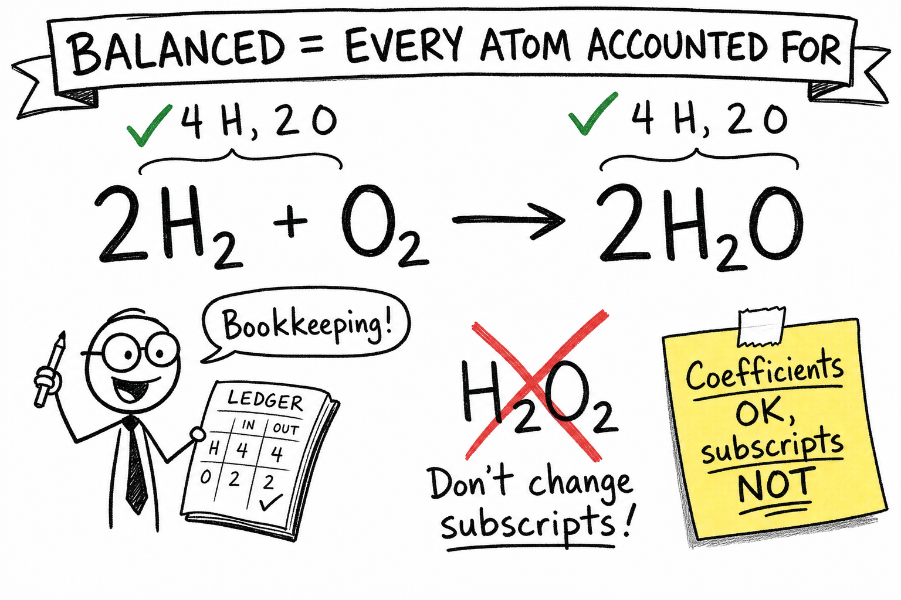
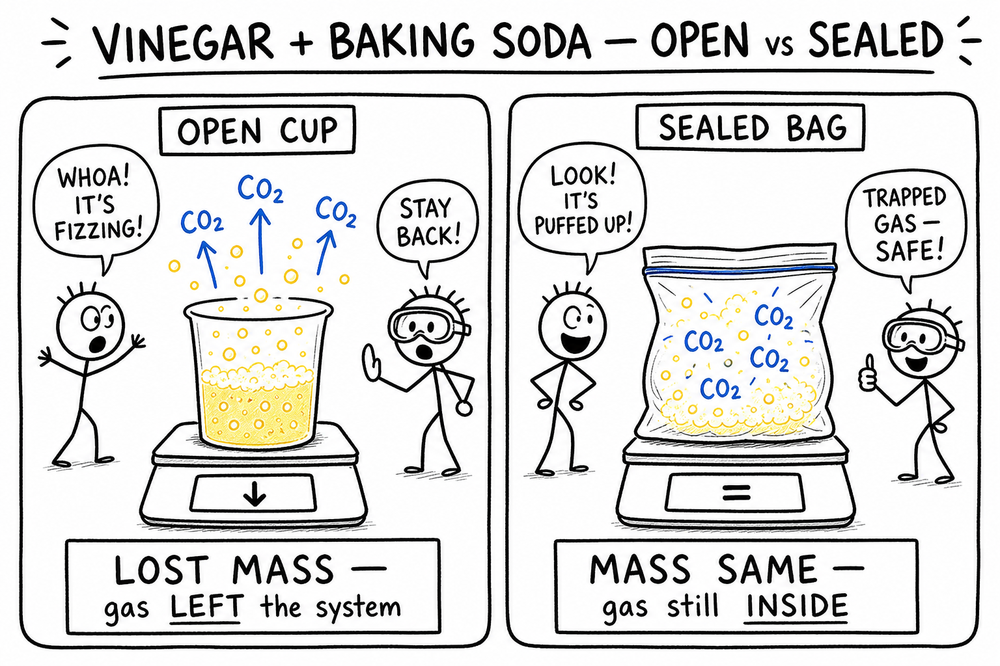
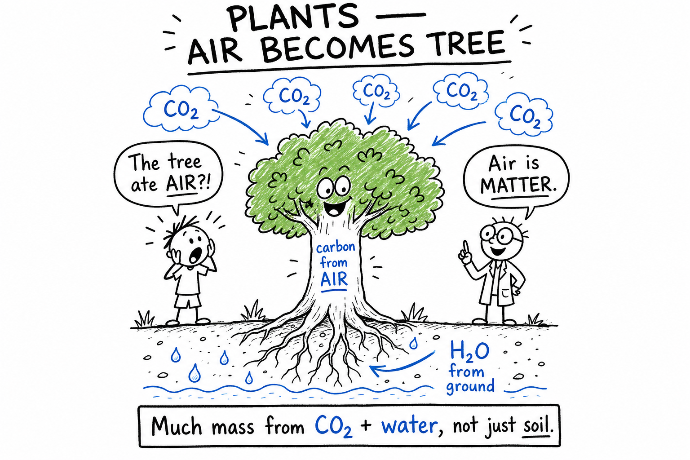
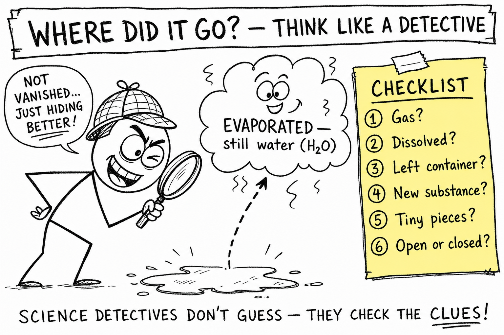

# Conservation of Matter

Picture a late-night campfire. You feed in sticks and watch the flames climb. By morning the wood is mostly gone. Only ash and a few charred chunks remain.

A friend shrugs. "The fire ate it. Nothing left."

You shake your head. Scientists do not accept that answer.

Where did the wood go? What did it become? Did the matter vanish — or did it change into stuff you cannot easily see?

**Conservation of matter is the rule that matter is not created or destroyed in ordinary physical and chemical changes.**

Matter can change shape, state, or identity. It can melt, freeze, dissolve, burn, rust, bubble, or react. But in ordinary changes, the atoms are still there. They may be rearranged, spread out, or carried away as invisible gases — but they have not simply disappeared.

That idea changes how you read the world. A shrinking candle, a fizzing soda, rust on a bike chain, steam from a pot, and even the food you eat all follow the same rule: **matter changes form, place, or arrangement; it does not vanish.**

## Matter Means Stuff

**Matter** is anything that has mass and takes up space.

Air is matter. Water is matter. Wood, metal, sugar, salt, smoke, steam, and carbon dioxide are matter too. Some matter is easy to see and hold. Some is invisible — like many gases — but it is still real. A balloon full of air has slightly more mass than the same balloon empty. That is why conservation of matter gets easier once you remember: **gases count.**

## Mass: How Much Stuff

**Mass** is the amount of matter in something. Scientists often measure it in grams or kilograms. When they test conservation of matter, they compare mass before and after a change. If no matter escapes or enters, the total mass should stay the same.

## Closed Systems vs. Open Systems

A **closed system** is one where matter cannot enter or leave. Imagine a sealed jar with a reaction inside. Gas may form, liquids may change color, the bag may puff up — but all the matter is trapped inside. The total mass of the jar and everything in it should stay the same.

An **open system** allows matter to enter or leave. Boil water in an uncovered pot and steam escapes. The water level drops because water vapor left the pot as gas. The water was not destroyed. It moved into the air. Many everyday changes *look* like matter is lost or gained because they happen in open systems. Track what enters and leaves, and the puzzle usually solves itself.

## The Candle Puzzle

A burning candle seems to lose wax. The wax melts, travels up the wick, and reacts with oxygen from the air. The products include carbon dioxide and water vapor — gases that drift into the room. The candle shrinks because wax left the candle as invisible gases after reacting.

Matter did not vanish. It changed form and moved away.

## The Rust Puzzle

Rusting surprises people the opposite way. A rusty nail or bike chain can *gain* mass. How?

Iron reacts with oxygen from the air and water from the environment. Oxygen atoms join iron atoms to form rust. That oxygen came from outside the original metal. The object gains mass because matter from the air became part of the rust.

## Physical Changes: Same Stuff, New Look

A **physical change** does not make a new substance. Melting ice is physical: still water, just liquid. Freeze it again — still water. Crush a can, cut paper, dissolve salt in water — the identity of the substance usually stays the same.

If you melt 50 grams of ice in a sealed container, you should still have 50 grams of water (plus the container). The form changed. The amount of matter did not.

## Chemical Changes: New Substances, Same Atoms

A **chemical change** makes new substances. Even then, atoms are conserved. Atoms in the reactants are rearranged into products. They are not destroyed.

When hydrogen and oxygen form water, hydrogen and oxygen atoms are still present — just bonded differently. When iron rusts, iron and oxygen atoms become part of rust. Chemical reactions rearrange atoms; they do not make atoms vanish.

## Conservation of Atoms

Conservation of matter connects directly to **conservation of atoms**. In ordinary chemical reactions, atoms are not created or destroyed — they are rearranged. Start with 6 carbon atoms, and the products must contain 6 carbon atoms. Start with 12 oxygen atoms, and the products must contain 12 oxygen atoms. They may sit in different molecules, but every atom must be accounted for. Chemistry often feels like careful bookkeeping — because it is.

## Chemical Equations and Balancing

Scientists use **chemical equations** to show reactions. Reactants go on the left; products on the right.

Hydrogen + oxygen → water

In formulas: H₂ + O₂ → H₂O

That shows the substances involved, but it is not balanced yet. A **balanced chemical equation** has the same number of each kind of atom on both sides.

2H₂ + O₂ → 2H₂O

Left side: 4 hydrogen atoms, 2 oxygen atoms. Right side: 4 hydrogen atoms, 2 oxygen atoms. Balanced.

When balancing, change **coefficients** (numbers in front of a formula). In 2H₂O, the 2 means two water molecules. Do **not** change **subscripts** (numbers inside a formula). In H₂O, the 2 means two hydrogens per molecule. Change H₂O to H₂O₂ and you get hydrogen peroxide — a different substance.

Balancing is not just a classroom exercise. It respects conservation of matter. If oxygen atoms disappear on paper, the equation cannot describe a real ordinary reaction. Balanced equations help predict how much reactant you need and how much product you get — in labs, factories, medicine, and even industrial cooking.

## Kitchen and Garage Experiments

**Vinegar and baking soda:** Bubbles are carbon dioxide. In an open cup, gas escapes and the cup may lose mass. In a sealed bag, the bag inflates — but total mass of bag plus contents should stay the same. The gas is still inside.

**Fizzy soda:** Before you open the bottle, dissolved carbon dioxide is trapped. Pop the cap and gas rushes out. The bottle may lose a tiny bit of mass. The gas did not disappear; it moved into the air.

**Boiling water:** In an open pot, the level drops as water becomes vapor. In a closed distillation setup, that vapor can be cooled and collected as liquid again. Boiling changes state, not what the water *is*.

**Bike pump or tire:** You are pushing matter (air) into a smaller space. The air did not vanish when you could not see it — it was always there.

These are the same rule in different costumes: track where the matter went.

## Fire, Food, and Growing Things

**Campfire:** Wood seems destroyed; mostly ash remains. But much of the wood became gases — carbon dioxide, water vapor, and other products — plus heat and light. Capture every gas and particle and the total matter is accounted for.

**Eating:** Food matter does not vanish inside you. Some atoms build and repair tissue. Some fuel reactions that release energy. You breathe out carbon dioxide, lose water and other wastes, and give off heat. Mass from food becomes body, breath, movement, and waste. Your body is a living rearrangement machine.

**Plants:** A tree looks like it grows from soil, but much of its mass comes from carbon dioxide in the air and water from the ground. During photosynthesis, plants use light energy to turn CO₂ and water into sugars and oxygen. Carbon from the air becomes wood and leaves. **Air can become part of a tree.** That only sounds impossible until you remember air is matter.

## Why Gases Fooled People for So Long

Gases can be invisible. They spread out. They escape open containers. For centuries, burning, breathing, and bubbling reactions looked like matter was *lost*. Antoine Lavoisier, a careful French chemist, measured masses before and after reactions and showed matter is conserved in chemical changes. He helped prove oxygen plays a key role in burning. Once scientists learned to trap and weigh gases, conservation of matter became obvious. **Closed systems** are still one of the best tools for proving it in a lab.

## Matter Moves, Mixes, and Hides

Sometimes the best question is simply: **Where did it go?**

Water evaporates from a puddle and moves into air. Smoke rises and spreads. Carbon dioxide bubbles out of a reaction. Rust pulls oxygen from air. Sweat dries off skin after practice.

Matter can change state — solid, liquid, gas — and seem to appear or vanish. Fog on a mirror is condensed water vapor. A disappearing puddle is evaporated water. Same atoms, different view.

Dissolving salt in water looks like the salt vanished. It did not. Particles spread through the water. Evaporate the water and salt returns. Filtering, distillation, and sorting separate mixtures without destroying matter.

Matter may become invisible gas, dissolve into a solution, spread into tiny pieces, or leave a container. When it seems missing, think like a detective — not like someone who gave up.

## Conservation in the Real World

**Engineers** track matter in water treatment, factories, rockets, and food production. Careful accounting prevents waste and improves safety.

**Environmental science:** Pollution does not disappear because you poured it away, burned it, buried it, or diluted it. Plastic breaks into smaller pieces; the matter remains. Smoke spreads through the atmosphere. Fertilizer washes into rivers. If matter leaves one place, it went somewhere else.

**"Throwing it away":** "Away" usually means a landfill, recycling center, compost pile, incinerator, or ocean. Understanding conservation encourages smarter choices about packaging and disposal.

**Batteries:** They do not create matter. Chemical reactions rearrange materials inside to move electrons and produce electricity. Rechargeable batteries reverse many of those changes. Matter is rearranged, not destroyed.

**Matter cycles:** Water cycles through evaporation, rain, rivers, and groundwater. Carbon moves through air, plants, animals, fuels, and rocks. Nitrogen cycles through soil, bacteria, and living things. Cycles move matter through forms and places — they do not create it from nothing.

## What Conservation Does *Not* Mean

It does not mean an object always keeps the same shape, substance, or location. It does not mean matter is always easy to see. It means that in ordinary physical and chemical changes, matter is not created or destroyed — every atom must still be accounted for.

**A note on nuclear reactions:** In ordinary chemistry, atoms are rearranged, not turned into different elements. In **nuclear** reactions, atomic nuclei can change and tiny amounts of matter can become large amounts of energy. That belongs to more advanced physics. For this chapter, conservation of matter means conservation in ordinary physical and chemical changes.

## Common Misconceptions

One mistake: if you cannot see matter, it is gone. Invisible gases still have mass.

Another: burning destroys matter. Burning changes matter into gases, ash, and smoke.

Another: dissolving makes a substance disappear. Dissolved particles are still there, spread out.

Another: conservation applies only to chemical reactions. It also applies to melting, freezing, evaporating, and dissolving.

## How to Think Like a Scientist

When matter seems to vanish, ask:

- Did it become a gas?
- Did it dissolve?
- Did it leave the container?
- Did it become part of a new substance?
- Did it spread into tiny pieces?
- Was the system open or closed?

Those questions turn mystery into investigation.

## Safety and Matter Changes

Conservation matters for safety too. Gas from a reaction can build pressure in a closed container. Fumes can fill a room. Combustion can produce dangerous gases such as carbon monoxide. Unknown household chemicals can react badly.

Good habits:

- Do not mix unknown chemicals.
- Do not seal reactions in closed containers unless a teacher designed the activity.
- Wear goggles when needed.
- Use ventilation when gases or fumes may form.
- Keep heat and flames under adult supervision.
- Dispose of materials as instructed.
- Remember: invisible gases are still real matter.

## The Big Idea

Conservation of matter means matter is not created or destroyed in ordinary physical and chemical changes.

Matter may change state, form, or identity. It may dissolve, burn, rust, react, or drift into the air. In a **closed system**, total mass stays the same because everything is still inside. In an **open system**, matter enters or leaves, so mass can seem to change. Balanced chemical equations show conservation by accounting for every atom.

If you remember only one sentence, remember this:

**Matter does not vanish in ordinary changes; it changes form, place, or arrangement.**

## Study Questions

1. What is conservation of matter?
2. What is matter, and why is air considered matter?
3. What is mass?
4. What is a closed system? What is an open system?
5. Why does a burning candle seem to lose wax?
6. Why can a rusty nail or bike chain gain mass?
7. How do physical changes conserve matter?
8. How do chemical changes conserve matter?
9. What does conservation of atoms mean?
10. What is a balanced chemical equation?
11. What is the difference between a coefficient and a subscript? Why should subscripts not be changed when balancing?
12. What happens to mass when vinegar and baking soda react in an open cup versus a sealed bag?
13. Why does an open soda bottle lose a little mass after you open it?
14. Where does water go when an open pot boils for a long time?
15. Why does a campfire leave much less material than the wood you started with?
16. How does eating food show matter changing form rather than vanishing?
17. Where do plants get much of the matter they use to grow?
18. Who was Antoine Lavoisier, and why did his work matter?
19. Why did invisible gases make conservation of matter hard to understand at first?
20. Give three examples of matter moving from one place to another without being destroyed.
21. Why does throwing something "away" not destroy the matter in it?
22. What is one important difference between ordinary chemical reactions and nuclear reactions?
23. When matter seems to disappear, what six questions should a scientist ask?
24. Name three safety rules connected to gases, reactions, or burning.
