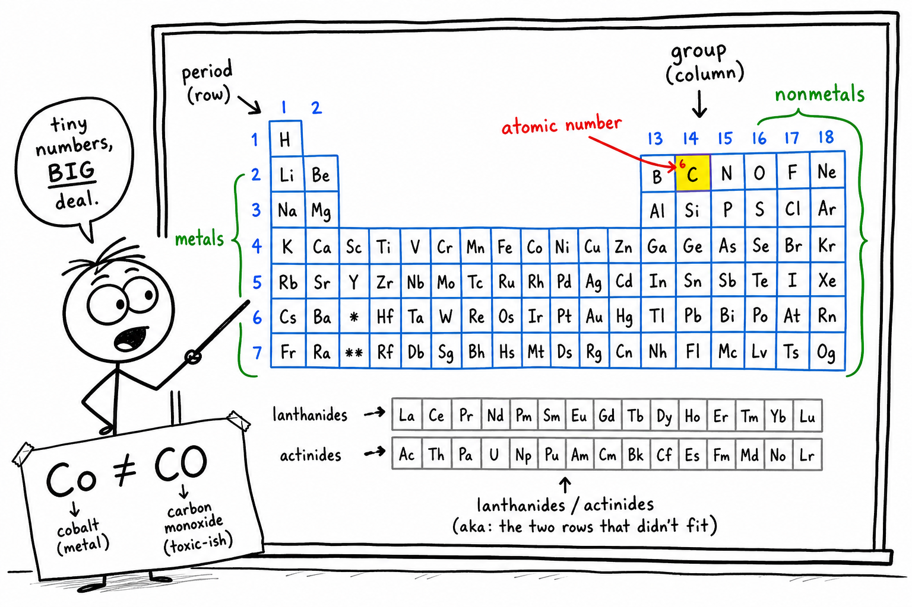

# Periodic Table

Walk into almost any science classroom and you will see a huge chart on the wall — a grid of boxes, symbols, and numbers that looks mysterious at first.

Then you notice the connections. The silicon in a gaming PC sits in the same neighborhood as the carbon in pencil graphite and the oxygen you just breathed out after gym class. The iron in a bike frame, the copper in phone chargers, the sodium and chlorine that make table salt, and the helium in some party balloons all have addresses on that same chart.

The periodic table is not random wallpaper. It is one of the most useful maps in science.

**The periodic table is a chart that organizes all known chemical elements by atomic number and by repeating patterns in their properties.**

It does not map countries or roads. It maps the building blocks of matter.

As you learned in the chapter on **elements**, an element is a pure substance made of only one kind of atom. As you learned in the chapter on **atoms**, every atom has a nucleus with protons and neutrons, plus electrons around it. The periodic table shows how those atoms sort into families — and how chemists predict what they will do.

## A Messy Pile vs. a Smart Map

Imagine a library where every book has been thrown on the floor — adventures, histories, science books, all mixed up. Finding one title would be slow and frustrating.

Now imagine the same library with shelves, labels, and a catalog. Suddenly you can find what you need and guess where a new book belongs.

The periodic table does that for chemistry. Before scientists understood the patterns, elements felt like a messy pile of facts. Once the table took shape, the elements started to make sense.

## Reading One Element Box

Every box on the table is like an ID card for one element. Layouts vary slightly, but most boxes show:

| Clue in the box | What it tells you |
|-----------------|-------------------|
| **Name** | Full name (e.g., carbon) |
| **Symbol** | Short code (e.g., C) |
| **Atomic number** | Number of protons |
| **Atomic mass** | Average mass of atoms (often a decimal) |

**Carbon** is a good example to practice on:

| Fact | Value |
|------|-------|
| Name | Carbon |
| Symbol | C |
| Atomic number | 6 |
| Atomic mass | about 12 |

Learn to read one box and you can read the whole chart.

## Chemical Symbols — Tiny Codes, Big Meaning

A **chemical symbol** is a short way to write an element's name.

| Style | Examples |
|-------|----------|
| One capital letter | H, C, N, O, S |
| Two letters (first capital, second lowercase) | He, Li, Cl, Ca, Fe |

**Capitalization matters.**

| Symbol | Meaning |
|--------|---------|
| **Co** | Cobalt (element) |
| **CO** | Carbon monoxide (compound) |

One letter can change everything. Chemists treat symbols like precise passwords, not casual abbreviations.

Some symbols come from older names: **Fe** for iron (from *ferrum*), **Au** for gold (*aurum*), **Pb** for lead (*plumbum*).

## Atomic Number — An Element's ID

The **atomic number** is the number of **protons** in an atom's nucleus.

A **proton** is a positively charged particle in the nucleus. Atomic number identifies the element.

| Element | Atomic number (protons) |
|---------|-------------------------|
| Hydrogen | 1 |
| Helium | 2 |
| Carbon | 6 |
| Oxygen | 8 |
| Iron | 26 |

**Change the number of protons, and you change the element.** An atom with 8 protons is oxygen. With 9, it is fluorine. With 10, it is neon.

The modern table is arranged mostly by atomic number — hydrogen (1) first, then helium (2), lithium (3), and so on. That order is not random. It follows proton count, and proton count links to electron patterns that repeat.

## What "Periodic" Means

**Periodic** means happening again in a pattern — like days of the week or seasons of the year.

On the periodic table, **chemical properties repeat** as atomic number increases. Elements in the same **vertical column** often behave in similar ways. That repeating pattern is why the table is called **periodic**.

## Dmitri Mendeleev and the Missing Pieces

In the 1800s, scientists knew many elements but did not yet have today's table.

**Dmitri Mendeleev**, a Russian chemist, arranged known elements by mass and properties. He noticed patterns — and left **empty spaces** where he thought undiscovered elements should go. He even predicted some of their properties before anyone found them.

When those elements were discovered later, many predictions were remarkably close. Mendeleev showed that elements are not a random pile. They follow an order worth mapping.

## Rows Are Periods

Horizontal rows are called **periods**.

| Period | Starts with | Ends with (examples) |
|--------|-------------|----------------------|
| 1 | Hydrogen | Helium |
| 2 | Lithium | Neon |
| 3 | Sodium | Argon |

Moving **left to right** across a period, atomic number increases by one each step — one more proton per element. Properties also shift: elements on the left are usually more **metallic**; elements on the right are usually more **nonmetallic**.

## Columns Are Groups

Vertical columns are called **groups** or **families**.

Elements in the same group often have **similar chemical behavior** because their atoms have similar **outer electron** arrangements. **Electrons** are negatively charged particles around the nucleus. The outer electrons matter most when atoms bond or react.

**Columns often matter more than rows** for chemical similarity. That is one of the table's best secrets.

## Major Families at a Glance

| Family / region | Where on table | Vibe | Examples |
|-----------------|----------------|------|----------|
| **Alkali metals** (Group 1) | Far left column | Very reactive metals | Li, Na, K |
| **Alkaline earth metals** (Group 2) | Next column | Reactive metals, less than Group 1 | Mg, Ca |
| **Transition metals** | Large middle block | Strong, shiny, conductive | Fe, Cu, Au, Zn |
| **Metalloids** | Stair-step between metals and nonmetals | Mixed properties | B, Si, Ge |
| **Halogens** (Group 17) | Next-to-last column | Reactive nonmetals | F, Cl, Br, I |
| **Noble gases** (Group 18) | Far right column | Usually unreactive | He, Ne, Ar |

### Alkali Metals and Alkaline Earth Metals

**Alkali metals** (lithium, sodium, potassium, and others) react strongly — especially with water. Pure sodium metal is dangerous to handle, but sodium in **table salt** is part of a stable compound. Same element, very different situation.

**Alkaline earth metals** (magnesium, calcium, and others) are reactive metals too, generally less reactive than alkali metals. Calcium builds bones and teeth; magnesium appears in cells, alloys, and fireworks.

### Transition Metals

The big middle section holds **transition metals** — iron, copper, nickel, silver, gold, zinc, and many more. They are often strong, shiny, and good conductors of heat and electricity. Iron becomes steel. Copper carries current in wires. Gold resists corrosion in jewelry and electronics.

### Halogens and Noble Gases

**Halogens** (fluorine, chlorine, bromine, iodine) are reactive nonmetals. Chlorine combined with sodium makes sodium chloride — ordinary salt. Many halogens are useful but dangerous in pure form; never breathe chlorine gas.

**Noble gases** (helium, neon, argon, krypton, xenon) are usually **unreactive** because their outer electrons are in stable arrangements. Helium lifts balloons without burning. Neon glows in signs. Argon helps fill some light bulbs and welding setups.

## Metals, Nonmetals, and Metalloids

Most elements are **metals**. Nonmetals sit mostly on the right (plus hydrogen on the far left). **Metalloids** sit on the stair-step between them.

| Type | Typical traits | Where on table |
|------|----------------|----------------|
| **Metals** | Shiny, conduct heat and electricity, malleable, ductile; usually solid (mercury is liquid) | Left and center |
| **Nonmetals** | Often poor conductors; may be gas, solid, or liquid (bromine) | Right side (+ H) |
| **Metalloids** | Some metal-like, some nonmetal-like | Stair-step border |

**Silicon** is the star metalloid for technology — computer chips, solar cells, and much of modern electronics depend on it.

Metals build bikes, bridges, trains, tools, and wires. Nonmetals are essential for life: **oxygen** for respiration, **carbon** for living molecules, **nitrogen** in proteins and DNA, **phosphorus** in bones and genetic material.

## Atomic Mass and Isotopes

Many boxes show **atomic mass** — the average mass of an element's atoms compared with a standard. Most mass comes from **protons** and **neutrons** in the nucleus. A **neutron** has no electric charge.

For now, remember:

- **Atomic number** = protons → identifies the element
- **Atomic mass** = how heavy atoms are on average

Atoms of the same element always have the same protons but can have different neutron counts. Those forms are **isotopes**. Carbon-12 and carbon-14 are both carbon (6 protons each); carbon-14 has more neutrons and more mass. The decimal on the table is often an average of natural isotopes. You do not need isotope math yet — just know proton count defines the element.

## Electrons and Chemical Behavior

Atoms can gain, lose, or share electrons when they bond. **Outer electrons** (valence electrons) strongly affect reactivity.

Elements in the same group often share the same number of outer electrons — so they behave like chemical relatives:

- Lithium, sodium, potassium → reactive Group 1 metals
- Fluorine, chlorine, bromine → reactive Group 17 nonmetals
- Helium, neon, argon → usually unreactive noble gases

## Why the Table Has an Odd Shape

The chart is not a perfect rectangle. Two rows — **lanthanides** and **actinides** — often sit below the main table so the poster fits on a wall. They still belong in atomic-number order; the layout is a printing trick, not a chemistry mistake.

The shape comes from how electrons fill shells in atoms. Strange look, real pattern inside.

## Patterns That Help You Predict

One of the table's superpowers is **prediction**.

| If you know… | You can often guess… |
|--------------|---------------------|
| Element is in noble gas group | Mostly unreactive |
| Element is an alkali metal | Reactive metal |
| Element is near silicon | Metalloid-like mixed properties |

### Across a Period (Left → Right)

In Period 3, for example, the table moves from metals (sodium, magnesium) through aluminum and silicon toward nonmetals (phosphorus, sulfur, chlorine) and argon. Same row, gradual shift.

### Down a Group (Top → Bottom)

Behavior stays similar, but atoms get larger and heavier. Potassium is generally more reactive than lithium. Halogens share family traits yet differ in state: fluorine and chlorine are gases, bromine is a liquid, iodine is a solid at room temperature.

Same family, different details.

## Elements, Compounds, and the Table

The periodic table lists **elements**, not compounds.

| Substance | On the table? | Why |
|-----------|---------------|-----|
| Water (H2O) | No | Compound of hydrogen and oxygen |
| Salt (NaCl) | No | Compound of sodium and chlorine |
| Carbon dioxide (CO2) | No | Compound of carbon and oxygen |
| Iron, oxygen, carbon | Yes | Each is an element |

As you learned in **compounds** and **mixtures**, elements are the alphabet of matter; compounds are words built from that alphabet. The table gives chemists the letters.

## The Table in Real Life

The chart is not locked in a lab. It is in your bones, your breath, your bike, and your phone.

| Element | Where you meet it |
|---------|-------------------|
| Calcium | Bones and teeth |
| Oxygen | Air and respiration |
| Carbon | Food, muscles, fuels, plastics |
| Iron | Steel tools and frames |
| Copper | Wires and motors |
| Silicon | Chips and solar tech |
| Helium | Some balloons |
| Sodium + chlorine | Table salt (as a compound) |

Scientists also add **synthetic elements** in laboratories — some exist for only a fraction of a second. The table grows and updates as discovery continues.

## Do You Have to Memorize Everything?

No.

Scientists use the table because it **organizes** information, not because they have every box memorized. Learn to read symbols, atomic numbers, periods, groups, and major regions (metals, nonmetals, metalloids, halogens, noble gases). Memorizing a few common elements helps; understanding the **pattern** helps more.

## Safety and the Periodic Table

Seeing an element on the table does **not** mean it is safe to touch, taste, breathe, or mix.

| Risk | Examples to respect |
|------|---------------------|
| Reactive with water or air | Some alkali metals |
| Poisonous or corrosive | Many pure halogens, some metalloids |
| Radioactive | Some heavy elements |
| Safe in compounds, dangerous pure | Sodium in salt vs. pure sodium metal |

**Never** taste unknown substances, smell gases directly, or handle samples without teacher permission. Chemistry rewards curiosity — and demands respect.

## Common Misconceptions

One mistake is thinking the table lists every substance. It lists **elements** only.

Another is assuming elements in the same **row** are always most alike. Usually the same **column** (group) matters more for similarity.

A third is confusing **atomic number** with **atomic mass**. Atomic number counts protons and identifies the element.

A fourth is thinking a pure element and a compound containing it behave the same. Pure sodium metal reacts violently with water; sodium in table salt is stable.

## How to Use the Table Like a Scientist

When you look at an element, ask:

- What is its atomic number and symbol?
- Is it a metal, nonmetal, or metalloid?
- What group and period is it in?
- Are neighbors similar?
- Does its family hint at reactivity?
- Is it usually found alone, in compounds, or in mixtures?

Those questions turn boxes into a thinking tool.

## The Big Idea

The periodic table organizes elements by **atomic number** and by **repeating patterns** in their properties. Rows are **periods**; columns are **groups**. Same-group elements often behave alike because of similar outer electrons. Metals, nonmetals, metalloids, halogens, noble gases, and other families have homes on the map.

If you remember only one sentence, remember this:

**The periodic table is a map of the elements that reveals patterns in the building blocks of matter.**

## Study Questions

1. What is the periodic table?
2. What four clues are usually shown in one element box?
3. What is a chemical symbol? Why does capitalization matter?
4. What is atomic number, and what particle does it count?
5. Why does atomic number identify an element?
6. What does **periodic** mean, and why is the table called periodic?
7. Who was Dmitri Mendeleev, and why was his work important?
8. What are **periods** and **groups** on the table?
9. Why do elements in the same group often behave similarly?
10. Where are alkali metals, and why is pure sodium different from sodium in salt?
11. What are transition metals? Give two examples and one use.
12. List three common properties of metals.
13. Where are nonmetals found? Why are they important for living things?
14. What is a metalloid? Why is silicon important?
15. What are halogens and noble gases? Give one example of each.
16. What is atomic mass? How is it different from atomic number?
17. What are isotopes?
18. Why are the lanthanides and actinides often placed below the main table?
19. Why are water, salt, and carbon dioxide not listed as elements on the table?
20. Give three ways the periodic table connects to everyday life.
21. Do scientists need to memorize the entire table? What matters more?
22. Name two safety rules when studying elements or chemicals.
23. Name two common misconceptions about the periodic table.
24. In your own words, explain how the periodic table helps you predict how an element might behave.
