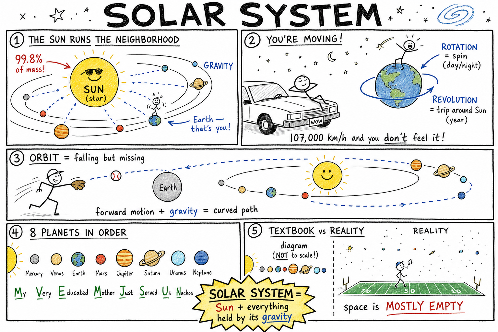

# Solar System

You are lying on the hood of a car after a late game, looking up. The sky looks calm — a few stars, maybe the Moon, and sometimes a steady point of light that does not twinkle the way stars do. That steady light might be Jupiter, millions of kilometers away, shining because sunlight bounced off it and traveled to your eyes.

The sky looks frozen. It is not.

Right now you are moving. Earth is spinning you toward and away from the Sun. Earth is racing around the Sun at about 107,000 kilometers per hour. The Moon is circling Earth. Other worlds are on their own paths. Asteroids, comets, dust, and human-built spacecraft are moving too.

You are not standing on a still platform. You are riding a planet inside an enormous, gravity-held machine.

**The solar system is the Sun and all the objects held by its gravity, including planets, dwarf planets, moons, asteroids, comets, meteoroids, dust, and spacecraft.**

It is our neighborhood in space — the place where Earth lives.

## The Sun Runs the Neighborhood

At the center is the **Sun**, a **star**: a huge ball of hot glowing gas that makes its own light and heat.

The Sun holds about **99.8 percent** of the mass in the entire solar system. Because it is so massive, its **gravity** is powerful. That gravity keeps planets, dwarf planets, comets, asteroids, and more in orbit around it.

The Sun is not a campfire in space. It shines because of **nuclear fusion** in its core, where hydrogen is changed into helium and enormous energy is released. That energy warms Earth, drives weather, powers plant growth, and makes life possible. Without the Sun, Earth would be dark, frozen, and lifeless.

When you study the solar system, start with the Sun. Everything else is arranged around it.

## Gravity: The Invisible Rope

**Gravity** is the force of attraction between objects that have mass.

The Sun pulls on Earth. Earth pulls on the Sun too — but the Sun is so much more massive that Earth does the obvious moving.

Gravity does not need a physical rope. It works across empty space. It keeps planets circling the Sun, moons circling planets, and comets on long looping paths.

The solar system has no walls holding it together. **Gravity** holds it together.

## Orbits: Falling and Missing the Ground

An **orbit** is the path one object follows around another object in space.

Earth orbits the Sun. The Moon orbits Earth. The International Space Station and thousands of other satellites orbit Earth.

Most planetary orbits are slightly stretched circles called **ellipses** — oval-like paths. Earth's orbit is nearly circular, but not perfect.

Orbits happen because two things work together:

- **Forward motion** — the object is already moving
- **Gravity** — something massive pulls it inward

If a planet had no forward motion, gravity would yank it into the Sun. If there were no gravity, the planet would fly off in a straight line. Together, motion and gravity bend the path into a curve — an orbit.

Picture tossing a baseball. Throw it gently and it falls quickly. Throw it harder and it lands farther away. Throw it hard enough from a tall mountain and, in theory, it could fall toward Earth but keep missing the ground — that is the basic idea behind orbit. Spacecraft and planets are doing that on a much larger scale.

## Rotation and Revolution

Two words will follow you through every astronomy unit:

**Rotation** means spinning around an axis. Earth rotates once about every 24 hours. That spin gives us day and night.

**Revolution** means traveling around another object. Earth revolves around the Sun once about every 365 days. That trip, together with Earth's tilted axis, gives us the year and the seasons.

A planet can rotate and revolve at the same time. Right now you are spinning with Earth while Earth carries you around the Sun. You are doing both motions at once without feeling either one.

## The Eight Planets

The solar system has **eight planets**. In order from the Sun:

1. Mercury  
2. Venus  
3. Earth  
4. Mars  
5. Jupiter  
6. Saturn  
7. Uranus  
8. Neptune  

A **planet** is a large round object that orbits the Sun and has cleared most other objects from its orbital path.

Planets do not make their own light. When Venus or Jupiter looks bright in the night sky, you are seeing **reflected sunlight** — like light bouncing off a mirror, except the mirror is a whole world.

**Memory trick:** *My Very Educated Mother Just Served Us Nachos* — first letter of each word matches a planet name in order.

## Two Kinds of Worlds

The solar system is not eight copies of Earth. It is split into two main groups.

**Inner planets** (Mercury, Venus, Earth, Mars) are the **terrestrial planets** — rocky, relatively small, dense, with solid surfaces. *Terrestrial* comes from a word meaning Earth-like.

**Outer planets** (Jupiter, Saturn, Uranus, Neptune) are much larger. Jupiter and Saturn are mostly hydrogen and helium and are called **gas giants**. Uranus and Neptune contain more water, ammonia, methane, and other icy materials, so they are often called **ice giants**. None of the outer planets has a solid surface you could stand on like a sidewalk.

All four outer planets have **rings** and many **moons**. The outer solar system is cold, huge, and full of surprises.

## Mercury: Scorched and Airless

Mercury is closest to the Sun — small, rocky, and cratered.

It has almost no atmosphere, so it cannot hold heat well. Its dayside can become extremely hot while its nightside can become extremely cold. Being near the Sun does not mean "warm everywhere." **Atmosphere matters.**

Mercury has the shortest year of any planet but rotates slowly compared with Earth.

## Venus: Earth's Evil Twin

Venus is about the same size as Earth but a completely different world.

Its thick atmosphere is mostly carbon dioxide. Its clouds contain sulfuric acid. Its surface is hotter than Mercury's — even though Mercury is closer to the Sun — because Venus traps heat in an extreme **greenhouse effect**.

Venus is proof that a planet's atmosphere can control its temperature more than its distance from the Sun.

## Earth: Home Base

Earth is the third planet from the Sun — not the biggest, not the closest, not the flashiest.

It has liquid water, a breathable atmosphere for humans, a protective magnetic field, and life. It has one large natural satellite, the **Moon**. From space it looks blue and white because of oceans, clouds, and atmosphere.

So far, Earth is the only world where scientists know life exists. Every mission, rover, and telescope in the solar system ultimately helps us understand this one world better.

## Mars: The Red Planet

Mars is often called the **Red Planet** because iron-rich dust gives its surface a reddish color.

It has volcanoes, canyons, polar ice caps, dust storms, and evidence that liquid water flowed there long ago. Today it is cold and dry, with a thin atmosphere mostly of carbon dioxide.

Robots have explored Mars for decades — from Sojourner to Curiosity to **Perseverance**, which collects rock samples and searches for signs of ancient life. Mars is the planet humans talk about visiting next. If you want to imagine walking on another world, Mars is the realistic first choice.

## The Asteroid Belt: Leftovers, Not a Junkyard

Between Mars and Jupiter is the **asteroid belt**.

An **asteroid** is a rocky or metallic object orbiting the Sun. Most are much smaller than planets — from boulders to objects many kilometers wide.

Movies sometimes show spaceships weaving through crashing rocks. Real life is different. Space is enormous, and asteroids are spread far apart. Spacecraft can cross the belt without dodging rocks every second.

The largest object there is **Ceres**, classified as a **dwarf planet**. Asteroids are leftovers from the early solar system — time capsules from when the planets were forming.

## Jupiter: King of the Planets

Jupiter is the largest planet. It has more mass than all the other planets combined.

It is a gas giant of hydrogen and helium with colorful cloud bands and storms. The **Great Red Spot** is a storm larger than Earth that has lasted for centuries.

Jupiter has dozens of moons. Four of the largest — **Io, Europa, Ganymede, and Callisto** — are called the **Galilean moons** because Galileo observed them in 1610. **Europa** is especially exciting: scientists think a salty ocean may hide under its icy crust, making it one of the best places to search for life beyond Earth.

## Saturn: Rings and a Moon with Lakes

Saturn is famous for its **rings** — countless pieces of ice and rock from tiny grains to house-sized chunks, all orbiting the planet.

Saturn is less dense than water. In a bathtub big enough, Saturn would float. (No such bathtub exists.)

Its largest moon, **Titan**, has a thick atmosphere and lakes and seas of liquid methane and ethane. Saturn reminds you that planets are not alone — moons and rings are worlds and systems of their own.

## Uranus: The Planet on Its Side

Uranus is an ice giant with a blue-green color from methane in its atmosphere.

It is unusual because it rotates on its side compared with the other planets — almost as if it rolls around the Sun. Scientists think a massive collision long ago may have knocked it over.

Uranus has faint rings and moons, but nothing as dramatic as Saturn's rings.

## Neptune: Windy and Far Away

Neptune is dark, cold, windy, and far from the Sun — yet not boring.

It has some of the fastest winds measured in the solar system. Its blue color comes largely from methane, along with other atmospheric factors.

Its largest moon, **Triton**, orbits backward compared with Neptune's rotation, suggesting Neptune may have captured it long ago.

## Dwarf Planets: Round but Not Cleared

A **dwarf planet** is a round object that orbits the Sun but has **not** cleared its orbital path of other objects.

**Pluto** is the most famous. For decades it was called the ninth planet. In 2006 astronomers refined the definition of a planet, and Pluto became a dwarf planet. Pluto did not vanish and did not become boring — it got a more precise label. Other dwarf planets include **Ceres, Eris, Haumea, and Makemake**.

Science updates categories when evidence improves. That is a strength, not a failure.

## Moons, Rings, Comets, and Shooting Stars

The solar system is more than planets.

A **moon** is a natural object orbiting a planet or dwarf planet. Earth has one Moon. Mars has two small ones. Jupiter and Saturn have dozens. Some moons are dead, cratered rocks; others are active worlds — **Io** has volcanoes, **Europa** may have an ocean, **Titan** has a thick atmosphere.

**Rings** are swarms of small particles orbiting a planet. Saturn's are the brightest; Jupiter, Uranus, and Neptune have rings too.

A **comet** is an icy object orbiting the Sun — often called a dirty snowball. Near the Sun, ice turns to gas, forming a glowing **coma** and tails pushed by sunlight and the solar wind. Comets are leftovers from the solar system's birth.

Three similar words, three different things:

- **Meteoroid** — small rocky or metallic object in space  
- **Meteor** — streak of light when one burns up in Earth's atmosphere (a "shooting star," not a star)  
- **Meteorite** — piece that survives and lands on the ground  

Meteorites are rare direct samples of space scientists can hold in a lab.

## Beyond Neptune: The Cold Storage Zone

Beyond Neptune lies the **Kuiper Belt** — icy bodies, dwarf planets, and other small objects. Pluto is the best-known member. It is like a distant freezer of leftovers from formation.

Farther still, scientists think the **Oort Cloud** may surround the solar system — a huge shell of icy objects, never visited by spacecraft, inferred partly from the paths of long-period comets.

The solar system does not end neatly at Neptune. It just gets colder, emptier, and harder to reach.

## Space Is Mostly Empty — and That Is Hard to Picture

Textbook diagrams often show planets close together so you can learn their order. Those pictures are useful. They are **not** drawn to scale.

In reality, space is mostly empty. Planets are tiny compared with the distances between them.

If the Sun were the size of a basketball, Earth would be a small speck many meters away, and Neptune would be far across a field. Walking a scale model on a football field or long hallway is one of the best ways to feel how huge the solar system really is.

## Measuring Distance: AU and Light-Time

Distances in space are so large that everyday kilometers become awkward. Scientists often use the **astronomical unit (AU)** — the average distance from Earth to the Sun, about **150 million kilometers**.

Earth is **1 AU** from the Sun. Mars is about **1.5 AU**. Jupiter about **5.2 AU**. Neptune about **30 AU**.

Light is fast, but space is bigger. Sunlight takes about **8 minutes** to reach Earth — so when you see the Sun, you see it as it was about 8 minutes ago. Light from the Moon takes a little over **1 second**. Light from Neptune takes **hours**.

Looking far away also means looking into the past. Astronomy is part time machine.

## How the Solar System Formed

About **4.6 billion years ago**, a huge cloud of gas and dust called a **nebula** began to collapse under gravity.

Most material gathered at the center and became the young Sun. The rest formed a spinning disk. Dust and rock collided and stuck together. Small clumps became big clumps. Some became planets and moons; some stayed as asteroids, comets, and other small bodies.

Near the young Sun it was **hot** — rock and metal could stay solid, but many gases and ices could not easily collect. That helped build the small rocky inner planets.

Farther out it was **cold** — ices could survive and giant planets could pull in huge amounts of gas. That helped build the gas and ice giants.

The pattern — rocky inner worlds, giant outer worlds — is a clue written in the layout of the system today.

## Quick Connections: Day, Night, Seasons, and Eclipses

**Day and night** come from Earth's **rotation**. The side facing the Sun has day; the side turned away has night. The Sun appears to rise in the east and set in the west because Earth spins west to east — the Sun is not racing around Earth each day.

**Seasons** are caused mainly by Earth's **tilted axis** as Earth **revolves** around the Sun — not mainly by Earth getting closer or farther from the Sun. When the Northern Hemisphere tilts toward the Sun, it gets more direct sunlight and longer days: summer there, winter in the Southern Hemisphere. Six months later, the situation flips.

An **eclipse** happens when one object blocks light from reaching another. In a **solar eclipse**, the Moon passes between Earth and the Sun. In a **lunar eclipse**, Earth passes between the Sun and the Moon. They do not happen every month because the Moon's orbit is slightly tilted.

**Never look directly at the Sun during a solar eclipse without proper certified eye protection.** Ordinary sunglasses are not safe.

## Humans in the Solar System

People have studied the solar system with eyes, telescopes, math, and spacecraft.

Astronauts walked on the Moon in the Apollo program. Robotic missions have visited every planet. Rovers have driven on Mars. Probes have flown past Jupiter, Saturn, Uranus, Neptune, Pluto, comets, and asteroids. The **Voyager** spacecraft, launched in 1977, have left the familiar planets behind and still send data from interstellar space.

Exploration is not just for pictures. Each mission tests ideas with real evidence — temperature, chemistry, magnetic fields, craters, atmospheres. The solar system is a laboratory. Earth is one experiment inside it.

## Why Study the Solar System?

Studying other worlds helps you understand Earth.

Compare Earth with Venus and Mars to learn about atmospheres and climate. Study craters on the Moon and Mars to learn about impacts. Study asteroids and comets to learn what the young solar system was made of.

The solar system is a place to explore and a mirror that helps you see home more clearly.

## Common Misconceptions

**The Sun is a planet.** No — the Sun is a **star**.

**Planets make their own light.** No — they **reflect sunlight**.

**The asteroid belt is packed with crashing rocks.** No — asteroids are spread across huge distances.

**Pluto disappeared when it was reclassified.** No — Pluto is still a real world, now called a **dwarf planet**.

**Summer happens because Earth is closer to the Sun.** Not mainly — **Earth's tilt** causes seasons.

**Space diagrams show true distances.** Usually they do not — they show **order**, not scale.

## How to Think Like an Astronomer

When you read about any object in the solar system, ask:

- What is at the center of this motion?
- What force keeps it in orbit?
- Is it a star, planet, dwarf planet, moon, asteroid, comet, or meteoroid?
- Is it rocky, gaseous, icy, or mixed?
- How far is it from the Sun?
- Does it have an atmosphere, moons, or rings?
- What evidence do scientists have?
- How does it compare with Earth?

Good astronomy starts with careful observation and patient comparison — not memorizing names for their own sake.

## The Big Idea

The solar system is the Sun and everything held by its gravity: eight planets, dwarf planets, moons, asteroids, comets, rings, dust, and human spacecraft. The Sun's mass and gravity organize the system. Distance and heat shaped which worlds are rocky and which are giant. Exploration — from telescopes in your backyard to rovers on Mars — turns the solar system from a diagram into a real place.

If you remember only one sentence, remember this:

**The solar system is our gravity-bound neighborhood in space, with the Sun at its center and many different worlds moving around it.**

## Study Questions

1. What is the solar system?
2. Why is the Sun called the center of the solar system?
3. What is gravity, and what role does it play in the solar system?
4. What is an orbit, and how do forward motion and gravity work together to create one?
5. What is the difference between rotation and revolution?
6. Name the eight planets in order from the Sun.
7. What is a planet?
8. Why do planets shine in the night sky?
9. What is the difference between the inner (terrestrial) planets and the outer planets?
10. Why is Venus hotter than Mercury even though Mercury is closer to the Sun?
11. Why is Mars called the Red Planet, and why do scientists send rovers there?
12. What is the asteroid belt, and why is it not like the crowded scenes in some movies?
13. Name one interesting fact about Jupiter and one about Saturn.
14. What is a dwarf planet, and why is Pluto classified as one?
15. What is a moon? Give two examples of moons that are scientifically interesting and why.
16. What is the difference between a meteoroid, a meteor, and a meteorite?
17. What are the Kuiper Belt and the Oort Cloud?
18. What is an astronomical unit (AU)?
19. About how long does sunlight take to reach Earth, and why does that matter?
20. What is a nebula, and how do scientists think the solar system formed?
21. Why are the inner planets rocky and the outer planets mostly giant worlds?
22. What mainly causes Earth's seasons — and what is a common wrong answer?
23. What is the difference between a solar eclipse and a lunar eclipse?
24. Name two ways humans have explored the solar system beyond looking with the naked eye.
25. What is one common misconception about the solar system, and what is the correct idea?
26. In your own words, explain why the solar system is a good place to study if you want to understand Earth.
