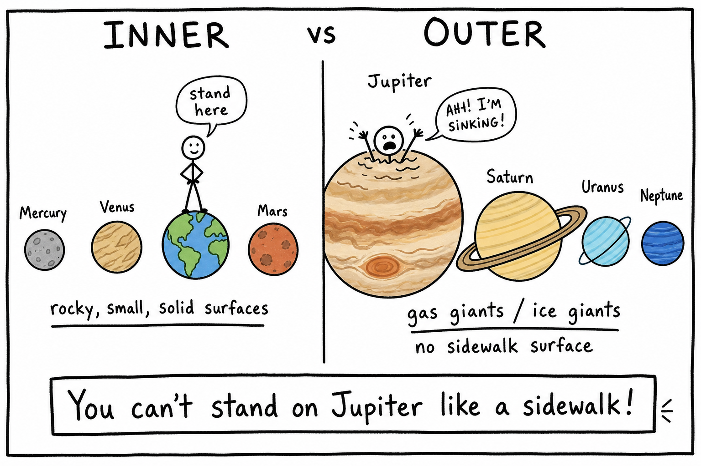
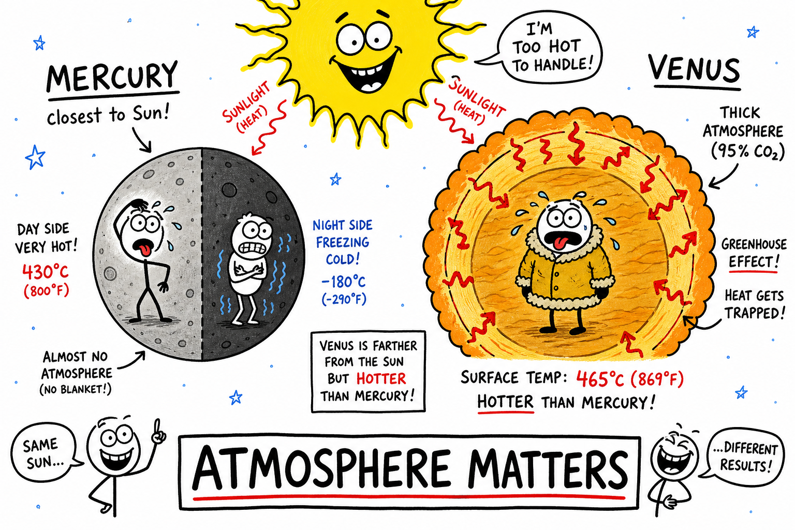
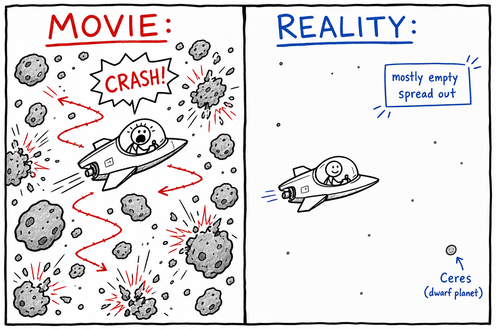
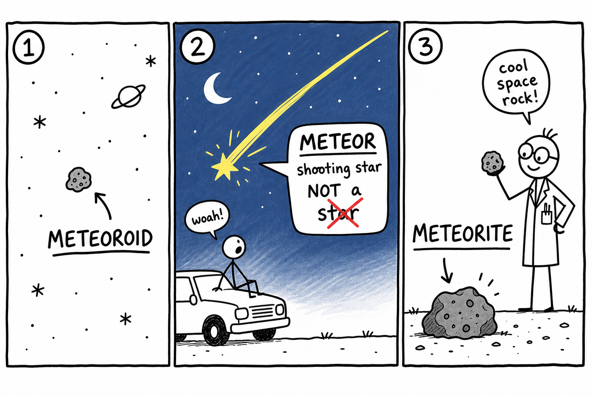
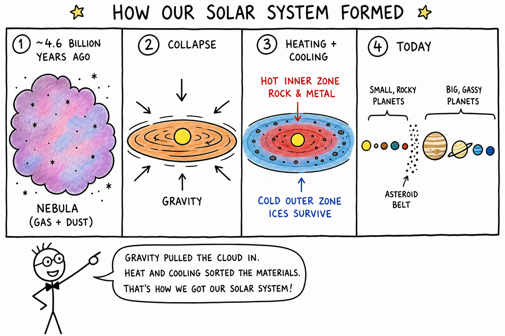
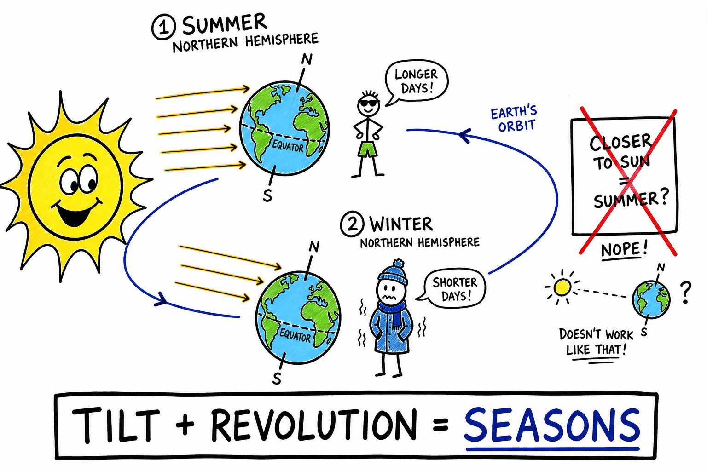
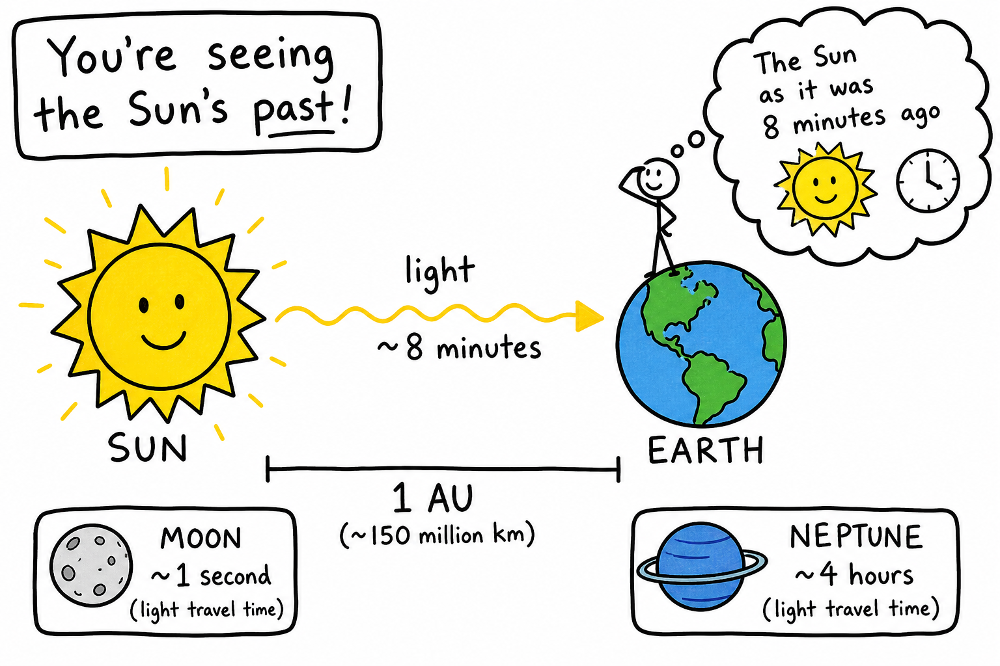

# Image briefs — 082 Solar System

Use when creating `082_Solar_system_02.png` through `082_Solar_system_08.png`. Each file is referenced in `082_Solar_system.md` at the placement noted below.

`082_Solar_system_01.png` already exists at the chapter top (overview panels: Sun/gravity, motion, orbit, eight planets, scale). Brief below for consistency if it is ever redrawn.

**Style** (from `_create_more_images.md`): crude, funny, hand-drawn explainer cartoon; stick-figure characters; rough black outlines; mostly white background; selective flat accent colors. Labels, arrows, exaggerated faces, simple metaphors. Minimalist, humorous, concept-first, intentionally rough. Color sparingly: **yellow/orange** = Sun/heat, **blue** = space/gravity/orbits/water ice, **red** = danger/hot/Mars, **green** = Earth/life/field scale, **gray** = rocky worlds. Vary panel width/height. Ages 11–13; hood-of-car stargazing, football-field scale models, rovers, and eclipse safety are fair hooks.

---

## 082_Solar_system_01.png — Chapter opener (existing)

**Placement:** Top of chapter (after title).

**Scene:** Multi-panel overview: Sun 99.8% mass + gravity; stick figure on car hood + rotation/revolution; orbit as “falling but missing”; eight planets with *My Very Educated Mother Just Served Us Nachos*; textbook crowded diagram vs football-field reality.

**Caption in chapter:** ``

---

## 082_Solar_system_02.png — Inner rocky vs outer giant worlds

**Placement:** End of “Two Kinds of Worlds”.

**Scene:** Wide split panel.

| Left — Inner (terrestrial) | Right — Outer (giants) |
|----------------------------|-------------------------|
| Four small gray/brown rocky circles: Mercury, Venus, Earth, Mars | Four huge planets: Jupiter, Saturn (rings), Uranus, Neptune (blue) |
| Labels: **rocky**, **small**, **solid surfaces** | Labels: **gas giants** / **ice giants**, **no sidewalk surface** |
| Stick-figure on Earth: “stand here” | Stick-figure sinking into Jupiter cloud with panicked face |

**Humor:** “You can’t stand on Jupiter like a sidewalk!”

**Aspect:** Wide (~2:1).

**Caption idea:** Inner rocky planets vs outer giant worlds.

---

## 082_Solar_system_03.png — Venus atmosphere beats distance

**Placement:** End of “Venus: Earth's Evil Twin”.

**Scene:** Two worlds side by side under the same cartoon Sun.

- **Mercury** (closer): small, gray, labeled “closest to Sun” but thermometer on nightside shows **cold**; dayside **hot** — “almost no air”
- **Venus**: thick orange/pink **CO₂ blanket** labeled “thick atmosphere”; surface thermometer **HOTTER** with red arrows trapped inside — “greenhouse effect”

**Humor:** Venus wearing a heavy coat sweating; Mercury shivering on the dark side.

**Key text:** **Atmosphere matters** more than distance alone.

**Aspect:** Wide (~2:1).

**Caption idea:** Venus traps heat — hotter than Mercury.

---

## 082_Solar_system_04.png — Asteroid belt is mostly empty

**Placement:** End of “The Asteroid Belt: Leftovers, Not a Junkyard”.

**Scene:** Split comparison.

| Left — MOVIE | Right — REALITY |
|--------------|-----------------|
| Spaceship zigzagging through crashing rocks, stick-figure pilot screaming | Vast empty blue-black space; a few tiny gray dots far apart; spacecraft glides calmly |
| Red “CRASH!” everywhere | Label: **spread out** — “mostly empty” |

**Optional:** Small **Ceres** labeled “dwarf planet — largest here.”

**Aspect:** Wide (~2:1).

**Caption idea:** The asteroid belt is not a rock traffic jam.

---

## 082_Solar_system_05.png — Meteoroid, meteor, meteorite

**Placement:** End of the meteoroid/meteor/meteorite bullet list in “Moons, Rings, Comets, and Shooting Stars”.

**Scene:** Three numbered panels left to right (heights can vary).

| 1 | 2 | 3 |
|---|---|---|
| Tiny rock in space labeled **meteoroid** | Streak of light in night sky over stick-figure on car hood — “shooting star” labeled **meteor** (NOT a star!) | Rock on ground labeled **meteorite** with scientist stick-figure holding sample |

**Colors:** Yellow streak for meteor; red X on word “star” in a small callout.

**Aspect:** Wide banner (~3:1).

**Caption idea:** Meteoroid → meteor → meteorite.

---

## 082_Solar_system_06.png — Solar system formed from a nebula

**Placement:** End of “How the Solar System Formed”.

**Scene:** Four-step horizontal strip (unequal boxes OK).

1. **Nebula** — fluffy gray cloud with “gas + dust”
2. **Collapse** — arrow inward; spinning disk around baby **Sun** (yellow)
3. **Hot inner / cold outer** — inner zone red “rock & metal”; outer zone blue “ices survive”
4. **Today** — small rocky inner planets, big outer giants; leftover asteroids/comets as tiny crumbs

**Labels:** ~4.6 billion years ago; **gravity** (blue arrow).

**Aspect:** Wide (~3:1).

**Caption idea:** From nebula to the layout we see today.

---

## 082_Solar_system_07.png — Seasons from Earth's tilt

**Placement:** End of the seasons paragraph in “Quick Connections: Day, Night, Seasons, and Eclipses”.

**Scene:** Sun on left; Earth at two positions on orbit (not to scale).

- **Summer (N. Hemisphere):** Earth’s axis tilted **toward** Sun; longer arrow of sunlight on top half; stick-figure in shorts: “more direct sun, longer days”
- **Winter (N. Hemisphere):** same Earth six months later, axis **away** from Sun; shorter slanted rays; stick-figure in coat

**Cross-out:** small wrong idea “closer to Sun = summer?” with red X.

**Key label:** **Tilt + revolution** → seasons.

**Aspect:** Wide (~2:1).

**Caption idea:** Seasons come from Earth's tilted axis.

---

## 082_Solar_system_08.png — Light-time: seeing the past

**Placement:** End of “Measuring Distance: AU and Light-Time”.

**Scene:** Sun on left, Earth on right with **1 AU** bracket. Wavy yellow arrow labeled “light ~8 minutes.” Stick-figure on Earth looking at Sun with thought bubble showing Sun from **8 minutes ago** and a small clock.

**Optional tiny insets:** Moon ~1 second; Neptune “hours!”

**Humor:** “You’re not seeing the Sun ‘right now’ — you’re seeing its past.”

**Aspect:** Tall or square (~1:1) — different from wide panels above.

**Caption idea:** Sunlight takes about 8 minutes to reach Earth.

---

## Suggested markdown inserts (in `082_Solar_system.md`)

```markdown







```

---

## Checklist for illustrators

- [x] _01 — chapter overview (exists)
- [x] _02 — inner terrestrial vs outer giants
- [x] _03 — Venus greenhouse vs Mercury
- [x] _04 — asteroid belt movie vs reality
- [x] _05 — meteoroid / meteor / meteorite
- [x] _06 — nebula formation strip
- [x] _07 — seasons and axial tilt
- [x] _08 — light-time / 8 minutes to Earth
