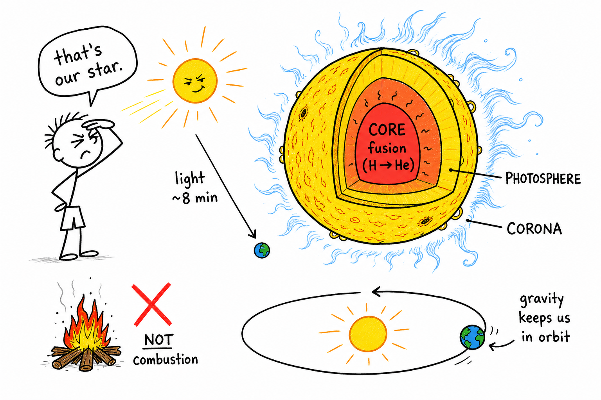
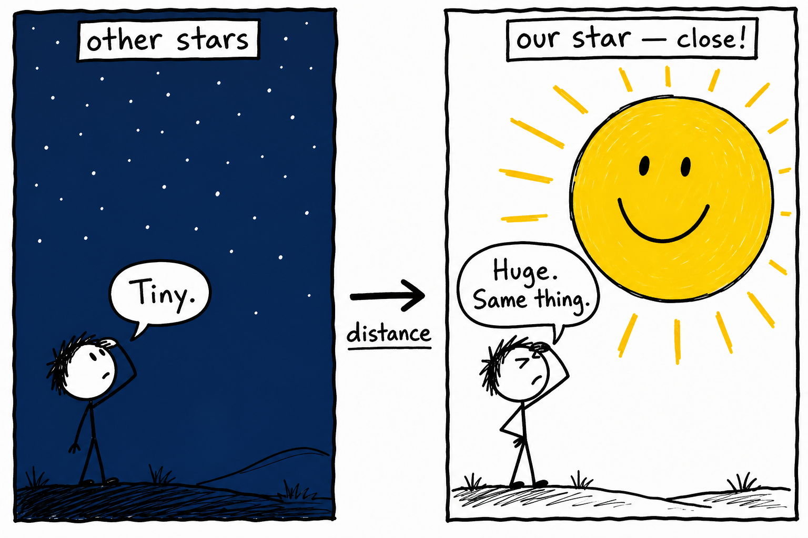
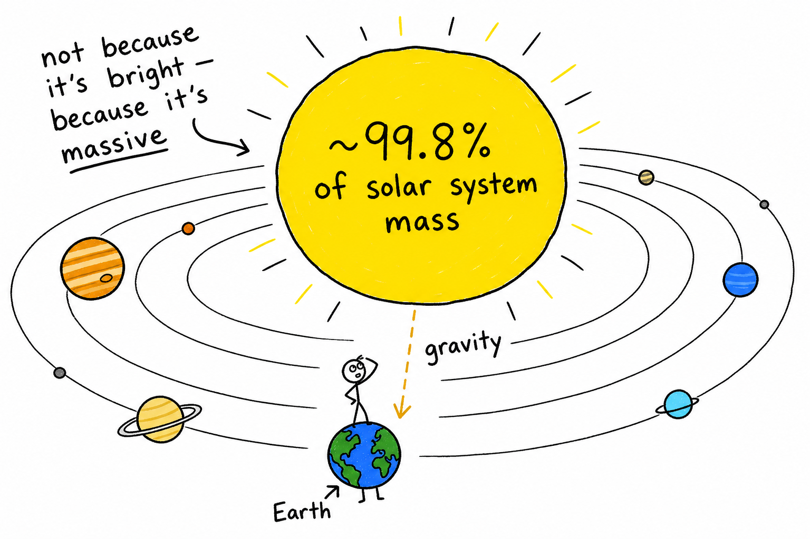
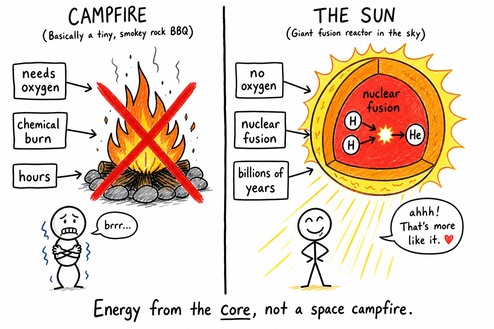
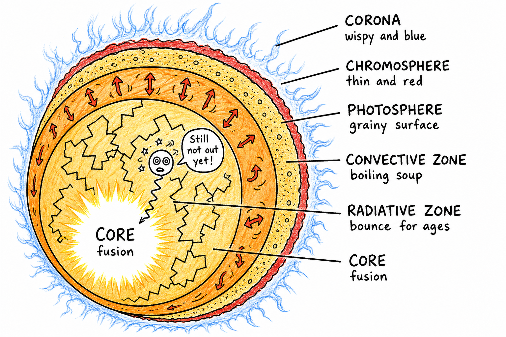
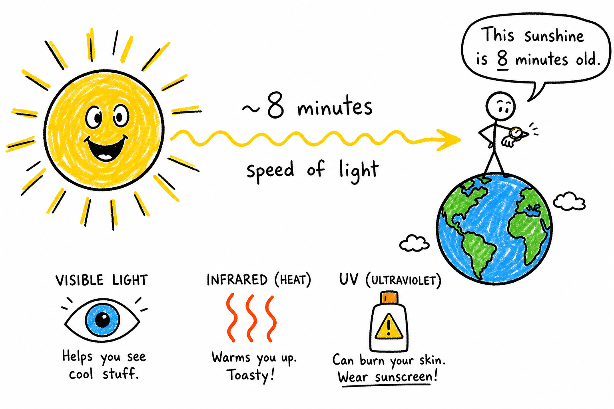
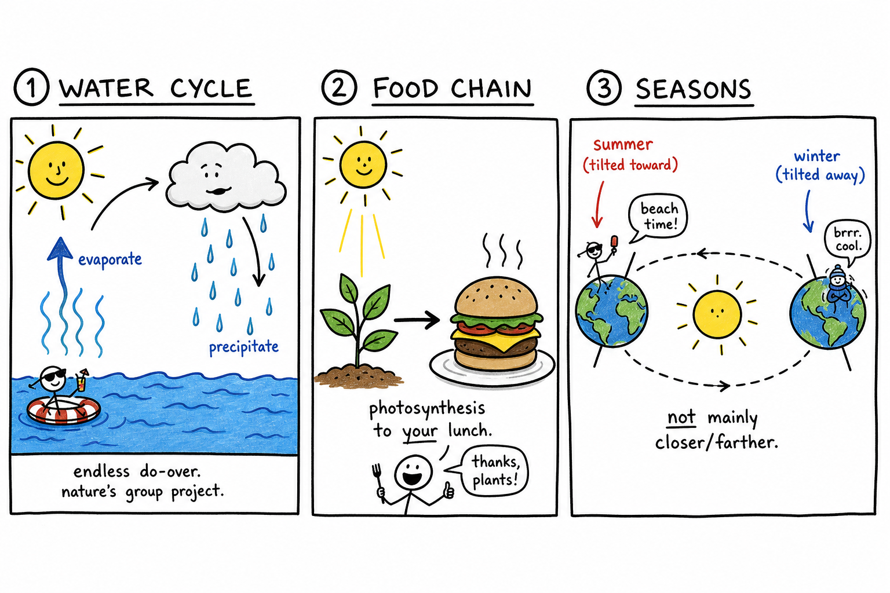
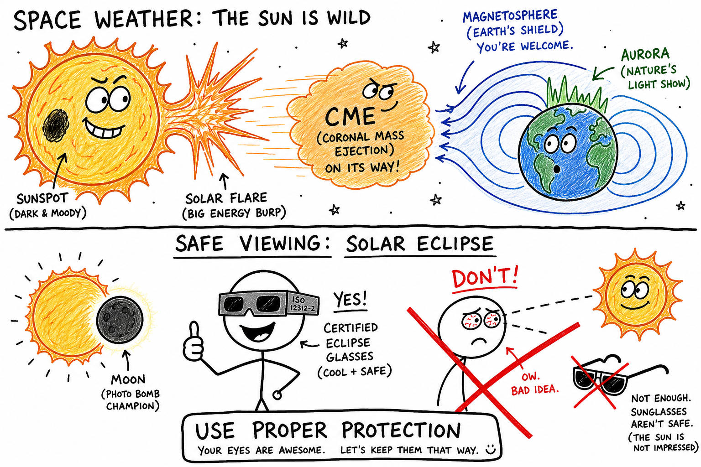

# Sun

Picture this: you wake up, check your phone, and head outside for practice. The grass is wet with dew. Your shadow stretches long across the field. By afternoon the same field is baking, and your shadow has shrunk to almost nothing under your feet.

You did not turn on a lamp in the sky.

Something far bigger did the job.

**The Sun is the star at the center of our solar system — a huge sphere of hot glowing plasma that gives Earth light, heat, and the energy needed for life.**

It is not a planet. It is not a ball of fire in the campfire sense. It is our star: the reason there is weather, food, seasons, and daylight. To understand Earth, the **solar system**, and life itself, you need to understand the Sun.

As you learned in the chapter on the **solar system**, the Sun sits at the center and holds the whole neighborhood together with gravity. As you learned in chapters on **hydrogen**, **matter**, and **gas**, the Sun is made mostly of light elements in an extreme state called **plasma**. As you learned in the chapter on **combustion**, ordinary burning needs fuel and oxygen — and that is *not* how the Sun shines.

## The Sun Is a Star

A **star** is a massive ball of hot glowing gas, mostly plasma, that produces its own light and heat.

The Sun is a star. It only looks bigger and brighter than the others because it is close. The pinpoints you see at night are also suns — some larger, some smaller, some hotter, some cooler — but they are so far away they look tiny.

Our Sun is special to us because it is *ours*. Nearly all the energy that supports life on Earth started there. The chapter on **stars** goes deeper into other suns in the galaxy; this chapter is about the one that runs your world.

## The Boss of the Solar System

The Sun sits at the center and holds about **99.8 percent** of the mass of the entire solar system. That means it outweighs every planet, moon, asteroid, comet, and dwarf planet combined.

Because it is so massive, it has powerful **gravity** — the same force you met in the chapter on **gravity**, but on a scale that bends the paths of worlds. Earth does not orbit the Sun because the Sun is bright. Earth orbits because the Sun's gravity pulls on it while Earth keeps moving forward — like a ball on a string, except the string is invisible and stretches across 150 million kilometers of space.

The Sun is both the bright heart and the gravitational anchor of our solar system.

| Role | What the Sun does |
|------|-------------------|
| Gravity | Keeps planets, moons, asteroids, and comets in orbit |
| Light | Makes daylight and lets you see |
| Heat | Warms land, water, and air |
| Energy | Powers weather, the water cycle, photosynthesis, and most food chains |

## What the Sun Is Made Of

The Sun is made mostly of **hydrogen** and **helium**, the two lightest elements. Together they account for almost all of its material. Trace amounts of heavier elements — oxygen, carbon, iron, and others — are there too; scientists detect them by studying sunlight.

The Sun is not solid like rock or liquid like an ocean. It is **plasma**: gas so hot that many electrons are torn loose from atoms. Plasma is sometimes called the fourth state of matter. Charged particles move freely, so plasma responds strongly to magnetic fields. That is a big reason the Sun has spots, loops, flares, and storms.

## The Sun Is Not "On Fire"

People say the Sun is burning. It gives off heat and light, so that makes sense — but the Sun is **not** burning the way a campfire burns.

A campfire uses **combustion**: a chemical reaction that needs fuel and oxygen. The Sun does not shine because oxygen is burning fuel in space.

The Sun shines because of **nuclear fusion** deep in its core.

**Nuclear fusion** is the process in which small atomic nuclei join to form larger nuclei, releasing energy. In the Sun, hydrogen nuclei fuse into helium. The energy produced is enormous. It slowly works its way outward and eventually escapes as light and other radiation. Some of that radiation reaches Earth.

| | Campfire (combustion) | The Sun (fusion) |
|---|----------------------|------------------|
| Where it happens | On Earth's surface | Deep in the Sun's core |
| Needs oxygen? | Yes | No |
| Fuel | Wood, paper, gas, etc. | Hydrogen |
| How long it can last | Hours | Billions of years |
| What you feel | Heat and light nearby | Heat and light across space |

When sunlight warms your face after a cold morning, you are feeling energy that began in nuclear reactions at the center of the Sun. Fusion is why the Sun can keep shining for billions of years instead of running out of fuel in a few hours like a wood fire.

## Inside the Sun: Layers of a Fusion Engine

The Sun looks simple from Earth — a bright disk in the sky — but inside it is one of the most complex machines in nature. Think of energy being born at the center and slowly fighting its way out.

| Layer | What happens there |
|-------|-------------------|
| **Core** | Fusion; ~15 million °C; energy is born here |
| **Radiative zone** | Energy moves outward mostly as radiation; photons bounce for ages |
| **Convective zone** | Hot plasma rises, cools, sinks — like soup in a giant pot |
| **Photosphere** | Visible "surface"; ~5,500 °C; most sunlight escapes here |
| **Chromosphere** | Thin layer above photosphere; glows red during total eclipses |
| **Corona** | Outer atmosphere; very hot; source of much **solar wind** |

**The core** is the center, where temperature reaches about 15 million degrees Celsius and pressure is crushing. Fusion happens here. Light made in the core can take thousands or even hundreds of thousands of years to bounce its way outward before it escapes.

Outside the core is the **radiative zone**, where energy moves outward mostly as radiation. Photons — packets of light energy — are absorbed and re-emitted over and over, like a slow, crowded game of pinball.

Farther out is the **convective zone**, where hot plasma rises, cools, and sinks. This **convection** is the same idea as hot soup rolling in a pot, except the "soup" is plasma and the pot is the size of a million Earths. Convection carries energy toward the surface and helps create the grainy pattern you see in close-up images of the Sun.

**The photosphere** is the visible "surface" — not solid, but the layer where most visible sunlight escapes. It is about 5,500 degrees Celsius. **Sunspots** appear here; they look dark because they are cooler than the surrounding surface, though they are still hotter than anything on Earth.

Above the photosphere lie the **chromosphere** and the **corona**. The corona stretches millions of kilometers into space, is surprisingly hot, and feeds much of the **solar wind** — a stream of charged particles flowing outward through the solar system.

## Sunlight: Eight Minutes from Star to Skin

Sunlight is energy traveling through space. Your eyes detect the visible part. Your skin feels **infrared** radiation as heat. **Ultraviolet** radiation can damage skin and eyes — another reason never to stare at the Sun and why coaches remind you to use sunscreen on long outdoor days.

Light travels fast: about **8 minutes** from the Sun to Earth. The Sun you see right now is the Sun as it was about 8 minutes ago.

The Sun sends light in all directions. Only a tiny fraction hits Earth — but that fraction powers almost everything alive here.

## How the Sun Runs Earth

The Sun is not just scenery. It is built into nearly every Earth system you care about.

**Heat and weather.** The Sun warms the planet unevenly — land vs. water, equator vs. poles, day vs. night. Those differences drive winds, clouds, storms, and ocean currents. A sunny week can dry out a baseball infield; a heat wave can cancel practice.

**The water cycle.** Solar energy evaporates water from oceans, lakes, rivers, and soil. Vapor rises, cools, forms clouds, and falls as rain or snow. Every raindrop has a history that starts with sunlight.

**Photosynthesis.** Plants, algae, and some bacteria use sunlight to make sugars from carbon dioxide and water. Animals eat plants — or eat animals that ate plants. The energy in your lunch, whether it is a burger, an apple, or rice, ultimately traces back to the Sun. The Sun feeds life indirectly by powering food chains.

**Seasons.** Summer is not mainly because Earth moves closer to the Sun. Seasons happen because Earth's axis is **tilted** as we orbit. When your hemisphere tilts toward the Sun, sunlight hits more directly and days are longer — warmer season. Tilted away: less direct sun, shorter days — cooler season. The chapter on **seasons** explores this in detail.

**Energy we use.** Solar panels on roofs and phone chargers turn sunlight into electricity. Wind power exists because the Sun heats Earth unevenly. Hydroelectric dams depend on the water cycle. Even fossil fuels are ancient sunlight stored in dead plants and animals from long ago. (Geothermal and nuclear power are exceptions — they do not come from the Sun.)

## Size and Gravity: Why the Sun Rules

The Sun is enormous. About **109 Earths** could fit side by side across its diameter. More than **a million Earths** could fit inside it by volume. It looks small in the sky only because it is about **150 million kilometers** away — one **astronomical unit**, or 1 AU.

| Comparison | About how much |
|------------|----------------|
| Earths across the Sun's diameter | ~109 |
| Earths inside the Sun by volume | >1 million |
| Distance from Sun to Earth | ~150 million km (1 AU) |
| Sunlight travel time to Earth | ~8 minutes |

Compared with some stars in the universe, our Sun is only medium-sized. But it is big enough to dominate the solar system by gravity, keeping Mercury through Neptune — plus asteroids, comets, and dwarf planets — in orbit without ever touching them.

## The Restless Sun: Spots, Storms, and Space Weather

The Sun may look calm, but it is active.

It **rotates**, though not like a solid ball. Plasma at the equator spins about every 25 Earth days; near the poles it is slower. That uneven spin twists magnetic fields and helps create **sunspots** — cooler, magnetically disturbed patches on the photosphere. Sunspot numbers rise and fall on a cycle of about **11 years**, called the **solar cycle**.

A **solar flare** is a sudden burst of energy from the Sun's atmosphere. Strong flares can disrupt radio signals and threaten astronauts in space. Earth's atmosphere shields people on the ground from most harmful radiation.

A **coronal mass ejection**, or **CME**, is a huge eruption of charged particles from the corona. If one is aimed at Earth, it can disturb our magnetic field and cause a **geomagnetic storm** — beautiful **auroras** near the poles, but also possible trouble for satellites, power grids, and GPS. That is why scientists track "space weather" the way meteorologists track storms on Earth.

The **solar wind** flows outward everywhere. Earth is partly shielded by its **magnetosphere**. When solar-wind particles hit gases high in the atmosphere, they can paint the sky with green, red, or purple light — the northern and southern lights.

Modern life depends on technology in space. A storm on the Sun is not science fiction; it is something engineers plan for when they design satellites, power grids, and navigation systems your phone relies on.

## Eclipses and Safe Viewing

A **solar eclipse** happens when the Moon passes between Earth and the Sun and blocks part or all of it. During a total eclipse, the bright photosphere is hidden and the corona can glow like a silver wreath — one of the greatest shows in nature. The chapter on **eclipse** goes further into types and timing.

Eclipses are rare for any one place and helped scientists study the Sun's outer atmosphere long before space telescopes existed.

They also come with a rule you must not break:

**Never look directly at the Sun without proper certified eye protection — even during an eclipse.**

Ordinary sunglasses are not safe. Telescopes and binoculars concentrate sunlight and can cause serious eye injury almost instantly without proper **front-mounted solar filters** used by trained adults.

Safe options include certified eclipse glasses used correctly, pinhole projectors, projected images under adult supervision, and images from trusted observatories.

The Sun gives life. Observing it demands respect.

## Color, Sky, and Shadows

From space, the Sun would look nearly **white** to human eyes because it emits many colors of visible light. From Earth's surface it often looks yellowish because the atmosphere **scatters** sunlight — especially blue light, which is why the daytime sky looks blue. At sunrise and sunset, light travels through more air, more blue is scattered away, and the Sun can look orange or red.

The Sun's daily path across the sky changes **shadows** — long in morning, short near midday, long again in the afternoon. Ancient people used sundials; you can notice the same pattern any sunny day. The Sun appears to move, but the daily cycle is mostly Earth spinning — the topic of **day and night**.

## The Sun's Past and Future

The Sun formed about **4.6 billion years ago** from a cloud of gas and dust. Gravity pulled material together until the core was hot and dense enough for fusion. It is now in the stable **main sequence** phase of its life and will keep shining for billions more years.

Eventually it will run low on hydrogen in the core, expand into a **red giant**, shed outer layers, and leave behind a dense **white dwarf**. That is so far in the future it does not affect your homework — but it reminds you the Sun is a real star with a life story, like the distant suns in the night sky.

## Studying the Sun

Scientists observe the Sun with ground telescopes, satellites, and spacecraft. Some instruments see visible light; others see ultraviolet, X-rays, infrared, or radio waves — each revealing different layers and processes. Spacecraft measure the solar wind and magnetic fields directly.

Studying our star teaches us about other stars, space weather, climate influences, and the conditions that make life possible.

## Common Misconceptions

- **The Sun is a planet.** No — it is a star.
- **The Sun is on fire like wood.** No — it shines by nuclear fusion, not combustion.
- **The Sun is only yellow.** It emits many colors; from space it would look nearly white.
- **Summer means Earth is closer to the Sun.** Seasons are caused mostly by Earth's **tilt**, not distance.
- **A quick glance at an eclipse is safe.** Direct viewing can permanently damage eyes. Use proper protection or projection methods.

## How to Think Like a Solar Scientist

When you read about the Sun, ask:

- What layer or process is this — core, surface, atmosphere, or space weather?
- Is this about light, heat, gravity, magnetism, or particles?
- How does it affect Earth or technology?
- What evidence do scientists use?
- What safety rules apply?

The Sun is familiar. It rewards good questions.

## The Big Idea

The Sun is the star at the center of our solar system. Made mostly of hydrogen and helium plasma, it fuses hydrogen in its core and sends energy outward as sunlight. Its gravity holds the planets in orbit. Its energy drives weather, the water cycle, photosynthesis, and most life on Earth. It also has magnetic storms, sunspots, solar wind, and a long life cycle like other stars.

If you remember only one sentence, remember this:

**The Sun is our star: a huge fusion-powered sphere of plasma whose gravity holds the solar system together and whose energy makes life on Earth possible.**

## Study Questions

1. What is the Sun?
2. Why does the Sun look larger and brighter than other stars?
3. What two elements make up most of the Sun, and what is plasma?
4. Why is the Sun not burning like a campfire?
5. What is nuclear fusion, and what happens during fusion in the Sun?
6. Name the Sun's main internal and surface layers (core through corona) and describe what happens in at least two of them.
7. About how long does sunlight take to reach Earth?
8. Name three ways the Sun affects Earth.
9. What is photosynthesis, and how does it connect your food to the Sun?
10. What causes Earth's seasons?
11. How large is the Sun compared with Earth?
12. How does the Sun's gravity affect the solar system?
13. What is unusual about how the Sun rotates?
14. What are sunspots, and what is the solar cycle?
15. What is a solar flare, and why can it matter to astronauts or radio signals?
16. What is a coronal mass ejection, and how can it affect Earth?
17. What is the solar wind?
18. What are auroras, and how are they connected to the Sun?
19. Why can the Sun look orange or red at sunrise and sunset?
20. What will happen to the Sun far in the future?
21. List three safety rules for observing the Sun.
22. In your own words, explain why the Sun is called "our star" even though other stars exist.
