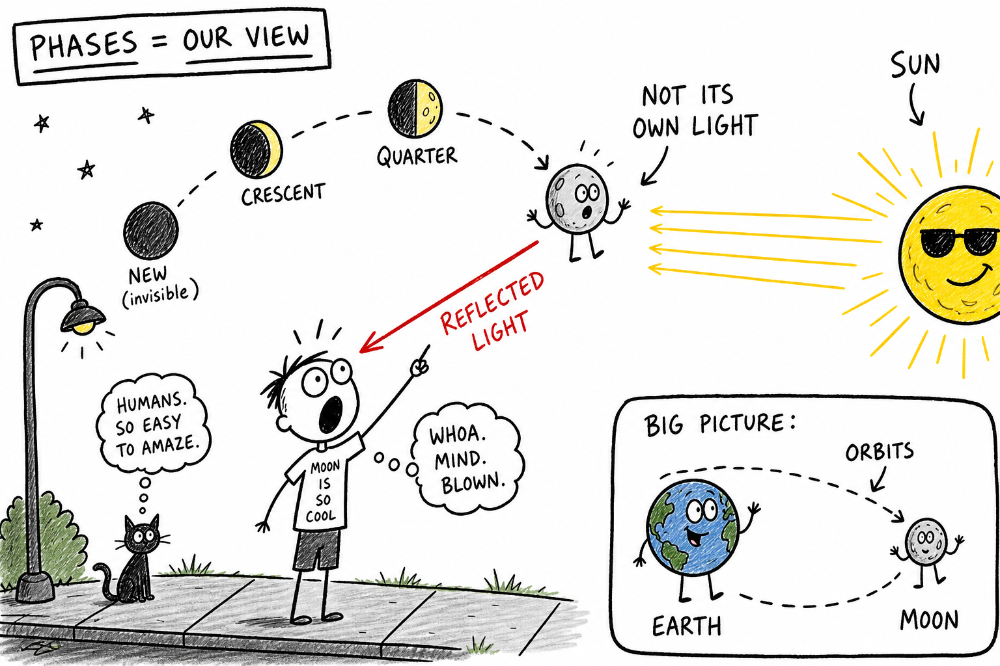

# Moon

You are walking home after a late practice. The sky is dark. Streetlights glow below, but above you something else catches your eye — a bright disk hanging over the rooftrees, sharp enough to cast a shadow on the sidewalk.

Last week that same object was only a thin curve, like someone had taken a bite out of it.

It did not shrink. It did not grow wings. It changed because of where it is in space and how sunlight hits it.

The Moon is familiar, but it is not simple. It is a rocky world with craters, ancient lava plains, dust, ice in shadowed craters, and a history written in impacts. It is also Earth's closest neighbor in space — close enough that twelve humans have walked on it.

**The Moon is Earth's natural satellite, a rocky world that orbits Earth and reflects sunlight.**

It does not make its own light. It shines because sunlight bounces off its surface and travels to your eyes.

## Earth's Companion in Space

A **satellite** is an object that orbits another object in space.

Weather satellites and GPS satellites are **artificial** — built by people. The Moon is **natural**. It travels around Earth again and again, held by gravity. Earth's gravity pulls on the Moon; the Moon's gravity pulls on Earth too. That pull helps create ocean **tides**, shapes calendars, makes eclipses possible, and has kept humans looking up for thousands of years.

The Moon is not a planet. It orbits Earth, not the Sun as its main path. (It does go around the Sun — but only because it is carried along with Earth.) It is not a star either. It is a **moon**: a natural satellite. Mars has two small moons; Jupiter and Saturn have dozens. Earth has one large Moon, and for our planet it matters more than most.

## A Pale Mirror, Not a Lamp

The Moon shines by **reflected sunlight**. Light leaves the Sun, hits the Moon's rocky surface, and bounces toward Earth. That is why you can see it at night — and sometimes in the daytime too, depending on where it is in its orbit.

The Moon is not glowing like a light bulb. Its surface is actually quite dark compared with fresh snow. It looks bright because the sky around it is black and the Sun is extremely bright. Think of it as a dusty rocky mirror in space.

## Orbit, Rotation, and the Same Face

An **orbit** is the path one object follows around another in space. The Moon orbits Earth. One trip around Earth takes about **27.3 days** compared with the background stars.

But the cycle of Moon **phases** — new to full and back — takes about **29.5 days**. Why the difference? Because Earth is also moving around the Sun while the Moon orbits Earth. The Moon must travel a little farther to line up with the Sun in the same way again. That 29.5-day cycle is a **lunar month**.

The Moon both **rotates** (spins on its axis) and **revolves** (travels around Earth). It rotates once in about the same time it takes to orbit once. Because of this **synchronous rotation**, the same side of the Moon always faces Earth. The Moon is still spinning — it spins exactly once per orbit.

The side that usually faces us is the **near side**. The side that faces away is the **far side**. People sometimes call the far side the "dark side," but that is misleading. The far side gets sunlight too. During a new moon, the far side is mostly lit while the near side is mostly dark. No human saw the far side directly until spacecraft photographed it in **1959**.

## Phases: Reading the Moon Like a Clock

The Moon seems to change shape during the month. Those shapes are **phases**. The Moon itself is not changing shape. The Sun always lights half of it. We see different portions of that sunlit half as the Moon moves around Earth.

**Waxing** means the lit part we see is growing. **Waning** means it is shrinking.

The main phases, in order:

- **New moon** — Moon between Earth and Sun; the side facing Earth is mostly dark and hard to see.
- **Waxing crescent** — a thin curved slice growing larger.
- **First quarter** — half the near side lit. Called "quarter" because the Moon is one quarter of the way through the phase cycle, not because only a quarter is lit.
- **Waxing gibbous** — more than half lit, growing toward full.
- **Full moon** — Earth between Sun and Moon; the near side is fully lit. Bright enough to cast shadows. Rises around sunset, sets around sunrise.
- **Waning gibbous** — more than half lit, shrinking.
- **Third quarter** — half lit again; three quarters through the cycle.
- **Waning crescent** — thin slice shrinking toward new moon.

Then the cycle starts again. Crescent moons often hang low near sunrise or sunset. A full moon can turn a football field silver. Learning waxing and waning lets you predict what comes next without checking an app.

## Eclipses: When the Lineup Is Perfect

Phases are **not** caused by Earth's shadow. Earth's shadow causes **lunar eclipses**, not ordinary phases.

If the Moon orbits every month, why not an eclipse every month? Because the Moon's orbit is **tilted** compared with Earth's path around the Sun. Most months the Moon passes slightly above or below the perfect line. Eclipses happen only when Sun, Earth, and Moon line up closely enough.

A **solar eclipse** happens at **new moon** when the Moon passes between Earth and the Sun and blocks part or all of the Sun's disk. In a total solar eclipse, the sky can darken and the Sun's corona may appear — but only along a narrow path on Earth. **Never look directly at the Sun during a solar eclipse without proper certified eye protection.** Ordinary sunglasses are not safe. Binoculars and telescopes aimed at the Sun can cause serious eye injury almost instantly.

A **lunar eclipse** happens at **full moon** when Earth passes between the Sun and the Moon and Earth's shadow falls on the Moon. During a total lunar eclipse the Moon can turn coppery red — some sunlight bends through Earth's atmosphere and reaches it while blue light is scattered away. Lunar eclipses are safe to watch with your eyes.

## The Moon's Surface: Not a Smooth Ball

Through binoculars or a small telescope, the Moon stops looking like a silver coin and starts looking like a battered world.

**Regolith** is the layer of dust and broken rock on the surface, built up over billions of years of impacts. Because the Moon has almost no atmosphere, small space rocks can hit the surface without burning up the way many meteors do in Earth's sky.

A **crater** is a bowl-shaped hollow, usually from an impact. A fast strike blasts out rock and leaves a circular depression. Some craters have raised rims, central peaks, or bright **rays** streaking outward. Craters last a long time on the Moon — there is almost no rain, wind, or plate tectonics to erase them. The surface is a history book of ancient collisions.

The dark patches are **maria** (Latin for "seas"). Early astronomers thought they might be water. They are not. They are broad plains of ancient hardened **lava** that filled low basins long ago. The lighter areas are **highlands** — older, rougher, more heavily cratered rock. On a full moon, bright highlands and dark maria are what people sometimes imagine as a "face" on the Moon.

The Moon has mountains, valleys, cliffs, and plains. It is rugged, dusty, and dry.

## Almost No Air, Wild Temperatures

Earth has a thick atmosphere. The Moon has only an extremely thin **exosphere** — so thin it does not behave like the air you breathe. No wind like Earth's. No clouds. No ordinary weather. No air for sound to travel through the way it does in a gym or on a field. Astronauts needed spacesuits for oxygen, pressure, and temperature protection.

Without air to spread heat around, temperatures swing hard. Sunlit ground can become very hot; shadowed ground can become extremely cold. Deep craters near the **poles** can stay in shadow for ages — and **water ice** can survive there. The Moon is dry compared with Earth, but ice near the poles matters for future exploration: water could mean drinking water, oxygen, or even rocket fuel if humans return to stay.

## Gravity: One-Sixth of Earth

The Moon has gravity, but weaker than Earth's — about **one sixth**. If you weighed 90 pounds on Earth, you would weigh about 15 pounds on the Moon. Your **mass** (how much matter is in you) would not change; **weight** depends on gravity. Apollo astronauts could hop in ways impossible on Earth. Things still fall on the Moon. There is no "zero gravity" on the surface — just less pull.

That weaker gravity still reaches Earth. The Moon's pull on our planet helps create **tides**: the regular rise and fall of sea level. The Sun affects tides too, but the Moon matters more because it is much closer. As Earth rotates, coastlines move through bulges of water — high tide and low tide. Fishermen, sailors, surfers, and beach planners all live with the Moon's schedule.

When Sun, Earth, and Moon line up near new or full moon, tides are especially strong — **spring tides** (the name has nothing to do with the season; water "springs" higher and lower). Near first or third quarter, when Sun and Moon pull at right angles, **neap tides** are milder.

## Why the Moon Matters to Earth

The Moon does not cause seasons — Earth's **tilted axis** does that as we orbit the Sun. But the Moon may help **stabilize** Earth's tilt over long time scales, which could make climate less chaotic. It preserves impact history from the early solar system. It lights the night. It gave humanity one of its oldest clocks — the word **month** comes from the Moon.

Scientists think the Moon formed about **4.5 billion years ago**, possibly when a Mars-sized object struck the young Earth and blasted material into orbit that later clumped together — the **giant impact hypothesis**. Moon rocks brought back by astronauts helped test that idea.

## Humans on the Moon

The Moon is the only world beyond Earth where people have walked.

In **1969**, Apollo 11 landed Neil Armstrong and Buzz Aldrin on the lunar surface while Michael Collins orbited above. Armstrong's first step was a milestone in exploration — boot prints, sample bags, and experiments in one-sixth gravity. Later Apollo missions brought back rocks that revealed the Moon's age, volcanic past, and connection to Earth. Robotic spacecraft have mapped it, hunted for ice, and photographed every crater on the far side.

The Moon is still a target for return missions and possible bases. It is close, harsh, and honest: no atmosphere to hide behind, no weather to smooth over mistakes. Training there is training for harder destinations.

## Observing the Moon Safely

The Moon is one of the best objects in the sky for your own eyes, binoculars, or a small telescope. Unlike the Sun, the Moon is safe to look at directly.

The best surface detail often appears along the **terminator** — the line between lunar day and night — where long shadows make craters and mountains stand out. A full moon is beautiful but can look flatter because shadows are short.

**Never point binoculars or a telescope near the Sun** while observing the Moon in daytime. Accidental alignment can blind you in seconds.

Watch the phases for a month. Sketch what you see. Compare your notes to the waxing and waning pattern. You are doing what hunters, farmers, and astronomers did for centuries — only with better sneakers.

## Common Misconceptions

- **The Moon makes its own light.** No — it reflects sunlight.
- **Earth's shadow causes the phases.** No — phases come from how much of the sunlit half we see. Earth's shadow causes lunar eclipses.
- **The far side is always dark.** No — it gets sunlight; we just do not see it from Earth.
- **There is no gravity on the Moon.** There is gravity — about one sixth of Earth's.
- **The Moon is smooth.** It has craters, mountains, maria, cliffs, and dust.

## How to Think Like a Lunar Scientist

When you study the Moon, ask:

- Where is the Moon compared with Earth and the Sun?
- Which half is lit by the Sun, and how much of that half can we see?
- Is this about phases, eclipses, tides, surface features, or exploration?
- What evidence do craters, rocks, and spacecraft give us?
- What safety rules apply for the Sun versus the Moon?

The Moon is close enough to watch with your own eyes and deep enough to study for a lifetime.

## The Big Idea

The Moon is Earth's rocky natural satellite. It orbits Earth, reflects sunlight, and shows phases because we see different amounts of its sunlit half as it moves. The same side faces us because of synchronous rotation. Its gravity drives tides; its surface preserves craters and ancient lava plains; its ice and weak gravity make it a proving ground for exploration.

If you remember only one sentence, remember this:

**The Moon is Earth's rocky natural satellite — a reflected-light world whose orbit, phases, gravity, and battered surface connect the night sky above you to life on Earth.**

## Study Questions

1. What is the Moon?
2. What is a natural satellite?
3. Why is the Moon not a planet?
4. Why does the Moon shine?
5. What is an orbit, and how long is the Moon's phase cycle?
6. What is the difference between rotation and revolution?
7. What is synchronous rotation, and why do we usually see the same side of the Moon?
8. Why is "dark side of the Moon" a misleading phrase?
9. What causes the Moon's phases?
10. What do waxing and waning mean?
11. Why is a quarter moon called a quarter moon?
12. Why do solar and lunar eclipses not happen every month?
13. What is a solar eclipse, and what safety rule must you follow?
14. What is a lunar eclipse, and why does the Moon sometimes look red?
15. What is regolith, and why does the Moon keep craters for a long time?
16. What are maria and highlands?
17. Why does the Moon have almost no weather?
18. How strong is gravity on the Moon compared with Earth?
19. How does the Moon help create tides? What are spring tides and neap tides?
20. What is the giant impact hypothesis?
21. Who were the first two astronauts to walk on the Moon, and in what year?
22. What is the terminator, and when is it a good time to see lunar surface detail?
