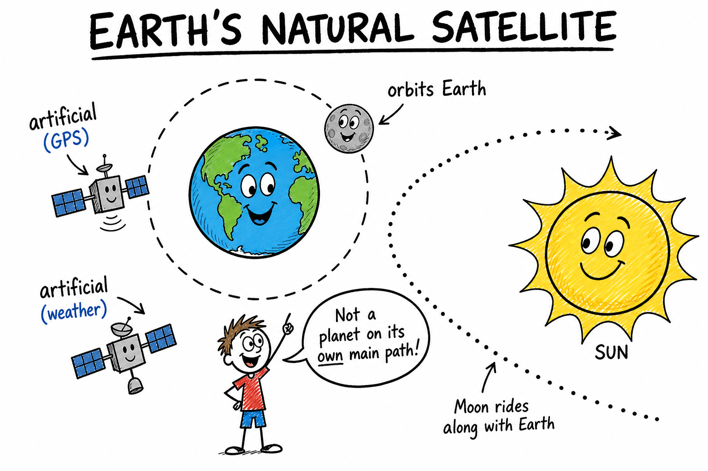
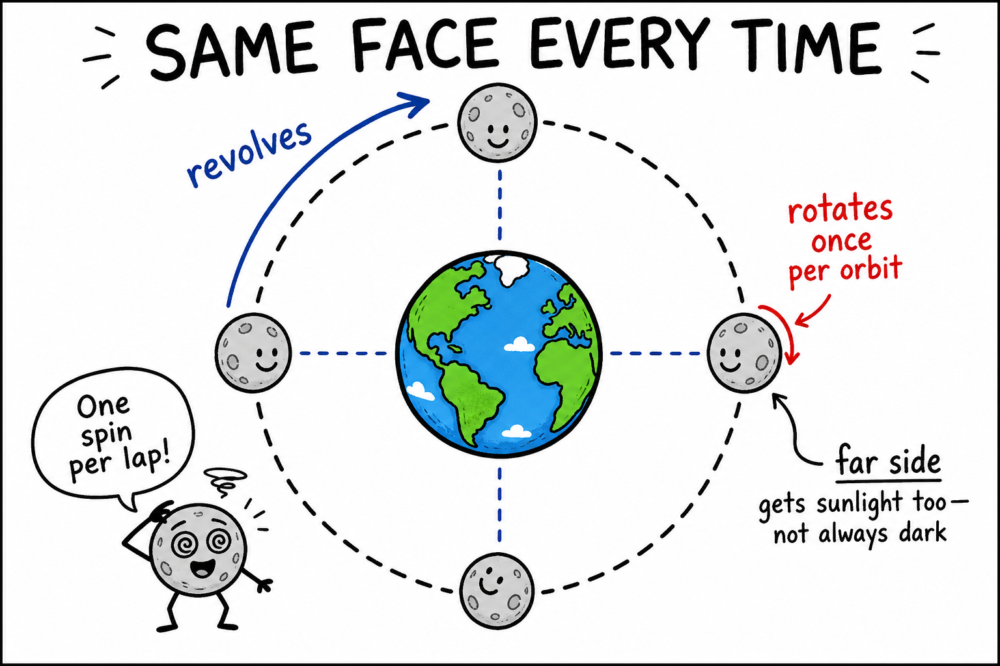
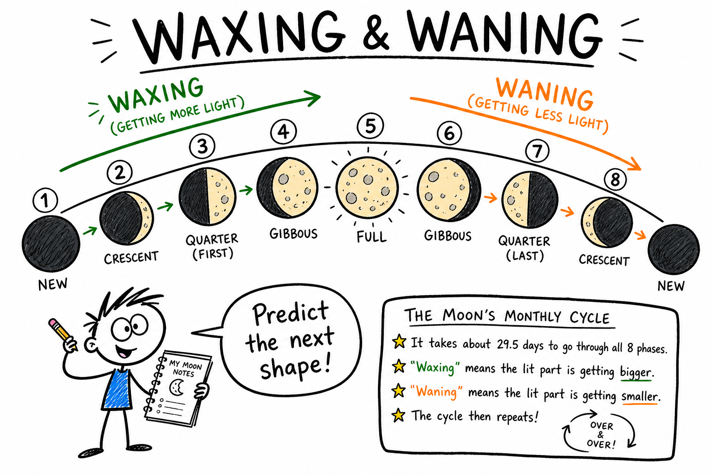
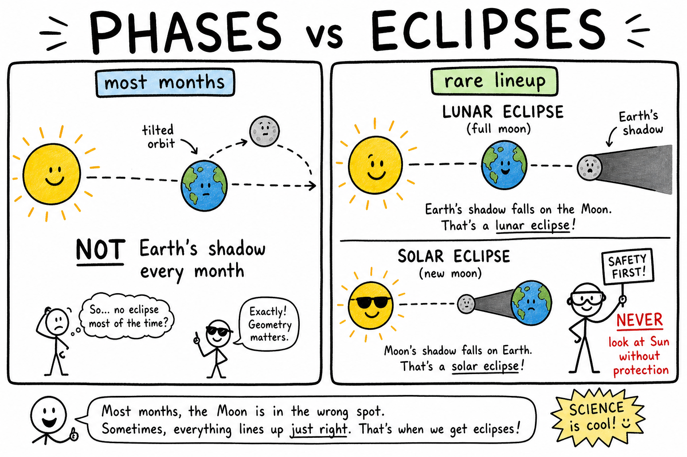
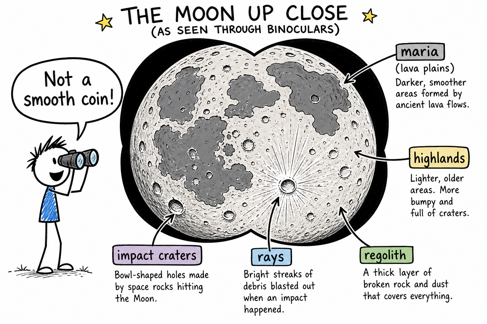
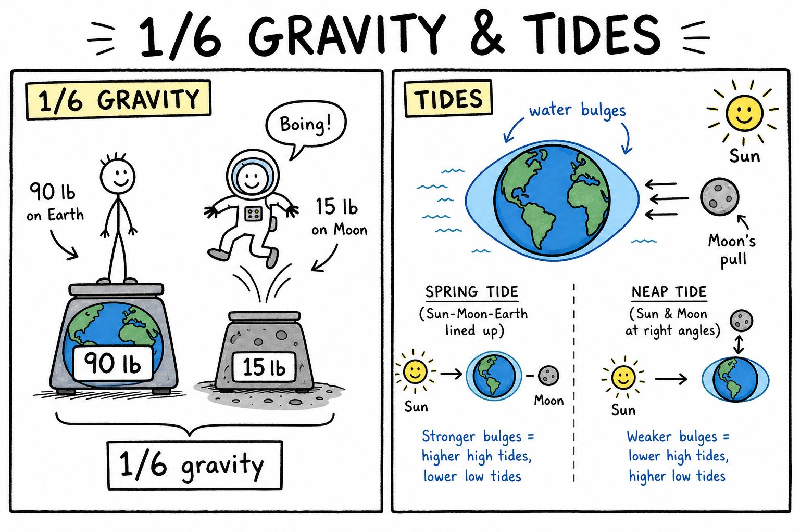
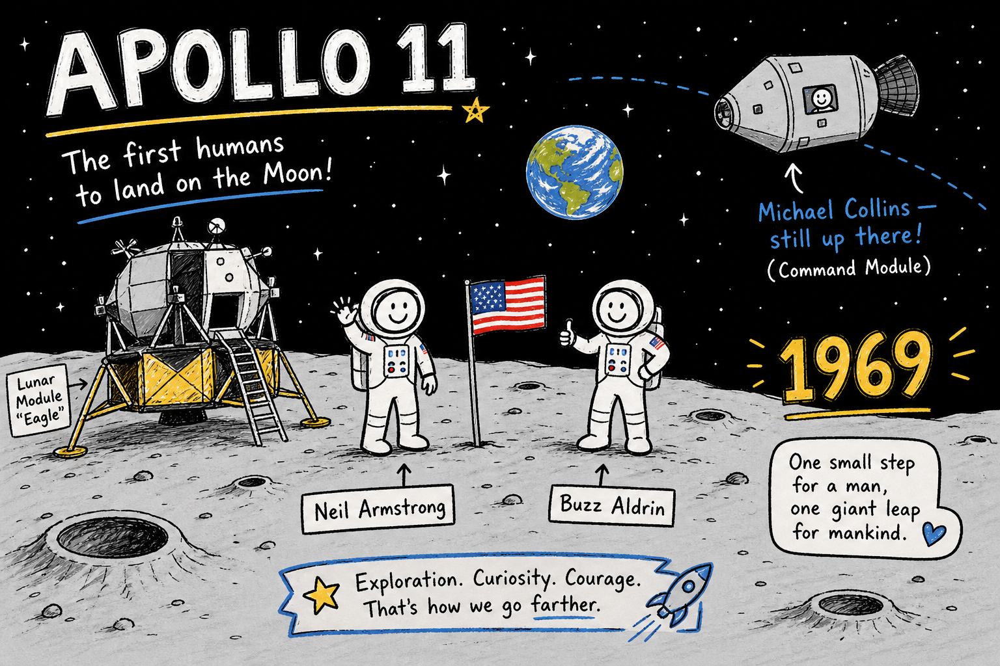

# Image briefs — 084 Moon

Use when creating `084_Moon_02.png` through `084_Moon_08.png`. Each file is referenced in `084_Moon.md` at the placement noted below.

`084_Moon_01.png` already exists at the chapter top (phases + reflected light). Brief below for consistency if it is ever redrawn.

**Style** (from `_create_more_images.md`): crude, funny, hand-drawn explainer cartoon; stick-figure characters; rough black outlines; mostly white background; selective flat accent colors. Labels, arrows, exaggerated faces, simple metaphors. Minimalist, humorous, concept-first, intentionally rough. Color sparingly: **yellow** = Sun/light, **blue** = Earth/water/tides, **gray** = Moon rock/dust, **red** = danger (eclipse eye safety), **orange** = lava/maria warmth. Vary panel width/height — not every image the same aspect ratio. Ages 11–13; night walks, sports fields, camping, tides, and Apollo hooks are fair game.

---

## 084_Moon_01.png — Phases and reflected light (existing)

**Placement:** Top of chapter (after title).

**Scene:** Title "PHASES = OUR VIEW"; phase row (new, crescent, quarter); Sun with rays; Moon labeled "NOT ITS OWN LIGHT" with red "REFLECTED LIGHT" arrow to stick-figure observer; "BIG PICTURE" inset with Earth–Moon orbit.

**Caption in chapter:** ``

---

## 084_Moon_02.png — Natural satellite: Moon orbits Earth

**Placement:** End of "Earth's Companion in Space" (after the Mars/Jupiter moons paragraph, before the fact table).

**Scene:** Wide horizontal panel. Center: blue Earth with dashed orbit loop and gray Moon labeled **orbits Earth**. Small GPS/weather satellites with label **artificial**. Dotted path showing Earth also going around the Sun — label **Moon rides along with Earth**.

**Humor:** Stick-figure pointing: "Not a planet on its own main path!"

**Aspect:** Wide (~2:1).

**Caption idea:** The Moon is Earth's natural satellite.

---

## 084_Moon_03.png — Synchronous rotation: same face

**Placement:** End of "Orbit, Rotation, and the Same Face" (after far-side paragraph, before rotation/revolution chapter link).

**Scene:** Top-down or side view: Earth in center, Moon on circular orbit. Curved arrows: **revolves** around Earth; smaller arrow on Moon: **rotates once per orbit**. Same crater face (simple smiley crater) always points at Earth. Far side labeled **far side** (not "always dark").

**Humor:** Moon stick-figure dizzy: "One spin per lap — same face every time."

**Aspect:** Square (~1:1).

**Caption idea:** Synchronous rotation — we usually see the same side.

---

## 084_Moon_04.png — Waxing and waning phase cycle

**Placement:** End of "Phases: Reading the Moon Like a Clock" (after waxing/waning memory trick, before "Eclipses").

**Scene:** Circular or arc arrangement of eight phase icons (new → full → new). Green arrows labeled **waxing** (growing lit part); orange arrows **waning** (shrinking). Stick-figure with notebook: "Predict the next shape!"

**Labels:** New, crescent, first quarter, gibbous, full, etc. (short labels OK).

**Aspect:** Wide banner (~3:1).

**Caption idea:** Waxing and waning — the monthly phase cycle.

---

## 084_Moon_05.png — Eclipses vs phases: tilted orbit

**Placement:** End of "Eclipses: When the Lineup Is Perfect" (after lunar eclipse paragraph, before "The Moon's Surface").

**Scene:** Split panel.

| Left — Phases (most months) | Right — Eclipse (rare lineup) |
|-----------------------------|-------------------------------|
| Sun, Earth, Moon slightly **above** perfect line; label **tilted orbit** | Sun–Earth–Moon in straight line; Earth's shadow on Moon OR Moon blocking Sun |
| "NOT Earth's shadow every month" | **Solar** (new moon) / **Lunar** (full moon) labels |

**Colors:** Red warning on solar side: **never look at Sun without protection**.

**Aspect:** Wide (~2:1).

**Caption idea:** Phases vs eclipses — tilted orbit matters.

---

## 084_Moon_06.png — Craters, maria, and highlands

**Placement:** End of "The Moon's Surface: Not a Smooth Ball" (after "face on the Moon" paragraph, before "Almost No Air").

**Scene:** Large cartoon Moon disk (binocular view). Dark patches labeled **maria** (lava plains); lighter bumpy areas **highlands**; bowl craters with **rays**; dusty surface label **regolith**. Stick-figure with binoculars: "Not a smooth coin!"

**Aspect:** Tall or square (~1:1.2).

**Caption idea:** Craters, maria, and highlands on the Moon.

---

## 084_Moon_07.png — One-sixth gravity and tides

**Placement:** End of "Gravity: One-Sixth of Earth" (after spring/neap tides paragraph, before "Why the Moon Matters").

**Scene:** Two panels stacked or side by side.

| Panel 1 — Gravity | Panel 2 — Tides |
|-------------------|-----------------|
| Earth scale "90 lb" vs Moon "15 lb" stick-figure hop | Earth with blue **bulges** of water; Moon and Sun pull arrows |
| Label **1/6 gravity** | **Spring tide** (lined up) vs **neap tide** (right angle) mini sketches |

**Humor:** Astronaut stick-figure mid-hop: "Boing!"

**Aspect:** Wide (~2:1).

**Caption idea:** Weaker gravity on the Moon — stronger tides on Earth.

---

## 084_Moon_08.png — Apollo 11: first steps on another world

**Placement:** End of "Humans on the Moon" (after "fly home" paragraph, before "Observing the Moon Safely").

**Scene:** Gray lunar surface, Earth small in black sky. Two astronaut stick-figures near **lunar module**; flag optional. Labels: **Neil Armstrong**, **Buzz Aldrin** on surface; **Michael Collins** in orbit ("still up there!"). Year **1969**.

**Tone:** Wonder and achievement — not militaristic.

**Aspect:** Wide (~2:1).

**Caption idea:** Apollo 11 — twelve humans have walked on the Moon.

---

## Suggested markdown inserts (in `084_Moon.md`)

```markdown







```

---

## Checklist for illustrators

- [x] _01 — phases + reflected light (exists)
- [x] _02 — natural satellite orbits Earth
- [x] _03 — synchronous rotation, same face
- [x] _04 — waxing/waning phase cycle
- [x] _05 — eclipses vs phases, tilted orbit
- [x] _06 — craters, maria, highlands
- [x] _07 — 1/6 gravity and tides
- [x] _08 — Apollo 11 crew roles
