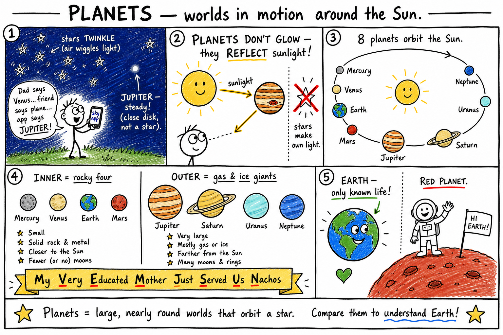
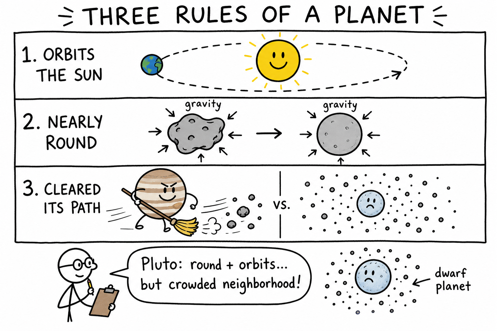
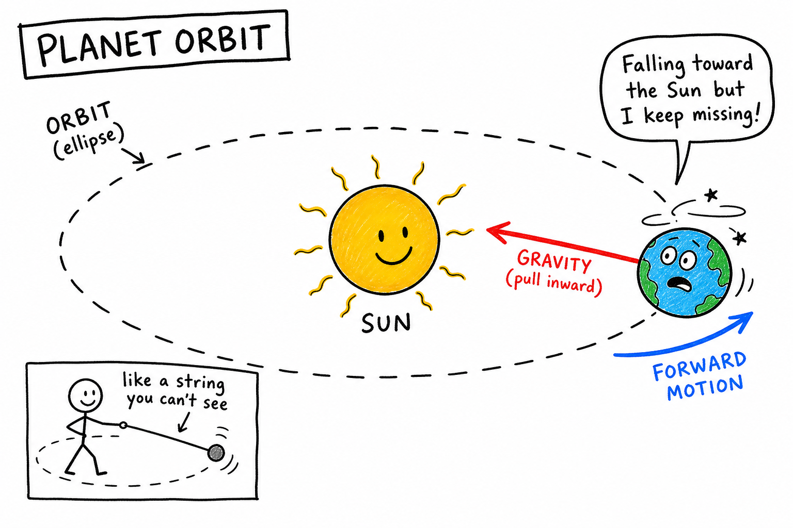
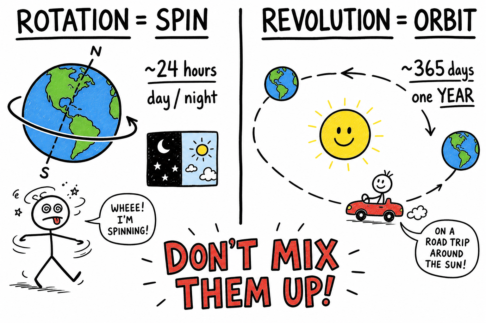
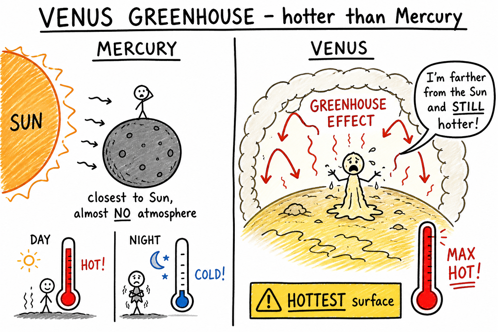
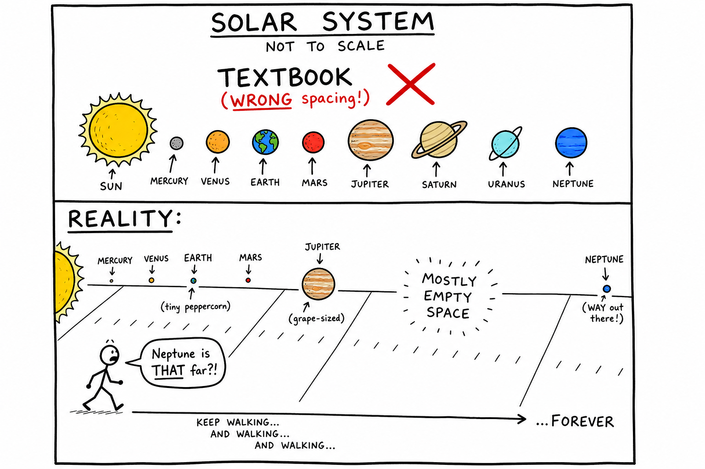
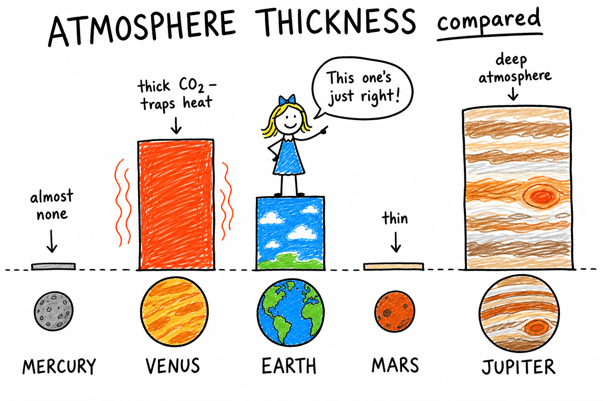
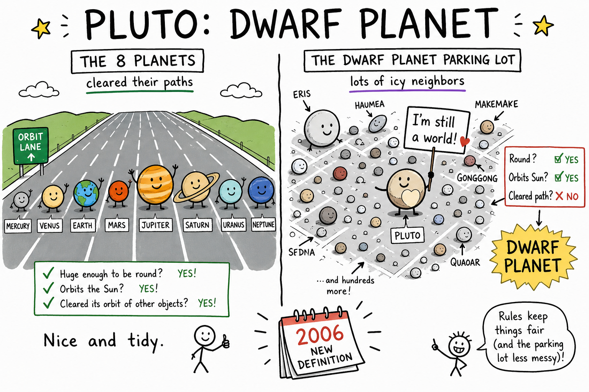

# Image briefs — 085 Planets

Use when creating `085_Planets_02.png` through `085_Planets_08.png`. Each file is referenced in `085_Planets.md` at the placement noted below.

`085_Planets_01.png` already exists at the chapter top (overview panels). Brief below for consistency if it is ever redrawn.

**Style** (from `_create_more_images.md`): crude, funny, hand-drawn explainer cartoon; stick-figure characters; rough black outlines; mostly white background; selective flat accent colors. Labels, arrows, exaggerated faces, simple metaphors. Minimalist, humorous, concept-first, intentionally rough. Color sparingly: **yellow/orange** = Sun/heat, **blue** = Earth/water/ice, **red** = Mars/danger/hot, **green** = life/Earth, **gray** = rock/Metal, **purple** = distant/ice giants. Vary panel width/height — not every image the same aspect ratio. Ages 11–13; sky apps, telescopes, astronauts OK.

---

## 085_Planets_01.png — Chapter opener (existing)

**Placement:** Top of chapter (after title).

**Scene:** Multi-panel overview: kid with sky app; planets reflect sunlight; eight planets in order; inner rocky vs outer giants; Earth vs Mars.

**Caption in chapter:** ``

---

## 085_Planets_02.png — Three rules of a planet

**Placement:** End of “What Makes Something a Planet?” (before “Planets Orbit the Sun”).

**Scene:** Three checklist panels with a happy round planet (Earth-like) getting gold stars, and a smaller icy Pluto-like world with a “shares the road” sign.

| Rule | Visual |
|------|--------|
| Orbits the Sun | Curved arrow around yellow Sun |
| Nearly round | Lumpy rock → ball (gravity squeezing) |
| Cleared its path | Planet sweeping asteroids aside vs Pluto surrounded by many small icy dots |

**Humor:** Stick-figure astronomer with clipboard: “Sorry, Pluto — you’re round and orbiting, but your neighborhood is crowded.”

**Aspect:** Tall vertical (~3:4) or square.

**Caption idea:** Three rules — orbit, round, cleared path.

---

## 085_Planets_03.png — Orbit: gravity + forward motion

**Placement:** End of “Planets Orbit the Sun” (before “Rotation and Revolution”).

**Scene:** Top-down view: yellow Sun in center. Earth (or generic planet) on curved path. Two arrows on the planet: **gravity** (inward toward Sun, red or black) and **forward motion** (tangent, blue). Result: curved **orbit** (ellipse).

**Metaphor inset:** Stick-figure swings ball on string — “inward pull + forward speed = curve.”

**Label:** Orbit = ellipse (oval OK, not perfect circle).

**Humor:** Planet stick-figure dizzy: “I’m falling toward the Sun… but I keep missing!”

**Aspect:** Wide (~2:1).

**Caption idea:** Gravity pulls in; forward motion curves the path into an orbit.

---

## 085_Planets_04.png — Rotation vs revolution

**Placement:** End of “Rotation and Revolution” (before “Planets Shine by Reflected Light”).

**Scene:** Split panel.

| Left — Rotation | Right — Revolution |
|-----------------|-------------------|
| Earth spinning on tilted axis | Earth on orbit around Sun |
| Arrow on axis: **spin** | Arrow on path: **orbit** |
| Label: ~24 hours → day/night | Label: ~365 days → year |

**Humor:** Stick-figure dizzy from spinning vs stick-figure on a year-long road trip around Sun.

**Warning text:** “Don’t mix them up!”

**Aspect:** Wide (~2:1).

**Caption idea:** Rotation is spin; revolution is orbit.

---

## 085_Planets_05.png — Venus greenhouse: hotter than Mercury

**Placement:** End of “Venus” subsection (before “Earth”).

**Scene:** Two thermometers side by side.

| Mercury | Venus |
|---------|-------|
| Close to Sun, almost no atmosphere — scorching days, freezing nights | Thick CO₂ clouds — sunlight in, heat trapped |
| Label: closest to Sun | Label: **hottest** surface (greenhouse) |

**Visual:** Venus under a glass-dome or blanket metaphor labeled **greenhouse effect**; Mercury with tiny “no blanket” atmosphere.

**Colors:** Red/orange heat arrows trapped on Venus; yellow warning on Venus.

**Humor:** Stick-figure on Venus melting: “I’m farther from the Sun than Mercury… and I’m still hotter!”

**Aspect:** Square or slightly wide.

**Caption idea:** Atmosphere can trap heat — Venus is hotter than Mercury.

---

## 085_Planets_06.png — Solar system NOT to scale

**Placement:** End of “Size and Distance: Bigger Than You Think” (before “Atmospheres”).

**Scene:** Two mini diagrams stacked.

| Top — Textbook lie | Bottom — Reality |
|--------------------|------------------|
| Planets crowded, similar sizes | Tiny dots on a huge empty hallway or football field |
| Red X or “NOT real spacing” | Peppercorn Earth, grape Jupiter, Neptune way down the street |

**Humor:** Stick-figure walks forever: “Neptune is *that* far?”

**Label:** Mostly **empty space**.

**Aspect:** Tall vertical (~3:4).

**Caption idea:** Diagrams teach order — real space is huge and not to scale.

---

## 085_Planets_07.png — Atmospheres compared

**Placement:** End of “Atmospheres: The Invisible Difference” (before “Moons and Rings”).

**Scene:** Five planet icons in a row with “atmosphere bars” above them (like sound meters).

| Planet | Bar | Note |
|--------|-----|------|
| Mercury | Tiny/none | Gray |
| Venus | Max, thick | Red/orange “trap heat” |
| Earth | Medium, just right | Blue/green |
| Mars | Thin | Pale red |
| Jupiter | Huge deep band | Striped orange |

**Humor:** Goldilocks stick-figure at Earth: “This one’s just right.”

**Aspect:** Wide (~2:1).

**Caption idea:** Atmosphere thickness changes everything.

---

## 085_Planets_08.png — Pluto: dwarf planet

**Placement:** End of “Why Pluto Is Not One of the Eight Planets” (before “Planets Beyond Our Solar System”).

**Scene:** Pluto (small, icy, heart shape OK) in a busy parking lot of other icy worlds (Eris, Haumea, etc. as dots). Eight planets on a separate “cleared highway” lane.

**Labels:** Round ✓; Orbits Sun ✓; Cleared path ✗ → **dwarf planet**.

**Humor:** Pluto holding sign: “I’m still here! I’m still a world!”

**Date:** Small “2006” for new definition.

**Aspect:** Wide (~2:1).

**Caption idea:** Pluto is a dwarf planet — round, but shares its zone with many icy neighbors.

---

## Quick reference — filenames and captions

```markdown








```
