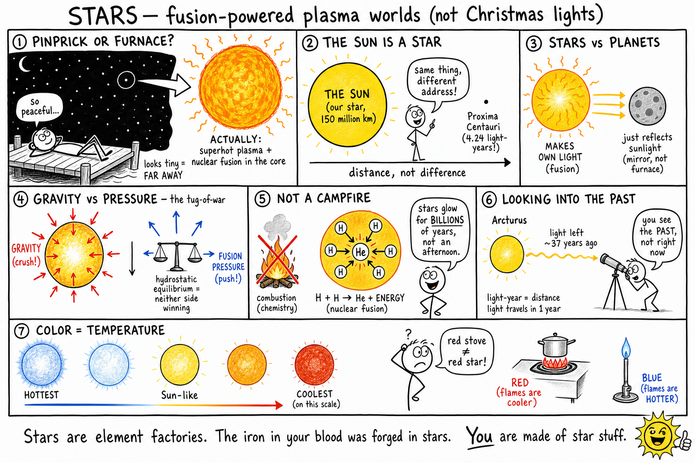

# Stars

You are lying on a dock after everyone else has gone inside. No streetlights. No phone screen. Just black sky and thousands of sharp points of light.

One star above the trees does not blink. Your cousin says it is a planet. You squint. It is steady, yes — but so are several real stars. The app on your phone finally settles the argument: **Arcturus**, an orange giant hundreds of times more luminous than the Sun, its light left that star about 37 years ago and only now reached your eyes.

That is the weird part about stars. They look like quiet pinpricks. They are not quiet. Each one is a roaring sphere of superheated gas — a fusion furnace held together by gravity — and when you look up, you are staring into the past.

**A star is a huge, glowing sphere of hot gas and plasma that produces its own light and heat, mainly through nuclear fusion in its core.**

Stars light the night. They build the elements that make planets and people. They gather in galaxies. They live, change, and die on scales that make human history look like a blink. And one star is close enough that you feel its heat on your skin every day.

That star is the Sun.

## The Sun Is a Star

The Sun is not merely *like* a star. It **is** a star.

It looks larger and brighter than every other point in the sky for one simple reason: distance. The Sun is about 150 million kilometers away. The next-nearest star, Proxima Centauri, is about 4.24 **light-years** away — so far that even a giant star looks like a dot.

If you could ride a spaceship billions of kilometers from the Sun, our star would shrink to another humble spark among thousands.

The Sun is special to **us** because it is **our** star. Its light and heat make life on Earth possible. In the wider universe, though, the Sun is a medium-sized, middle-aged star in the Milky Way — one of hundreds of billions in our galaxy alone.

## Stars Make Their Own Light

Planets and moons are mirrors. They shine by **reflected** sunlight. They do not run their own fusion engines.

Stars are different. They manufacture light and heat from within.

Deep in a star, gravity squeezes matter until temperature and pressure become extreme. In stars like the Sun, **hydrogen** nuclei join to form **helium**. That process is **nuclear fusion**, and it releases enormous energy. The energy works its way outward and escapes as light, heat, and other radiation.

When you see starlight, you are seeing energy born in a stellar core — possibly long before you were born.

## Plasma: The Fourth State of Matter

You know solids, liquids, and gases. Stars are mostly something else: **plasma**.

**Plasma** is gas so hot that many electrons break free from their atoms. Charged particles swarm and move freely. Plasma responds strongly to electric and magnetic fields — which is why stars have spots, loops, flares, and storms.

The Sun's surface may look smooth from Earth. Up close it boils. Other stars can be even wilder. Betelgeuse, a red supergiant in Orion, has thrown off huge clouds of material that telescopes can actually photograph. Stars are not calm Christmas lights. They are active, magnetic, churning worlds of plasma.

## Gravity vs. Pressure: The Stellar Tug-of-War

**Gravity** pulls everything with mass together. In a star, gravity tries to crush the star smaller and smaller.

So why does a star not collapse into a point?

Because fusion in the core releases energy. That energy creates **outward pressure** from hot gas and radiation. For most of a star's life, inward gravity and outward pressure are nearly balanced. Scientists call this balance **hydrostatic equilibrium** — a long phrase for a simple idea: **a stable star is a tug-of-war that neither side is winning.**

When fusion strengthens, the star can expand and cool slightly. When fusion weakens, gravity squeezes the core, heats it up, and fusion can ramp up again. Stars are not frozen statues. They are feedback systems — enormous, slow, and powerful.

## Nuclear Fusion Is Not a Campfire

People say stars are "burning." They glow. They are hot. But a star is **not** burning the way wood burns in a campfire.

A campfire is **combustion** — a chemical reaction that needs fuel and oxygen. There is no wood in space, and no oxygen tank feeding the Sun.

**Nuclear fusion** joins small atomic nuclei into larger ones and converts a tiny amount of mass into energy. In the Sun, hydrogen becomes helium. The energy released is staggering. Fusion is why a star can shine for billions of years instead of fizzling out in an afternoon like a pile of logs.

Remember the difference: **campfire = chemistry. Star = nuclear physics.**

## Why Stars Do Not Blow Themselves Apart

If fusion releases so much energy, why doesn't the star explode?

Gravity. It never takes a break. It holds the star together while pressure pushes out. In a stable star, the two forces stay matched closely enough that the star can shine steadily for ages.

Massive stars push this balance harder. Their cores run hotter. Fusion races. They blaze brilliantly — and burn through their fuel fast. Small stars are dimmer but patient. Some red dwarfs may shine for **trillions** of years, far longer than the current age of the universe.

One of astronomy's best surprises: **the biggest stars often live the shortest lives.**

## Stars Are Far — and That Means the Past

Stars look tiny because they are far away. Many are vastly larger than Earth. Many dwarf the Sun. Distance shrinks them to dots.

The nearest star besides the Sun is **Proxima Centauri**, about **4.24 light-years** away. A **light-year** is the distance light travels in one year — roughly 9.5 trillion kilometers. Light moves at about 300,000 kilometers per second, yet it still takes more than four years to reach us from Proxima.

When you look at a star, you are not seeing it **now**. You are seeing light that left that star years, decades, centuries, or longer ago. Arcturus? About 37 years in the past. Some stars in the Big Dipper? Roughly 80 to 120 years. Distant galaxies? Millions or billions of years.

Astronomy is part physics, part history.

## Brightness: Nearby vs. Powerful

Some stars look bright because they are close. Some look bright because they are monsters.

Astronomers separate two ideas:

- **Apparent brightness** — how bright a star looks from Earth.
- **Luminosity** — how much energy a star actually pumps out every second.

A small flashlight in your face can look brighter than a stadium light a mile away. A nearby dim star can outshine a distant supergiant in the sky — even though the supergiant is the true powerhouse.

Good questions to ask about any star: *How bright does it look from here?* and *How much energy is it really making?*

## Color Tells Temperature

Stars are not all white. Some look blue-white, some golden, some orange, some reddish.

**Color is a thermometer.** Blue and blue-white stars are usually the hottest. White stars are very hot. Yellow stars like the Sun are cooler than blue ones. Orange stars are cooler still. Red stars are the coolest on the main visible scale.

This can feel backward. People often link red with heat (stove coils) and blue with cold (ice). Watch a gas flame closely: the blue part is often hotter than the orange tip. Stars follow similar physics.

## Size: From Red Dwarfs to Supergiants

Stars range from small, cool **red dwarfs** to yellow sun-like stars to enormous **giants** and **supergiants**.

A red supergiant like Betelgeuse can be so huge that, if you dropped it where the Sun sits, it might swallow Mars — or Jupiter — depending on the star and how swollen it is at the moment. But **size is not the same as mass.** A swollen giant can be less dense in its outer layers than the air in a hot-air balloon, relatively speaking. The core is still extreme.

The Sun is only one example in a universe of sizes.

## Mass: The Property That Runs the Show

If you learn one fact about stars, learn this: **mass is the master key.**

**Mass** is the amount of matter in an object. A star's mass sets its temperature, brightness, lifetime, and death.

- **High mass** → hotter core, faster fusion, blinding light, short life.
- **Low mass** → cooler, dimmer, slow fuel use, incredible longevity.

Massive stars are the rock stars of the sky: brilliant, loud, gone young. Small red dwarfs are the marathon runners: faint, common, still going long after the universe's current age.

## Born in a Nebula

Stars are born in giant clouds of gas and dust called **nebulae** (one cloud is a **nebula**). These clouds are mostly hydrogen, with helium and traces of heavier elements and dust.

Gravity pulls a pocket of the cloud together. The gas grows denser and hotter. A young forming star is a **protostar** — not yet a true star, because steady fusion has not started in the core.

When the core becomes hot and dense enough, hydrogen begins fusing into helium. Then a star is born. The leftover disk of material can become planets, moons, asteroids, and comets. Your solar system started in a nebula about 4.6 billion years ago.

## Main Sequence: The Long Stable Chapter

Most stars spend most of their lives as **main sequence stars** — fusing hydrogen into helium in the core while gravity and pressure stay balanced. The Sun is here now. So are the small red dwarfs and the blazing blue giants.

They are not identical. Mass makes them different:

| Type | Temperature | Brightness | Lifetime |
|------|-------------|------------|----------|
| Low-mass red dwarf | Cool | Dim | Trillions of years (maybe) |
| Sun-like star | Moderate | Moderate | Billions of years |
| High-mass blue star | Hot | Blazing | Millions of years |

The main sequence is not one kind of star. It is a **stage of life** — the steady middle chapter.

## Red Dwarfs: Common and Patient

**Red dwarfs** are small, cool, and dim. They are the most common stars in the Milky Way — so common that most stars in the galaxy are red dwarfs, even though you rarely notice them without a telescope.

They sip their hydrogen slowly. Some may shine for trillions of years. The universe is only about 13.8 billion years old, so no red dwarf has had time to die of old age yet. They are the tortoises of the stellar world.

## Giants and Supergiants: Swollen and Bright

When a star runs low on hydrogen in the core, its structure changes. A sun-like star eventually becomes a **red giant** — outer layers expand and cool, the star grows huge and reddish.

More massive stars can become **supergiants** — enormous and wildly luminous. They can lose mass in powerful **stellar winds**. Some end in the most violent explosions in nature.

## White Dwarfs: Dense Leftovers

A star like the Sun will not go supernova. After the red giant phase, it sheds outer layers into space, forming a glowing cloud called a **planetary nebula** (nothing to do with planets — old name, cool object). The hot core left behind is a **white dwarf**.

A white dwarf can pack about the mass of the Sun into a sphere roughly the size of Earth. It is incredibly dense. It no longer fuses hydrogen in the core. It slowly cools over an immense time. One teaspoon of white dwarf material would weigh tons — not something to carry in your backpack.

## Supernovae: Stellar Fireworks That Seed the Universe

A **supernova** is a gigantic stellar explosion. Some massive stars die this way when their cores collapse and the outer layers blast into space.

For a short time, a supernova can outshine an entire galaxy of normal stars. The explosion spreads **heavy elements** — iron, calcium, oxygen, and more — into space, where they can join new stars, planets, and eventually living things.

Here is the personal version: **the iron in your blood and the calcium in your bones were forged in stars** — and in some cases scattered by explosions violent enough to erase a star from the sky.

You are not metaphorically connected to the cosmos. You are physically made of it.

## Neutron Stars and Black Holes: Extreme Endings

After a massive star explodes, the collapsed core may become a **neutron star** or a **black hole**.

A **neutron star** packs more than the Sun's mass into a sphere about the size of a city. Some spin hundreds of times per second and sweep beams of radiation through space like a cosmic lighthouse. These are **pulsars** — among the most precise clocks in the universe.

A **black hole** has gravity so strong that not even light can escape from inside its **event horizon**. Black holes do not "suck up" everything in the universe like a vacuum cleaner in a movie. They pull with gravity like any mass — just extreme. If the Sun somehow became a black hole with the same mass, Earth would keep orbiting at the same distance. It would be dark and frozen, but Earth would not get magically swallowed.

## Stars Are Element Factories

The early universe was mostly hydrogen and helium. Stars changed that.

Fusion builds heavier elements from lighter ones. The Sun makes helium from hydrogen. Massive stars can build carbon, oxygen, neon, magnesium, silicon, iron, and more during their lives. Supernovae and other violent events create and spread even heavier elements.

Every atom in your body has a history. Many spent billions of years inside stars or in the blast waves of stellar deaths before they became part of Earth — and part of you.

## Constellations: Patterns, Not Families

A **constellation** is a pattern of stars as seen from Earth. Cultures around the world have named pictures in the sky for thousands of years — hunters, bears, ships, heroes.

Constellations are useful for finding directions and learning the sky. But the stars in a constellation are usually **not** close together in space. They only line up from Earth's viewpoint.

Imagine birds at different distances that happen to line up from where you stand. They look like a flock. In 3D, they are scattered. Constellations are sky art, not stellar families.

## Galaxies: Cities of Stars

Stars do not scatter evenly through space. They gather in **galaxies** — enormous systems of stars, gas, dust, planets, dark matter, and more, all held by gravity.

Our galaxy is the **Milky Way**, home to hundreds of billions of stars. The Sun is one of them, about two-thirds of the way out from the center in a spiral arm.

On a dark night, the pale band across the sky is your edge-on view into the crowded disk of the Milky Way. Beyond it lie other galaxies — each with millions, billions, or trillions of stars. The universe is larger than any camping trip can suggest.

## Binary and Variable Stars

Many stars are not alone. A **binary star** system has two stars orbiting each other. Some systems have three or more. From Earth, a close pair may look like one dot unless you use a telescope or careful measurements.

**Variable stars** change brightness over time. Some pulse because they swell and shrink. Some dim when a companion passes in front. Some flare or erupt. Certain variable stars are so predictable that astronomers use them as **cosmic rulers** to measure distances across the galaxy.

The Sun is unusual in being a single star with no close stellar companion.

## How Astronomers Study Stars Without Visiting Them

You cannot fly to Proxima Centauri for a field trip. Astronomers study **starlight** instead.

Light carries information. Spread starlight into a **spectrum** — a band of colors and wavelengths — and dark or bright lines reveal which elements are present. Color hints at temperature. Brightness and distance hint at luminosity. Slight shifts in color can reveal motion toward or away from Earth. Tiny, repeating dips in brightness can reveal planets orbiting the star.

A star may be trillions of kilometers away, but its light is a packed report card.

## The H-R Diagram: A Map of Stellar Lives

Astronomers plot stars on the **Hertzsprung-Russell diagram** (H-R diagram), comparing temperature and luminosity. Most stars fall along a band called the **main sequence**. Red giants, supergiants, and white dwarfs occupy other regions.

One dot on the diagram can tell a trained astronomer a star's type, stage of life, and approximate future. It is like a family tree and medical chart combined — for suns.

## Exoplanets: Other Worlds Around Other Suns

Planets orbiting stars beyond the Sun are **exoplanets**. Thousands are known. Many more are waiting to be found.

Scientists often discover them by watching the star:

- **Transit method** — a planet passes in front of the star and the star's light dips slightly.
- **Radial velocity method** — a planet's gravity tugs the star, causing a tiny wobble.

To find planets, astronomers study stars. Every pinprick in the sky might be a sun with worlds — hot lava planets, gas giants, or maybe, somewhere, a rocky world with water and weather. That is one reason stars matter beyond homework: they are addresses in the universe.

## Common Misconceptions

- **Stars are tiny.** They only look tiny because they are far away. Many are larger than the Sun.
- **The Sun is not a real star.** It is a star — our close one.
- **Stars burn like campfires.** They shine mainly by nuclear fusion, not ordinary combustion.
- **Red stars are hottest.** Usually blue stars are hotter; red stars are cooler on the stellar scale.
- **Constellations are star families.** They are patterns from Earth's viewpoint; member stars can be at very different distances.
- **Black holes vacuum the whole universe.** They obey gravity like any mass; only nearby matter is strongly affected.

## How to Think Like a Stellar Astronomer

When you study a star, ask:

- How bright does it look from Earth, and how luminous is it really?
- What color is it, and what temperature does that suggest?
- How massive is it, and what does mass imply for its lifetime?
- What stage is it in — protostar, main sequence, giant, white dwarf, neutron star?
- Is it alone or in a binary system?
- Does its brightness change?
- What does its spectrum reveal?
- Could it have planets?

Good astronomy starts when you look up. Great astronomy starts when you ask what the light is telling you.

## The Big Idea

Stars are huge glowing spheres of hot plasma that make their own light and heat through nuclear fusion. They are born in nebulae, spend most of their lives on the main sequence, and end in different ways depending on mass — from slow-cooling white dwarfs to supernova explosions that seed the universe with heavy elements. Their light carries clues about temperature, distance, composition, and life stage. The atoms in your body were made in stars.

If you remember only one sentence, remember this:

**Stars are fusion-powered worlds of plasma whose light tells us their temperature, distance, life story, and role in building everything — including you.**

## Study Questions

1. What is a star?
2. Why does the Sun look larger and brighter than other stars?
3. How are stars different from planets and moons?
4. What is plasma, and why does it matter for stellar activity?
5. What is nuclear fusion?
6. Why is fusion different from ordinary burning?
7. What two forces or effects balance each other in a stable star?
8. What is a light-year?
9. Why are we looking into the past when we look at distant stars?
10. What is the difference between apparent brightness and luminosity?
11. What does a star's color tell scientists?
12. Which stars are usually hottest: red stars or blue stars?
13. Why is mass so important in a star's life?
14. Why do very massive stars often have shorter lives than smaller stars?
15. What is a nebula, and how do stars form there?
16. What is a protostar?
17. What is a main sequence star?
18. What are red dwarfs, and why are they hard to see but common?
19. What happens when a star like the Sun becomes a red giant?
20. What is a white dwarf?
21. What is a supernova, and why is it important for elements?
22. What is a neutron star, and what is a pulsar?
23. What is a black hole, and does it suck in the whole universe?
24. How do stars help make the elements found in planets and living things?
25. What is a constellation, and why is it not usually a true star family?
26. What is a galaxy?
27. What is a binary star system?
28. Name two methods astronomers use to find exoplanets.
29. How can astronomers learn about stars by studying starlight and spectra?
30. In your own words, explain why the phrase "we are made of star stuff" is scientifically true, not just poetic.
