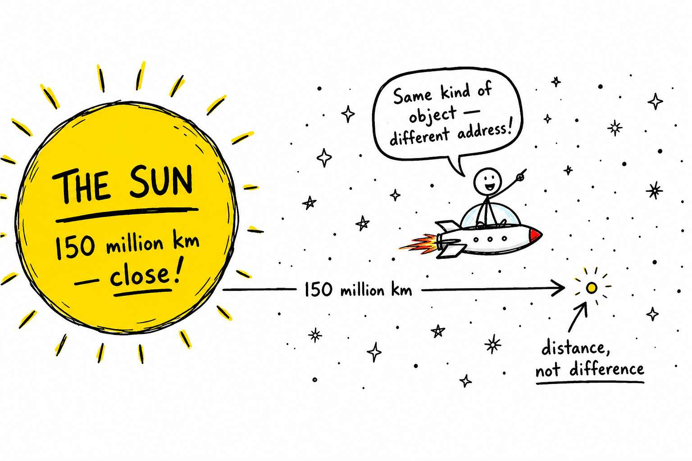
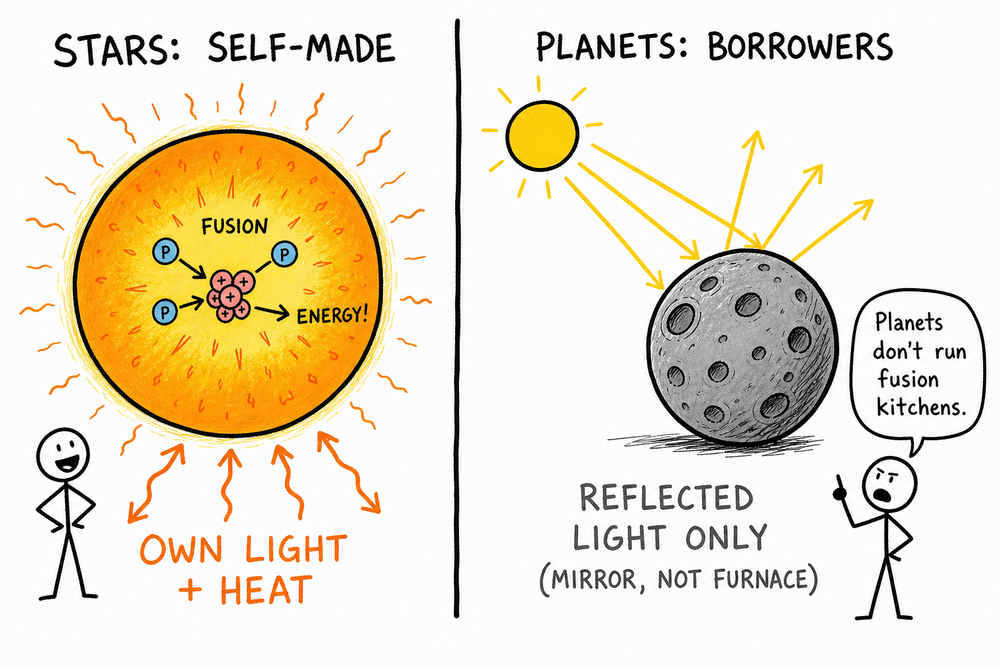
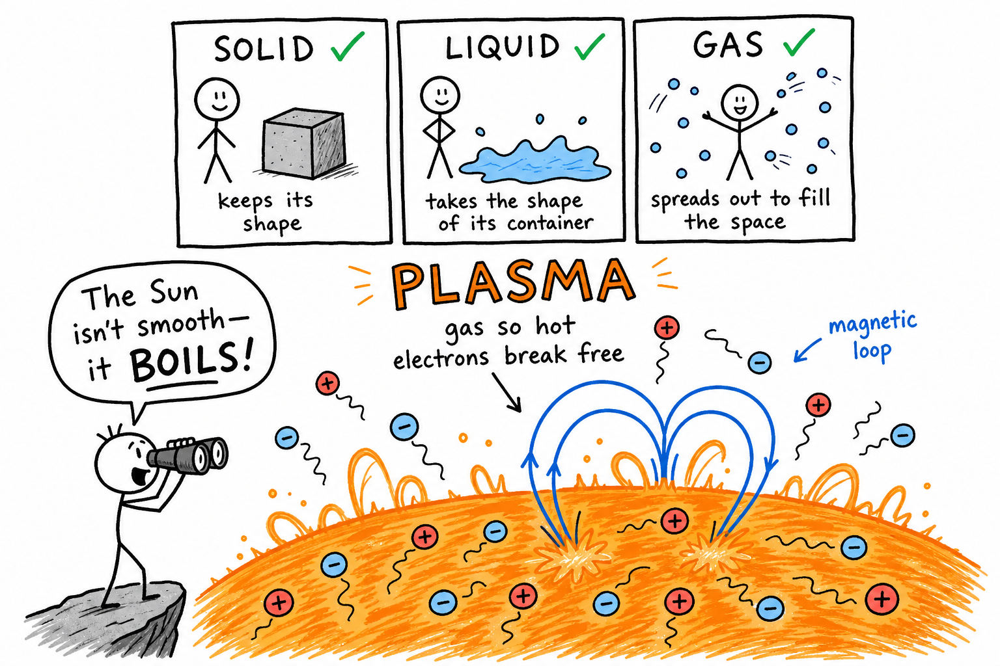
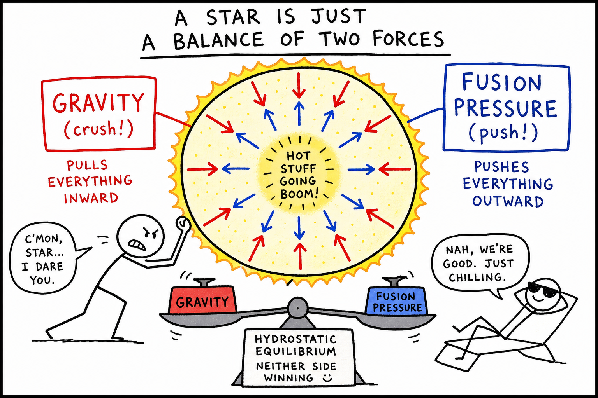
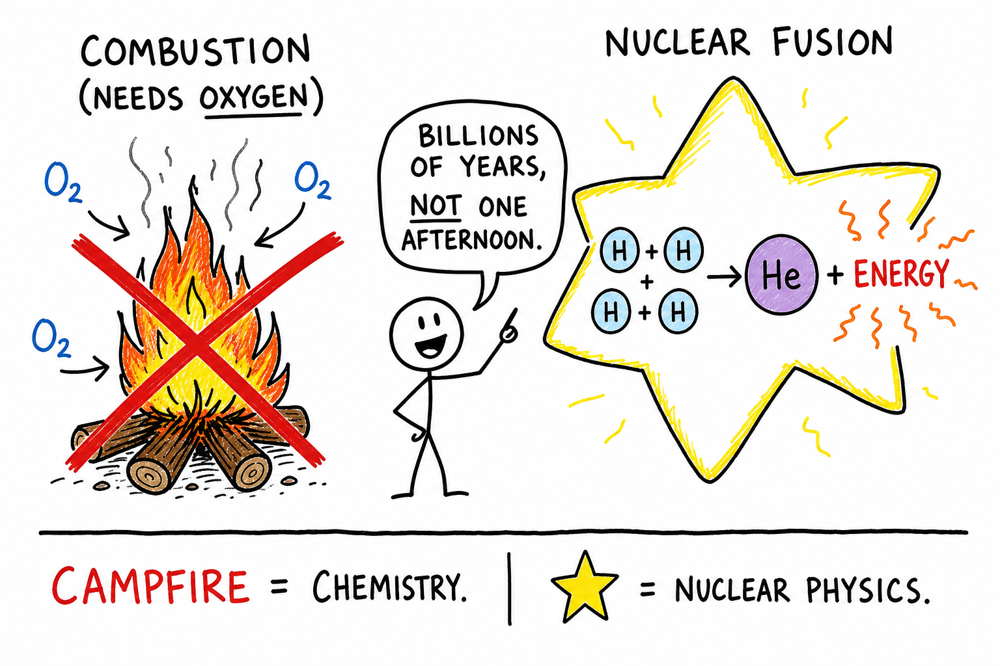
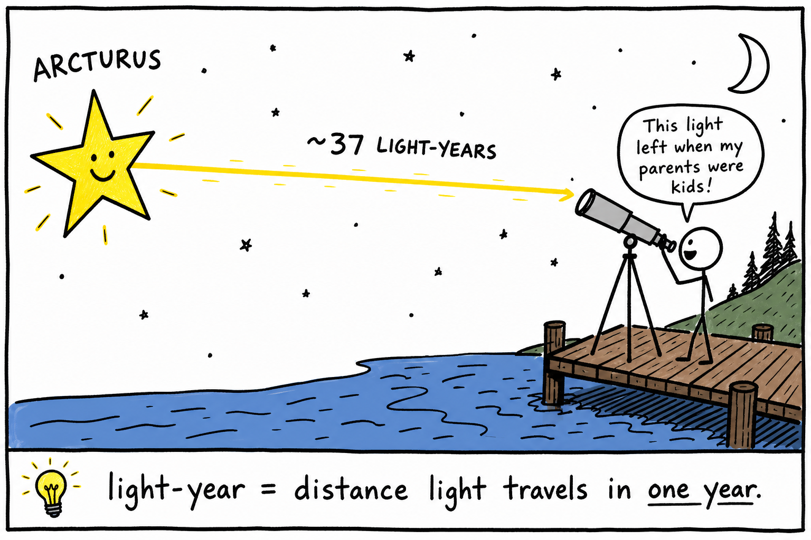
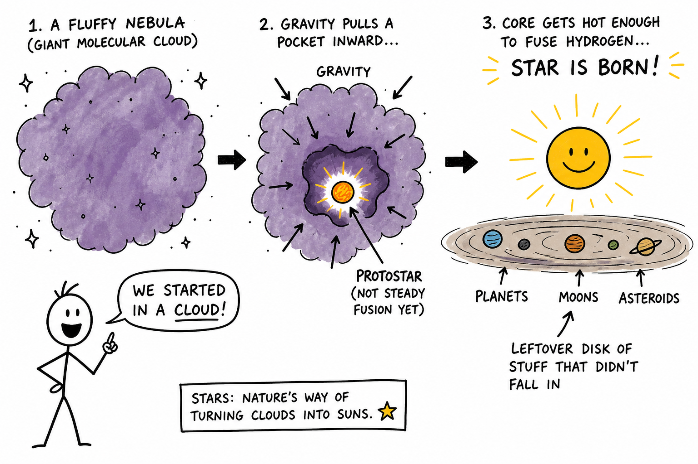

# Image briefs — 086 Stars

Use when creating `086_Stars_02.png` through `086_Stars_08.png`. Each file is referenced in `086_Stars.md` at the placement noted below.

`086_Stars_01.png` already exists at the chapter top (multi-panel overview: pinprick vs furnace, Sun vs Proxima, stars vs planets, gravity vs pressure, fusion vs campfire, light from the past, color = temperature). Brief below for consistency if it is ever redrawn.

**Style** (from `_create_more_images.md`): crude, funny, hand-drawn explainer cartoon; stick-figure characters; rough black outlines; mostly white background; selective flat accent colors. Labels, arrows, exaggerated faces, simple metaphors. Minimalist, humorous, concept-first, intentionally rough. Color sparingly: **red** = gravity/crush/danger, **blue** = pressure/space/systems, **orange/yellow** = heat/fusion/Sun, **purple/gray** = nebula dust, **green** = optional growth. Vary panel width/height. Ages 11–13; dock at night, phone star apps, Orion, camping, telescopes — awe without unsafe stargazing alone at water.

---

## 086_Stars_01.png — Chapter overview (existing)

**Placement:** Top of chapter (after title).

**Scene:** Multi-panel poster: peaceful pinprick vs roaring furnace; Sun vs Proxima distance; star makes light vs planet reflects; gravity vs fusion pressure scales; campfire X vs H→He fusion; Arcturus light ~37 years; color temperature scale.

**Caption in chapter:** ``

---

## 086_Stars_02.png — The Sun is a star (distance, not difference)

**Placement:** End of “The Sun Is a Star” (after “humble spark among thousands”).

**Scene:** Wide horizontal panel. Left: huge yellow **Sun** labeled “150 million km — looks huge because it’s **close**.” Right: stick-figure on tiny spaceship billions of km away; Sun shrinks to a dot among many stars. Speech bubble: “Same kind of object — different **address**!”

**Aspect:** Wide (~2:1).

**Caption idea:** The Sun is a star — distance makes it look special.

---

## 086_Stars_03.png — Stars make light; planets reflect

**Placement:** End of “Stars Make Their Own Light” (after “long before you were born”).

**Scene:** Split panel. Left: orange star with **fusion** in core, arrows labeled **own light + heat**. Right: gray moon/planet with incoming sunlight arrows bouncing off, label **reflected light only (mirror, not furnace)**. Stick-figure: “Planets don’t run fusion kitchens.”

**Aspect:** Wide (~2:1).

**Caption idea:** Stars manufacture light; planets reflect it.

---

## 086_Stars_04.png — Plasma: the fourth state

**Placement:** End of “Plasma: The Fourth State of Matter” (after “churning worlds of plasma”).

**Scene:** Tall panel. Top: three boxes — solid, liquid, gas with checkmarks. Bottom: huge **plasma** zone — wiggly charged particles (+/−), magnetic loop on a boiling star surface. Label: **gas so hot electrons break free**. Stick-figure with binoculars: “The Sun isn’t smooth — it **boils**!”

**Colors:** Orange boiling surface; blue magnetic loop.

**Aspect:** Tall (~1:1.5).

**Caption idea:** Stars are mostly plasma.

---

## 086_Stars_05.png — Gravity vs pressure (hydrostatic equilibrium)

**Placement:** End of “Gravity vs. Pressure: The Stellar Tug-of-War” (after “feedback systems”).

**Scene:** Cross-section of a star. **Red** arrows inward: **GRAVITY (crush!)**. **Blue** arrows outward: **FUSION PRESSURE (push!)**. Center balance scale even: **hydrostatic equilibrium — neither side winning**. Optional stick-figure arm-wrestling the star.

**Aspect:** Square (~1:1).

**Caption idea:** A stable star is a tug-of-war in balance.

---

## 086_Stars_06.png — Fusion is not a campfire

**Placement:** End of “Nuclear Fusion Is Not a Campfire” (after “campfire = chemistry. Star = nuclear physics”).

**Scene:** Left: campfire with big red **X**, label **combustion (needs oxygen)**. Right: **H + H + H + H → He + ENERGY** in star core. Stick-figure: “Billions of years, not one afternoon.”

**Aspect:** Wide (~2:1).

**Caption idea:** Stars fuse hydrogen — they don’t burn like wood.

---

## 086_Stars_07.png — Light-years and looking into the past

**Placement:** End of “Stars Are Far — and That Means the Past” (after “Astronomy is part physics, part history”).

**Scene:** Yellow star **Arcturus** sends a light beam along a winding path labeled **~37 light-years**. Stick-figure on dock with telescope; speech bubble: “This light left when my parents were kids!” Footer: **light-year = distance light travels in one year**.

**Aspect:** Wide banner (~3:1).

**Caption idea:** Starlight shows us the past.

---

## 086_Stars_08.png — Born in a nebula

**Placement:** End of “Born in a Nebula” (after “Your solar system started in a nebula…”).

**Scene:** Purple/gray fluffy **nebula** cloud. Gravity arrow pulls a pocket inward → **protostar** (glowing core, not yet steady fusion) → arrow to **star is born** when core fuses hydrogen. Leftover disk labeled **planets, moons, asteroids**. Stick-figure: “We started in a cloud!”

**Aspect:** Wide (~2:1).

**Caption idea:** Stars are born in nebulae.

---

## Suggested markdown inserts (in `086_Stars.md`)

```markdown







```

---

## Checklist for illustrators

- [x] _01 — multi-panel overview (exists)
- [x] _02 — Sun is a star at a distance
- [x] _03 — own light vs reflected light
- [x] _04 — plasma fourth state
- [x] _05 — gravity vs pressure equilibrium
- [x] _06 — fusion vs campfire
- [x] _07 — light-year / past
- [x] _08 — nebula → protostar → star + disk
