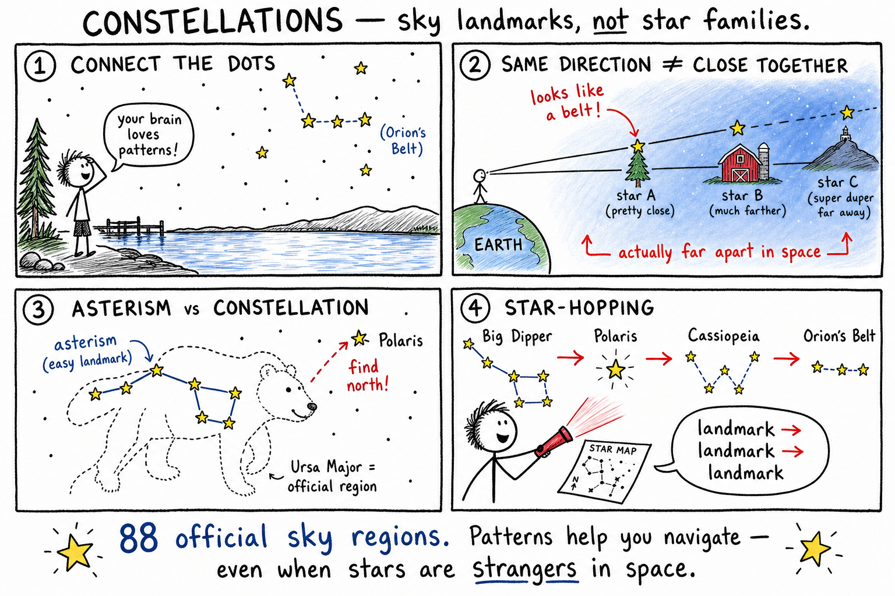

# Constellations

You are at a lake house after everyone else has gone to bed. No streetlights. No Wi‑Fi worth mentioning. Just black sky and more stars than you thought existed.

Your cousin dares you to find north without a phone. You laugh — then realize you have no idea where to start.

At first the stars look scattered, like someone shook a salt shaker over the world.

Then your brain does what human brains have done for thousands of years: it starts connecting them.

Three bright stars in a row. A bowl with a handle. A crooked W above the trees.

Suddenly the sky is not chaos. It is a map — and you are learning to read it.

**A constellation is an official region of the sky, usually named for a pattern of stars, animal, object, or legendary figure as seen from Earth.**

Long ago, people used these patterns to tell stories, mark seasons, remember directions, and organize the night. Today astronomers still use constellations — not as magic, but as a coordinate system for the heavens.

## Your Brain Is a Pattern Machine

A constellation often starts with a simple habit: connecting dots.

Stars are bright points of light. If several seem to form a shape, people imagine a hunter, bear, scorpion, swan, or ship. The shape is rarely perfect. Most constellations need imagination — and that is fine. The point is not that the sky truly contains drawings. The point is that **patterns help you remember and find stars**.

Orion is one of the easiest wins. Three bright stars in a straight line form **Orion's Belt**. Once you spot the belt, the rest of the hunter starts to appear.

Leo can look like a crouching lion if you learn its main stars. Other constellations are faint and frustrating. Do not try to memorize the whole sky in one night. **Start with bright landmarks. Build from there.**

## Same Sky, Different Depths

Here is the twist that changes everything:

**The stars in a constellation are usually not close together in space.**

They only look close because they line up from Earth's point of view.

Imagine standing on a road. A nearby tree, a faraway barn, and a distant hill all sit in the same direction. From where you stand, they look lined up. Walk sideways and the pattern breaks.

Constellations work like that. One star might be tens of light-years away. Another might be hundreds or thousands. They are not usually one star family. They are a **picture made by perspective** — a sky landmark, not a physical cluster.

That is why astronomers say constellations are **regions and directions**, not clubs of neighboring stars.

## Eighty-Eight Official Sky Regions

Modern astronomers use constellations in a precise way.

The sky is divided into **88 official constellations**. Each one is not only a stick-figure drawing. It is a **region** with boundaries — like countries on a map of the sky.

That matters when a comet, galaxy, nebula, or planet appears somewhere specific. Astronomers can say it is in Andromeda, Perseus, Taurus, or Gemini. A meteor shower may seem to radiate from a constellation. A planet might hang in Leo one month and Virgo the next.

The bright patterns help you recognize the regions. The official boundaries cover the whole sky, even the faint parts between the famous stars.

## Constellation or Asterism?

| | **Constellation** | **Asterism** |
|---|-------------------|--------------|
| What it is | One of **88 official sky regions** | A familiar star pattern people love |
| Example | **Ursa Major** (Great Bear) | **Big Dipper** (bowl and handle) |
| Easy rule | Has official boundaries on the sky map | Easier to spot; often part of a constellation |
| Why it matters | Scientists use the name as a "neighborhood" | Great **first landmark** for star-hopping |

An **asterism** is a familiar star pattern that is **not** one of the official 88 constellations by itself.

The **Big Dipper** is an asterism inside **Ursa Major**. The **Little Dipper** is inside **Ursa Minor**. **Orion's Belt** is an asterism within Orion. The **Summer Triangle** joins **Vega**, **Deneb**, and **Altair** from three different constellations.

**Star-hopping** means finding an easy asterism first, then hopping to nearby stars and constellations. It is like learning a new neighborhood: memorize the pizza shop and the school, then the streets between them start to make sense.

## Northern Hemisphere Starter Kit

If you live in the northern United States, Canada, or much of Europe, learn these landmarks first. They pay off on camping trips, late walks, and any "find north without a phone" dare.

### Ursa Major and the Big Dipper

**Ursa Major** means Great Bear. Its most famous part is the **Big Dipper** — a bowl with a handle.

Two stars on the outer edge of the bowl are **pointer stars**. Draw an imaginary line through them and they point toward **Polaris**, the North Star. For centuries, that trick helped sailors, explorers, and hikers when landmarks disappeared.

The Big Dipper changes position during the night and through the seasons. Sometimes the bowl looks upright; sometimes it is tipped on its side. In much of the northern United States and Europe, it never fully disappears below the horizon — a reliable old friend in the sky.

### Polaris and the Little Dipper

**Ursa Minor** means Little Bear. The **Little Dipper** is part of it.

At the end of the Little Dipper's handle sits **Polaris**. It appears close to the **north celestial pole** — the point in the sky above Earth's North Pole. As Earth rotates, most stars seem to circle that point. Polaris stays nearly fixed in the northern sky.

**Common mistake:** Polaris is **not** the brightest star in the sky. It is useful because of **where** it sits, not because it outshines everything else. Find Polaris and you have found north.

### Cassiopeia: The Backup W

**Cassiopeia** often looks like a W or an M, depending on how it is tilted. It lies on the opposite side of Polaris from the Big Dipper — handy when the Dipper is low or hidden behind trees or buildings.

The region sits in a rich part of the **Milky Way**. Binoculars can reveal star clusters and countless faint stars. You do not need Greek mythology memorized to use Cassiopeia. Learn the shape, learn where it sits relative to Polaris, and you have another navigation tool.

### Orion: The Winter Hunter

Orion is one of the best constellations for beginners in the Northern Hemisphere — especially in **winter**.

The three stars of Orion's Belt form a short straight line. Bright stars above and below mark shoulders and feet.

**Betelgeuse** (say BET-el-juice) is a reddish star on one shoulder. **Rigel** is a blue-white star on one foot. Color is a temperature clue: Betelgeuse is cooler at its surface, so it looks red-orange. Rigel is hotter and looks blue-white.

Below the belt is **Orion's Sword**. In the sword lies the **Orion Nebula** — a glowing cloud where new stars are forming. With binoculars on a clear night, it can look like a fuzzy patch. Orion teaches pattern, color, star birth, and patience all at once.

### The Summer Triangle

In **summer**, look for the **Summer Triangle**: three bright stars from three constellations — **Vega**, **Deneb**, and **Altair**. It is an asterism, not a constellation, but it is huge and hard to miss once you know it.

## Circumpolar Constellations

Some constellations never set below the horizon for certain observers. They are **circumpolar** — they circle the pole.

Which ones are circumpolar depends on **where you live**. In much of the northern United States and Europe, Ursa Major, Ursa Minor, Cassiopeia, Cepheus, and Draco may never dip below the horizon. Near the equator, fewer constellations are circumpolar. Near the North Pole, many northern patterns wheel around the sky all night.

Earth's rotation makes stars appear to drift across the sky each night. Your latitude on the globe changes which stars you can see at all.

## The Zodiac and the Ecliptic

The **zodiac** is a band of constellations along the apparent path of the Sun, Moon, and planets across the sky. That path is the **ecliptic**.

The ecliptic exists because Earth orbits the Sun and the planets orbit in nearly the same flat plane. As seen from Earth, the Sun seems to move through certain constellations during the year. The Moon and planets stay near that same band.

Zodiac constellations include Aries, Taurus, Gemini, Cancer, Leo, Virgo, Libra, Scorpius, Sagittarius, Capricornus, Aquarius, and Pisces. **Ophiuchus** also lies along the ecliptic, though it is often left out of popular zodiac lists.

In astronomy, these are **regions of the sky** — useful for locating planets. They are **not** a scientific way to predict personality or the future.

**Astronomy** studies the universe using evidence and testable ideas. **Astrology** is a belief system, not a science. Learn the difference early and you will never confuse a horoscope with a telescope.

## Seasonal Sky Calendar

Different constellations dominate different seasons.

Earth orbits the Sun all year. At night you see the part of space facing **away** from the Sun. As Earth travels, the nighttime side faces different directions in space.

| Season (Northern Hemisphere) | Famous patterns often up at night |
|------------------------------|-----------------------------------|
| Winter | Orion, Taurus, Canis Major |
| Spring | Leo, Boötes |
| Summer | Scorpius, Sagittarius, Summer Triangle |
| Autumn | Pegasus, Andromeda |

That is why **Orion** is a famous winter constellation in the Northern Hemisphere. **Scorpius** and **Sagittarius** shine in summer. **Leo** often marks spring. **Pegasus** and **Andromeda** show up in autumn.

Before printed calendars were everywhere, people used the sky as a clock and calendar. Seasonal constellations still work that way if you know what to look for.

## Navigation Without a Phone

Constellations have guided travelers for a long time.

In the Northern Hemisphere, Polaris marks north. Sailors, explorers, scouts, and hikers used star patterns when coastlines and trails disappeared.

The **height of Polaris above the horizon** also tells you roughly your **latitude** north of the equator. If Polaris is about 40 degrees above the horizon, you are near 40 degrees north latitude. That is not magic — it is geometry on a spinning globe.

In the Southern Hemisphere there is no equally bright South Star. Navigators often use the **Southern Cross** (in the constellation **Crux**) to help locate south.

Star navigation takes practice, clear weather, and dark skies. City lights and clouds can ruin the lesson in seconds — which is why a dark campsite beats a parking lot for your first real try.

## Stories Across Cultures

Constellations are scientific tools **and** cultural treasures.

Ancient Greeks told stories of Orion, Perseus, Andromeda, and Cassiopeia. Many Indigenous cultures have their own sky stories. Chinese, Arabic, Polynesian, African, and other traditions organized the heavens in rich, different ways.

Some cultures emphasized bright stars. Some traced patterns in the dark lanes of the Milky Way. These stories helped people remember seasons, migrations, planting times, and routes home.

When you study constellations, respect both the **science** and the **human history**. The sky belongs to no single culture.

## Star Maps and Star-Hopping

A **star map** is a map of the night sky. A round map you can adjust for date and time is a **planisphere**.

To use one, you need your direction, the date, the time, and your location. A Northern Hemisphere map will not match the Southern Hemisphere sky. A winter chart will not match a summer evening.

Hold the map above you or turn it to match the direction you face. Start with an easy asterism — Big Dipper, Orion's Belt, Cassiopeia, or the Summer Triangle — then hop to nearby constellations and stars.

Planetarium apps on a phone can help, but they also spoil your night vision if the screen is too bright. A dim **red** light preserves dark adaptation better than a white flashlight. Serious sky watchers treat night vision like a superpower — once you lose it, you wait 20 minutes to get it back.

## Deep-Sky Treasures

Constellations point to more than individual stars.

**Deep-sky objects** lie beyond the solar system: star clusters, nebulae, and galaxies. Examples:

- **Orion Nebula** — in Orion; a stellar nursery.
- **Andromeda Galaxy** — in Andromeda; our nearest large galactic neighbor.
- **Pleiades** — in Taurus; a young star cluster.
- **Lagoon Nebula** — in Sagittarius; another glowing cloud.

These objects are not "inside" the constellation the way ink is inside a drawing. They simply lie in that direction from Earth. Constellations tell you where to aim binoculars or a telescope.

## Dark Skies and Light Pollution

From a truly dark place, the **Milky Way** can appear as a pale, cloudy band — our galaxy seen edge-on from inside.

Many constellations lie along that band. In bright cities, the Milky Way may be invisible. **Light pollution** is excessive or poorly aimed artificial light that brightens the night sky, hides faint stars, and makes constellations harder to learn.

Good outdoor lighting points downward, uses only needed brightness, and does not waste light into the sky. Dark skies help humans **and** wildlife that depend on natural night.

## Why the Sky Moves

Stars appear to drift across the sky during the night because **Earth rotates** — west to east. Stars seem to rise in the east and set in the west. Near Polaris, they appear to circle the pole.

A long-exposure photo can show circular **star trails**. The stars are not racing around Earth each night. You are spinning, and the sky's motion is **apparent motion**.

Over thousands of years, constellation shapes slowly change because stars have **proper motion** — real movement through space. The Big Dipper will not always look exactly like a dipper. On a human lifetime scale, though, the patterns stay familiar.

## Not Every Bright Dot Is a Star

**Planets** look like steady bright stars but slowly wander against the background — the word *planet* comes from an old word meaning *wanderer*.

**Meteors** are brief streaks from small bits of rock burning in the atmosphere.

**Satellites** and **airplanes** move across the sky on predictable paths; airplanes often blink.

Once you know the background patterns, anything that moves or flashes stands out. Constellations are the frame. Everything else is the action.

## Observe Like a Pro: Tonight's Five Steps

Pick a clear night away from bright lights if you can.

1. **Wait for dark adaptation** — give your eyes **20 minutes or more**. Use a red flashlight for charts. White light resets your night vision.
2. **Find north** — use pointer stars from the Big Dipper, or Cassiopeia when the Dipper is low.
3. **Pick one season's landmark** — Orion in winter, Summer Triangle in summer, Leo in spring, Pegasus in autumn.
4. **Star-hop** — landmark to landmark; do not try to memorize every faint star.
5. **Log one win** — sketch what you found, name one deep-sky object in that region, or teach a friend one pointer-star trick.

Sky learning is like learning a new neighborhood: a few landmarks first, then the paths between them start to make sense. Friendly competition helps — race a cousin to find Polaris first, or see who spots Orion's Belt faster.

## Common Mistakes

- Thinking constellation stars are usually neighbors in space — they are usually **not**.
- Calling the Big Dipper a constellation — it is an **asterism** in Ursa Major.
- Assuming Polaris is the brightest star — it is **not**; position is what matters.
- Expecting the same constellations every night all year — **seasons** change the view as Earth orbits the Sun.
- Confusing **astronomy** (evidence-based science) with **astrology** (belief, not science).

## How to Think Like a Sky Watcher

When you look up, ask:

- What pattern am I seeing — constellation or asterism?
- What direction am I facing? What season is it?
- Are these stars truly close together, or only lined up from Earth?
- What bright stars or colors identify this pattern?
- What deep-sky objects could I find nearby?
- What evidence separates astronomy from imagination?

Wonder gets you outside. Discipline tells you what you are actually seeing.

## The Big Idea

Constellations are named regions and patterns in the sky as seen from Earth. They help people organize the night sky, find directions, mark seasons, remember stories, and locate planets, galaxies, nebulae, and star clusters.

The stars in a constellation usually are **not** close together in space — they only appear to form a pattern from our viewpoint. Modern astronomers divide the sky into **88 official constellations**, while familiar patterns like the Big Dipper and Summer Triangle are **asterisms**.

If you remember only one sentence, remember this:

**Constellations are sky landmarks: patterns and regions that help us map the heavens, even though their stars may be far apart in space.**

## Study Questions

1. What is a constellation?
2. Why do people connect stars into patterns?
3. Are the stars in a constellation usually close together in space? Explain.
4. How many official constellations do modern astronomers use?
5. What is an asterism? How is it different from a constellation?
6. What larger constellation contains the Big Dipper?
7. Describe Orion's Belt and name two bright stars in Orion.
8. What can the colors of Betelgeuse and Rigel tell you?
9. What is Polaris, and why is it useful for navigation?
10. Is Polaris the brightest star in the sky? Why or why not?
11. What are circumpolar constellations?
12. What is the zodiac, and what is the ecliptic?
13. Why do different constellations appear in different seasons?
14. How can the height of Polaris above the horizon help you?
15. What is star-hopping?
16. What is a planisphere?
17. Name two deep-sky objects and the constellations they appear in.
18. What is light pollution, and why does it matter?
19. Why do stars appear to move across the sky during the night?
20. What is the difference between astronomy and astrology?
21. Why is the Big Dipper not an official constellation?
22. In your own words, explain why constellations are useful even though their stars may be far apart in space.
