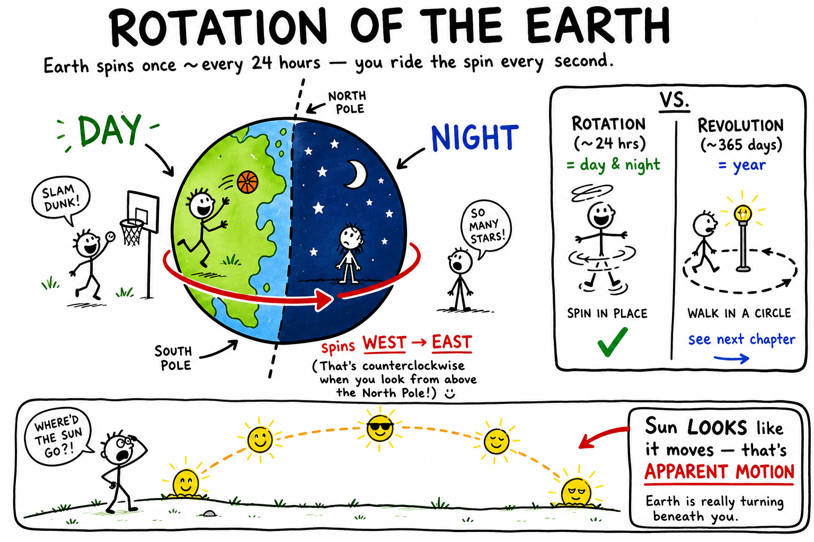

# Rotation of the Earth

You finish a late game, walk off the field, and flop onto the bench. Your legs feel heavy. Your heart is still pounding. Everything around you seems perfectly still — the grass, the bleachers, the parking lot lights.

But you are not still.

Right now, Earth is spinning. You are riding a planet that turns once about every 24 hours. At the equator, the ground under your feet is racing eastward at roughly **1,670 kilometers per hour** — faster than a commercial jet. You do not feel it because Earth carries you, the air, the oceans, and everything around you together.

**Rotation of the Earth is Earth's spin around its axis, which takes about 24 hours and causes day and night.**

That daily spin is one of the most important motions you will ever study. It gives us sunrise and sunset, clocks, time zones, star trails, long afternoon shadows on a basketball court, and the rhythm of every school day.

## Rotation Means Spinning

**Rotation** means turning around an axis.

An **axis** is an imaginary line an object spins around. Earth's axis runs from the North Pole to the South Pole through the center of the planet. You cannot see it — it is not a metal rod stuck through the globe. It is a useful line scientists draw to describe the spin.

Earth rotates once in about **24 hours**. That is why one day is about 24 hours long.

As Earth turns, different parts face the Sun. The side facing the Sun has **day**. The side turned away has **night**. Nothing mystical happens at sunset — your location is simply rotating out of direct sunlight.

## Rotation and Revolution

These two words sound similar. They are not the same.

**Rotation** is spinning around an axis.

**Revolution** is traveling around another object.

Earth **rotates** once about every 24 hours.

Earth **revolves** around the Sun once about every 365 days.

| Motion | What moves | How long | What you notice most |
|--------|------------|----------|----------------------|
| Rotation | Earth spins on its axis | ~24 hours | Day and night |
| Revolution | Earth orbits the Sun | ~365 days | The year; seasons (with tilt) |

Rotation gives you today. Revolution, together with Earth's **tilted axis** (about 23.5°), gives you the year and the seasons.

Both happen at once. You are spinning with Earth while Earth travels around the Sun. Earth and the Sun are also moving with the Milky Way galaxy — motion in space is layered. The motion you notice every morning and evening is Earth's rotation.

## Earth's Axis, Poles, and the Equator

Earth's axis is **tilted**, not straight up and down compared with Earth's path around the Sun. That tilt matters for seasons. The **spin itself** matters for day and night.

Earth rotates around its tilted axis every day. The **North Pole** and **South Pole** are the ends of the axis. Halfway between them is the **equator** — an imaginary line around Earth's middle.

Places near the equator travel the farthest during one rotation, so they move fastest. Places near the poles travel in tiny circles, so they move more slowly. If Earth were a spinning basketball, a dot on the equator would race around the "seam" while a dot near the north end would barely creep in a small loop.

## Day and Night

Day and night happen because Earth is a **sphere** that rotates.

The Sun lights the half of Earth facing it. That half has daylight. The other half is in Earth's shadow and has night.

As Earth rotates, your town moves into sunlight, then out again. When your location turns toward the Sun, you see **sunrise**. When it faces the Sun most directly for that day, the Sun is highest in the sky. When your location turns away, you see **sunset**, then night.

The Sun is not actually rising and falling around Earth each day. **Earth is turning.** The daily path of the Sun across the sky is mostly **apparent motion** — motion as it appears from where you stand, even when the real cause is Earth's spin.

## Sunrise in the East, Sunset in the West

The Sun appears to rise in the **east** and set in the **west** because Earth rotates from **west to east**.

Picture a merry-go-round turning counterclockwise. Trees outside seem to slide the opposite way across your view. Earth's eastward rotation makes the Sun, Moon, planets, and stars appear to drift **westward** across the sky.

That is why coaches schedule evening practice knowing the Sun will sink behind the west bleachers — and why stargazers know constellations will crawl westward through the night even though the stars themselves are not racing around Earth once per day.

## Noon, Midnight, and Why You Do Not Feel the Spin

**Solar noon** is when the Sun is highest in the sky for that day — not always exactly when a clock says 12:00. Clocks use **time zones** and sometimes daylight saving time, so clock noon and solar noon can differ a little.

**Midnight** is roughly when your side of Earth faces most directly away from the Sun.

If Earth is spinning so fast, why do you not feel it? Because you notice **changes** in motion more than **steady** motion.

Think about riding smoothly on a bus or train at constant speed. You can toss a ball gently in your hands and it behaves normally. You, the ball, the air, and the vehicle move together. Earth's rotation is very steady. The ground, oceans, atmosphere, buildings, and people are carried around together — so Earth does not feel as if it is rushing beneath your feet.

## The Atmosphere Spins Too

Earth's atmosphere rotates with the planet. If the air did not move with Earth, fierce winds would constantly blast the surface.

Gravity, friction, and billions of years of shared motion keep the atmosphere mostly carried along. Ordinary winds are movements **inside** the rotating atmosphere — not the whole sky being left behind.

That is why birds, planes, clouds, and thrown footballs are not instantly swept away by rotation alone. They already share Earth's motion.

## The Night Sky and Star Trails

At night, stars appear to rise in the east and set in the west, just like the Sun. That is mostly because **Earth rotates beneath the sky**.

Near the North Star, **Polaris**, stars seem to circle around the **north celestial pole** — the point in the sky above Earth's North Pole. Polaris is useful because it sits very close to that point and helps you find north. It is **not** the brightest star in the sky; its value is its position.

In the Southern Hemisphere there is no equally famous South Star. Sky watchers use other patterns, such as the Southern Cross, to find south.

A long-exposure photograph of the night sky can show **star trails** — curved streaks that reveal Earth's rotation in one image.

## Time, Shadows, and Sundials

Earth's rotation is the basis of timekeeping. A **day** is tied to one rotation. Hours, minutes, and seconds divide that day into smaller pieces.

Ancient people used sunrise, sunset, and moving shadows to mark time. A **sundial** uses a shadow that changes direction and length as the Sun appears to cross the sky.

On a sunny day at school, you can watch the same idea without a sundial:

- **Morning:** shadows are long and point generally westward because the Sun is low in the east.
- **Near noon:** shadows are usually shorter because the Sun is higher.
- **Afternoon:** shadows grow longer again and point generally eastward.

You may not feel the ground turn, but a moving shadow tells the story.

## Solar Day vs. Sidereal Day

Earth rotates once compared with the distant stars in about **23 hours and 56 minutes**. That is a **sidereal day**.

A normal **solar day** — from one solar noon to the next — is about **24 hours**.

Why the difference? Earth is also moving around the Sun while it spins. After one spin compared with the stars, Earth must turn a little more so the Sun appears in the same noon position again. That extra turning takes about **four minutes**.

For daily life, we use the solar day. For astronomy, the sidereal day tracks the stars.

## Time Zones, Longitude, and the Date Line

Earth rotates **360 degrees** in about 24 hours — about **15 degrees per hour**.

Because different longitudes face the Sun at different times, places around the world use different clock times. A **time zone** is a region that shares the same standard clock time. When it is morning where you live, it may be evening on the other side of the planet — not because the Sun behaves differently there, but because Earth is rotating and those places face the Sun at different times.

**Longitude** tells how far east or west a place is from the **prime meridian** (zero degrees, through Greenwich, England). A difference of about 15 degrees in longitude roughly matches a one-hour difference in solar time.

Before accurate portable clocks, finding **longitude at sea** was brutally hard. Sailors could estimate latitude from the Sun or stars more easily, but longitude required knowing the exact time at a home port and comparing it with local solar time. Earth's rotation made global navigation possible — and, for centuries, frustrating.

The **International Date Line** is an imaginary line mostly near 180° longitude where the calendar date changes when you travel around the world. Cross westward and you generally gain a calendar day; cross eastward and you generally lose one. The line bends around countries so nearby communities can share the same date. It exists because Earth is round, rotates, and has time zones.

Ever text a friend in another country and wonder why their "tomorrow morning" is still your tonight? Rotation and time zones are the reason.

## The Coriolis Effect

Earth's rotation deflects large moving masses of air and water. That apparent deflection is the **Coriolis effect**.

- In the **Northern Hemisphere**, large air masses tend to curve to the **right** of their path.
- In the **Southern Hemisphere**, they tend to curve to the **left**.

The Coriolis effect helps shape global winds, ocean currents, and the spin of huge storms. Hurricanes rotate **counterclockwise** in the Northern Hemisphere and **clockwise** in the Southern Hemisphere.

It does **not** decide which way water drains in a sink or toilet. Those tiny motions are controlled by the shape of the drain and how the water started moving — a common myth you can ignore.

## Earth's Shape, Satellites, and Slowing Down

Earth is not a perfect sphere. It is slightly wider at the equator than from pole to pole — an **oblate spheroid**. Rotation helps create that slight bulge by carrying material around a large circle at the equator. The effect is small, but measurable.

Rotation also matters in space. Some satellites sit in **geostationary orbit** above the equator, orbiting once every 24 hours so they appear to hover over one spot on Earth. Weather and communication satellites use this trick. Other satellites streak across the night sky on different schedules.

Earth's rotation is very steady, but not perfectly unchanging. The Moon's gravity raises tides, and tidal friction slowly transfers energy so Earth's spin **gradually slows**. Days are getting longer — by tiny amounts in a human lifetime, but noticeably over hundreds of millions of years.

## Foucault's Pendulum: Proof You Can See Indoors

In 1851, French scientist Léon Foucault used a **pendulum** — a weight hanging from a fixed point — to show Earth's rotation. The pendulum seemed to change the direction of its swing over time. The pendulum was not twisting on its own. **Earth was rotating beneath it.**

Today, Foucault pendulums hang in some museums and science centers. A slow, swinging weight becomes visible proof that the ground is turning — even when you cannot feel it.

## Common Misconceptions

One mistake is thinking day and night happen because the Sun orbits Earth each day. **Earth rotates**; the Sun stays put in the solar system while we turn.

Another mistake is confusing rotation with revolution. Earth **revolves** around the Sun once per year but **rotates** once per day.

A third mistake is expecting to feel Earth's spin like a roller coaster. Steady shared motion is hard to sense.

A fourth mistake is calling Polaris the brightest star. It is important because it is near the north celestial pole.

A fifth mistake is blaming the Coriolis effect on sink drains. Save it for hurricanes and planet-sized winds.

## How to Think Like an Earth Scientist

When you study rotation, ask:

- What is rotating, and around what axis?
- How long does one rotation take?
- Is this real motion or apparent motion?
- What evidence can I observe — shadows, stars, clocks, storms?
- How is rotation different from revolution?

Earth's rotation is invisible in one blink but obvious over an afternoon or a night. Watch the Sun, your shadow, the stars, and the clock — the spinning planet reveals itself.

## The Big Idea

Earth rotates around its axis once about every 24 hours. That spin causes day and night, makes the Sun and stars appear to move across the sky, shapes timekeeping and time zones, changes shadows through the day, creates star trails, and influences large-scale winds and ocean currents through the Coriolis effect. Earth rotates from west to east, so the Sun appears to rise in the east and set in the west.

Rotation is not revolution: **rotation gives us the day; revolution around the Sun gives us the year.**

If you remember only one sentence, remember this:

**Earth's rotation is the planet's daily spin — the hidden motion behind sunrise, sunset, night, clocks, shadows, star trails, and the rhythm of each day.**

## Study Questions

1. What is Earth's rotation?
2. What is an axis?
3. About how long does Earth take to rotate once?
4. What causes day and night?
5. What is the difference between rotation and revolution?
6. What does Earth's revolution around the Sun help cause?
7. What is the equator, and why do places near it move faster during rotation than places near the poles?
8. Why does the Sun appear to rise in the east and set in the west?
9. What is apparent motion? Give one example related to Earth's rotation.
10. What is solar noon?
11. Why do we not feel Earth spinning?
12. Why does the atmosphere not get left behind as Earth rotates?
13. Why do stars appear to move across the sky at night?
14. What are star trails, and what do they show?
15. What is Polaris, and why is it useful? Is it the brightest star?
16. How do shadows change during the day because of Earth's rotation?
17. What is the difference between a solar day and a sidereal day?
18. What is a time zone, and about how many degrees does Earth rotate each hour?
19. What is longitude, and why was finding longitude at sea difficult before accurate clocks?
20. What is the International Date Line?
21. What is the Coriolis effect, and why does it matter for storms but not ordinary drains?
22. What did Foucault's pendulum help show?
