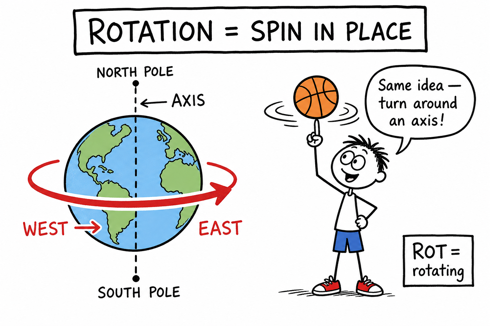
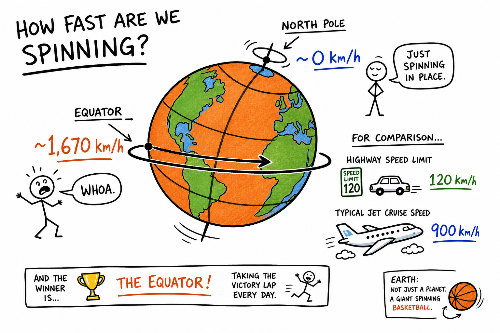
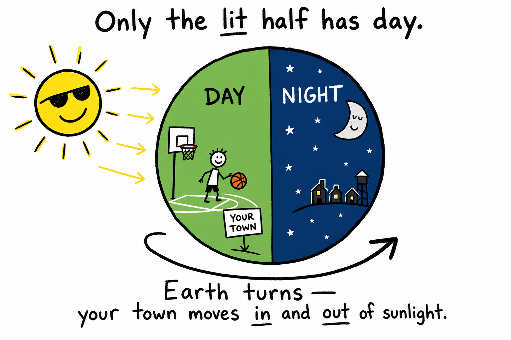
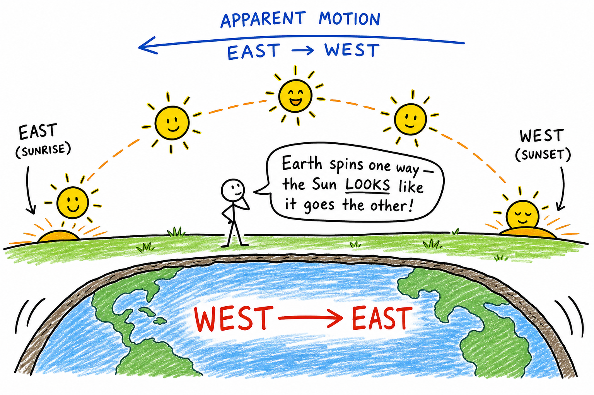
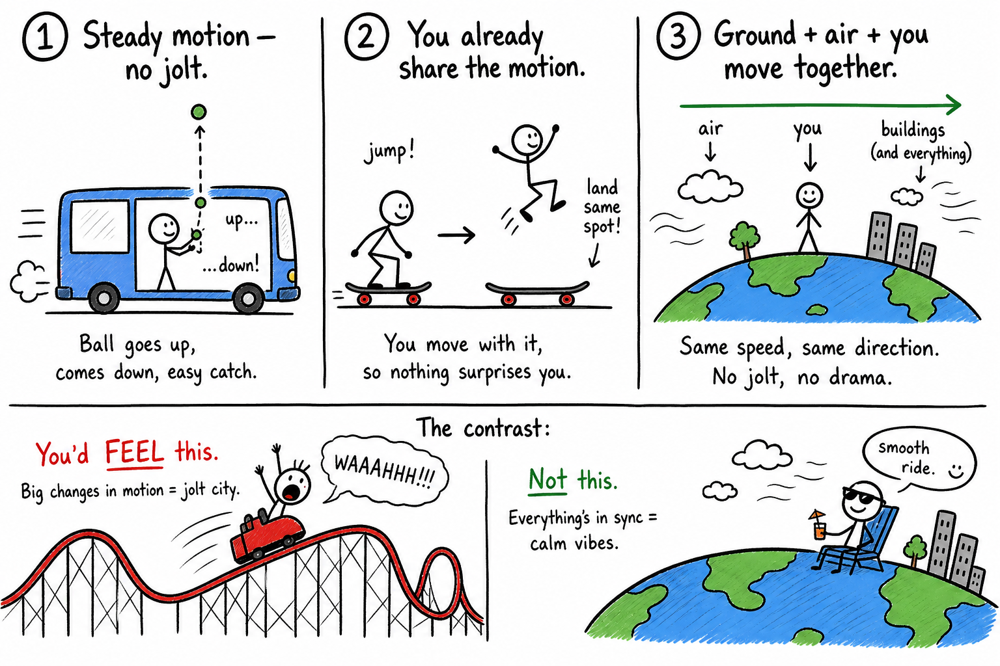
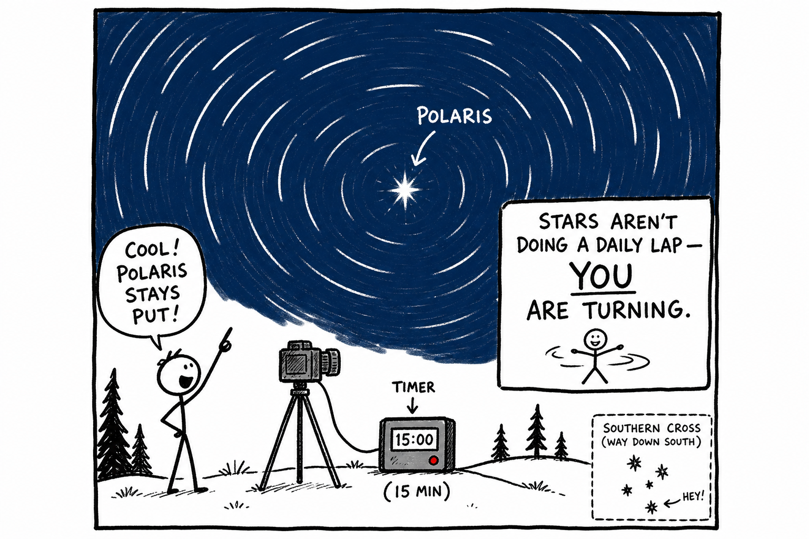

# Image briefs — 088 Rotation of the Earth

Use when creating `088_Rotation_of_the_Earth_02.png` through `088_Rotation_of_the_Earth_07.png`. Each file is referenced in `088_Rotation_of_the_Earth.md` at the placement noted below.

`088_Rotation_of_the_Earth_01.png` already exists at the chapter top (day/night spin, rotation vs revolution, apparent motion). Brief below for consistency if it is ever redrawn.

**Style** (from `_create_more_images.md`): crude, funny, hand-drawn explainer cartoon; stick-figure characters; rough black outlines; mostly white background; selective flat accent colors. Labels, arrows, exaggerated faces, simple metaphors. Minimalist, humorous, concept-first, intentionally rough. Color sparingly: **red** = key direction/spin, **blue** = night/sky/systems, **green** = day/ground, **yellow** = Sun, **gray** = dull machinery. Vary panel width/height. Ages 11–13; sports field, basketball spin, bleachers, stargazing, shadows on a court.

---

## 088_Rotation_of_the_Earth_01.png — Day/night + rotation vs revolution (existing)

**Placement:** Top of chapter (after title).

**Scene:** Earth split day/night with west→east spin arrow; VS box rotation vs revolution; bottom panel apparent motion of Sun across sky.

**Caption in chapter:** ``

---

## 088_Rotation_of_the_Earth_02.png — Axis and spin in place

**Placement:** End of "Rotation Means Spinning" (after memory trick paragraph).

**Scene:** Earth circle with dashed **axis** from North Pole to South Pole through center. Thick **red** curved arrow: **WEST → EAST**. Side panel: stick-figure spinning a basketball on one finger with circular motion lines; label **ROT = spin in place**. Speech bubble: "Same idea — turn around an axis!"

**Colors:** Green day side hint optional; red spin arrow.

**Aspect:** Wide (~2:1).

**Caption idea:** Rotation is spinning around an axis.

---

## 088_Rotation_of_the_Earth_03.png — Equator races, poles creep

**Placement:** End of "Earth's Axis, Poles, and the Equator" (after speed comparison paragraph).

**Scene:** Earth as tilted spinning basketball/globe. **Equator:** dot racing a big loop, label **~1,670 km/h**. **Pole:** dot barely moving in tiny circle, label **~0 km/h**. Stick-figure at equator: "WHOA!" Stick-figure at pole: "I'm just spinning in place."

**Humor:** Highway sign **120 km/h** and jet **900 km/h** crossed out — equator still wins.

**Aspect:** Wide banner (~3:1).

**Caption idea:** Equator moves fastest; poles spin in place.

---

## 088_Rotation_of_the_Earth_04.png — Sun lights half the sphere

**Placement:** End of "Day and Night" (after Moon paragraph).

**Scene:** Yellow **Sun** left; Earth sphere center — half **green** (day), half **dark blue** with stars (night). Stick-figure on day side on a sports field; tiny figure on night side with moon. Label: **Only the lit half has day.** Arrow: **Earth turns** — your town moves into and out of sunlight.

**Aspect:** Square (~1:1).

**Caption idea:** Day and night on a rotating sphere.

---

## 088_Rotation_of_the_Earth_05.png — Earth spins west→east; sky looks east→west

**Placement:** End of "Sunrise in the East, Sunset in the West" (after memory trick).

**Scene:** Stick-figure on green ground watching five yellow Sun icons along dashed arc **east → west** across sky (sunrise to sunset). Below Earth cross-section: big **red** arrow **WEST → EAST**. Above sky: **blue** arrow **EAST → WEST** labeled **apparent motion**. Speech bubble: "Earth spins one way — the Sun *looks* like it goes the other!"

**Aspect:** Wide (~2:1).

**Caption idea:** Earth's spin and the Sun's apparent path.

---

## 088_Rotation_of_the_Earth_06.png — Why you do not feel the spin

**Placement:** End of "Noon, Midnight, and Why You Do Not Feel the Spin" (after skateboard sentence).

**Scene:** Three mini-panels:

| Panel | Scene | Label |
|-------|-------|-------|
| 1 | Bus at steady speed; stick-figure tosses ball up and catches it | **Steady motion — no jolt** |
| 2 | Skateboard; jumper lands same spot | **You already share the motion** |
| 3 | Earth with stick-figure, air, buildings all on same arrow | **Ground + air + you move together** |

**Humor:** Roller-coaster stick-figure (red) labeled "you'd FEEL this" vs calm Earth rider "not this."

**Aspect:** Wide (~2.5:1).

**Caption idea:** Steady shared motion is hard to feel.

---

## 088_Rotation_of_the_Earth_07.png — Star trails and Polaris

**Placement:** End of "The Night Sky and Star Trails" (after Southern Hemisphere sentence).

**Scene:** Night sky — curved white **star trails** circling **Polaris** (labeled). Stick-figure with camera on tripod, timer **15 min**. Callout: **Stars aren't doing a daily lap — YOU are turning.** Optional tiny Southern Cross corner note.

**Colors:** Dark blue sky; white streaks; yellow Polaris star.

**Aspect:** Tall (~3:4).

**Caption idea:** Star trails show Earth's rotation.

---

## Suggested markdown inserts (in `088_Rotation_of_the_Earth.md`)

```markdown






```

---

## Checklist for illustrators

- [x] _01 — day/night, rotation vs revolution, apparent motion (exists)
- [x] _02 — axis and spin in place (basketball metaphor)
- [x] _03 — equator vs pole surface speed
- [x] _04 — Sun lights half the sphere
- [x] _05 — west→east spin vs east→west apparent Sun path
- [x] _06 — why you don't feel the spin (bus/skateboard/Earth together)
- [x] _07 — star trails around Polaris
