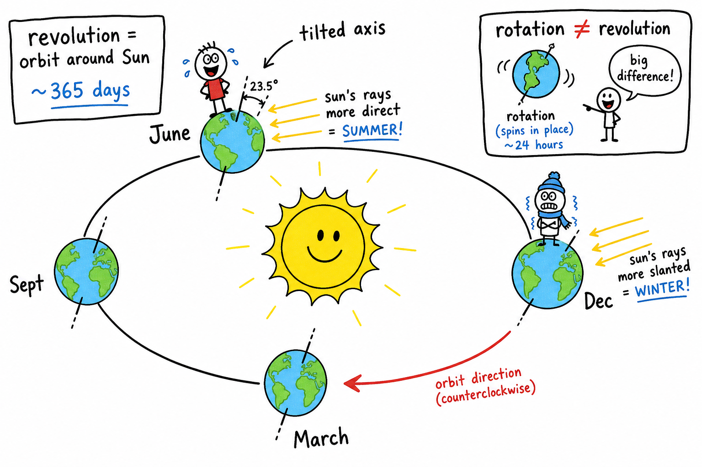
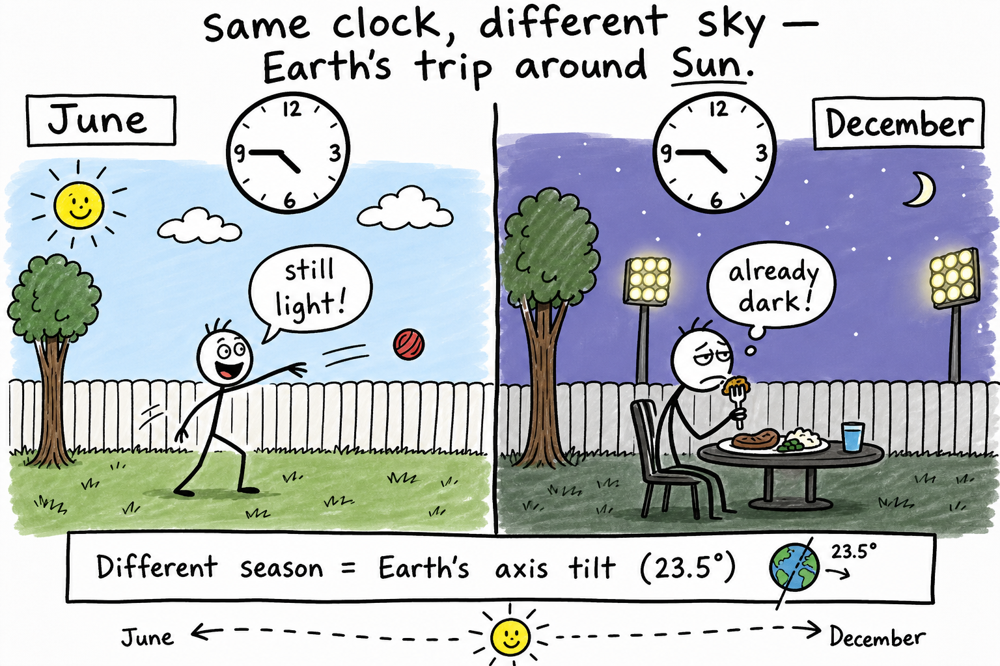
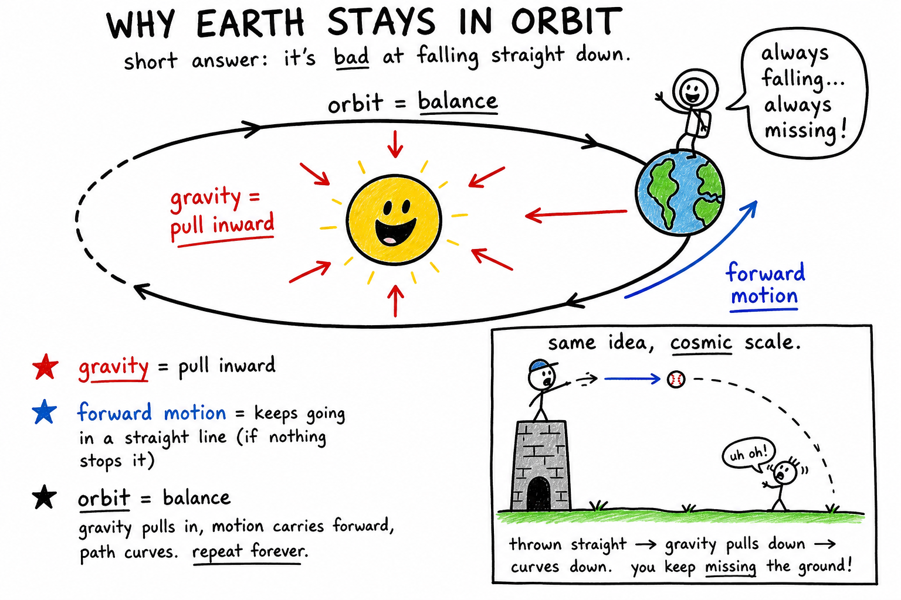
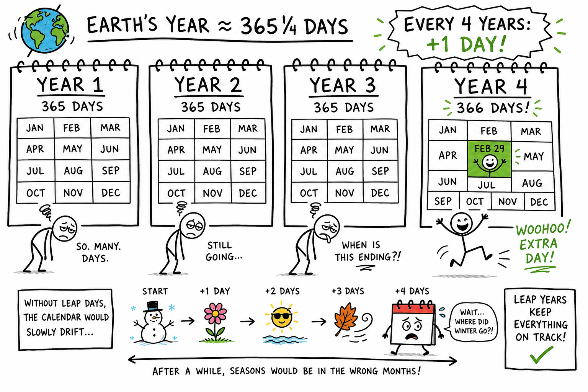
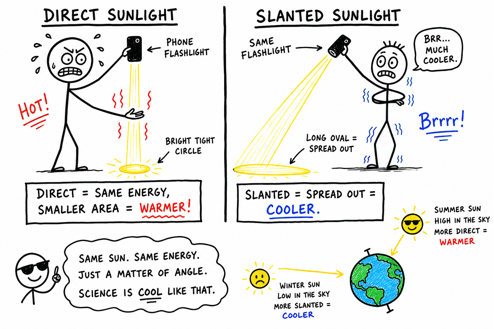
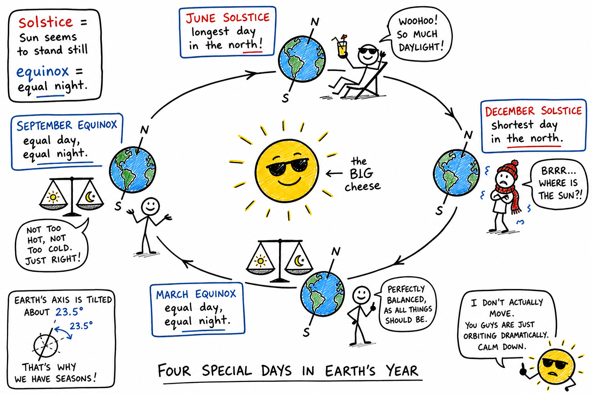
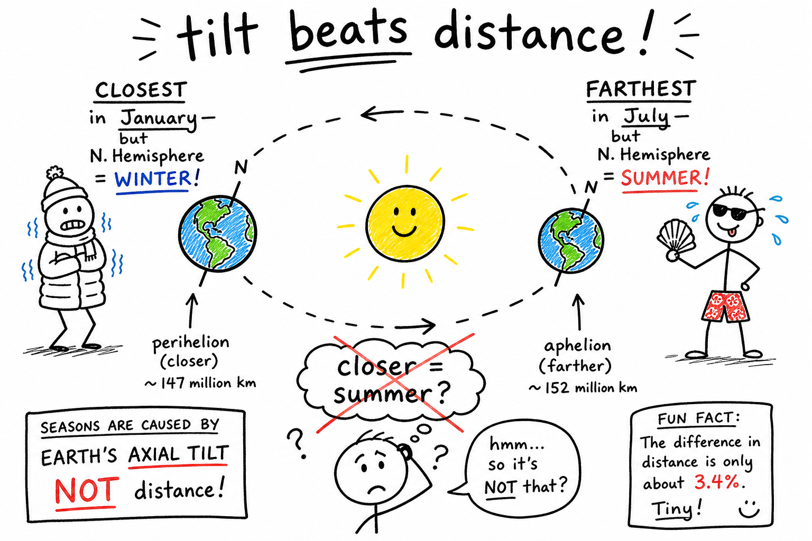
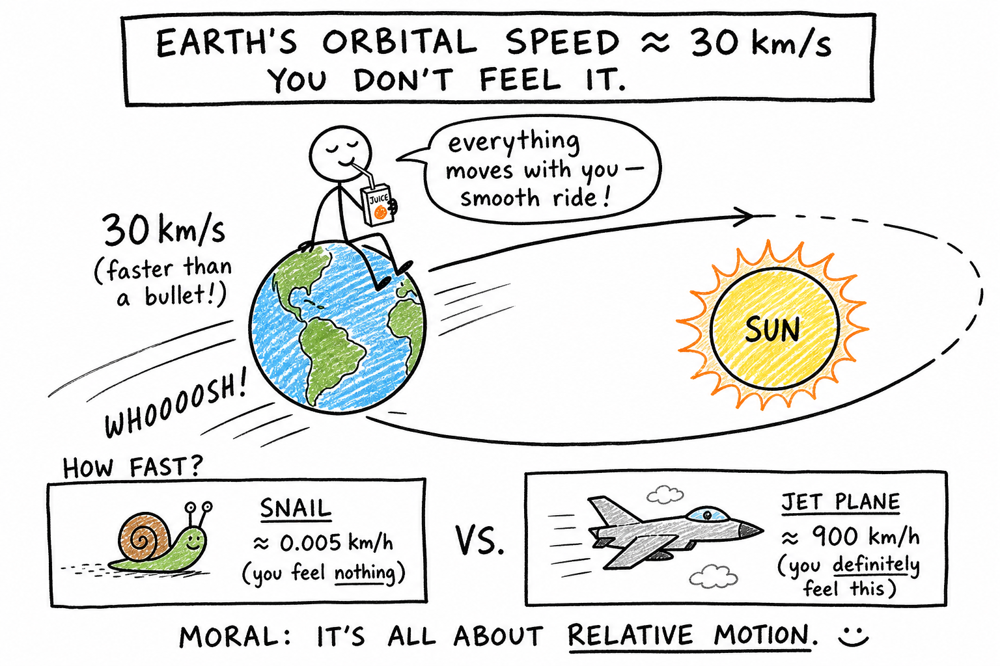

# Revolution of the Earth

Last June you stayed outside until nine o'clock and still had light for one more throw. Last December the same clock said dinner time, but the sky was already purple and the field lights were buzzing on.

Same backyard. Same you. Different sky.

That shift is not the Sun getting lazy. It is Earth finishing another lap.

While you slept through winter break, grinded a new game over summer, went to camp, and started a new school year, Earth never parked in space. It was racing around the Sun on a giant curved path — about **30 kilometers per second** on average. That is faster than a rifle bullet. You do not feel it because Earth carries you, the air, and everything around you along smoothly — the same reason you do not feel Earth's daily spin, as you learned in the chapter on **rotation of the Earth**.

**Revolution of the Earth is Earth's motion around the Sun, taking about 365 1/4 days and helping create the year and the seasons.**

Revolution is quieter than sunrise and sunset. You cannot watch one full orbit in a single evening. But over weeks and months, its effects show up everywhere: changing seasons, longer or shorter days, different constellations at night, and the calendar on your phone.

As you learned in the chapter on the **Sun**, our star sits at the center of the solar system and holds Earth in orbit with gravity. Revolution is how Earth keeps that yearly appointment.

## Revolution at a Glance

| Idea | What to remember |
|------|------------------|
| **Revolution** | Earth traveling around the Sun |
| **Orbit** | The path Earth follows |
| **One year** | About **365 1/4 days** per orbit |
| **Rotation** (different!) | Earth spinning once ~**24 hours** → day and night |
| **Axis tilt** | About **23.5°** — main driver of seasons |
| **Seasons** | Mostly **tilt + revolution**, not distance from the Sun |
| **Leap year** | Bookkeeping for that extra quarter day |
| **Speed** | ~**30 km/s** average — you ride along smoothly |

## Revolution Means Orbiting

**Revolution** means traveling around another object.

Earth **revolves** around the Sun.

The path it follows is called an **orbit**.

An orbit is the path one object takes around another object in space.

Earth's orbit is not a perfect circle. It is an **ellipse** — a slightly stretched oval. Even so, compared with many orbits in space, Earth's path is nearly circular.

The Sun sits slightly off the center of that ellipse, at a point called a **focus**. So Earth is a little closer to the Sun at some times of year and a little farther at others.

That small distance change is **not** the main reason we have seasons. **Tilt** is. (More on that soon.)

## Rotation and Revolution

These two words sound alike. Mixing them up is one of the most common mistakes in Earth science — and on tests.

**Rotation** is spinning around an axis.

**Revolution** is traveling around another object.

| Motion | What Earth does | About how long | What you notice most |
|--------|-----------------|----------------|----------------------|
| Rotation | Spins on its axis | ~24 hours | Day and night |
| Revolution | Orbits the Sun | ~365 1/4 days | The year; seasons (with tilt) |

Earth **rotates** once about every 24 hours. That gives you day and night.

Earth **revolves** around the Sun once about every **365 1/4 days**. That gives you the year.

Both happen at once. You are spinning with Earth every day while Earth carries you around the Sun every year. Rotation gives you today's schedule. Revolution, together with Earth's **tilted axis**, gives you the year's rhythm — when soccer season feels crisp, when the pool opens, when you need a heavier jacket.

The chapter on **seasons** goes deeper into weather patterns and regional differences. Here, focus on the **orbit** and how tilt plus revolution set the stage.

## Gravity and Forward Motion

Why does Earth stay in orbit instead of flying away or crashing into the Sun?

The Sun's **gravity** pulls Earth inward.

Earth's **forward motion** carries it onward.

Together, inward pull and forward motion bend Earth's path into a curve around the Sun.

If Earth had no forward motion, gravity would pull it into the Sun.

If there were no Sun's gravity, Earth would drift off in a straighter line through space.

There is no giant track in space — no invisible road. Earth is always falling toward the Sun and always moving forward fast enough to miss it. That balance is the orbit.

Picture tossing a baseball horizontally. Gravity bends the path downward. Throw it fast enough from a tall tower and the ground curves away beneath it — the ball could keep missing the ground. Earth is doing that on a cosmic scale, year after year.

## How Long Is a Year?

A **year** is based on Earth's revolution around the Sun.

One full orbit takes about **365 1/4 days**.

That extra quarter day matters. If every calendar year had exactly 365 days, the dates would slowly drift away from Earth's real position in its orbit. After four years, you would be about one day off.

To fix this, we use **leap years**. Most leap years add **February 29**, giving the year 366 days instead of 365.

Most years divisible by 4 are leap years. Century years are leap years only if divisible by 400 (so **2000** was a leap year, but **1900** was not). The rules are fussy because Earth's year is not exactly 365.25 days — but the basic reason is simple: **Earth's orbit is not a neat whole number of days.**

Without leap years, seasons would slowly slide through the calendar. Eventually, July would not feel like summer in the Northern Hemisphere — and "back to school in August" would land in a totally different sunlight pattern.

## Earth's Axis Is Tilted

Earth's **axis** is the imaginary line from the North Pole to the South Pole. Earth rotates around this line.

The axis is **tilted** about **23.5 degrees**. It is not straight up and down compared with the flat plane of Earth's orbit around the Sun.

This tilt is one of the most important facts in astronomy for daily life.

As Earth revolves around the Sun, the tilted axis keeps pointing in nearly the same direction in space — roughly toward **Polaris**, the North Star. It does not wobble like a spinning top losing balance.

Because the axis stays tilted, different parts of Earth receive sunlight more directly at different times of year.

That is the main reason Earth has **seasons**.

## Seasons

Seasons are caused mostly by Earth's **tilted axis** as Earth **revolves** around the Sun — not mainly by Earth getting closer or farther from the Sun.

When the **Northern Hemisphere** tilts toward the Sun:

- Sunlight strikes more **directly**
- Days are **longer**
- That hemisphere has **summer**

At the same time, the **Southern Hemisphere** tilts away:

- Sunlight strikes at a **slant**
- Days are **shorter**
- That hemisphere has **winter**

Six months later, the situation **reverses**. Australia can have winter while the United States has summer. Opposite seasons at the same time are strong proof that **tilt**, not distance, drives the pattern.

Spring and autumn happen during the in-between parts of the orbit.

## Direct and Slanted Sunlight

Sunlight can hit the ground straight on or at a slant.

**Direct** sunlight packs the same energy into a smaller area — like aiming a flashlight straight down on a desk. It warms more strongly.

**Slanted** sunlight spreads the same energy over a larger area — like tilting the flashlight. It warms less strongly.

In summer, the Sun climbs **higher** in the sky and its rays strike more directly.

In winter, the Sun stays **lower** and its rays strike at a slant.

**Day length** matters too. Long summer days give the ground more hours to warm. Short winter days give less time.

Seasonal temperature is really a team effort: **angle of sunlight + length of daylight.**

Try this at home: shine a phone flashlight straight on your hand, then at a steep angle. Same light, different spread — same physics the planet uses all year.

## Solstices and Equinoxes

A **solstice** happens twice each year. The name comes from an old idea that the Sun seems to **stand still** for a few days — its noon height barely changes.

- **June solstice** (around June 20–21): Northern Hemisphere has its **longest day** and start of astronomical summer; Southern Hemisphere has its shortest day and winter.
- **December solstice** (around December 21–22): Northern Hemisphere has its **shortest day** and winter; Southern Hemisphere has its longest day and summer.

An **equinox** happens twice each year. The word means **equal night**. Around an equinox, day and night are nearly equal in length worldwide.

- **March equinox** (around March 20): Northern Hemisphere spring, Southern Hemisphere autumn.
- **September equinox** (around September 22–23): Northern Hemisphere autumn, Southern Hemisphere spring.

At an equinox, neither hemisphere is tilted strongly toward or away from the Sun.

Solstices and equinoxes come from Earth's **tilt and revolution**. The Sun is not changing its own behavior — our view and our lighting change because Earth moves and tilts.

## Why Distance Is Not the Main Cause of Seasons

Many people think summer happens because Earth is **closer** to the Sun.

It sounds reasonable. It is **wrong**.

Earth is actually **closest** to the Sun in early January. That point is **perihelion**.

Earth is **farthest** in early July. That point is **aphelion**.

If distance were the main cause, the **whole planet** would have summer at the same time. Instead, when the Northern Hemisphere has summer, the Southern Hemisphere has winter.

Northern Hemisphere winter happens near perihelion. Northern Hemisphere summer happens near aphelion. The timing does not match a "closer = hotter" story.

Distance has a **small** effect. Earth's **tilted axis** and **revolution** do the heavy work.

## The Ecliptic and Seasonal Stars

Earth's orbit lies in a nearly flat plane called the **ecliptic plane**.

As Earth travels around the Sun, the Sun appears to move against the background stars along a path called the **ecliptic**. The zodiac constellations lie along that band — which is why the Sun, Moon, and planets often appear in the same region of the sky.

At night you look **away** from the Sun into space. As Earth moves in its orbit, the nighttime side of Earth faces **different directions** in space.

That is why **different constellations** show up in different seasons.

In the Northern Hemisphere, **Orion** is easy on winter evenings — perfect for a cold camping trip. **Scorpius** and **Sagittarius** stand out in summer. **Leo** often appears in spring. **Pegasus** and **Andromeda** in autumn.

The stars are not vanishing. Earth's position in its orbit changes which slice of the universe your night sky faces. Seasonal constellations are a quiet sign that Earth is moving.

## The Sun's Path Across Your Sky

The Sun's daily path changes through the year.

In **summer**, the Sun rises earlier, sets later, and climbs **higher** at noon.

In **winter**, it rises later, sets earlier, and stays **lower**.

That is why evening practice in June still has light, while the same time in December feels dark early — Earth's tilt and revolution, not the Sun "deciding" to quit.

If Earth had **no** axial tilt, day length would stay nearly the same all year and seasons would be much weaker. **Revolution alone** does not create our familiar spring, summer, fall, and winter. **Tilt plus revolution** does.

## Lines on the Map: Tropics and Polar Circles

Earth's 23.5° tilt shows up on maps as special lines of latitude.

The **Tropic of Cancer** (~23.5° north) and **Tropic of Capricorn** (~23.5° south) mark the farthest north and south where the Sun can appear **directly overhead** at noon.

The **Arctic Circle** (~66.5° north) and **Antarctic Circle** (~66.5° south) mark where, on some days each year, the Sun can stay above the horizon all day (**midnight sun**) or not rise at all (**polar night**).

Near the poles, summer can bring weeks of daylight and winter weeks of darkness. Extreme, but real — all from tilt and revolution.

## Calendars and Astronomy

The **day** comes from Earth's rotation.

The **year** comes from Earth's revolution.

**Months** are historically tied to the Moon's phases, though calendar months do not match the Moon's cycle perfectly.

The calendar on your wall is not random. It is humans trying to line up clocks and dates with motions in the sky. Leap years are not a weird bonus day — they are bookkeeping for a planet that will not orbit in exactly 365 neat days.

Your birthday marks another trip around the Sun — one more revolution completed since the day you were born.

## Earth's Orbital Speed

Earth's average speed around the Sun is about **30 km/s** — roughly **108,000 km/h**.

For comparison, a commercial jet might cruise near **900 km/h**. Earth is moving vastly faster, yet you feel nothing because everything around you moves with you at the same steady pace — the same reason you do not feel Earth's daily spin.

The ride is smooth. The speed is real.

## Evidence You Can Spot

You cannot see Earth slide along its orbit in one night, but you can collect proof:

- **Day length** — Track sunset time on your phone for two weeks in June vs. two weeks in December. The pattern tracks Earth's tilt and position in orbit.
- **Noon Sun height** — Notice how high the Sun is at lunch in summer vs. winter. Higher in summer means more direct rays.
- **Seasonal constellations** — Orion in winter evenings, Scorpius in summer. The night sky is a slow calendar.
- **Opposite hemispheres** — News from Australia or World Cup schedules can show winter sports while yours are in full swing. Same orbit, different tilt toward the Sun.
- **Leap day** — February 29 exists because the year is about 365 1/4 days long.

Revolution is invisible in one glance but obvious if you watch the year unfold.

## What Would Happen Without Tilt?

If Earth's axis were not tilted:

- Day length would barely change through the year
- The Sun's noon height would stay more constant at each place
- Weather would still vary, and the equator would still be warmer than the poles
- But the strong yearly swing of **spring, summer, autumn, winter** would fade

Earth's revolution would still give you a year. It would not give you **our** seasons without the tilt.

## Common Misconceptions

One mistake is thinking **revolution** means spinning. **Rotation** means spinning. **Revolution** means orbiting.

Another mistake is thinking summer happens because Earth is much closer to the Sun. **Tilt and sunlight angle** matter more.

A third mistake is thinking the whole Earth has the same season at once. Hemispheres have **opposite** seasons.

A fourth mistake is thinking leap years are random. They exist because Earth's year is about **365 1/4 days**.

A fifth mistake is thinking the Sun really moves through the zodiac while Earth stays still. Earth's **revolution** makes the Sun's yearly path against the stars.

## How to Think Like an Earth Scientist

When you study Earth's revolution, ask:

- What is Earth orbiting, and how long does one trip take?
- What force keeps Earth in orbit?
- How is revolution different from rotation?
- How is Earth's axis tilted, and which hemisphere leans toward the Sun now?
- Is sunlight direct or slanted? How long is daylight?
- Does the evidence point to **distance** or **tilt**?
- What changes in the night sky as Earth moves?

Earth's revolution is not just a path in space. It is the motion behind years, seasons, calendars, and the shifting stars.

## The Big Idea

Earth revolves around the Sun once about every **365 1/4 days**. That revolution gives us the **year** and, together with Earth's **23.5-degree tilt**, creates the **seasons**. Seasons happen mainly because each hemisphere receives different **angles** and **lengths** of sunlight during the year — not because Earth is much closer to the Sun in summer.

Revolution also explains **leap years**, the Sun's apparent path along the **ecliptic**, and why **different constellations** appear in different seasons.

If you remember only one sentence, remember this:

**Earth's revolution is our planet's yearly journey around the Sun — and with Earth's tilted axis it creates the seasons, the calendar year, and the changing night sky.**

## Study Questions

1. What is Earth's revolution?
2. What is an orbit?
3. What shape is Earth's orbit, and what is an ellipse?
4. What is the difference between rotation and revolution?
5. What does Earth's rotation cause? What does revolution help cause?
6. How long does Earth take to revolve around the Sun once?
7. Why do we need leap years?
8. What is Earth's axis, and about how much is it tilted?
9. What is the main cause of Earth's seasons?
10. What happens in the Southern Hemisphere when the Northern Hemisphere has summer?
11. Why does direct sunlight warm more strongly than slanted sunlight?
12. How does day length affect seasons?
13. What is a solstice? What happens in the Northern Hemisphere at the June solstice?
14. What is an equinox?
15. Why is distance from the Sun not the main cause of seasons?
16. What are perihelion and aphelion?
17. What is the ecliptic?
18. Why are different constellations visible in different seasons?
19. How does the Sun's path across the sky change from summer to winter?
20. What are the Tropic of Cancer and Tropic of Capricorn?
21. What can happen inside the Arctic and Antarctic Circles?
22. About how fast does Earth move around the Sun, and why do you not feel it?
23. What would seasons be like if Earth had no axial tilt?
24. Name two pieces of evidence you can observe that Earth is moving in its orbit (without leaving the ground).
