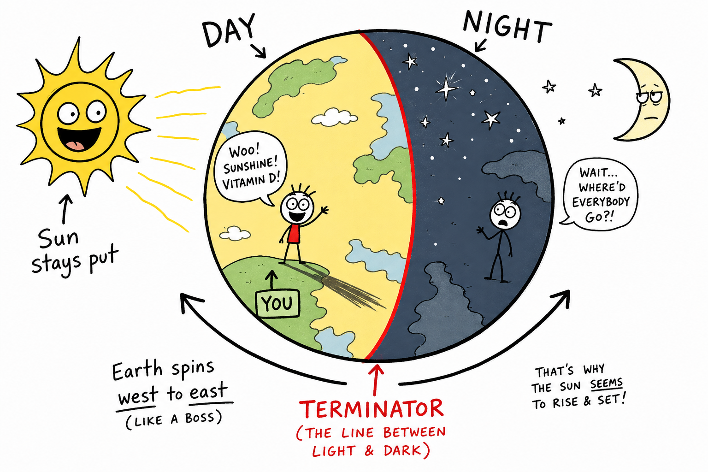

# Day and Night

You finish a late game, walk off the field, and flop onto the bench. The parking-lot lights buzz on. Your shadow stretches long across the asphalt. A few hours earlier, that same shadow was almost gone — crushed under your feet at noon when the Sun was high.

It feels as if the Sun traveled over your town today: up in the east, across the sky, down in the west.

But the deeper truth is better.

You are standing on a spinning planet.

**Day and night happen because Earth rotates, turning different parts of the planet toward and away from the Sun.**

That daily switch from light to dark is one of the simplest things to notice and one of the most important things to understand in astronomy.

## The Sun Lights Half of Earth

The Sun shines in all directions. Earth is a sphere. At any moment, the half facing the Sun is lit — that half has **day**. The half turned away is in darkness — that half has **night**.

The line between day and night is called the **terminator**. The name sounds like something from a science-fiction movie, but in astronomy it simply means the boundary between light and dark. On Earth, the terminator is where sunrise or sunset is happening right now.

As Earth rotates, this boundary sweeps across the planet. Your town moves into sunlight in the morning and out of it in the evening.

## Earth Rotates

**Rotation** means spinning around an axis. Earth's **axis** is an imaginary line through the North Pole and South Pole. Earth rotates around this axis once about every 24 hours. That spin causes day and night.

Earth rotates from **west to east**. Because of this, the Sun appears to rise in the east and set in the west.

The Sun is not really circling Earth each day. **Earth is turning.** The Sun's daily path across the sky is mostly **apparent motion** — motion as it appears from where you stand, even when the real cause is Earth's spin.

This is like watching scenery seem to slide backward when you ride in a train or bus. The trees are not rushing backward. Your point of view is moving. Same idea with the sky.

## Your Daily Ride Toward and Away from the Sun

**Sunrise** happens when your part of Earth rotates into sunlight. The Sun appears at the eastern horizon. The sky often brightens before the Sun itself shows up — that early glow is **twilight**, caused when Earth's atmosphere scatters sunlight even while the Sun is still below the horizon.

During the morning, your location turns more directly toward the Sun. The Sun appears to climb higher. Near the middle of the day it reaches its highest point. This is **solar noon**. At solar noon, shadows are usually shortest and sunlight is often strongest because it travels through less atmosphere than when the Sun is low.

Solar noon is not always exactly 12:00 on a clock. Clocks use **time zones**, daylight saving time, and other human rules. Solar noon depends on where the Sun actually is in *your* sky.

After solar noon, your part of Earth begins turning away from the Sun. The Sun appears lower. At **sunset**, your location rotates out of direct sunlight and the Sun sinks toward the western horizon.

**Midnight** is roughly when your side of Earth faces most directly away from the Sun — the opposite of solar noon. Clock midnight may not match the exact astronomical middle of the night, but it still reminds you of the main idea: day and night are not the Sun turning on and off. They are Earth turning.

## Night Is Earth's Shadow

Night is not a substance and not black air pouring over the land. Night is what you get when your side of Earth is turned away from the Sun. Earth itself blocks the sunlight. You are standing in Earth's shadow.

That is why stars become visible at night. They were there during the day too, but sunlight scattered by the atmosphere made the sky too bright to see them. At night, the sky above you is no longer flooded with scattered sunlight, and faint stars can appear.

Far from city lights, the night sky can be much darker and richer — which is why people travel to dark-sky sites to see the Milky Way. Darkness is not empty. It is a chance for faint light to be noticed.

## Why the Daytime Sky Looks Blue

During the day, sunlight enters Earth's atmosphere. Gases and tiny particles **scatter** sunlight. Blue light is scattered more strongly than red light, so blue light bounces around the sky in all directions. That is why the daytime sky often looks blue.

This is also why stars are hard to see during the day. The stars are still shining, but the bright blue sky hides them. If Earth had no atmosphere, the sky would look black even in daytime — except right where the Sun was shining. The atmosphere turns sunlight into a bright sky.

## Why Sunrises and Sunsets Can Look Epic

Sunrise and sunset are softened by Earth's atmosphere. When the Sun is low, its light travels through more air. More blue light is scattered away from the direct path to your eyes, leaving redder and orange colors. That is why a sunset over a lake, a stadium, or a mountain ridge can look red, pink, or purple — even though the Sun itself is still white-hot in space.

After sunset comes evening twilight: the Sun is below the horizon, but the upper atmosphere still catches and scatters some sunlight. Then the sky darkens into night. Without an atmosphere, sunrise and sunset would look much sharper and harsher.

## Shadows: Proof You Can See on the Ground

A **shadow** forms when an object blocks light. Shadows are excellent clues that the day is passing and Earth is rotating.

On a sunny day at school or practice:

- **Morning:** the Sun is low in the east. Shadows are long and point generally westward.
- **Near noon:** the Sun is higher. Shadows are usually shorter.
- **Afternoon:** the Sun is low in the west. Shadows grow longer and point generally eastward.

Stick a pencil or tent pole upright and mark its shadow every hour. The ground seems still, but the moving shadow tells you the planet is turning. Ancient people used the same idea with sundials. You do not need to feel the spin to see its effects.

## The Moon Can Show Up During the Day

Many people think the Moon belongs only to night. It does not.

The Moon shines because it reflects sunlight. Depending on where the Moon is in its orbit, it may be above the horizon during daylight. A crescent, half moon, or gibbous moon can sit in a blue daytime sky.

The **full moon** is usually easiest to see at night because it is opposite the Sun in the sky. The **new moon** is usually hard to spot because it is near the Sun's direction. Day and night come from Earth's rotation, but what you see in the sky also depends on the Moon's orbit.

## Planets, Stars, and Eye Safety

Stars are usually hidden during the day by the bright sky. Planets are usually hidden too. But a few bright planets — especially Venus — can sometimes be seen in daylight if conditions are right and you know exactly where to look.

**Never** search near the Sun with binoculars or a telescope unless trained adults use proper solar-safe equipment. Looking at or near the Sun with optical instruments can permanently damage eyes. The safe lesson is simple: daylight does not mean the stars and planets vanish. It means scattered sunlight overwhelms them.

## Time Zones: Earth Is Round and Spinning

When it is noon where you live, it is not noon everywhere. Earth is round and rotating, so different places face the Sun at different times. That is why we have **time zones** — regions that share the same standard clock time.

As Earth rotates, morning sweeps across the planet, then noon, then evening and night. If you text a friend far away, it may be breakfast time for you and bedtime for them. Time zones are a human way of organizing Earth's rotation — not a change in how the Sun works.

## Why Summer Days Are Longer (But Day and Night Still Come Daily)

Not every day has the same amount of daylight. In many places, summer days are longer and winter days are shorter. That happens because Earth's axis is **tilted** and Earth **revolves** around the Sun.

**Rotation** causes the daily cycle of day and night — about every 24 hours, no matter the season.

**Tilt and revolution** change how long daylight lasts during different seasons. In summer, your hemisphere is tilted toward the Sun and the Sun takes a longer path across the sky. In winter, your hemisphere is tilted away and the path is shorter.

Keep the causes separate: rotation gives you today; tilt and revolution stretch or shrink how much of today is lit.

## Different Places, Different Daylight

Near the **equator**, day and night are often close to equal in length all year. Farther from the equator, day length changes more with the seasons. Near the poles, the changes are extreme.

Inside the Arctic and Antarctic Circles, places can have **polar day** — the Sun stays above the horizon for 24 hours or more (sometimes called the midnight sun) — or **polar night**, when the Sun stays below the horizon for 24 hours or more. Earth keeps rotating. The tilted pole may stay aimed toward or away from the Sun for weeks at a time.

## Twilight: The In-Between Light

**Twilight** is the glow in the sky before sunrise and after sunset. It happens because the atmosphere scatters sunlight when the Sun is just below the horizon.

Scientists name three levels — civil, nautical, and astronomical — from brightest to darkest. You do not need every name memorized yet. The main idea is that atmosphere makes day and night change gradually instead of flipping like a light switch.

## Who Is Awake When?

Day and night shape living things.

Animals active during the day are **diurnal** — hawks, squirrels, many songbirds. Animals active at night are **nocturnal** — owls, bats, many moths. Some animals are busiest at dawn and dusk.

Plants respond to light and dark too. Many flowers open or close on a daily schedule. Human bodies have **circadian rhythms** — daily cycles tied to light and darkness. Your sleep schedule is connected to when your side of Earth faces the Sun.

Earth's rotation quietly organizes the schedule of life: school in the morning, practice in the afternoon, dinner in the evening, sleep at night.

## Artificial Light and Light Pollution

Humans have changed night with artificial light — streetlights, stadium lights, house lights, signs, and screens. Light can help people see and stay safe.

But too much poorly aimed light causes **light pollution**. Light pollution hides stars, wastes energy, and can confuse animals that navigate by natural darkness. Good lighting points downward, uses the right brightness, and shines only where needed.

Studying day and night helps explain why dark skies matter for astronomy and wildlife — and why a camping trip under real stars feels different from looking up in a bright city.

## Day and Night on Other Worlds

Other planets have day and night too, if they rotate and are lit by a star.

- **Mars:** a day only a little longer than Earth's.
- **Jupiter:** rotates very fast — a day of about 10 hours.
- **Venus:** rotates very slowly, and in an unusual direction.
- **The Moon:** has day and night, but one full cycle there lasts about a month.

Earth's 24-hour rhythm is familiar to us. It is not the only rhythm in space.

## Common Misconceptions

One mistake is thinking day and night happen because the Sun moves around Earth each day. **Earth rotates.**

Another mistake is thinking night happens because clouds cover the Sun. Clouds can darken a day, but night happens when your side of Earth faces away from the Sun.

A third mistake is thinking the Moon only comes out at night. The Moon can often be seen during the day.

A fourth mistake is thinking stars disappear during the day. They are still there; the bright sky hides them.

A fifth mistake is thinking every place on Earth has the same daylight hours. Day length changes with latitude and season.

## How to Think Like a Sky Scientist

When you study day and night, ask:

- Which side of Earth is facing the Sun right now?
- Where is the terminator?
- Which way is Earth rotating?
- Is this sunrise, solar noon, sunset, or midnight?
- Is the Sun's motion real or apparent?
- How are shadows changing?
- How does the atmosphere affect the sky?
- How does the season affect day length?
- What can be seen in the sky during day or night?

Day and night are ordinary enough to ignore. Pay attention, and they become a daily experiment in astronomy.

## The Big Idea

Day and night happen because Earth rotates. The side facing the Sun has daylight; the side turned away is in Earth's shadow and has night. As Earth spins from west to east, the Sun appears to rise in the east, climb to solar noon, set in the west, and disappear below the horizon. Earth's atmosphere creates blue daytime skies, colorful sunrises and sunsets, and twilight. The length of daylight changes with latitude and season because Earth's axis is tilted as Earth revolves around the Sun — but rotation still gives you a new day-night cycle about every 24 hours.

If you remember only one sentence, remember this:

**Day and night are the daily result of Earth's rotation, as each place on the planet turns toward and away from the Sun.**

## Study Questions

1. What causes day and night?
2. What part of Earth has day at any moment? What part has night?
3. What is the terminator?
4. What is rotation, and what is Earth's axis?
5. About how long does Earth take to rotate once?
6. Which direction does Earth rotate, and why does the Sun appear to rise in the east and set in the west?
7. What is apparent motion? Give one example related to day and night.
8. What is sunrise? What is solar noon? What is sunset? What is midnight?
9. Why is solar noon not always exactly 12:00 by the clock?
10. Why are stars usually visible at night but not during the day?
11. Why is the daytime sky usually blue?
12. Why can sunrise and sunset look red or orange?
13. How do shadows usually change from morning to noon to afternoon?
14. Can the Moon be seen during the day? Why or why not?
15. Why do time zones exist?
16. What is the difference between what causes day and night and what changes how long daylight lasts during the year?
17. How are day and night different near the equator compared with near the poles?
18. What are polar day and polar night?
19. What is twilight?
20. What does nocturnal mean? What does diurnal mean?
21. What is light pollution?
22. Do other planets have day and night? Give one example.
23. Name two common misconceptions about day and night.
24. In your own words, explain why the Sun seems to move across the sky even though Earth is doing the moving.
