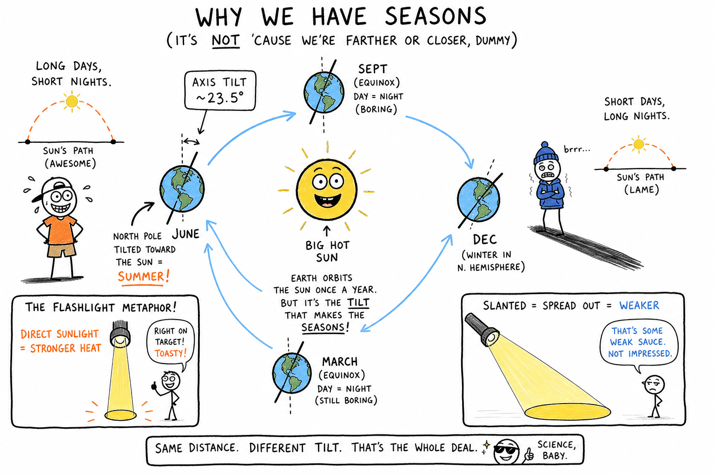

# Seasons

In October you zip a hoodie over your jersey and jog through leaves that crunch under your cleats. In July you are dripping sweat at the pool after a pickup game, searching for shade. In February you scrape frost off the windshield before dawn practice — same field, same bus stop, completely different sky.

Same planet. Same Sun. Completely different feel outside.

Those repeating changes are **seasons**.

They are not random moods of the sky. They are patterns — temperature, storms, daylight, and plant growth that fit together in a familiar way each time of year.

**A season is a long stretch of the year when a region tends to have a certain kind of weather and daylight pattern tied to Earth's position in its orbit around the Sun.**

Once you understand why seasons happen, you can explain why evening practice in June still has light while the same time in December feels dark early — and why a cousin in Australia might be wearing a swimsuit on Christmas while you are in a coat.

You already know Earth's **rotation** gives you day and night (chapter on **rotation of the Earth**) and Earth's **revolution** carries you around the Sun once a year (chapter on **revolution of the Earth**). This chapter connects those motions to the **year's rhythm** — the tilted axis that makes summer hot, winter cold, and your sports schedule feel like a different planet.

## Seasons at a Glance

| Idea | What to remember |
|------|------------------|
| **Season** (astronomical) | Long pattern of weather + daylight tied to Earth's orbit |
| **Sports season** | A block of games or practices — related word, different meaning |
| **Main cause** | Earth's **tilted axis** (~23.5°) as Earth **revolves** |
| **Rotation** | ~24 hours → day and night (not seasons by itself) |
| **Revolution** | ~365 1/4 days → the year; seasons need **tilt + revolution** |
| **Summer recipe** | Higher Sun + **longer days** → stronger heating |
| **Winter recipe** | Lower Sun + **shorter days** → weaker heating |
| **Hemispheres** | Opposite seasons at the **same time** |
| **Distance myth** | Earth nearest Sun in **January** (Northern winter) — tilt wins |
| **Solstice** | Longest or shortest day of the year for a hemisphere |
| **Equinox** | Day and night nearly **equal** worldwide |

## Sports Season vs Astronomical Season

People use the word **season** in two ways, and both are real.

**Sports season** means a block of games or practices: fall football, winter basketball, spring baseball, summer league.

**Astronomical season** means Earth's yearly sunlight pattern: spring, summer, autumn (fall), and winter.

They overlap, but they are not the same thing. A warm January day does not magically turn winter into summer. A rainy July week is still summer. Your travel-team schedule can start in March while astronomical spring begins around the equinox — close, but not identical.

This chapter is about **astronomical seasons** — the science behind the year's rhythm.

## What a Season Really Is

In many places people name four seasons:

- **Spring** — days lengthen, plants wake up, weather often shifts from cold toward warm.
- **Summer** — longest days, strongest heating, pools open, insects buzz, storms can be fierce.
- **Autumn (fall)** — days shorten, leaves change, air often cools, harvest time in farming regions.
- **Winter** — shortest days, weakest heating, frost and snow in many climates.

Near the equator, seasons can feel milder or different, but the Sun still changes its path across the sky during the year.

The big idea is simple to say and deep to understand:

**Earth's seasons are mainly caused by Earth's tilted axis as Earth revolves around the Sun.**

That one sentence contains two separate motions you must keep straight.

## Rotation and Revolution — Do Not Mix Them Up

These words sound alike. Mixing them up is one of the most common mistakes in Earth science — and on tests.

**Rotation** is Earth spinning once about every **24 hours**.

Rotation gives you **day and night**. The chapter on **day and night** explores what that spin feels like from sunrise to midnight.

**Revolution** is Earth traveling around the Sun once in about **365 1/4 days**.

Revolution gives you the **year** and, together with tilt, the **seasons**.

| Motion | What Earth does | About how long | What you notice most |
|--------|-----------------|----------------|----------------------|
| Rotation | Spins on its axis | ~24 hours | Day and night |
| Revolution | Orbits the Sun | ~365 1/4 days | The year; seasons (with tilt) |

Both happen at once. You are spinning with Earth every day while Earth carries you around the Sun every year.

**Memory trick:** **ROT**ation = **ROT**ating in place (like a ball on your fingertip). **REV**olution = **REV**olving around something else (like a lap around the track).

If Earth were **not** tilted, days would still exist, but seasons would be much weaker. **Revolution alone** does not create our familiar spring, summer, fall, and winter. **Tilt plus revolution** does.

## Earth's Axis Is Tilted

Picture a globe on a desk.

The **axis** is the imaginary line through the North Pole and South Pole. Earth spins around that axis every day — the same axis you met in the chapters on **rotation** and **revolution**.

But the axis is **not** straight up-and-down compared with Earth's path around the Sun.

It is tilted by about **23.5 degrees**.

That tilt stays pointed toward roughly the same direction in space — near **Polaris**, the North Star — as Earth goes around the Sun. The axis does not wobble like a spinning top losing balance.

So sometimes the **Northern Hemisphere** leans toward the Sun.

Sometimes it leans away.

Sometimes Earth is in an in-between position.

The **Southern Hemisphere** leans the opposite way at the same time.

That is why Australia can have winter while the United States has summer. Opposite seasons at the same moment are strong proof that **tilt**, not distance, drives the pattern.

## Why Tilt Changes the Strength of Sunlight

When your hemisphere tilts **toward** the Sun, two important things happen.

**First**, the Sun climbs **higher** in the sky at midday.

Higher Sun means sunlight strikes the ground more **directly**.

Direct sunlight concentrates energy into a smaller area — like shining a flashlight straight down onto a table. The bright spot is small and intense.

**Second**, days become **longer**.

Longer daylight means more hours for the ground and air to warm.

Together, direct sunlight and longer days produce **summer** conditions in that hemisphere.

When your hemisphere tilts **away**, the pattern reverses.

The Sun stays **lower** in the sky.

Lower Sun means sunlight arrives more **at a slant**.

Slanted sunlight spreads the same energy over a **larger** area, so each patch of ground receives less intense heating — like tilting the flashlight so the beam stretches into a wide oval.

Days also become **shorter**.

That combination tends to produce **winter** conditions.

Seasonal temperature is really a team effort:

**angle of sunlight + length of daylight.**

Scientists sometimes call the sunlight that reaches a surface **insolation** — incoming solar radiation. More direct insolation over more hours means stronger heating. That is summer's recipe.

**Try this:** Shine a phone flashlight straight on your palm, then at a steep angle. Same light, different spread — same physics the planet uses all year.

## Your Year on the Same Field

Seasons are not only about thermometers. You can **see** and **feel** them where you live.

In summer, your **noon shadow** is short because the Sun is high. In winter, the same clock time can cast a long shadow across the driveway or court.

The Sun rises and sets farther north or south along the horizon as the year turns. In many towns, summer sunsets hang around the west bleachers longer than winter sunsets do.

Evening practice in June still has usable light. The same time slot in December can feel like night is already winning — that is **seasonal** daylight change on top of the daily spin you learned about in **day and night**.

Birds migrate. Trees leaf out or drop leaves. Frost appears on grass. Your gear changes — shorts, hoodie, heavy coat. These living-world and locker-room signs ride on the same astronomical rhythm.

| What to watch | Summer tendency | Winter tendency |
|---------------|-----------------|-----------------|
| Noon shadow | Shorter | Longer |
| Sunset time (same clock) | Later | Earlier |
| Practice after school | More usable light | Darker sooner |
| Midday Sun height | Higher in sky | Lower in sky |

## Distance from the Sun Is Not the Main Story

It sounds reasonable to guess that summer happens when Earth is closest to the Sun.

That guess is wrong for most places on Earth.

Earth's orbit is slightly **elliptical** — a stretched oval — so distance does change a little during the year.

Earth is **closest** to the Sun around **early January**. Astronomers call that point **perihelion** — during Northern Hemisphere **winter**.

Earth is **farthest** around **early July**. That point is **aphelion** — during Northern Hemisphere **summer**.

So winter in places like New York is **not** caused by Earth being far away.

Winter there is caused mainly by **tilt**, **sunlight angle**, and **shorter days**.

Distance has a small effect. Earth's **tilted axis** and **revolution** do the heavy work.

**Memory trick:** **Peri**helion sounds like **peri**od — think "close period" in January. **Ap**helion — **ap**art, farther in July. But neither one decides your hemisphere's season. **Tilt** does.

## Solstices and Equinoxes

Astronomers mark the year with special turning points tied to tilt and orbit.

A **solstice** happens twice a year, when one hemisphere has its **longest day** and the other has its **shortest day**.

The name comes from an old idea that the Sun seems to **stand still** for a few days — its noon height barely changes.

- **June solstice** (around June 20–21): Northern Hemisphere tilted most toward the Sun — longest day there, start of astronomical summer; Southern Hemisphere has its shortest day and winter.
- **December solstice** (around December 21–22): Northern Hemisphere tilted most away — shortest day there and winter; Southern Hemisphere has its longest day and summer.

An **equinox** happens twice a year, when day and night are nearly **equal** all over Earth. The word means **equal night**.

At an equinox, neither hemisphere is tilted strongly toward the Sun.

- **March equinox** (around March 20): begins astronomical spring in the Northern Hemisphere.
- **September equinox** (around September 22–23): begins astronomical autumn there.

Names can vary by culture and local climate, but the astronomy is the same: **tilt plus revolution** creates repeating sunlight patterns.

## Tropics, Polar Circles, and the Geometry of Seasons

Because Earth's axis is tilted about **23.5°**, mapmakers mark special latitude circles that help describe sunlight extremes.

The **Tropic of Cancer** lies near **23.5° north** latitude.

The **Tropic of Capricorn** lies near **23.5° south** latitude.

Between them lies the **tropical zone**, where the Sun can pass **directly overhead** at local noon at some time during the year.

Farther toward the poles, the **Arctic Circle** and **Antarctic Circle** lie near **66.5°** latitude.

Inside those circles, depending on the date, you can experience long runs of daylight or darkness tied to solstice geometry — **polar day** and **polar night**. That is extreme, but real. All from tilt and revolution.

You do not need every name memorized on day one.

You need the idea:

**Tilt prints its signature on the map as latitude circles where sunlight behavior becomes extreme.**

## Latitude Changes How Seasons Feel

Seasons happen everywhere on Earth, but they **feel** different by latitude.

Near the **equator**, day length stays fairly even all year. Temperature may shift with rain patterns more than with snow and ice.

In **mid-latitude** towns — much of the United States, Europe, and parts of Asia — four distinct seasons are familiar: hot summers, cold winters, and transitional spring and fall.

Near the **poles**, daylight can stretch for many hours in summer and nearly vanish in winter. Life adapts to dramatic light swings.

Two cities at the same moment can be in opposite seasons if they are in opposite hemispheres. Two cities in the same hemisphere but different latitudes can have very different winter harshness.

## Seasons, Weather, and Climate

**Weather** is what happens outside today or this week: rain, wind, a heat wave, a blizzard.

**Climate** is the long-term average pattern of weather in a place.

Seasons help shape climate, but they are not the same thing.

A snowy day in April is still **spring** season.

A warm spell in January is still **winter** season.

A freak cold snap in July does not erase summer astronomy.

Seasons describe Earth's **astronomical rhythm**.

Weather is the atmosphere's daily drama inside that rhythm.

## Common Mistakes About Seasons

One mistake is mixing up **rotation** and **revolution**.

Rotation does not create seasons by itself.

Revolution **with tilt** does.

Another mistake is saying summer is because Earth is **closer** to the Sun.

Tilt and sunlight angle matter far more for seasonal heating in each hemisphere. **Perihelion** in January proves the distance story fails for the Northern Hemisphere.

A third mistake is thinking the **whole Earth** has summer at once.

Hemispheres are opposite.

A fourth mistake is believing seasons happen because the Sun **moves farther away from your house** each day.

The Sun's daily path across the sky **changes with season**, but the deeper cause is Earth's **tilt** as Earth **orbits** — not the Sun wandering off on its own.

A fifth mistake is confusing a **warm day** with a **change of season**.

Seasons are long patterns. One unusual day does not rewrite the year's geometry.

## How to Think Like a Season Scientist

When someone asks why it is cold in December or light so late in June, run through this checklist:

- Which hemisphere is tilted **toward** the Sun right now?
- Is sunlight arriving more **directly** or more **at a slant**?
- Are days getting **longer** or **shorter**?
- Is this near a **solstice** or an **equinox**?
- If it is summer here, what season is it in the **opposite hemisphere**?
- Does the evidence point to **distance** or **tilt**?

Seasons are Earth's great yearly lesson in geometry, motion, and energy. They connect the globe in your classroom to the jacket on your hook and the clock on the scoreboard.

## The Big Idea

Seasons are long-term patterns of temperature, daylight, and weather tied to the time of year.

They happen mainly because Earth's axis is tilted about **23.5 degrees** as Earth **revolves** around the Sun, changing the Sun's height in the sky and the length of day.

Summer in one hemisphere means winter in the other — at the same time.

If you remember only one sentence, remember this:

**Seasons are caused mainly by Earth's tilted axis as Earth revolves around the Sun, not by Earth simply moving closer or farther away.**

## Study Questions

1. What is a season (in the astronomical sense)?
2. How is an astronomical season different from a sports season?
3. What two motions of Earth must you keep separate when explaining seasons?
4. What is Earth's axis?
5. About how many degrees is Earth's axis tilted?
6. What is the main cause of Earth's seasons?
7. When the Northern Hemisphere tilts toward the Sun, what tends to happen to the Sun's midday height and to day length there?
8. Why does direct sunlight warm the ground more strongly than slanted sunlight?
9. What is insolation in simple terms?
10. Name two changes you might notice in your own town between summer and winter besides temperature.
11. If it is summer in the Northern Hemisphere, what season is it in the Southern Hemisphere?
12. Why is distance from the Sun not the main cause of seasons?
13. When is Earth closest to the Sun, and what season is it in the Northern Hemisphere then? What is that closest point called?
14. What is a solstice?
15. What is an equinox?
16. During an equinox, are day and night nearly equal across Earth?
17. What happens in the Northern Hemisphere at the June solstice?
18. How is weather different from climate in simple terms?
19. Name one common misconception about seasons and correct it.
20. What is revolution, and how long does Earth take to revolve around the Sun once?
21. What are the Tropic of Cancer and the Tropic of Capricorn, and about what latitude are they found?
22. What is special about the region inside the Arctic Circle or Antarctic Circle compared with mid-latitude towns?
23. Why do seasons feel different near the equator than in mid-latitude regions?
24. In your own words, explain why **tilt plus revolution** matters more than **distance alone** for seasons.
