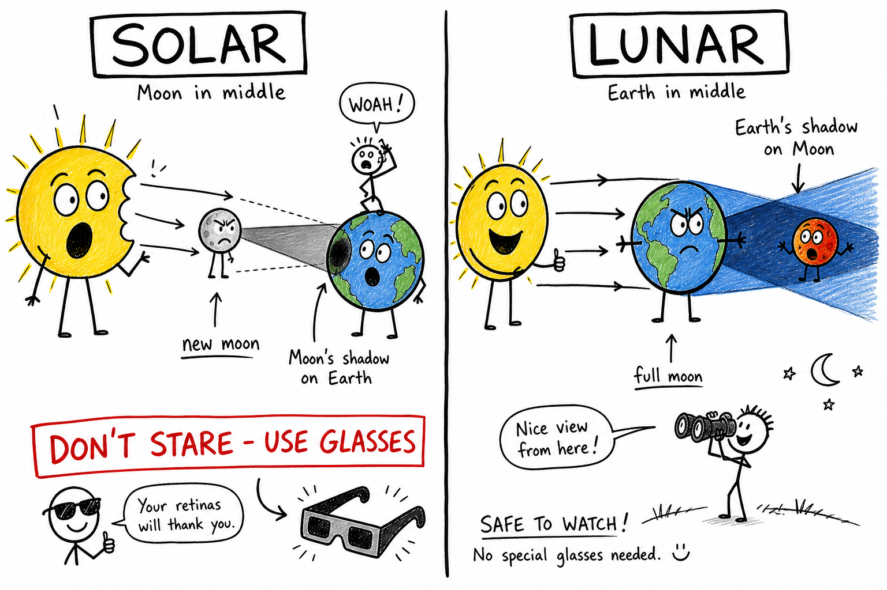

# Eclipse

You are outside at recess when someone shouts, "Look up!" The Sun looks wrong — like something took a curved bite out of it. The air cools. Shadows on the pavement sharpen into thin crescents, as if a thousand tiny moons are hiding in the tree leaves. A teacher hands out stiff cardboard glasses with dark film and says, "Do not stare without these — not even for a second."

Or maybe it is a clear night after a late game. The full Moon rises over the bleachers, bright as a stadium light. An hour later it is dimmer. Then copper-red, hanging in the sky like a coin dipped in rust. Your team stops arguing about the score and just watches.

Both scenes are **eclipses**.

They are not magic. They are not random punishments from the sky. They are **shadows** — huge shadows — cast when the Sun, Earth, and Moon line up in space.

Once you know which object is in the middle and which shadow falls where, eclipses stop feeling mysterious. They start feeling like geometry you can predict years ahead — the same kind of clockwork that tells you when the Moon will be full, as you learned in the chapter on the **Moon**.

**An eclipse is an event where one astronomical body moves into another's shadow, or passes in front of another from a viewer's perspective, changing how light reaches us.**

On Earth, the two eclipses you notice most are **solar eclipses** and **lunar eclipses**. The names sound alike. The setups are completely different — and mixing them up is like confusing rotation with revolution. Fix that one mistake and the whole topic clicks.

## Two Shadow Stories — Do Not Mix Them Up

This is the rule that unlocks the whole chapter:

| Eclipse type | Who is in the middle? | Whose shadow falls where? | Moon phase (roughly) | Safe to look with bare eyes? |
|--------------|----------------------|---------------------------|----------------------|------------------------------|
| **Solar** | Moon between Earth and Sun | **Moon's shadow** on Earth | Near **new moon** | **No** — use proper protection or projection |
| **Lunar** | Earth between Sun and Moon | **Earth's shadow** on the Moon | Near **full moon** | **Yes** — like any night sky viewing |

**Solar eclipse:** the Moon blocks the Sun *for you on Earth*.

**Lunar eclipse:** Earth blocks sunlight from reaching the Moon, and you watch the Moon dim or turn red.

If you remember only the middle object, you are halfway to mastering eclipses.

**Memory trick — SOLAR vs LUNAR:**

- **SOLAR:** **S**un gets blocked. **M**oon is in the **M**iddle. Moon's shadow hits **E**arth.
- **LUNAR:** **L**ook at the **M**oon at night. **E**arth is in the **E**middle. **E**arth's shadow hits the Moon.

Say it out loud once. It beats guessing on a test.

## Solar Eclipse: The Moon Covers the Sun

A **solar eclipse** happens when the Moon passes between Earth and the Sun and blocks some or all of the Sun's light for viewers in certain places.

From Earth, the Moon and Sun can look almost the same size in the sky — even though the Sun is vastly larger. The Sun is about 400 times wider than the Moon, but it is also about 400 times farther away. That coincidence of distance and size is why the Moon's disk can cover the Sun's disk when the alignment is right. As you learned in the chapter on the **Sun**, our star is enormous; the Moon just happens to sit at the right distance to block it from where we stand.

### Total, Partial, and Annular

Not every solar eclipse looks the same.

A **partial solar eclipse** is the most common view for any one location: only part of the Sun's disk is covered. It can still feel strange — dimmer light, weird shadows — but a slice of the Sun stays bright.

A **total solar eclipse** needs a near-perfect lineup. Along a narrow path on Earth, the Moon fully covers the Sun's bright face. Day can turn toward twilight. Stars may peek out. For a short time — often only a few minutes — you may see the **corona**, the Sun's faint outer atmosphere, glowing like a silver wreath around a black hole where the Sun used to be. Totality is one of the most dramatic sights in nature. People travel across countries to stand in that narrow path.

An **annular solar eclipse** happens when the Moon is aligned with the Sun but a bit farther from Earth in its orbit, so it looks slightly smaller in the sky. The Moon cannot fully cover the Sun. A bright ring of sunlight remains — sometimes called a "ring of fire." It is still a solar eclipse. It is still dangerous to view without proper protection.

| Type | What you see (simple version) | How rare along one path |
|------|------------------------------|-------------------------|
| Partial | A bite taken out of the Sun | Common outside totality path |
| Total | Sun fully covered; corona may show | Rare for any one town |
| Annular | Bright ring around the Moon | Uncommon; depends on orbit distance |

### The Path of Totality

During a **total** solar eclipse, the Moon's dark inner shadow — the **umbra** — traces a narrow ribbon across Earth's surface. Only people inside that moving path see totality.

Outside the path, you might see a partial eclipse if the geometry is close. That is why your cousin three states away might get a decent partial view while you get totality — or nothing impressive at all.

Earth is huge. The Moon's shadow on the ground is small — often only about 100 to 200 kilometers wide during totality. A total solar eclipse for your hometown might not happen again for centuries. That is why people book hotels years ahead and drive across state lines: they are chasing a moving ribbon of darkness that lasts only a few minutes.

### The Safety Rule That Matters

Solar eclipses are spectacular. They are also dangerous if you handle them wrong.

**Never look directly at the Sun during a solar eclipse without proper eye protection designed for solar viewing.**

Ordinary sunglasses are **not** safe. Not even very dark ones. The Sun can damage your eyes even when it looks dim or mostly covered. The uncovered part of the Sun is still intense enough to harm the **retina** — the light-sensitive layer at the back of your eye. Damage can be permanent.

Safe options include:

- **Eclipse glasses** that meet recognized safety standards (not homemade filters, not old scratched pairs unless you know they are certified)
- **Approved solar filters** on binoculars or telescopes — never use regular optics pointed at the Sun without the right filter
- **Projection methods** — letting the Sun's image fall on a screen through a pinhole or projector so you look at the image, not the Sun itself

If you are unsure, ask a science teacher, planetarium, or astronomy club. When in doubt, do not risk your eyes.

A **lunar eclipse** is a different story for safety — more on that below.

## Lunar Eclipse: Earth Covers the Moon

A **lunar eclipse** happens when the Moon passes through **Earth's shadow**.

This can occur only near **full moon**, when Earth sits between the Sun and the Moon and the near side of the Moon is fully lit from Earth's point of view.

Earth is bigger than the Moon. Earth's shadow in space is bigger too. When the Moon slides into that shadow, the eclipse can be visible to everyone on the night side of Earth who can see the Moon — a much wider audience than a solar eclipse.

### Umbra and Penumbra

Shadows are not all-or-nothing. A big light source like the Sun makes shadows with two main zones:

- The **umbra** is the deep inner shadow where direct sunlight is fully blocked.
- The **penumbra** is the lighter outer shadow where sunlight is only partly blocked.

Think of standing near a goalpost on a sunny field. Close behind the post, your shadow is sharp and dark — like the umbra. Farther out, the shadow fades and blends — like the penumbra.

### Total, Partial, and Penumbral Lunar Eclipses

A **total lunar eclipse** occurs when the entire Moon enters Earth's umbra. The Moon does not disappear. Some sunlight **bends** through Earth's atmosphere and still reaches the Moon. Earth's air scatters shorter wavelengths (blues) more than longer ones (reds). The light that gets through can paint the Moon **copper, orange, or rust-red**. People sometimes call this a "blood moon" in popular language. Scientists still say **lunar eclipse** — the red color is physics, not horror.

A **partial lunar eclipse** happens when only part of the Moon enters the umbra. You see a dark bite on one side of the disk while the rest stays bright.

A **penumbral lunar eclipse** is subtle: the Moon passes only through Earth's penumbra. The dimming can be hard to notice unless you are watching carefully or comparing photos.

A lunar eclipse is **generally safe** to watch with your eyes, binoculars, or a small telescope — the Moon is never as bright as the Sun. Dress for the weather, avoid tripping in the dark, and use equipment carefully as you would for any night observing.

## Moon Phases Are Clues, Not Extras

Eclipses connect directly to the Moon's monthly cycle — but they do **not** happen every month.

A **solar eclipse** can happen only near **new moon**, when the Moon is roughly between Earth and the Sun. The sunlit side of the Moon faces away from Earth; we see little or no Moon in the sky.

A **lunar eclipse** can happen only near **full moon**, when Earth is roughly between the Sun and the Moon and the near side is fully lit.

So if someone says, "There was a lunar eclipse last week during a crescent moon," the geometry does not work. Phases tell you which eclipse type is even possible.

**Phases** are caused by which part of the sunlit Moon we see as it orbits Earth. **Lunar eclipses** are caused by Earth's shadow on the Moon. Do not confuse the two — the Moon chapter makes the same warning, because "Earth's shadow causes phases" is one of the most common wrong answers in middle school science.

## Why Eclipses Do Not Happen Every Month

The Moon orbits Earth about once every **27.3 days** (compared with the stars). The cycle of phases — new to full and back — takes about **29.5 days** because Earth is also moving around the Sun.

So you might think: new moon every month, full moon every month — eclipses every month.

They do not happen that often, because the Moon's orbit is **tilted** by about **5 degrees** compared with Earth's path around the Sun (the **ecliptic**). Most months, the Moon passes slightly above or below the perfect line between Sun, Earth, and Moon.

Eclipses occur when the lineup is good enough near special crossing points in the orbit called **nodes** — where the Moon's path crosses the ecliptic plane.

That is why eclipses are rare treats, not nightly news. Several can happen in one year; then none for a while. Astronomers publish eclipse maps years in advance because the motions are that predictable — the same careful orbit math behind **revolution of the Earth** and the yearly calendar.

## What Totality Feels Like

People who have stood in the path of totality often describe the same things:

- Temperature drop, like evening arriving in minutes
- Odd shadows — crescent-shaped under trees as leaves act like thousands of pinholes
- Confused birds or insects
- A thin band of sunset colors on the horizon while the sky overhead goes dark
- The corona appearing when the bright disk vanishes — delicate, bright, unlike anything in a textbook drawing

A partial solar eclipse is interesting. Totality is unforgettable. If you ever get a chance to see one safely and legally from the path of totality, treat it as a serious sky event — not a two-second glance at lunch.

## Ancient Observers, Modern Predictions

Long before apps and satellites, people watched the sky carefully. Many cultures recorded eclipses — sometimes with fear, sometimes with curiosity. Chinese astronomers, Babylonian tablets, and Mayan calendars all tracked patterns. When the sky "broke its rules," rulers and priests took notice.

Today, scientists predict eclipses using precise measurements of orbits plus the physics of gravity — from Newton's laws to Einstein's refinements for extreme cases. Ships, airlines, and phone apps publish eclipse paths years ahead. If someone claims eclipses are random surprises to science, that is false. They are clockwork with complicated gears.

## Eclipses as Science Tools

Eclipses are not only shows. They are experiments written in the sky.

A **total solar eclipse** is one of the few times observers on the ground can study the Sun's **corona** without special instruments blocking the bright disk. The corona is hotter than the visible surface and tied to **solar wind** and space weather that can affect satellites and power grids.

**Lunar eclipses** help scientists learn about Earth's **atmosphere**. The exact color and brightness of a reddened Moon depend on dust, clouds, and volcanic material in the air along Earth's edge. After major volcanic eruptions, totally eclipsed Moons have sometimes looked darker or grayer because the atmosphere scattered light differently.

Even in the age of space telescopes, a total solar eclipse from the ground is still a valuable observing window — which is one reason scientists and fans chase them around the world.

## Eclipses in the Real World

You do not need a research telescope to care about eclipses.

- **Phone apps and websites** publish eclipse times, maps, and safety reminders. Check them before you look up.
- **Partial solar eclipses** reach many towns. Totality is rare, but a partial bite out of the Sun is still worth planning for — with real eclipse glasses, not sunglasses.
- **Lunar eclipses** are slow sky shows. You can watch from a backyard, a park, or a parking lot after practice. No special glasses required.
- **School and club events** sometimes hand out certified filters or run pinhole stations. Treat those like sports equipment: use the right gear for the job.

If an eclipse is coming to your region, mark the date. Ask an adult or science teacher about safe viewing before the day arrives.

## Try This — No Sun-Staring Required

You can practice eclipse thinking without risking your eyes.

1. **Lamp and ball model:** Use a bright desk lamp (Sun), a globe or ball (Earth), and a smaller ball (Moon). Slide the Moon between lamp and Earth to model a **solar** eclipse — shadow on Earth. Put Earth between lamp and Moon to model a **lunar** eclipse — shadow on the Moon. Label who is in the middle each time.
2. **Pinhole crescents:** On a sunny day, stand under a leafy tree or overlap your fingers slightly. Look at the ground, not the Sun. The tiny gaps act like pinholes and cast crescent-shaped spots — the same idea as during a partial solar eclipse.
3. **Shadow zones:** Hold a ball close to a wall under one lamp. Move the ball slowly. Sketch where the shadow is darkest (umbra) and where it fades (penumbra). Connect that sketch to why a lunar eclipse can look red only in the deep shadow.
4. **Headline drill:** Read a fake news line — "Red Moon visible tonight across the country." Write: solar or lunar? Which phase? Safe to look? Who can see it?

Write one sentence about what you learned. That sentence is how scientists start — with a clear observation, not a guess.

## Common Misconceptions

One mistake is thinking a **lunar eclipse** can happen at any moon phase. Lunar eclipses need **full moon** geometry — Earth between Sun and Moon.

Another mistake is staring at a **solar eclipse** without protection because "it feels darker." Dim does not mean safe. The uncovered part of the Sun can still burn your retina.

A third mistake is swapping the shadows: **Earth's shadow on the Moon** causes a lunar eclipse. The **Moon's shadow on Earth** is involved in a solar eclipse. Earth's shadow does not cause a solar eclipse.

A fourth mistake is thinking **phases** and **eclipses** are the same thing. Phases happen every month from changing viewing angle. Eclipses need a tight lineup and the right node timing.

Finally, do not assume you must travel to Antarctica to ever see one. Partial solar eclipses and lunar eclipses are visible from many places. Totality is special — but check eclipse calendars for your region across the next decade. You might get a partial sooner than you think.

## How to Think Like an Eclipse Scientist

When you hear "eclipse" in the news, run through this checklist:

- Which object is in the **middle** — Moon or Earth?
- Whose **shadow** is falling on whom?
- What **moon phase** fits — new (solar) or full (lunar)?
- **Where** on Earth can people see it, and is it total, partial, or annular?
- Is it **safe** to look? (Solar: almost always needs a plan. Lunar: usually yes.)

Draw a quick sketch: Sun on the left, Earth in the middle or not, Moon on the right. Arrows for light. Shade the shadow cone. Thirty seconds of drawing beats ten minutes of guessing.

Eclipses are shadows written large across the solar system — and you live on one of the worlds that can watch them happen.

## The Big Idea

A **solar eclipse** happens when the Moon passes between Earth and the Sun and the Moon's shadow falls on part of Earth.

A **lunar eclipse** happens when the Moon passes through Earth's shadow, often turning reddish because sunlight bends through our atmosphere.

If you remember only one sentence, remember this:

**Eclipses are alignment events involving shadows: the Moon's shadow on Earth for solar eclipses, and Earth's shadow on the Moon for lunar eclipses.**

## Study Questions

1. What is an eclipse in general terms?
2. What is a solar eclipse?
3. What is a lunar eclipse?
4. During a solar eclipse, which object is mainly between the other two?
5. During a lunar eclipse, which object is mainly between the other two?
6. In one sentence, how are solar and lunar eclipses different in terms of shadows?
7. Name the three main types of solar eclipse and describe each in simple words.
8. What is the difference between a **total** and an **annular** solar eclipse?
9. Why can a total solar eclipse be visible from only a narrow region on Earth?
10. What is the **path of totality**?
11. Why can a total lunar eclipse look red?
12. What are the **umbra** and **penumbra**?
13. What is the difference between a total, partial, and penumbral lunar eclipse?
14. Near which moon phase can a solar eclipse occur, and near which phase can a lunar eclipse occur?
15. Why do eclipses not happen every month?
16. What are **nodes**, and how do they relate to eclipses?
17. Why is it dangerous to look at the Sun during a solar eclipse without proper protection?
18. Are ordinary sunglasses safe for viewing a solar eclipse? Why or why not?
19. Is a lunar eclipse generally safe to view with the unaided eye?
20. Name two safe ways to observe a solar eclipse without looking directly at the Sun.
21. Name one common misconception about eclipses and correct it.
22. Name one way eclipses are useful to scientists today, beyond looking impressive.
23. Why can the Moon cover the Sun in the sky even though the Sun is much larger?
24. In your own words, explain the "two shadow stories" rule for solar vs lunar eclipses.
25. Name one "Try This" activity from the chapter that helps you model or observe eclipse shadows without looking directly at the Sun.
