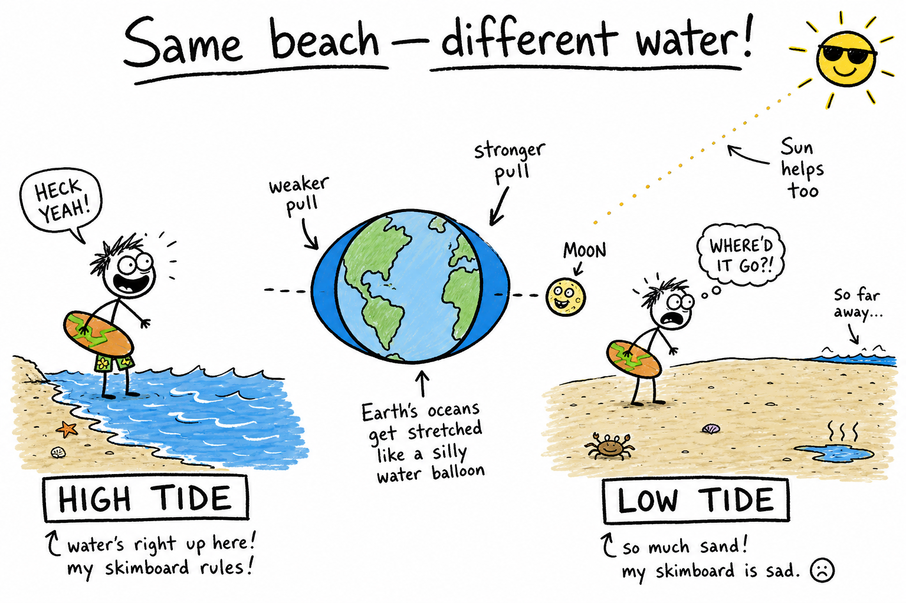

# Tides

You show up at the beach at 7 a.m. with a skimboard. The water is almost at the dunes — perfect for a long run and a fast slide. You come back at 4 p.m. and the same stretch of sand is a football field wide. The waves break far from where you stood this morning.

Same beach. Same ocean. Different water level.

That slow rise and fall is a **tide**.

Tides are one of the clearest signs that Earth is not an isolated rock floating alone. The **Moon** and **Sun** pull on our planet from across space, and the oceans respond. Surfers, sailors, fishermen, bridge engineers, and anyone who explores tide pools all live by that rhythm — whether they call it "science" or just "check the tide app before we go."

**A tide is the regular rise and fall of sea level caused mainly by gravitational forces from the Moon and Sun acting on Earth's oceans, together with Earth's rotation.**

Once you understand tides, you can explain why a kayak launch might be easy at noon and muddy at sunset — and why a storm hitting at the wrong hour can turn a normal high tide into serious flooding.

If you have read the chapters on the **Moon**, **rotation of the Earth**, and **day and night**, you already have half the puzzle. The Moon orbits Earth. Earth spins. Sunlight and gravity both reach across space. Tides are where those ideas meet the water at your feet.

## What a Tide Really Is

When people say **tide**, they usually mean the ocean moving up and down along a coast over hours — not the wind-chop on the surface.

Scientists describe a **tide** as a large-scale change in sea level tied to the positions of the Moon, Sun, and Earth — not a single wind wave rolling in.

That matters because:

- **Tides** are slow and predictable over days and weeks.
- **Wind waves** are fast ripples and breakers driven mostly by wind.
- **Storm surge** is extra water piled up by a hurricane or severe storm — dangerous, but a different mechanism.

If you mix those up, you might blame "the tide" for a windy afternoon splash when the real story is gusts — or underestimate flood risk when a storm arrives at **high tide**.

| What you see | How fast it changes | Main cause |
|--------------|---------------------|------------|
| **Tide** | Hours | Moon and Sun gravity, Earth's spin, coast shape |
| **Wind wave** | Seconds | Wind on the surface |
| **Storm surge** | Hours during a storm | Low pressure and powerful winds |

## Gravity: The Invisible Rope

**Gravity** is the attractive force between any two masses.

Earth pulls on you. You pull on Earth (a tiny amount). The Moon pulls on Earth. Earth pulls on the Moon.

For tides, the important idea is not just "gravity exists." It is that **gravity is slightly stronger on the side of Earth closer to the Moon and slightly weaker on the side farther away.**

Picture Earth as a ball of putty with the Moon off to one side. The near side gets tugged a bit harder. The far side gets tugged a bit less hard than the center. Over vast oceans, that difference helps create a pattern of bulging water — often described as two main bulges in a simplified model, one toward the Moon and one on the opposite side.

You do not need every equation at age twelve.

You need the honest core:

**The Moon's gravity is the main driver of ocean tides on Earth.**

**Memory trick:** **Moon close, Sun far.** The Sun is much more massive, but the Moon is much closer — and closeness wins for everyday ocean tides.

## Why the Moon Wins Over the Sun

The Sun is far more massive than the Moon. So why does the Moon matter more for everyday ocean tides?

Because the Moon is **much closer**.

Tidal effects depend strongly on distance. The Sun still matters — a lot — but the Moon dominates the day-to-day rhythm at most coasts.

| Body | Mass (very rough) | Distance from Earth | Role in ocean tides |
|------|-------------------|---------------------|---------------------|
| Moon | Smaller than Earth | ~384,000 km (close) | **Main** driver |
| Sun | Huge | ~150 million km (far) | Important **modifier** |

When the Sun and Moon work together, tides can swing higher and lower. When they partly cancel, tides calm down. That monthly pattern is one of the coolest "hidden calendars" on the planet — and it lines up with **moon phases** you may have studied already.

## High Tide, Low Tide, and Tidal Range

When the ocean surface is higher than its average level for that cycle, that is **high tide**.

When it is lower, that is **low tide**.

The difference between a typical high and low in one place is the **tidal range**.

Some coasts barely notice — a meter or less.

Others are famous for enormous ranges. The **Bay of Fundy** between New Brunswick and Nova Scotia in Canada can see tidal ranges of about **15 meters** (roughly 50 feet) — tall as a five-story building. Water rushes in and out of narrow bays like a giant bathtub sloshing.

Geography matters. A wide open beach and a narrow funnel-shaped bay do not behave the same even under the same Moon.

| Term | Plain meaning |
|------|---------------|
| **High tide** | Water level near its peak for that cycle |
| **Low tide** | Water level near its minimum for that cycle |
| **Tidal range** | Typical height difference between high and low |

## Spring Tides and Neap Tides

Tides change over a **month**, not just over a day.

When the Sun, Moon, and Earth line up at **new moon** or **full moon**, their tidal pulls combine more strongly. The tidal range tends to grow. Those are called **spring tides**.

The name is **not** about the season spring. It is an old word idea — the water can "spring" higher and fall lower.

When the Moon is at **first quarter** or **third quarter** relative to the Sun–Earth line, the tidal forces partly cancel. Ranges shrink. Those are **neap tides**.

| Moon phase (simplified) | Sun–Moon–Earth layout | Name | Typical tidal range |
|-------------------------|------------------------|------|---------------------|
| New or full | Roughly lined up | **Spring tide** | Larger (higher highs, lower lows) |
| First or third quarter | Sun and Moon pull at angles | **Neap tide** | Smaller |

Surfers and sailors often learn the lunar calendar without thinking about it: certain weeks bring bigger swings at the same harbor.

**Memory trick:** **Spring** tides at **full** and **new** — think "full swing" of the water. **Neap** tides at **quarter** moons — think "nearer to average," smaller swings.

## Why Many Places Get Two High Tides a Day

Earth **rotates** once about every 24 hours — the same spin that drives **day and night**.

In a simple two-bulge picture, as Earth spins, a given beach can pass through regions of higher water twice in one rotation — which helps explain why many coasts see roughly **two highs and two lows** per day.

In the real world, continents, ocean depth, and coast shape scramble the timing.

Scientists group common patterns:

- **Semidiurnal** — roughly two highs and two lows per day (common on the U.S. Atlantic coast).
- **Diurnal** — roughly one high and one low per day (some Gulf of Mexico areas).
- **Mixed** — two highs and two lows, but one is clearly higher than the other (parts of the U.S. Pacific coast).

The Moon and Sun set the forcing rhythm. **Local geography** sets the schedule on your watch.

That is why two beaches an hour apart can have high tide at different clock times.

| Pattern | Highs per day (roughly) | Lows per day (roughly) | Example region |
|---------|-------------------------|------------------------|----------------|
| **Semidiurnal** | 2 | 2 | U.S. Atlantic coast |
| **Diurnal** | 1 | 1 | Parts of Gulf of Mexico |
| **Mixed** | 2 (unequal) | 2 (unequal) | Parts of U.S. Pacific coast |

## Tides Versus Wind Waves and Storm Surge

**Wind waves** are what you see on a breezy afternoon: energy moving through the water, crests forming and breaking, often gone in seconds.

You can have huge wind waves during **low tide** or **high tide**. Wind and astronomy are separate players.

**Tides** are the slow breathing of mean sea level — the baseline the waves ride on top of.

A **storm surge** is a mound of water pushed by low pressure and powerful winds in a hurricane or severe coastal storm. It can add meters of extra height on top of whatever the tide is already doing.

That combo is why emergency managers warn about "storm surge at high tide." Normal high water plus surge plus wind-driven waves can send water blocks inland.

Think of it in layers:

1. **Tide** — slow up-and-down baseline (Moon, Sun, spin, coast).
2. **Wind waves** — fast ripples on top of that baseline.
3. **Storm surge** — extra mound from weather, stacked on whatever the tide is doing.

## Tides in Action: Who Cares?

Tides are not just textbook diagrams. They shape real jobs and adventures.

**Surfers and skimboarders** watch tide charts because shape and depth change how waves break. A reef that is perfect at mid tide can be dry rock or mushy soup at the wrong hour.

**Fishermen** know some species move with incoming or outgoing water.

**Sailors and captains** need enough depth at docks and channels — running aground at low tide is expensive and embarrassing.

**Tide-pool explorers** time trips for low tide, when rocks expose crabs, anemones, and snails.

**Bridge and harbor engineers** design for clearance when water is highest.

**Coastal scientists** study erosion lines that shift with every cycle.

Before smartphones, harbors lived by printed **tide tables**. Today an app can tell you tomorrow's high and low to the minute — but the physics behind the numbers is the same ancient clock.

## Reading a Tide Table (Basics)

A **tide table** lists predicted high and low times and heights for a specific place.

Key ideas:

- Times are usually **local** and tied to one station — do not assume the next town matches.
- **Height** is measured from a reference level called **chart datum** (sailors need this for safe depth).
- Predictions assume normal weather; storms can push water higher than the table says.

Try this mental habit: before a beach trip, ask **"Are we going at high or low?"** Then plan shoes, access paths, and safety.

Example of what you might see (times and heights vary by place):

| Event | Time | Height (example) |
|-------|------|------------------|
| Low tide | 6:12 a.m. | 0.4 m |
| High tide | 12:38 p.m. | 2.1 m |
| Low tide | 6:54 p.m. | 0.6 m |
| High tide | 1:02 a.m. (next day) | 2.3 m |

Always use a table for **your** harbor or beach — not a city an hour away.

## Life in the Tidal Zone

The strip between high and low tide — the **intertidal zone** — is a harsh, exciting habitat.

Animals there must survive being underwater part of the day and exposed to sun, birds, and drying air the rest.

Hermit crabs scramble in tide pools.

Barnacles glue themselves to rocks.

Shorebirds run ahead of the incoming edge of water.

Some fish spawn on particular tides. Coastal wetlands depend on regular flooding to bring nutrients and sediment.

Humans have built ports, salt farms, and cities on tidal rivers for thousands of years. When you learn tides, you are learning a clock that governed trade long before mechanical clocks were accurate.

## Tides Are Not Only in the Ocean

The solid Earth itself flexes slightly with tidal forces — **Earth tides**. You do not feel them, but sensitive instruments detect them.

The atmosphere has **atmospheric tides** too.

For most people, though, **ocean tides** are the visible ones: ships, bridges, marshes, and beaches.

## Common Mistakes About Tides

One mistake is thinking tides happen because Earth **spins faster** than the Moon and "throws" water off. Rotation affects **timing**, but the **forcing** comes from gravity and the changing Sun–Moon–Earth geometry.

Another mistake is believing **only the Moon** matters. The Sun significantly strengthens or weakens tidal range through the month.

A third mistake is expecting every beach worldwide to have two equal highs each day. **Local geography** can reshape the pattern.

A fourth mistake is confusing **one big wind wave** with the tide. Check the baseline water level over hours, not a single breaker.

A fifth mistake is ignoring **storm surge** because "it's not a full moon." Surge can flood at any lunar phase if winds and pressure are extreme — especially on top of high tide.

## How to Think Like a Tide Scientist

When someone asks why the dock was underwater last Tuesday but not today, run through this checklist:

- Where are the **Moon and Sun** in their cycle — near spring or neap geometry?
- Is this coast **semidiurnal**, **diurnal**, or **mixed**?
- Could **bay shape** or **channel depth** amplify the range?
- Is there a **storm** adding surge on top of astronomical tide?
- Are you using a tide table for **this exact station**, not a city an hour away?

Tides are a daily handshake between Earth's rotation and the Moon's month-long orbit — with the Sun joining the push-and-pull on a longer beat.

## The Big Idea

Tides are regular changes in sea level caused mainly by gravitational pulls of the **Moon** and **Sun** on Earth's oceans, modified by Earth's **rotation** and **coastal geography**.

**Spring tides** (bigger range) tend to occur around **new** and **full moon** when Sun and Moon align. **Neap tides** (smaller range) tend to occur around **quarter** moons when their effects partly cancel.

If you remember only one sentence, remember this:

**Tides are mostly driven by the Moon's gravity (with important help from the Sun), and they change with both the day and the month.**

## Study Questions

1. What is a tide?
2. What force is mainly responsible for ocean tides on Earth?
3. Why is the Moon especially important for tides even though the Sun is much more massive?
4. What is the difference between high tide and low tide?
5. In simple words, what is tidal range? Give one example of a place with a very large range.
6. What are spring tides, and when in the lunar month do they tend to occur?
7. What are neap tides, and when do they tend to occur?
8. Why is the word "spring" in spring tides confusing? What does it actually refer to?
9. How does the Sun affect tides if the Moon is the main driver?
10. Name two common tidal patterns (semidiurnal and diurnal) and explain them simply.
11. What is a mixed tide?
12. Why might two nearby beaches experience high tide at different clock times?
13. How is a wind wave different from a tide?
14. What is storm surge, and why can it be especially dangerous at high tide?
15. Name two activities or jobs where people need to know the tide schedule.
16. What is a tide table used for?
17. What is the intertidal zone?
18. Name one misconception about tides and correct it.
19. Besides oceans, name another part of Earth that experiences tidal effects (even if small).
20. In the simple two-bulge model, why can a rotating beach pass through high water about twice per day?
21. How do bay shape and coastline affect tidal range? Use the Bay of Fundy or another example in your answer.
22. If you are planning a tide-pool trip, would you aim for high tide or low tide? Why?
23. How might climate and weather change affect tide predictions on a particular day?
24. In your own words, explain why tides are a "clock" tied to both the day and the month.
