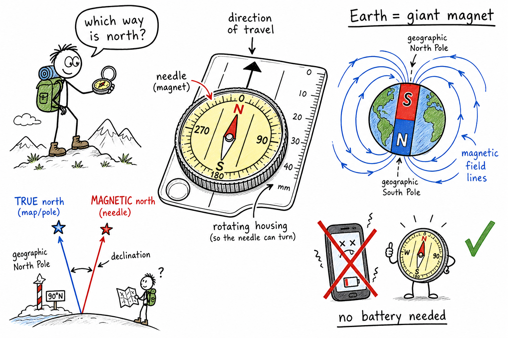

# Compass

You are on a weekend hike with friends. The trail splits three ways. Pine trees look the same in every direction. Your phone shows one bar of battery, then dies. The sun is dropping behind the hills, and you promised to meet your group at the parking lot on the east side of the lake.

You pull a small compass from your pack. The needle swings, settles, and points. Suddenly you are not guessing. You have a tool that talks to something bigger than any trail sign — Earth's own magnetic field.

**A compass is a tool that uses Earth's magnetic field to help you find directions, especially north and south, and from those, east and west.**

People have used compasses for centuries to cross oceans, explore deserts, march through forests, and find their way home. Sailors, soldiers, scouts, pilots, and hikers still rely on them. Even in the age of GPS, a compass is one of the best backups you can carry because it needs no battery and no cell signal.

## What a Compass Does

A compass does not tell you where you are on a map by itself. It tells you **direction**.

The classic pocket compass has a **magnetized needle** mounted so it can spin freely. When you hold the compass level and still, the needle aligns with Earth's magnetic field and points roughly toward the **magnetic north** direction near Earth's surface.

Markings around the dial — often a rotating ring called the **housing** — let you read directions in degrees. With practice, a compass becomes a bridge between the map in your hands and the land in front of you.

## How a Compass Works

A compass needle is a **magnet**.

Magnets have a **north pole** and a **south pole**. Opposite poles attract. Like poles repel.

Earth behaves like a giant magnet. Its magnetic field stretches from deep inside the planet out into space. The needle in your compass is a small magnet sitting in that big field. The north-seeking end of the needle is pulled into alignment with the field lines around you.

Here is the part that confuses almost everyone at first: the end of the needle marked "N" is attracted toward Earth's **magnetic south pole**, which sits near Earth's geographic **north** polar region. That is why we simply say the needle points "north." What we mean is: the labeled north end points generally toward the Arctic end of Earth, along the direction of the magnetic field at your location.

No magic. No satellite. Just a magnet responding to a planet-sized magnet.

## Directions on Earth

Navigators name four main **cardinal directions**:

**North, east, south, and west.**

They go clockwise around a circle. Halfway between them are **intercardinal** directions — northeast, southeast, southwest, and northwest.

| Direction | Degrees (clockwise from north) |
|-----------|-------------------------------|
| North | 0° or 360° |
| Northeast | 45° |
| East | 90° |
| Southeast | 135° |
| South | 180° |
| Southwest | 225° |
| West | 270° |
| Northwest | 315° |

A compass helps you hold a steady **heading** — the direction you are traveling — while walking, paddling, skiing, or riding. That matters most when landmarks disappear: fog, thick woods, open desert, or night.

## True North vs Magnetic North

Here is one of the most important facts in navigation:

**Compass north is usually not exactly the same as true geographic north.**

**True north** is the direction toward the North Pole along Earth's rotation axis. Mapmakers often draw maps so that "up" on the page matches true north.

**Magnetic north** is the direction a compass needle actually points. It is controlled by Earth's magnetic field, not by the spin axis.

The angle between true north and magnetic north at a given place is called **magnetic declination**. Declination changes slowly over the years as Earth's magnetic field shifts. In some parts of the world it is only a degree or two. In others it can be much larger.

If you ignore declination on a long hike, you can walk confidently in the wrong direction. Maps for serious navigation often include declination notes so you can correct your compass readings.

## Bearings and the Compass Rose

A **bearing** is a direction stated as an angle, usually measured **clockwise from north**.

North is **0°** (or **360°**). East is **90°**. South is **180°**. West is **270°**.

If a trail guide says "follow a bearing of 45°," you are heading northeast. If it says "270°," you are heading west.

Many maps show a **compass rose** — a symbol, often decorated with arrows, that shows which way north is drawn on that map. Always check the rose before you assume "up" on a map is true north.

A **baseplate compass** — the kind hikers and orienteers use — has a clear plastic base, a rotating dial, and a direction-of-travel arrow. You can line up the edge of the compass with a direction on your map, twist the housing until the needle matches the correction you need, and read a bearing off the dial. With practice, you can plan a route on paper and then walk it in the field.

## Types of Compasses

Not every compass looks like a pocket watch.

**Liquid-filled compass:** The needle floats in oil or another fluid. The fluid dampens bouncing so the needle settles faster — useful when you are walking.

**Baseplate compass:** Designed for map work. Has rulers, arrows, and a rotating housing for bearings. Standard gear for hiking and orienteering.

**Lensatic compass:** Folds like a small case with a sighting wire. Used in military and surveying work where precise sighting matters.

**Digital compass:** Built into phones, watches, and GPS units. Uses electronic sensors instead of a free needle. Convenient, but it can be affected by the same interference as a classic compass.

All of them answer the same basic question: which way is north from where I am standing?

## A Short History

Long before GPS, people noticed that certain rocks called **lodestones** could attract iron. Chinese navigators used lodestone compasses on ships more than a thousand years ago. European sailors adopted the compass during the Age of Exploration, when crossing open ocean meant trusting a small needle more than the horizon on a cloudy day.

The **compass rose** on old charts grew elaborate over time — not just north, east, south, and west, but wind names and decorative points. Behind the art was a lifesaving idea: know your direction, or drift into danger.

Compasses helped explorers reach new continents. They also helped armies march in formation and rescue teams search grid patterns. The technology is ancient. The physics is still taught in every serious science classroom.

## Using a Compass with a Map

A compass and a map are partners.

The map shows **where** things are — trails, rivers, ridges, roads. The compass shows **which way** you are facing or should walk. Together they let you plan a route and follow it.

A basic field routine looks like this:

1. Lay the map flat and find where you are (or where you think you are).
2. Identify a landmark you can see or will reach — a hill, bridge, or trail junction.
3. Place the compass on the map and line up the edge from your position to that landmark.
4. Turn the housing until the orienting lines match the map's north (true north on the map).
5. Read the bearing at the index line.
6. Hold the compass level in your hand, turn your body until the needle aligns with the housing marks, and walk the bearing.

That sounds like a lot of steps at first. Scouts and orienteering teams practice until it feels natural. The reward is freedom: you can navigate country you have never seen before.

## What Can Throw a Compass Off

A compass is honest, but it is not invincible.

Nearby **iron or steel** — fence posts, vehicles, backpacks with metal frames, rebar in concrete — can pull the needle away from Earth's field.

**Magnets** and strong **electrical currents** do the same. So can some speakers and motors.

**Holding it wrong** matters too. If the compass is tilted, the needle may not swing freely. If you move before it settles, you read a false direction.

**Assuming GPS is always right** is another modern trap. GPS is excellent, but batteries die, screens crack, and signals fail under heavy tree cover or in deep canyons. A compass in your pocket costs little and weighs almost nothing.

## Compasses in the Real World

You meet compasses in more places than a hiking store.

**Orienteering** is a sport where runners navigate between control points in woods or parks using only map and compass. It is part race, part puzzle.

**Search and rescue** teams use compass bearings to sweep areas in organized patterns.

**Sailors and pilots** combine compass headings with charts, wind, and instruments.

**Geologists and surveyors** use precise compasses to map rock layers and property lines.

**Campers and hunters** use them to find a cabin, blind, or campsite in the dark.

Even if you never join a rescue crew, knowing a compass means you can help a group stay on course when technology fails.

## Common Misconceptions

One common mistake is believing a compass points exactly at the geographic North Pole. It points toward **magnetic north**, which wanders and differs from true north by declination in most places.

Another mistake is thinking the compass tells you which way you are facing without any effort. You must hold it **level**, let the needle **settle**, and line up the dial or housing correctly.

A third mistake is treating a compass as proof you cannot get lost. Navigation is a **skill**. A compass gives direction; you still need a map, landmarks, a plan, and good judgment.

Some people think digital navigation has made compasses useless. In reality, compasses remain standard backup gear for hikers, pilots, and sailors because they are simple, durable, and independent of networks.

## How to Think Like a Navigator

Before you trust a reading, ask:

- Is the needle free to move and the compass held level?
- Am I standing near large metal objects, vehicles, or magnets?
- Do I need to correct for declination using map data for my area?
- What landmark should appear ahead if my bearing is correct?
- Does my route make sense on the map — or am I about to walk into a lake?

A compass is a conversation between Earth's invisible magnetic field and a small magnet in your hand. Learning that conversation is one of the oldest survival skills humans ever invented.

## The Big Idea

A compass is a direction-finding tool. A magnetized needle aligns with Earth's magnetic field to show north and south, from which you can find east, west, and any bearing in between.

Compass directions differ slightly from true geographic directions in many places because of **magnetic declination**. Serious navigators correct for that difference when moving between map and field.

If you remember only one sentence, remember this:

**A compass helps you find direction by aligning with Earth's magnetic field, but magnetic north is not always the same as true north.**

## Study Questions

1. What is a compass?
2. What part of a classic compass aligns with Earth's magnetic field?
3. Name the four cardinal directions.
4. In simple magnet language, why does a compass needle point roughly toward the Arctic end of Earth?
5. What is true north?
6. What is magnetic north?
7. What is magnetic declination?
8. Name two things that can disturb a compass reading.
9. Why might a map user need declination information?
10. Name one misconception about compasses and correct it.
11. In the degree system, what bearing number is usually used for east?
12. What is a compass rose on a map?
13. In one sentence, what is a bearing?
14. What is the difference between a heading and a map?
15. Name two types of compasses and one use for each.
16. Why did sailors and explorers value compasses before GPS existed?
17. What is orienteering?
18. List four steps for using a baseplate compass with a map (in your own words).
19. Why is a compass still useful when you carry a phone with GPS?
20. What should you do if the compass needle will not settle near a parked truck?
21. If you walk on a bearing of 180°, which cardinal direction are you traveling?
22. In your own words, explain why "the compass points north" is a useful shortcut but not the whole scientific story.
