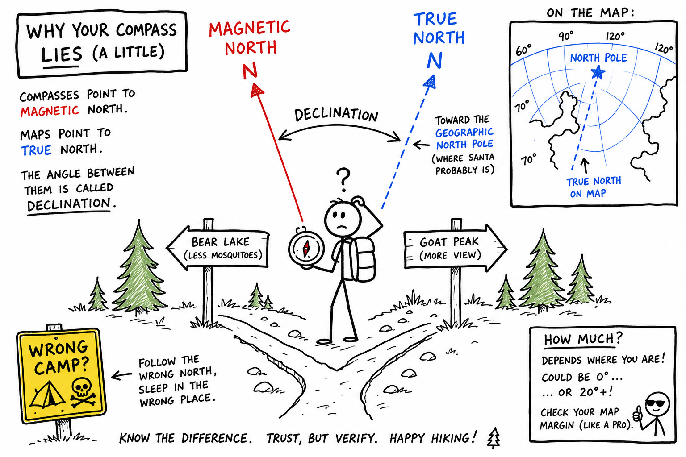

# Magnetic north

You are on a trail in the woods. The path splits. Your map says the campsite is northeast. You pull out a compass, hold it level, and watch the needle swing and settle.

It points north.

You start walking.

An hour later, the trail does not look right. The creek is on the wrong side. The ridge you expected is not there. You were careful. You were not lost on purpose. But you may have been following the wrong kind of north.

**Magnetic north** is one of the most useful directions in outdoor life — and one of the easiest to misunderstand.

**Magnetic north is the north direction a compass shows, based on Earth's magnetic field at your location.**

That sounds simple. In practice, it saves trips — or ruins them — depending on whether you know what your compass is really telling you.

## Earth's Magnetic Field

Earth is not just rock and water. Deep inside, it acts like a giant magnet.

In the **outer core**, hot liquid iron moves and churns. Electric currents and motion there create a planet-wide **magnetic field** that stretches far into space.

You cannot see the field, but you can see what it does. It deflects charged particles from the Sun, helps create **auroras** near the poles, and tugs on a compass needle.

Near the ground, magnetic field lines run in huge loops. In a simplified picture, they emerge from southern polar regions and curve back into northern polar regions. A compass needle lines up with the local direction of that field.

The field is real. It is also not frozen in place forever.

## What "Magnetic North" Means on a Trail

When hikers, scouts, pilots, and sailors say **magnetic north**, they usually mean something very practical:

**The direction a level compass points when you read "north" on the dial.**

More precisely, it is the direction of the **horizontal component** of Earth's magnetic field — the part that lies flat in the ground plane where you are standing.

This is not a single dot painted on the ground that never moves.

Earth's magnetic field **changes slowly over time** and **varies by location**. Scientists track **magnetic poles** — places where the field points straight up or down — separately from the everyday compass idea of "which way is north."

For navigation on foot, the key idea is straightforward:

**Magnetic north is compass north, from Earth's magnetic field right where you stand.**

## Magnetic North vs True North

Maps for serious navigation are usually built around a different north.

**True north** (also called **geographic north**) is the direction toward Earth's **North Pole** along Earth's rotation axis.

**Magnetic north** is the direction your compass needle favors.

Those two directions are often close. They are not always the same.

The angle between true north and magnetic north at a given place and time is called **magnetic declination** (or just **declination**).

| Term | What it means |
|------|----------------|
| True north | Toward the geographic North Pole |
| Magnetic north | Toward compass "N" at your location |
| Declination | The angle between them (east or west) |

In some cities the difference is only a few degrees — easy to ignore on a short walk.

In other places it can be **15°, 20°, or more**. Ignore it on a long hike with a paper map and you can miss a landmark by hundreds of meters.

Declination also **changes year by year**. A map printed ten years ago may show declination that is slightly out of date. For rough camping that might not matter. For careful orienteering, it does.

## Grid North: A Third "North" on Some Maps

Some maps use **grid north** — the direction of the map's north–south grid lines.

On many maps, grid north is almost the same as true north. On others, especially over large areas or certain map projections, grid north can differ a little from both true north and magnetic north.

For serious navigation you learn which "north" your map is using, then correct in the right order:

1. Compass bearing (magnetic)
2. Adjust for declination → true bearing (or grid bearing, depending on the map)
3. Plot on the map using the map's north reference

It sounds like paperwork. In the field, it is the difference between reaching camp and walking past it.

## Why Magnetic North Wanders

Earth's magnetic field is generated by a **dynamo** in the liquid outer core. The core is not a solid frozen magnet. It is moving, swirling, and shifting.

The field **drifts**, **strengthens in some regions**, **weakens in others**, and over geologic time can even **reverse** (north and south magnetic poles trade places). Those reversals take thousands of years. You will not wake up to a flipped compass tomorrow.

On human time scales, what matters is **slow drift**:

- Magnetic directions change over decades.
- The regions called magnetic poles move.
- Declination values on maps need updating.

Scientists measure the field with **ground observatories**, **ships and aircraft surveys**, and **satellites** (such as missions that map Earth's magnetism from orbit). Agencies publish models and charts so navigators can use current declination values.

Magnetic north is reliable enough to guide explorers — and humble enough to drift while you sleep.

## Navigation: Why Declination Matters

Imagine you stand on a hilltop with a map and compass.

You sight a bearing to a distant hill: **45°** on your compass dial. You plot that line on the map to see where you will intersect a trail.

If the map is drawn to **true north** but your compass reads **magnetic north**, your plotted line can be wrong unless you convert.

**Hikers, pilots, and ships** routinely convert between:

- **Map directions** tied to true north or grid north, and
- **Compass directions** tied to magnetic north.

The rule is always the same idea: **add or subtract declination** according to whether declination is **east** or **west** at your location — and according to which direction you are converting (map → compass or compass → map). Your teacher or field manual will give the exact sign convention used in your country.

Get it backward and you march confidently in the wrong direction.

Failure to correct declination has sent experienced people into the wrong valley. It is not a beginner-only mistake. It is a **careless** mistake.

## Compasses, Metal, and Phone Apps

A compass is a small magnet on a pivot. It aligns with Earth's field — unless something else pulls harder.

**Nearby metal** can deflect a needle:

- Belt buckles
- Knife sheaths
- Zippers and snaps
- Fence posts
- Bridge rails
- The frame of your backpack if you hold the compass too close

Hold the compass away from metal, level it, and let the needle settle before you read it.

**Smartphones** can show direction using a **magnetometer** (a chip that senses magnetic fields). That can be handy. It is still Earth's field — not magic GPS north.

Phones can be wrong when:

- They need **calibration** (often a figure-eight motion)
- You are **indoors** near steel beams, rebar, or elevators
- **Magnets** in cases or mounts interfere
- The app confuses **magnetic north** with **true north** in its settings

Before trusting a phone on a hike, check whether it shows magnetic or true north, calibrate outdoors away from metal, and compare with a real compass when you can.

## Common Misconceptions

**Mistake 1: Magnetic north is the same as the North Pole.**

The **geographic North Pole** is a fixed point on Earth's rotation axis — true north for the whole planet in that sense.

**Magnetic north** is a **direction** your compass follows from local field lines. The place where compasses point "into the ground" (a magnetic pole) is a different idea and is not even at the geographic pole.

**Mistake 2: Declination is the same everywhere.**

It depends on **where you are** and **when** the map was made. Two cities hundreds of kilometers apart can have very different declination.

**Mistake 3: A compass always points straight at "the magnetic pole" like an arrow to a target.**

Over short distances, you think in terms of **local field direction** — the way the field lines run near your feet. That is what the needle follows. Treating the whole planet like a simple "point me at one spot" diagram can confuse you on long trips or when learning advanced navigation.

**Mistake 4: If the needle points north, I do not need a map.**

A compass tells you direction. It does not tell you **where you are**, **what is in front of you**, or **whether a cliff is ahead**. Direction plus map plus landmarks plus common sense wins.

## How to Think Like a Field Navigator

Before you trust a bearing, ask:

- **What year** is the declination on this map for?
- Is declination **east** or **west** of true north here?
- Is my compass or phone influenced by **nearby metal**?
- Does my app show **magnetic** or **true** north?
- Do I need to **convert** my measured bearing before plotting on the map?
- Does this map use **true north**, **grid north**, or something else in its legend?

Good navigators look confident because they checked the details — not because they skipped them.

## The Big Idea

**Magnetic north** is the north direction shown by a compass, determined by Earth's magnetic field at your location.

It is **not** the same as **true (geographic) north** everywhere or every year. The difference is **magnetic declination**, which varies by place and changes slowly over time.

If you remember only one sentence, remember this:

**Magnetic north is compass north from Earth's magnetic field — not the same as true north on your map until you correct for declination.**

## Study Questions

1. What is Earth's magnetic field in simple terms?
2. What does "magnetic north" usually mean for someone using a compass on a hike?
3. What is true north?
4. What is magnetic declination?
5. Why can declination be different in two cities far apart?
6. Why does declination change over the years?
7. Why is declination important when using a map and compass together?
8. What is grid north, and why might it matter on some maps?
9. What is one cause of slow change in Earth's magnetic field?
10. Name two types of metal or objects that can pull a compass needle off course.
11. Why might a smartphone compass be unreliable indoors?
12. What is the difference between magnetic north and the geographic North Pole?
13. If you ignore declination on a long hike, what kind of error can happen?
14. Name one thing scientists use to measure and model Earth's magnetic field.
15. Why is "magnetic north" not a single permanent spot that never moves?
16. True or false: A compass alone tells you exactly where you are on a map. Explain.
17. When converting between compass bearings and map bearings, what should you check on the map legend first?
18. In your own words, explain why a careful hiker might reach the wrong campsite even while following a compass needle that works perfectly.
