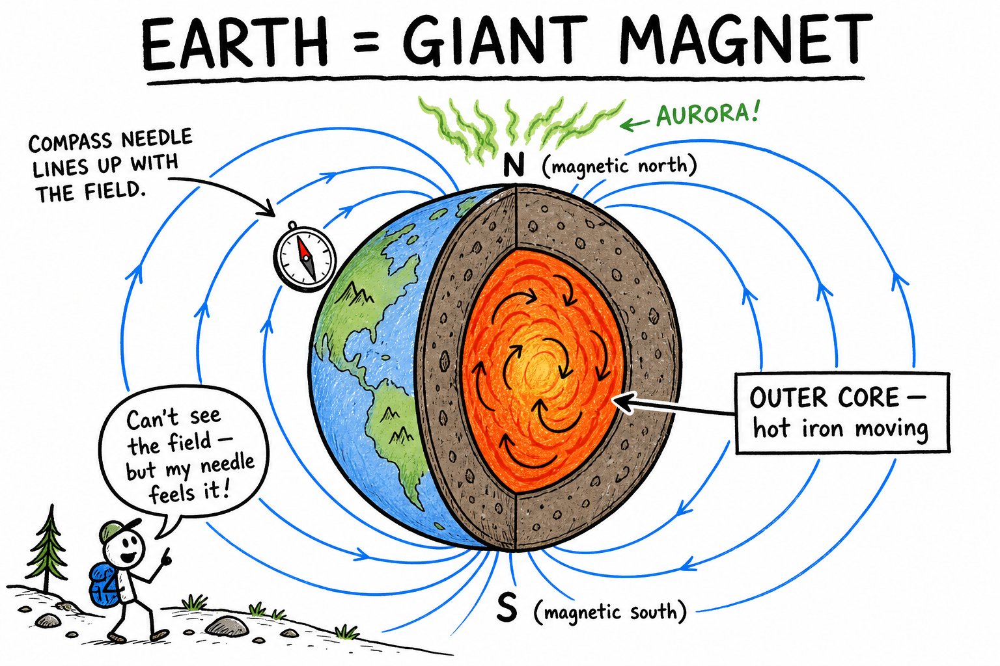
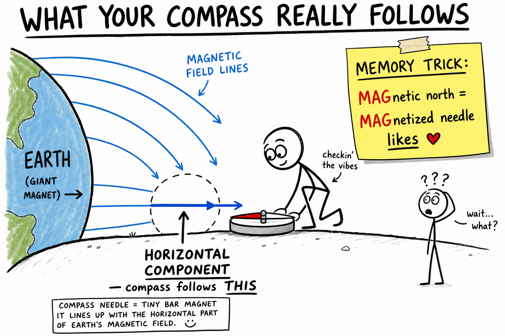
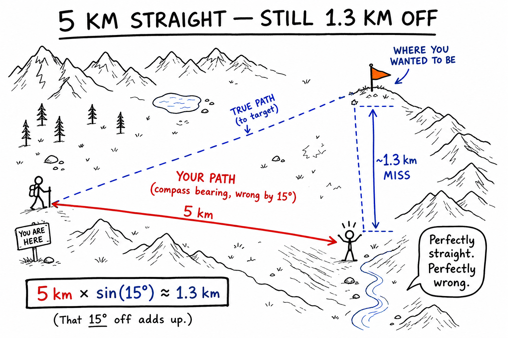
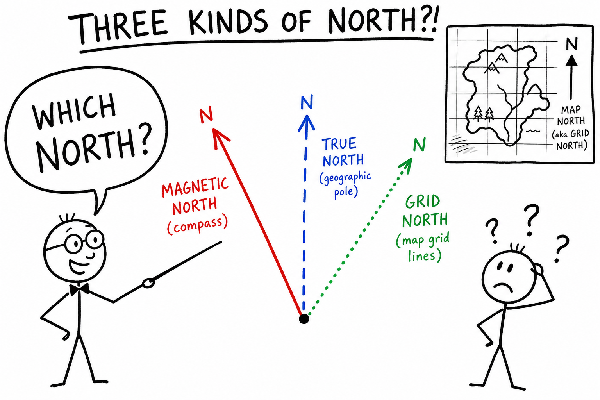
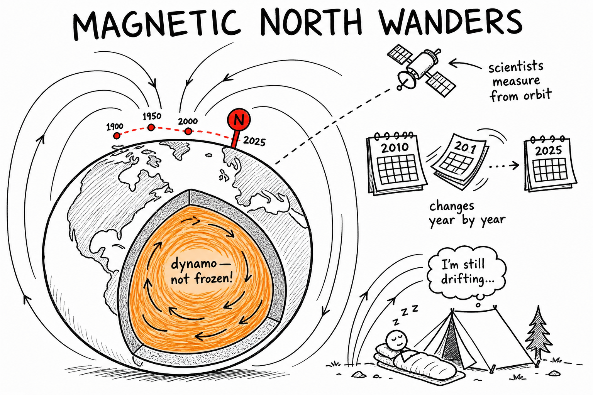
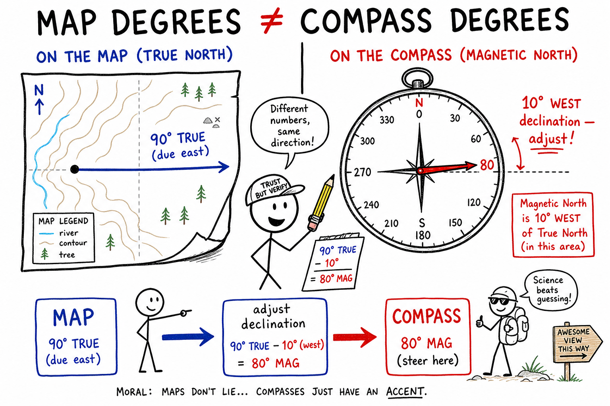
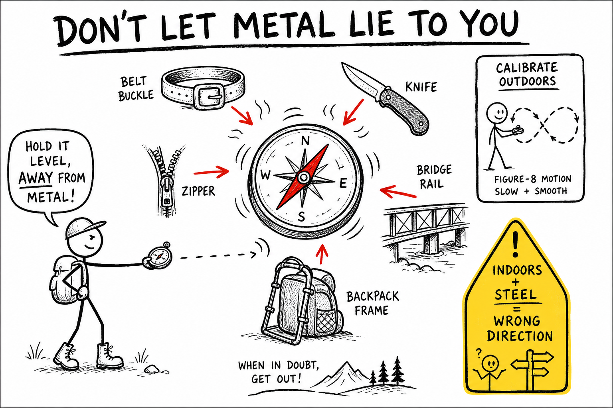

# Image briefs — 095 Magnetic North

Use when creating `095_Magnetic_north_02.png` through `095_Magnetic_north_08.png`. Each file is referenced in `095_Magnetic_north.md` at the placement noted below.

`095_Magnetic_north_01.png` already exists at the chapter top (magnetic vs true north, declination fork-in-trail). Brief below for consistency if it is ever redrawn.

**Style** (from `_create_more_images.md`): crude, funny, hand-drawn explainer cartoon; stick-figure characters; rough black outlines; mostly white background; selective flat accent colors. Labels, arrows, exaggerated faces, simple metaphors. Minimalist, humorous, concept-first, intentionally rough. Color sparingly: **red** = magnetic north / compass, **blue** = true north / maps / field lines, **green** = grid north / aurora, **yellow** = warnings, **gray** = metal objects. Vary panel width/height. Ages 11–13; hiking, orienteering, maps, compasses — no scary gore.

---

## 095_Magnetic_north_01.png — Chapter opener (existing)

**Placement:** Top of chapter (after title).

**Scene:** Confused hiker at trail fork; solid red arrow magnetic north, dashed blue arrow true north; declination arc between them; map inset; wrong-camp warning; declination varies by location.

**Caption in chapter:** ``

---

## 095_Magnetic_north_02.png — Earth's magnetic field

**Placement:** End of "Earth's Magnetic Field" (after field is not frozen forever).

**Scene:** Earth cross-section with swirling outer core; blue field lines looping pole to pole; compass on surface; aurora hint; "can't see the field — but the needle feels it."

**Colors:** Orange/red core swirl; blue field lines.

**Aspect:** Wide (~2:1).

**Caption idea:** Earth's outer core acts like a giant magnet.

---

## 095_Magnetic_north_03.png — Horizontal component

**Placement:** End of "What Magnetic North Means on a Trail" (after MAG/TRUE memory trick).

**Scene:** Side view of field lines; bold horizontal component arrow; compass needle parallel; sticky note MAG = magnetized needle likes.

**Colors:** Blue field; red needle.

**Aspect:** Tall (~1:1.2).

**Caption idea:** Your compass follows the horizontal part of the field.

---

## 095_Magnetic_north_04.png — Declination distance error

**Placement:** End of "How Far Off Can You Be?" (before Grid North section).

**Scene:** Bird's-eye map; 5 km red path vs blue target line; ~1.3 km sideways miss; equation 5 km × sin(15°) ≈ 1.3 km; hiker in wrong valley.

**Colors:** Red path; blue true bearing.

**Aspect:** Wide (~2:1).

**Caption idea:** Walk straight on the wrong bearing and miss by over a kilometer.

---

## 095_Magnetic_north_05.png — Three norths

**Placement:** End of "Grid North" (after "Which north?" question).

**Scene:** Three diverging arrows from one point — magnetic (red), true (blue dashed), grid (green dotted); map grid inset; teacher asks "WHICH NORTH?"

**Aspect:** Square (~1:1).

**Caption idea:** True north, magnetic north, and grid north can all differ.

---

## 095_Magnetic_north_06.png — Field wanders

**Placement:** End of "Why Magnetic North Wanders".

**Scene:** Earth with dynamo core; magnetic pole dot on dotted drift path; calendar years; satellite; tent sleeper — field still drifting.

**Aspect:** Wide (~16:9).

**Caption idea:** Earth's magnetic field drifts — declination values need updating.

---

## 095_Magnetic_north_07.png — Map vs compass degrees

**Placement:** End of "A Mini Field Example".

**Scene:** Split panel — map 90° true east vs compass dial adjusted for 10° west declination; conversion arrow map → adjust → compass.

**Colors:** Blue true; red magnetic.

**Aspect:** Wide (~2:1).

**Caption idea:** Convert map bearings to compass bearings — do not assume the numbers match.

---

## 095_Magnetic_north_08.png — Metal and phones

**Placement:** End of "Compasses, Metal, and Phone Apps".

**Scene:** Compass needle deflected by belt, knife, zipper, rail, pack; hold compass away; phone figure-eight calibration; yellow indoor warning.

**Colors:** Yellow warning; gray metal.

**Aspect:** Tall (~1:1.3).

**Caption idea:** Metal and phones can pull a compass needle off course.

---

## Quick reference — captions in chapter

```markdown








```
