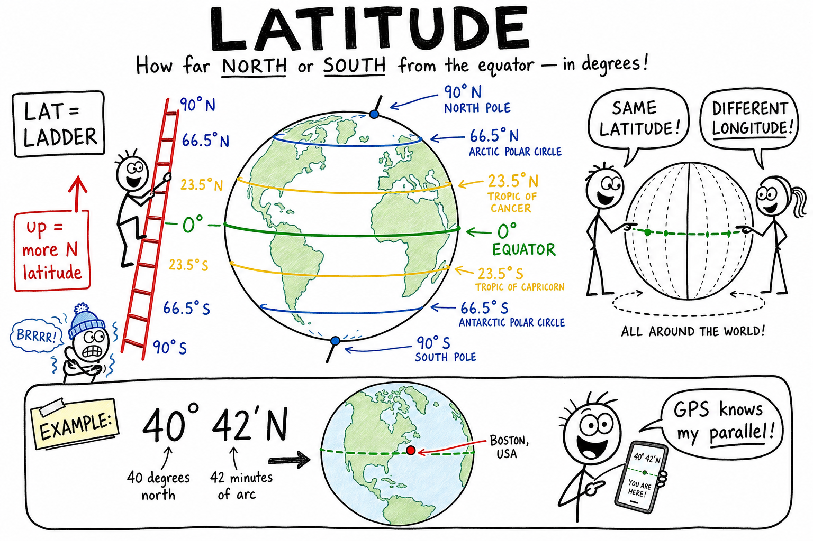

# Latitude

Your coach texts a meet-up spot for summer camp: **"Same latitude as home — just fly south."** You land in São Paulo. The airport is warm, palm trees line the road, and kids are in shorts in July while your cousins back home are in hoodies. Same **latitude band** on the globe — totally different country, language, and longitude.

Or you drop a pin in a survival game: **42.3° N**. The map loads mountains and pine trees. Your friend types **42.3° S** and spawns on a windy coast with penguins. One number flipped from **N** to **S** — opposite side of the planet.

"Meet me on Earth" is useless. You need coordinates — a global address made of numbered lines.

**Latitude is the measure of how far north or south a place is from Earth's equator, expressed in degrees.**

Pilots, ship captains, search-and-rescue teams, weather forecasters, and the GPS in your phone all use latitude every day. Once you understand it, a map stops being flat decoration and starts being a real locator for anywhere on the planet.

As you learned in the chapter on **rotation of the Earth**, the **equator** is the big east–west belt around Earth's middle. Latitude is how far north or south you are from that belt. The chapter on **longitude** covers the other half of the address — east and west around the globe.

## Latitude at a Glance

| Idea | What to remember |
|------|------------------|
| **Latitude** | North–south distance from the equator, in **degrees** |
| **Equator** | **0°** latitude — Earth's middle belt |
| **North Pole** | **90° N** |
| **South Pole** | **90° S** |
| **Parallels** | East–west latitude lines; same latitude = same parallel |
| **Longitude** (other half!) | East–west position — see the **longitude** chapter |
| **Hemispheres** | Equator splits **Northern** and **Southern** |
| **Tilt tie-in** | **23.5°** and **66.5°** parallels link to seasons and Sun geometry |

## The Question Latitude Answers

Picture Earth as a ball with a belt around its middle. That belt is the **equator**, defined as **0° latitude**.

Walk north toward the North Pole and your latitude number climbs until you hit **90° north latitude** at the pole. Walk south toward the South Pole and you reach **90° south latitude**.

Everything in between is a fraction of the way from equator to pole.

Latitude answers one clean question:

**How far north or south am I?**

It does not tell you how far east or west you are. That is **longitude** — the other half of the global address. Mixing them up is the most common mistake in map work, so keep them separate from the start.

| Coordinate | Direction it measures | Lines on a globe | Memory trick |
|------------|----------------------|------------------|--------------|
| **Latitude** | North–south from the equator | Run **east–west** (parallels) | **Lat**itude = **L**adder steps up and down from the equator |
| **Longitude** | East–west from the prime meridian | Run **north–south** (meridians) | **Long**itude = **L**ong lines from pole to pole |

**Memory trick:** Latitude lines look like **rungs on a ladder** laid flat around the ball — sideways on the map, but they tell you how far up or down the ball you are.

## Parallels: East–West Rings on the Globe

On a globe, latitude lines are circles that run east–west all the way around Earth.

They are called **parallels** because each one is parallel to the equator — same tilt, same spacing idea, never meeting.

All points on the same parallel share the same latitude.

That is why driving due east along a highway can take you through three states while your latitude stays the same. You are sliding along a parallel. Only your longitude changes.

The equator is the longest parallel. As you move toward the poles, the circles shrink. Near the North Pole, a "circle of latitude" is tiny — you could walk around it in minutes. At the pole itself, you are standing on a single point: 90° north, no east or west left.

| Parallel | Rough latitude | What it is like |
|----------|----------------|-----------------|
| Equator | **0°** | Longest ring; fastest spin from Earth's rotation |
| Mid-latitude city | **~40° N or S** | Strong seasons in many places |
| Arctic/Antarctic Circle | **~66.5° N or S** | Extreme daylight possible |
| Pole | **90° N or S** | A point, not a ring |

## Degrees, Minutes, and Seconds

Locations are often written like:

**40° 42′ 46″ N**

That means 40 degrees, 42 minutes, 46 seconds **north** of the equator.

Think of it like slicing a circle into smaller pieces. A **degree** is a big step. **Minutes** and **seconds** are smaller steps on the same angle — not clock minutes, but angle minutes.

Digital maps and phones often use **decimal degrees** instead, such as **40.7128° N** (New York City area). Same idea, different format. Both describe an angle measured at Earth's center between the equator's plane and a line drawn to your spot on the surface.

If you have ever used coordinates in a strategy game, flight simulator, or mapping app, you have already seen numbers like these — even if nobody called them latitude.

**Try it:** Look up your town online. You will get something like **34.05° N**. The **N** means north of the equator. A city at **34.05° S** would be in the Southern Hemisphere — mirror address, not nearby.

## Latitude and What the Sun Does

Latitude does not control today's exact forecast, but it strongly shapes what the Sun can do over a year.

Near the equator, the Sun can climb high in the sky at noon. Day length changes less through the year.

Near the poles, the Sun stays lower, and day length can swing wildly between summer and winter — think of midnight sun or long polar nights, as you may have read in the chapter on **day and night**.

That is why latitude connects to broad climate patterns, even though mountains, oceans, and wind can change local weather. Earth's **tilted axis** (about **23.5°**) and **revolution** around the Sun set the seasonal story; latitude is where you sit on the ball while that story plays out.

| Zone (broad) | Latitude range (approx.) | What you might notice |
|--------------|--------------------------|------------------------|
| **Tropics** | Low latitudes, between ~23.5° N and ~23.5° S | Warm year-round; Sun can pass nearly overhead |
| **Mid-latitudes** | Between tropics and polar circles | Strong seasons — hot summers, cold winters in many places |
| **Polar regions** | High latitudes, inside Arctic/Antarctic circles | Extreme daylight swings; cold on average |

Latitude is not destiny — a coastal city at 45° north can feel different from an inland city at the same latitude — but it is one of the biggest clues on the map.

## Special Parallels: Tropics and Polar Circles

Earth's axis is tilted about **23.5°**. That tilt is the same reason you get seasons (see the chapter on **revolution of the Earth**). It also stamps famous latitude lines onto every globe.

**Tropic of Cancer** — near **23.5° north**

**Tropic of Capricorn** — near **23.5° south**

Between them lies the **tropical zone**, where the Sun can pass directly overhead at local noon at some point during the year. Vacation ads love this zone for a reason.

Farther toward the poles:

**Arctic Circle** — near **66.5° north**

**Antarctic Circle** — near **66.5° south**

Inside those circles, depending on the date, you can get extreme daylight patterns — weeks where the Sun barely sets, or barely rises.

Notice the math:

**23.5° + 66.5° = 90°**

The tropics and polar circles are geometry labels for a tilted planet, not magic walls. Birds, storms, and people cross them freely. But on a map they are excellent signposts for how sunlight behaves.

## Northern Hemisphere and Southern Hemisphere

The equator splits Earth into two **hemispheres** by latitude.

The **Northern Hemisphere** is everything north of the equator.

The **Southern Hemisphere** is everything south of it.

Hemisphere tells you north-or-south side of the equator, not your east-west position.

Australia and Argentina are both in the Southern Hemisphere, but they sit on opposite sides of the planet in longitude — like two kids on opposite ends of the same bench row.

When the Northern Hemisphere has summer, the Southern Hemisphere has winter, because tilt aims more sunlight at one half of Earth at a time.

## Latitude in the Real World

You use latitude more than you might think:

- **GPS and maps** — Your phone's location is latitude and longitude. Search-and-rescue teams use the same system.
- **Weather and climate** — Scientists compare temperature records by latitude bands.
- **Travel and sports** — Why does a December away game in Brazil feel like beach weather while home is freezing? Hemisphere and latitude.
- **Astronomy** — Which constellations you see depends partly on how far north or south you live (see the chapter on **stars**).
- **Earthquakes and volcanoes** — News reports often give coordinates so geologists can map events worldwide.

Try looking up your town's latitude online. Then find a city on a similar parallel on another continent. Same latitude, different continent — you share a ring around Earth, but you might be thousands of miles apart east-west.

**Example:** About **51° N** passes near London and also through southern Canada and parts of Russia. Same parallel, different longitudes, different local times and cultures.

## Common Misconceptions

**Mistake 1: Swapping latitude and longitude.**

Latitude = north–south from the equator. Longitude = east–west from the prime meridian. On most maps, latitude lines run sideways (east–west) even though they measure north–south position. Confusing, but learn the rule once and you are set.

**Mistake 2: Thinking all latitude lines are the same length.**

Only the equator is a **great circle** among the parallels — a circle whose center is Earth's center. Higher-latitude parallels are smaller rings. That is also why flat wall maps stretch polar regions and make Greenland look gigantic.

**Mistake 3: Believing latitude tells today's weather.**

Latitude describes **where** you are, not whether it will rain this afternoon. A mountain town and a beach town at the same latitude can feel totally different.

**Mistake 4: Forgetting N and S.**

**40° N** and **40° S** are on opposite sides of the equator — like mirror addresses. Always check the letter.

## How to Think Like a Geographer

When you look at a map or coordinates, ask:

- Is this place near the equator or near a pole?
- Is the latitude number low (near 0°) or high (near 90°)?
- If I travel due north in the Northern Hemisphere, does my latitude number increase?
- Is this location in the tropics, mid-latitudes, or polar latitudes?
- Could another town share this parallel but sit halfway around the world in longitude?

Latitude is the steady coordinate that places you between the warm belt of the equator and the cold crowns of the poles.

## The Big Idea

Latitude measures how far north or south a location is from the equator in degrees, from **0°** at the equator to **90°** at each pole.

Latitude lines are east–west **parallels** that locate places and connect to how the Sun behaves through the year.

If you remember only one sentence, remember this:

**Latitude tells you how far north or south you are from the equator, measured in degrees along Earth's surface.**

## Study Questions

1. What question does latitude answer?
2. What is the latitude of the equator, the North Pole, and the South Pole?
3. What is another name for a latitude line on a globe, and which direction does it run?
4. If you travel due east along a parallel, does your latitude change? What coordinate changes instead?
5. Why are latitude lines called parallels?
6. Why is the equator the longest parallel?
7. In one sentence, what is the difference between latitude and longitude?
8. What do the letters **N** and **S** mean in a coordinate like **34° S**?
9. Give one example of a latitude written with degrees, minutes, and seconds (or decimal degrees) and explain it.
10. How does latitude relate broadly to sunlight and seasons?
11. Name the Tropic of Cancer and the Tropic of Capricorn. About what latitude is each one found?
12. What are the Arctic Circle and the Antarctic Circle, and about what latitude is each one found?
13. Why do maps often pair **23.5°** with **66.5°** when teaching Earth's tilt?
14. What is the difference between the Northern Hemisphere and the Southern Hemisphere?
15. Can two cities share the same latitude but still be far apart on Earth? Explain.
16. Name two real-world jobs or tools that use latitude.
17. Why might two towns at the same latitude have different weather on the same day?
18. If you move from 10° N to 30° N, are you moving toward the equator or toward the North Pole?
19. What is the tropical zone, and why is the Sun sometimes directly overhead there?
20. In your own words, why is latitude only half of a full global address?
