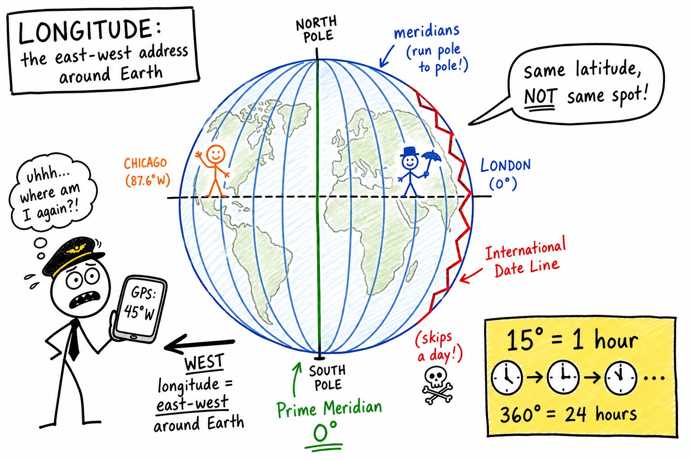

# Longitude

Your squad is dropping into a battle-royale map. The ping says **42° N, 87° W** — Chicago suburbs. You parachute in. Your cousin in London loads the **same latitude** (**51° N** vs **42° N** is close enough that they joke you are "on the same line") and thinks you are practically neighbors.

You are not.

Latitude put you on the same north–south "rung" of the ladder. You are still thousands of kilometers apart because you skipped the other half of Earth's address.

**Longitude is the measure of how far east or west a place is from Earth's prime meridian, expressed in degrees.**

Ship captains, pilots, GPS satellites, rescue helicopters, weather satellites, and every online map you touch use longitude every day. Miss it by a few degrees at sea and you might miss an island — or run aground. Get it right and you can land on a runway in fog, find a lost hiker in the woods, or sync a global tournament so every team logs in at the same instant.

As you learned in the chapter on **latitude**, north–south position comes from the equator. Longitude completes the picture.

## The Question Longitude Answers

Picture Earth as a ball. Slice it from the North Pole to the South Pole like an orange. Each slice is a **meridian** — a line of **longitude**.

One slice was chosen long ago as the starting line: the **prime meridian** at **0° longitude**. By modern international convention, that line runs through the **Royal Observatory** in **Greenwich, England** (near London). It is often called the **Greenwich meridian**.

Walk east around the globe and your longitude number climbs toward **180° east**. Walk west and you climb toward **180° west**. East and west meet on the far side of Earth at the **180° meridian** — the rough home of the **International Date Line**.

Longitude answers one clean question:

**How far east or west am I around Earth?**

It does not tell you how far north or south you are. That is **latitude**. Together, latitude and longitude give you a full surface address.

| Coordinate | Direction it measures | Lines on a globe | Memory trick |
|------------|----------------------|------------------|--------------|
| **Latitude** | North–south from the equator | Run **east–west** (parallels) | **Lat**itude = **L**adder steps up and down from the equator |
| **Longitude** | East–west from the prime meridian | Run **north–south** (meridians) | **Long**itude = **L**ong lines from pole to pole |

**Memory trick:** **LONG**itude lines are **LONG** — they run from pole to pole. They measure how far you have walked **around** the ring of the planet, not how far up or down the ladder you are.

## Meridians: Pole-to-Pole Slices

Longitude lines are called **meridians**.

They run from the North Pole to the South Pole.

Unlike parallels of latitude, **all meridians are the same length**. Each one is half of a **great circle** through the poles.

All towns on the same meridian share the same longitude. For astronomy purposes, they experience **solar noon** at about the same moment — when the Sun is highest for that slice of Earth (ignoring time zones and small corrections).

On most flat maps, meridians look like straight up-and-down lines. On a globe, they curve from pole to pole. Near the equator, moving one degree of longitude is roughly **111 km** east or west on the ground. Near the poles, the same one-degree change covers a much shorter distance — the meridians squeeze together there.

## Degrees East, West, and Decimal Form

Locations are often written like:

**77° 2′ 12″ W**

That means 77 degrees, 2 minutes, 12 seconds **west** of the prime meridian.

Think of it like slicing a circle into smaller pieces — same idea as latitude, but measured from Greenwich instead of the equator. A **degree** is a big step. **Minutes** and **seconds** are smaller angle steps — not clock minutes.

Digital maps often use **decimal degrees**, such as **−77.0367°** (negative often means west in some systems) or **77.0367° W**. Same idea, different format.

**E** and **W** matter as much as **N** and **S** do for latitude. **40° E** and **40° W** are on opposite sides of Greenwich — like mirror addresses around the globe.

If you have dropped pins in a flight simulator, geocaching app, or open-world game, you have already seen these numbers — even if nobody called them longitude.

## East and West of Greenwich

The prime meridian splits Earth into longitude halves the way the equator splits north and south.

Places **east** of Greenwich have longitudes like **30° E**, **90° E**, or **150° E** as you move toward Asia and the Pacific.

Places **west** of Greenwich have longitudes like **75° W**, **120° W**, or **45° W** as you move toward the Americas.

**Greenwich itself is 0°.** The number tells you how far around the ring you are, and the letter tells you which direction from the starting line.

## Why Longitude Was the Hard Problem

For centuries, sailors could estimate **latitude** fairly well by measuring how high the Sun or certain stars sat above the horizon.

**Longitude at sea was much harder.** It was not mainly a geometry puzzle on a chart. It was a **time** problem.

Earth rotates about **360° in about 24 hours**.

So **15° of longitude** matches about **1 hour** of Earth's rotation.

| Rotation fact | Simple meaning |
|---------------|----------------|
| **360°** in ~**24 hours** | One full spin of Earth |
| **15°** per **1 hour** | Each hour of spin = 15° of longitude |
| **1°** in ~**4 minutes** | Fine-grained east–west position from time |

If you know the exact time at Greenwich (or any agreed zero meridian) **and** you know your local solar time, you can figure out how many hours you are ahead or behind — and convert that to degrees east or west.

Before reliable ship clocks, guessing longitude could put a crew hundreds of kilometers off course. Fog, storms, and wrong landfalls made longitude a life-or-death skill for exploration and trade. Books and films about "finding longitude" are really stories about **clocks**, not just compasses.

Accurate **chronometers** (precision ship clocks), radio time signals, and later **GPS satellites** solved the problem for the modern world. You do not need the full engineering history now. You need the concept:

**Longitude is your east–west position around Earth, and that position is deeply tied to time.**

## Longitude, Rotation, and Time Zones

Earth spins from west to east, as you learned in the chapter on **rotation of the Earth**. As it turns, different longitudes face the Sun at different times.

That is why **solar noon** — when the Sun is highest — happens earlier for places east of you and later for places west of you.

For convenience, countries divide Earth into **time zones**. A time zone is a human scheduling system, not a perfect copy of longitude. Borders zigzag for politics: one country may choose one clock for the whole nation even when meridians would suggest several different times.

But the **reason** time zones exist is Earth's rotation changing which longitude faces the Sun.

**Longitude is the geography. Time zones are the compromise on our watches.**

## Solar Time vs Clock Time

**Solar time** follows the Sun. Local noon is roughly when the Sun is highest for your longitude.

**Standard clock time** follows **time zones**, so many towns on different longitudes share the same minute on the clock.

That is why your phone can say **3:15** while shadows suggest the Sun is not exactly at astronomy-class "noon" for your spot. Clock time is smoothed for schools, trains, TV schedules, and online matches.

Longitude is still underneath the system. Time zones are a human layer on top of Earth's spin.

## UTC: The World's Shared Clock

When pilots, astronomers, satellites, and game servers need one time that does not jump forward or back with summer clock changes in any one country, they often use **UTC**.

The letters stand for **Coordinated Universal Time**.

UTC is a modern global time standard — a worldwide reference clock for science, aviation, navigation, and international schedules. It grew from the same prime-meridian tradition as old **Greenwich Mean Time (GMT)**, but it is defined with atomic clocks and careful leap-second adjustments so the whole planet can agree on a moment in time.

For everyday thinking:

**UTC helps the world compare times without every city inventing its own private noon.**

If a rocket launch is at **14:30 UTC**, engineers in Florida, Paris, and Tokyo can convert that to their local clocks and still mean the same instant. If a ranked match starts at **18:00 UTC**, every squad converts to local time so nobody shows up an hour late.

**Memory trick:** Pilots sometimes call UTC **"Zulu time"** — the **Z** on aviation charts. It is not whatever o'clock is on your classroom wall.

## The International Date Line

On the opposite side of Earth from Greenwich lies the **180° meridian**. Near it runs the **International Date Line**.

Crossing it eastward or westward often changes the **calendar date** — you might "lose" or "gain" a day on a long flight or ship voyage.

The date line does not follow the 180° meridian exactly. It **zigzags** so island nations and regions can stay on the same weekday as their neighbors. Politics and convenience shape the line; geometry only suggests where it might go.

| Idea | Simple meaning |
|------|----------------|
| **180° meridian** | Opposite Greenwich on the globe; where east and west longitude meet |
| **International Date Line** | Roughly follows 180° but bends; where the **date** often jumps |
| **Why it exists** | Earth is divided into date regions so the calendar does not split noon and midnight oddly everywhere |

## Why One Prime Meridian Mattered

For centuries, different countries drew **0° longitude** through their own national observatories. French charts, British charts, and others did not always match.

That made international sea charts confusing and sometimes **dangerous**. Two ships comparing notes could be using different zeros.

In the late 1800s, a conference helped settle a common reference. **Greenwich** became the conventional prime meridian for most of the world.

Modern satellite navigation uses a precise Earth model called **WGS84**, which keeps **0° longitude** aligned with the Greenwich tradition for practical map work. Your phone's GPS depends on that shared system.

## Longitude With Latitude: A Full Address

Together, **latitude and longitude** pinpoint a location on Earth's surface. Add **elevation** when you need height above sea level — useful for mountains, aircraft, and flood planning.

Examples in the real world:

- **GPS and maps** — Your phone reports both coordinates. Search-and-rescue teams send helicopters to the exact pair.
- **Aviation** — Flight plans and air traffic control use degrees east and west of Greenwich constantly.
- **Earthquakes and storms** — News and science reports give coordinates so everyone maps the same spot.
- **Games and simulators** — Flight sims, open-world games, and mapping tools use the same degree system (sometimes simplified).
- **Time zones and esports** — A tournament at **18:00 UTC** means teams in different longitudes convert to local time so players know when to log in.

Try looking up your town's longitude. Then find a city at nearly the same longitude but a very different latitude — for example, same meridian slice from equator to arctic. You share a north–south "slice" of Earth, but you may be thousands of kilometers apart north–south.

## Common Misconceptions

**Mistake 1: Swapping latitude and longitude.**

Latitude = north–south from the equator. Longitude = east–west from the prime meridian. On most maps, latitude lines run sideways and longitude lines run up and down — but they measure different directions. Learn the pair once and read coordinates aloud the same way every time: latitude first or longitude first, but never mix the letters.

**Mistake 2: Thinking the prime meridian is "natural" like the equator.**

The **equator** is fixed by Earth's spin. The **prime meridian** was chosen by international agreement, historically anchored at Greenwich. It is real and shared, but it is a convention — not a visible painted line on the ground.

**Mistake 3: Believing meridians are parallel to each other.**

Meridians all meet at the **poles**. They spread apart at the equator and squeeze together near the poles. Only at the equator are meridians as far apart as they can be.

**Mistake 4: Confusing UTC with your wall clock.**

UTC does not "spring forward" for summer time. Your country's local civil time might. When a pilot says "Zulu time," they often mean UTC — not whatever o'clock is on the classroom wall.

## How to Think Like a Navigator

When you read a map or coordinates, ask:

- Am I **east** or **west** of Greenwich?
- If Earth rotates about **15° per hour**, how does my longitude relate to when noon happens?
- Does this map label longitude in **degrees E/W** or as positive/negative numbers?
- When someone says **UTC**, are they talking about local clock time or a shared global reference?
- Do I have **both** latitude and longitude, or only half an address?

Longitude is Earth's way of answering:

**Where am I around the ring of the planet?**

## The Big Idea

Longitude measures how far east or west a place is from the prime meridian (**0°** at Greenwich), in degrees up to **180°** east or west.

Meridians run pole to pole. Longitude is closely connected to Earth's rotation — and therefore to **time**, **time zones**, the **International Date Line**, and coordinated standards like **UTC**.

If you remember only one sentence, remember this:

**Longitude tells you how far east or west you are around Earth, measured in degrees from the prime meridian.**

## Study Questions

1. What question does longitude answer?
2. What is the prime meridian, and which famous observatory city is tied to **0° longitude** by modern convention?
3. What is the highest longitude number in the east or west system before you wrap to the other side of Earth?
4. What is a **meridian**, and which direction do meridians run on a globe?
5. How are meridians different from parallels of latitude in shape and length?
6. Why are **time zones** related to longitude in simple terms?
7. Why was longitude historically harder to find at sea than latitude?
8. About how many degrees of longitude correspond to one hour of Earth's rotation?
9. What is the **International Date Line** in simple terms, and why does it zigzag?
10. What two coordinates together usually pinpoint a surface location on Earth?
11. What is **UTC**, and why do pilots and scientists use it?
12. Why was it a problem when different countries used different prime meridians on their charts?
13. In simple language, what is the difference between **solar time** and **standard clock time**?
14. Name one real-world job, tool, or situation that uses longitude.
15. Can two cities share the same longitude but still be far apart on Earth? Explain.
16. Why do meridians get closer together near the poles even though each meridian is the same length?
17. What is **WGS84** in simple words, and how does it connect to Greenwich?
18. If Greenwich is at **0°** and you are at **45° W**, are you east or west of Greenwich?
19. Name one misconception about longitude and correct it.
20. In your own words, why is longitude only half of a full global address?
