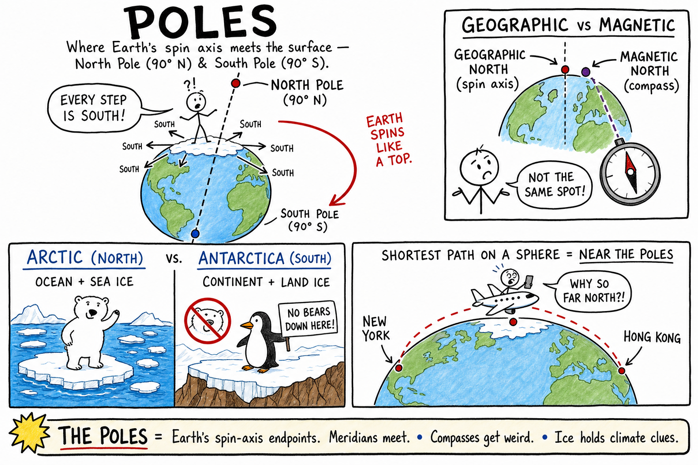
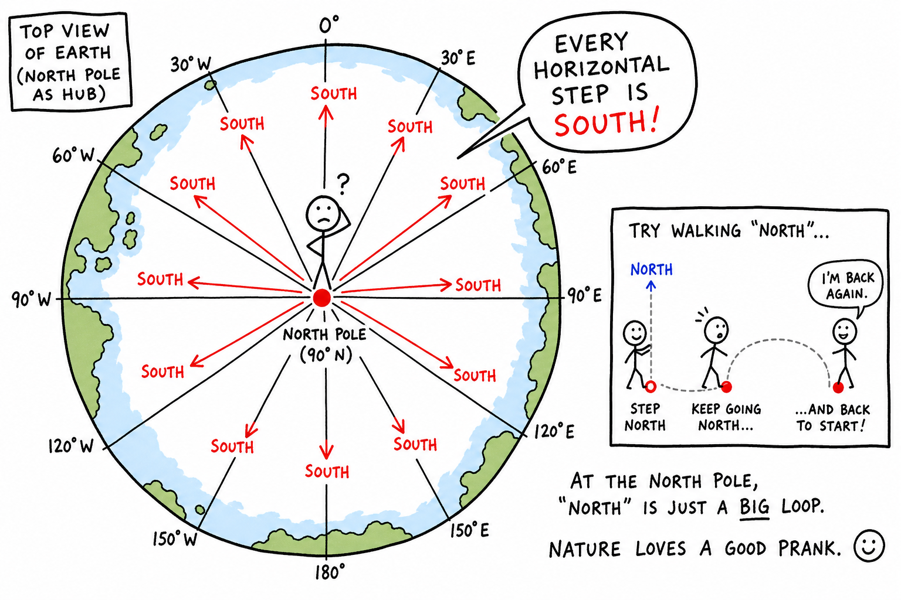
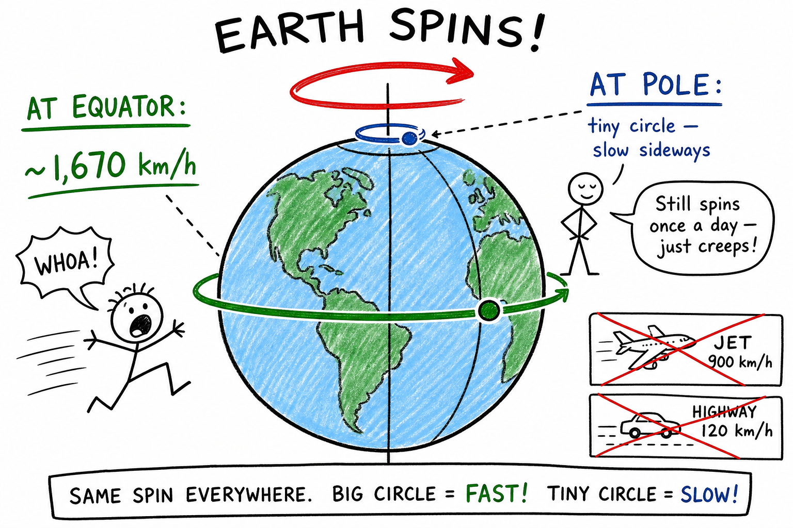
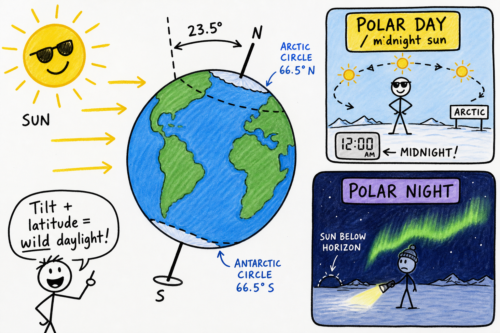
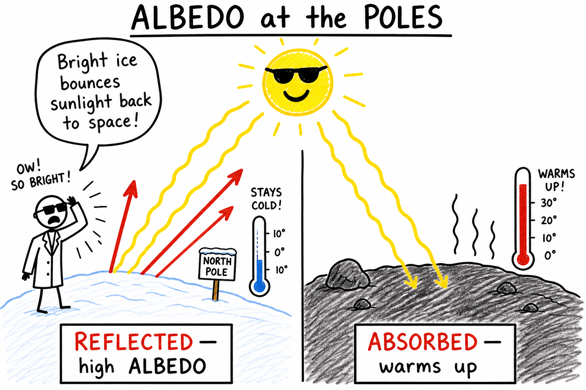
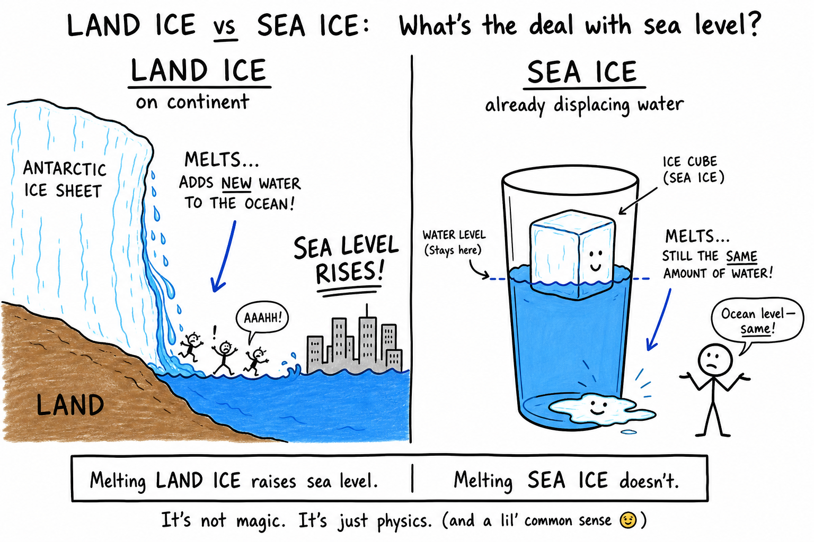
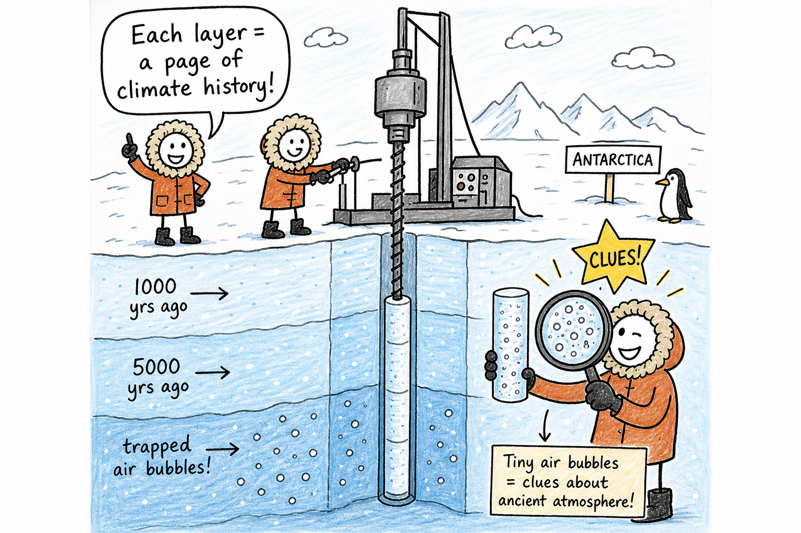
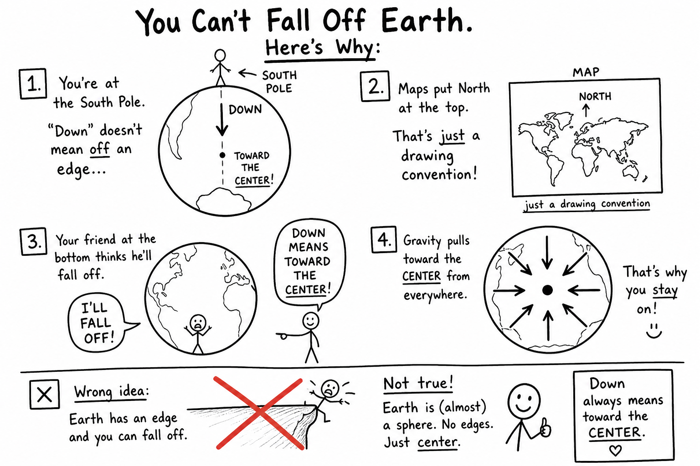

# Poles

You are watching a flight tracker on your phone. A plane heading from New York to Hong Kong does not fly in a straight line across a flat map. It curves north over the Arctic — closer to the top of the world than you expected.

Why? Because the shortest path on a sphere often passes near the **poles**.

Now picture standing at the very top of Earth. Every step you take — east, west, or any direction on flat ground — is **south**. There is no "north" left to walk toward. Your compass still works, but the idea of "forward on the map" gets strange fast.

That is life at a **pole**.

Earth spins like a top. Every top has two ends where the spin axis pokes through. Earth's ends are the **poles** — the North Pole and the South Pole.

**The poles are the two points where Earth's axis of rotation meets Earth's surface: the North Pole and the South Pole.**

They are not edges you can fall off. They are pivot points where latitude lines shrink to nothing, seasons go extreme, and science camps drill ice that is older than the pyramids.

## What the Poles Are

Earth **rotates** once about every 24 hours around an imaginary line called its **axis**. That axis runs from the North Pole through the center of the planet to the South Pole.

The **poles** are where that axis sticks out of the surface.

| Pole | Latitude | What it is |
|------|----------|------------|
| **North Pole** | **90° N** | The northern end of Earth's rotation axis |
| **South Pole** | **90° S** | The southern end of Earth's rotation axis |

At each pole, all the **meridians** (longitude lines) meet like the spokes of a wheel. That is why direction behaves oddly there.

At the **geographic North Pole**, every horizontal direction on the ice is **south** — you are already as far north as Earth allows.

At the **geographic South Pole**, every horizontal direction is **north**.

You learned **latitude** as how far north or south you are from the equator. The poles are latitude's finish lines: **90° north** and **90° south**. You learned **rotation** as the spin that gives day and night. The poles are where that spin axis touches the ground.

## Spinning Fast, Moving Slow

Here is a puzzle that surprises many people.

Near the **equator**, the ground under your feet races east at roughly **1,670 km/h** during one rotation — faster than a jet. Near the **poles**, you still rotate once per day, but you travel in a tiny circle. You move much more slowly across Earth's surface.

So the poles are not "still." Earth is always spinning. But the poles are the places where that spin barely carries you sideways at all.

## Geographic Poles vs Magnetic Poles

You will hear "north pole" in two different ways. Keep them separate or your map, compass, and homework will fight each other.

The **geographic poles** are defined by Earth's **rotation axis**. They are the true spin-axis endpoints used for latitude, globes, and satellite orbits.

**Magnetic poles** are defined by Earth's **magnetic field** — the invisible force that tugs on a compass needle. They are **not** in exactly the same places as the geographic poles, and they **drift slowly** over time.

| Idea | Defined by | Used for |
|------|------------|----------|
| **Geographic North Pole** | Earth's rotation axis | Latitude, maps, "true north," globe geometry |
| **Magnetic north** (compass sense) | Local magnetic field direction | Compass bearings on trails and charts |
| **Magnetic pole** (field sense) | Where field lines go straight up or down | Scientific models; not the same dot as geographic north |

A compass points toward **magnetic north**, not automatically toward the geographic North Pole. Explorers, pilots, and hikers correct for that difference when precision matters. See the chapters on **magnetic north** and the **compass** for the full story.

## Polar Day and Polar Night

Because Earth's axis is **tilted** about **23.5°**, high-latitude regions get wild daylight swings through the year.

Inside the **Arctic Circle** (near **66.5° N**) and **Antarctic Circle** (near **66.5° S**), there are times when the Sun stays above the horizon for many hours straight — or stays below for many hours straight.

Near the poles, that can become **polar day** (the Sun up for an extended period, including "midnight sun") or **polar night** (the Sun below the horizon for an extended period) around the solstices.

You already know **day and night** from Earth's daily **rotation**.

You know **seasons** from **tilt plus revolution** around the Sun.

The poles are where those lessons go to the extreme. A winter at the South Pole can feel like one long night. A summer there can keep the Sun circling the sky without setting.

## Arctic vs Antarctica — Not the Same Cold

Both polar regions are cold. Both have ice. Both feel remote. But they are different worlds.

| Feature | **Arctic** (North) | **Antarctica** (South) |
|---------|-------------------|------------------------|
| Main geography | **Ocean** (Arctic Ocean) surrounded by continents | **Continent** (land) covered by a thick **ice sheet** |
| Ice type | Mostly **sea ice** on the ocean (plus land ice on nearby areas like Greenland) | Mostly **land ice** piled on rock |
| Who lives there year-round? | No single country owns the pole; **Indigenous peoples** and nations border the Arctic; research stations | **No permanent human population**; scientists at research stations; governed partly by international treaty |
| Famous wildlife (examples) | Polar bears, Arctic foxes, walruses | Penguins, seals, skuas (no polar bears — they live only in the north) |
| Elevation | Mostly at or near sea level on the ocean | High interior plateau — very cold and dry |

Mixing them up is like confusing a frozen lake with a frozen mountain. Same word — ice — different setup.

## Why Polar Regions Are Cold

Polar regions are generally cold for reasons you can actually picture.

**Lower Sun angle.** Over the year, sunlight hits polar regions at a slant. The same energy spreads over a larger area, so heating is weaker on average than near the equator.

**Long dark seasons.** Extended polar night means less solar heating for weeks or months.

**Ice and snow reflect light.** Bright surfaces bounce sunlight back to space instead of absorbing it. That property is called **albedo**. High albedo can help keep polar regions cool — a feedback loop scientists watch closely.

Mountains, oceans, and wind still change local weather, but latitude and polar geometry set the stage.

## Why the Poles Matter Far From the Poles

The poles can feel like the ends of nowhere. They are not disconnected from your life.

**Sea level.** Much of Antarctica's ice sits on land. If large amounts of land ice melted, extra water could raise sea levels worldwide — affecting coasts, ports, and cities far from either pole.

**Ocean currents.** Cold, salty water forming near polar regions helps drive global ocean circulation, which moves heat around the planet like a giant conveyor belt.

**Weather patterns.** Changes in polar temperature and sea ice can shift jet streams and storm tracks — so a melt season in the Arctic can eventually show up in headlines about heat waves or cold snaps thousands of miles away.

**Navigation and flights.** Great-circle routes on a globe often bend toward the poles. That is why your flight tracker sometimes shows a plane over the Arctic.

**Climate history.** Polar ice stores evidence of past atmospheres. What happens at the poles does not stay at the poles.

## Science at the Ends of the Earth

The poles are busy laboratories, not empty white deserts.

**Ice cores** are long cylinders drilled from ice sheets in Greenland and Antarctica. Each layer is like a page in a history book — trapped bubbles, dust, and chemistry reveal how temperature and atmosphere changed over thousands of years.

**Research stations** study ice, ocean water, weather, wildlife, and even **space weather** (auroras and solar storms are spectacular near the poles).

**Satellites** pass over the poles on nearly every orbit, so polar regions get scanned constantly — ice extent, ocean color, temperatures, and more.

Explorers once raced to be first at the poles with dogsleds and ships. Today scientists race against time to read what the ice is telling us before it changes.

## Common Misconceptions

**Mistake 1: Thinking you can "fall off" the bottom of Earth.**

Earth is a sphere. There is no edge. "Down" means toward Earth's center, not off a cliff at the South Pole. Maps that put north at the top are a **drawing convention**, not a law of gravity.

**Mistake 2: Believing the North Pole and magnetic north are the same spot.**

They are related but not identical. Your compass follows magnetism; latitude lines follow the spin axis.

**Mistake 3: Treating the Arctic and Antarctica as twins.**

Same word — polar — but different geography, ice, wildlife, and human stories.

**Mistake 4: Assuming polar night means total darkness 24/7 with no exceptions.**

Polar night means the Sun stays below the horizon for an extended period. Twilight, moonlight, and auroras can still light the sky. Exact conditions depend on latitude and date.

**Mistake 5: Thinking polar ice melting always raises sea level the same way.**

**Land ice** melting adds new water to the ocean. **Sea ice** floating in the ocean is already displacing water — melting it does not raise sea level the way melting a land ice sheet can. Both matter for climate and ecosystems, but the sea-level story differs.

## How to Think Like a Polar Explorer

When you read about the poles, ask:

- Am I talking about the **geographic** pole or the **magnetic** pole?
- Is this the **Arctic** (north, ocean-centered) or **Antarctica** (south, continent-centered)?
- What season and **tilt** could produce **polar day** or **polar night** here?
- Is the ice **on land** or **on the ocean**, and why does that matter for sea level?
- How could a change at the pole affect weather or coastlines far away?

The poles are tiny dots on a globe and enormous drivers of Earth's system.

## The Big Idea

The **poles** are where Earth's rotation axis meets the surface: the **North Pole** at **90° N** and the **South Pole** at **90° S**.

They are different from **magnetic poles**, they show **tilt** and **seasons** in extreme form, and the **Arctic** and **Antarctica** are related but not the same.

If you remember only one sentence, remember this:

**The poles are Earth's spin-axis endpoints — where meridians meet, compasses get confusing, and ice holds clues about the whole planet.**

## Study Questions

1. What are Earth's poles in simple words?
2. What is Earth's **axis**, and how does it connect to the poles?
3. What is the latitude of the North Pole and the South Pole?
4. At the geographic North Pole, which compass direction is every horizontal step?
5. Why do all longitude lines meet at the poles?
6. Why does the ground near the equator move faster during rotation than the ground at the poles?
7. What is the difference between the **geographic North Pole** and **magnetic north** on a compass?
8. What are **polar day** and **polar night**?
9. How do **rotation**, **tilt**, and **revolution** each relate to what people experience at the poles?
10. About what latitude are the **Arctic Circle** and **Antarctic Circle** found?
11. Name two differences between the **Arctic** and **Antarctica** besides "both are cold."
12. Give two reasons polar regions are generally cold.
13. What is **albedo**, and how can ice and snow affect polar temperatures?
14. Why can melting **land ice** in Antarctica affect sea level in coastal cities far away?
15. How can polar oceans influence weather or climate in other parts of the world?
16. What is an **ice core**, and why do scientists drill them?
17. Why do many satellite orbits pass over the poles?
18. Why might an airplane route from one continent to another pass near the Arctic?
19. Name one misconception about the poles and correct it.
20. In your own words, explain why the poles matter even to people who never visit them.
