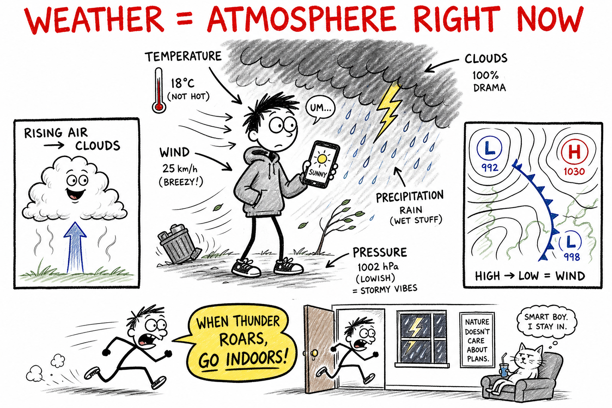

# Weather

Saturday morning you check your phone. The forecast says clear until noon — perfect for a pickup game at the park. By 1:30 the sky has turned steel gray. Wind rips napkins off the picnic table. Your friend texts: *Game off. Lightning.*

Two hours earlier the same air felt calm and warm.

That fast-changing package — sun, wind, damp, cold, storm — is **weather**.

**Weather is the state of the atmosphere at a place and time**, including temperature, humidity, wind, clouds, precipitation, visibility, and air pressure.

Weather is what you feel on your skin during cross-country practice. It is what coaches watch before calling a meet. It is what pilots, sailors, farmers, and game designers who build outdoor levels all have to respect.

Weather can flip quickly. A sunny morning can become a stormy afternoon. A dry week can end in a downpour. That is normal. The atmosphere is always in motion.

## Weather Is Not Climate

People mix these up all the time. Keep them separate from the start.

**Weather** is short-term — hours to days.

**Climate** is the long-term average pattern of weather in a region — years and decades.

A single cold day in winter does not disprove long-term warming. A single heat wave does not prove it either. You will study **climate** as its own chapter.

For now, remember this line:

**Weather is what you wear today. Climate is what your closet is built for over years.**

## The Main Ingredients

Think of weather as a recipe. The Sun, spinning Earth, oceans, and land all stir the pot.

| Ingredient | What it means | What you might notice |
|------------|---------------|------------------------|
| **Temperature** | How hot or cold the air is | Hoodie or T-shirt choice |
| **Humidity** | How much water vapor is in the air | Sticky skin, fogged glasses |
| **Air pressure** | Weight of air pushing down on you | Often felt as "clear" vs "stormy" changes |
| **Wind** | Moving air | Flags, hair, thrown passes curving |
| **Clouds** | Tiny water droplets or ice crystals in the sky | Shade, rain building, sunset colors |
| **Precipitation** | Water falling from clouds | Rain, snow, sleet, hail |
| **Visibility** | How far you can see clearly | Fog, smoke, heavy rain |

None of these works alone. **Temperature** and **moisture** together decide whether you get rain or snow. **Pressure** and **wind** together tell you if a storm is approaching.

## Air Pressure: The Invisible Push

**Air pressure** is the force from the weight of the air column above you.

You cannot see air, but it has mass. A column of air from the ground to the top of the atmosphere pushes down on every square inch of surface.

When forecasters say a **high-pressure** system is moving in, they mean air is sinking slowly over a wide area. Sinking air tends to warm and dry out. Skies often turn **clear and calm** — great for practice, not always great if you needed rain for a garden.

A **low-pressure** system means air is rising over a region. Rising air can cool and form clouds and storms. Lows often bring **wind, clouds, and precipitation**.

Wind blows because air moves from areas of **higher** pressure toward areas of **lower** pressure, like water finding a drain — except the "drain" is a low on the weather map.

Earth's rotation **curves** moving air in large systems. That twist is part of why storm tracks and wind directions can seem to turn on a map.

## Wind: Air on the Move

**Wind** is air moving from higher pressure toward lower pressure, shaped by Earth's spin, mountains, lakes, cities, and the temperature of land and water.

You feel wind at the skate park, on a boat, or when a door slams because pressure changed inside and outside a building.

Local winds have names you might hear:

- **Sea breeze** — afternoon wind from cool ocean toward warm land.
- **Land breeze** — night wind from cooler land toward warmer water.
- **Mountain breeze** and **valley breeze** — daily patterns tied to slopes heating and cooling.

On a bigger scale, the **jet stream** is a fast river of air high in the sky. It steers large masses of cold and warm air, like a conveyor belt for storm systems.

## Water in the Air: Humidity, Clouds, Rain

Water is everywhere in weather, usually as invisible **water vapor**.

**Humidity** describes how much moisture the air holds. Warm air can often hold more vapor than cold air.

When air **rises**, it expands and **cools**. Cool air cannot hold as much vapor. The vapor **condenses** into tiny liquid droplets or ice crystals — a **cloud**.

That is one of the most useful ideas in meteorology:

**Rising air cools → moisture condenses → clouds form.**

When droplets or crystals grow heavy enough, they fall as **precipitation**:

- **Rain** — liquid drops.
- **Snow** — ice crystals that stay frozen to the ground.
- **Sleet** — rain that freezes into ice pellets before landing.
- **Hail** — ice balls formed in strong thunderstorm updrafts.

**Sinking** air warms and can **evaporate** clouds, clearing the sky. Sunny high-pressure days often work this way.

## Cloud Families You Can Actually Name

You do not need to memorize every cloud type on Earth. Start with three families:

- **Cumulus** — puffy, fair-weather clouds that look like cotton piles. They can grow tall into storm clouds.
- **Stratus** — flat layers that blanket the sky like a gray sheet; often bring drizzle or steady gray days.
- **Cirrus** — thin, wispy, high clouds made of ice crystals; often mean a change in weather is coming.

Storm clouds such as **cumulonimbus** can tower like mountains and produce lightning, heavy rain, and hail.

Clouds are not "light" because they float. A thick cloud can weigh **millions of pounds**. Droplets stay aloft because they are tiny, spread out, and supported by **updrafts** — rising air inside the cloud.

## Why Weather Changes

The Sun heats Earth **unevenly**.

Reasons include:

- **Day and night** — half the planet is lit, half is dark.
- **Latitude** — the equator receives more direct sunlight than the poles.
- **Seasons** — tilt changes how strongly sunlight hits each hemisphere.
- **Land vs ocean** — land heats and cools faster than water.
- **Elevation** — mountain tops are colder than valleys.
- **Surface type** — dark pavement, snow, and forests reflect and absorb heat differently.

Uneven heating sets air in motion. Warm air rises; cool air sinks. Air flows sideways to replace what moved. Mountains **block** and **lift** air. Cities can be hotter than nearby fields (**urban heat island**).

All of this pushes air up, down, and sideways — and **weather is what you get when that motion happens fast enough to notice**.

## Air Masses and Fronts

Much of your weekly weather is shaped by huge blobs of air called **air masses** — enormous regions where temperature and moisture are fairly similar.

Examples you might hear on a forecast:

- **Continental polar (cP)** — cold and dry from interior continents.
- **Maritime tropical (mT)** — warm and humid from tropical oceans.

Where two air masses meet, forecasters draw a **front** on the map — a boundary between different air properties.

| Front | What happens (simple version) | What you might experience |
|-------|------------------------------|---------------------------|
| **Cold front** | Colder, denser air wedges under warmer air and lifts it fast | Sharp temperature drop, gusty wind, thunderstorms possible |
| **Warm front** | Warmer air rides up over cooler air ahead of it | Long period of clouds, steady rain or snow |
| **Stationary front** | Air masses stall; boundary barely moves | Days of clouds and on-and-off rain |
| **Occluded front** | A cold front catches up to a warm front | Complex clouds and precipitation |

Fronts are not the whole atmosphere, but they are a powerful story for why Tuesday feels calm and Wednesday turns dramatic.

Picture a cold front like a **snowplow blade** of dense air shoving under warm, moist air and forcing it upward fast — boom, tall clouds and storms.

## How Forecasters Do Their Job

**Meteorologists** study weather using **observations** and **models**.

**Observations** come from:

- Ground weather stations (temperature, pressure, wind).
- **Radar** — radio waves bounce off rain and snow to show where precipitation is.
- **Satellites** — cameras and sensors watch clouds and storms from space.
- **Weather balloons** — instruments rise through the air column measuring temperature, humidity, and wind at many heights.
- Ships, buoys, and aircraft reports over oceans.

They feed that data into computer **models** — programs that simulate the atmosphere forward in time using physics.

Forecasts are usually **excellent for a day or two**, **good for several days**, and **less certain** far ahead. Small measurement errors grow. The atmosphere is **chaotic** — incredibly sensitive to starting conditions.

That is not failure. It is honest science about a spinning planet wrapped in a fluid ocean of air.

When your app says "40% chance of rain," it usually means that in similar situations, rain happened on 4 out of 10 days — not that 40% of your town gets wet. Read the fine print on your favorite app.

## Severe Weather and Safety

Some weather becomes **dangerous**. Science class is a good place to learn rules that save lives.

### Thunderstorms and Lightning

**Lightning** is a giant electric spark between charged parts of a storm cloud or between cloud and ground.

- **Go indoors** when you hear thunder — if you can hear it, the storm is close enough to be dangerous.
- Stay away from tall isolated trees, open fields, and water.
- Indoors: avoid plumbing and plugged-in electronics if possible; the goal is not to be the best path for electricity.

The rule **"When thunder roars, go indoors"** exists for a reason.

### Tornadoes

A **tornado** is a violently rotating column of air connected to a thunderstorm cloud and the ground.

- Know your school's **shelter** plan.
- Lowest floor, interior room, away from windows.
- **Cars and highway overpasses are not safe shelters** — that myth has killed people.

### Hurricanes (Tropical Cyclones)

A **hurricane** is a huge rotating storm over warm ocean water with very strong winds and flooding rain.

Threats include **wind**, **storm surge** (ocean water pushed ashore), and **inland flooding** long after the eye passes.

- Evacuate when officials say so.
- Never drive through **flooded roads** — you cannot see if the road still exists underneath.

### Extreme Heat and Cold

**Heat** can cause dehydration and heat illness during summer practice. Drink water, take breaks, watch teammates.

**Cold** and **blizzards** can cause frostbite and make travel impossible. Layer clothing, limit exposed skin, and take wind chill seriously.

### Hail

**Hail** can damage cars, crops, and roofs. If stones are falling, get under sturdy cover.

Safety is not being scared of the sky. It is **respecting** what the atmosphere can do and **following warnings** from national weather services.

## Reading the Sky Like a Player Reads a Field

Good forecasters ask questions. So can you.

- Where is air **rising** or **sinking**?
- Is **moisture** available — humid air, lake, ocean nearby?
- What is the **wind** doing at the surface and aloft?
- Is **pressure** rising or falling at your location?
- What does **radar** show approaching?

Watch the western sky in many mid-latitude regions — storms often march from west to east.

Notice **wind shift** and **temperature drop** — classic signs a cold front passed.

Weather is the atmosphere's handwriting: messy, powerful, and readable with tools and patience.

## Common Misconceptions

**"Weather and climate are the same."** They are not. Weather is short-term; climate is the long-term pattern.

**"Forecasters are just guessing."** Modern forecasts are built on physics, observations, and models tested every day. Uncertainty far ahead is real — that is science, not laziness.

**"Clouds float because they are light."** Clouds can weigh enormous amounts. Tiny droplets and updrafts keep them aloft.

**"Tornadoes always look like a visible funnel from far away."** Rain-wrapped tornadoes can be hard to see. Trust warnings, not only your eyes.

**"Lightning never strikes the same place twice."** It often does — tall buildings and towers get hit repeatedly.

**"Opening windows during a tornado equalizes pressure."** It does not protect your house and wastes time you need to shelter.

**"A cold day means global warming is fake."** One day is weather. Decades of data are climate.

## The Big Idea

Weather is the short-term state of the atmosphere — temperature, moisture, wind, clouds, pressure, and precipitation at a place and time.

It changes because the Sun heats Earth unevenly and because air, water, and land move, rise, sink, and collide in patterns from local breezes to continent-sized fronts.

If you remember only one sentence, remember this:

**Weather is what the atmosphere is doing now and soon — not the long-term average pattern of a place.**

## Study Questions

1. What is weather?
2. Name five ingredients of weather you could report on a school morning announcement.
3. What is air pressure in simple language?
4. How is a high-pressure system often linked to sky conditions?
5. Why does air generally move from high pressure toward low pressure?
6. Why does rising air often form clouds?
7. What is precipitation? Name three types.
8. What is humidity, and how can you feel it?
9. Name two reasons the Sun heats Earth unevenly.
10. What is an air mass?
11. In simple words, what is a cold front?
12. How is a warm front different from a cold front in the kind of weather it often brings?
13. Name three tools meteorologists use to observe weather.
14. What is a weather model?
15. Why are long-range forecasts less certain than short-range forecasts?
16. What is the difference between weather and climate in one sentence?
17. Name one severe weather hazard and one safety habit linked to it.
18. Why can a cloud weigh a huge amount and still appear to float?
19. What is the jet stream's role in simple terms?
20. What does "When thunder roars, go indoors" mean?
21. Why should you not drive through a flooded road even if it looks shallow?
22. In your own words, explain why weather can change from sunny morning to stormy afternoon.
