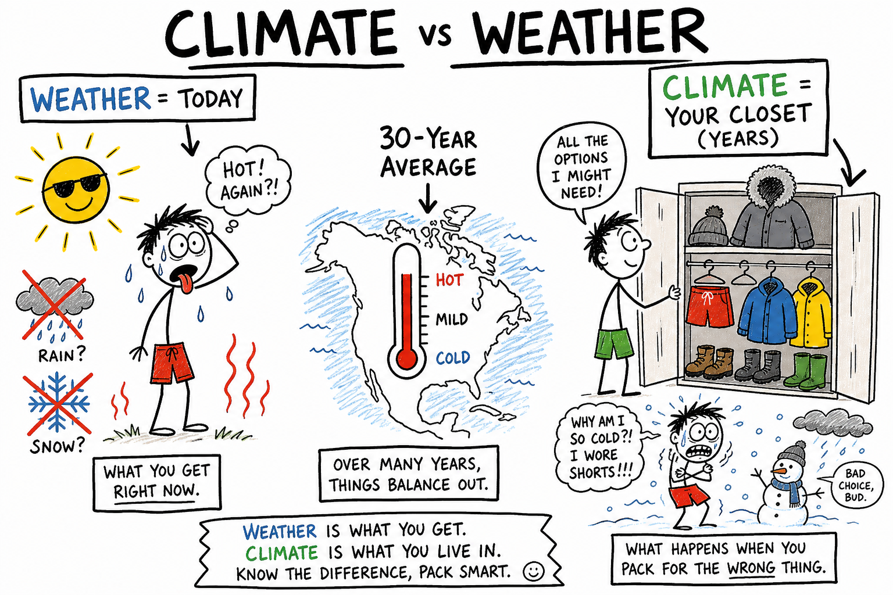
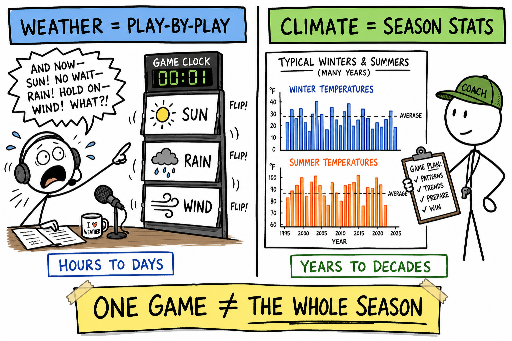
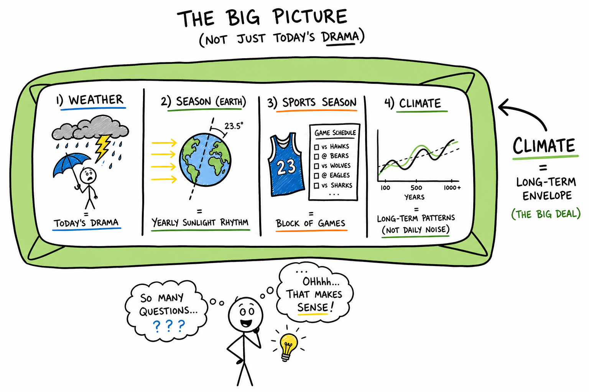
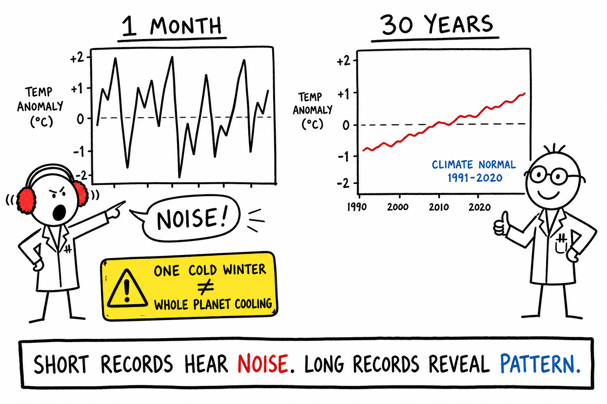
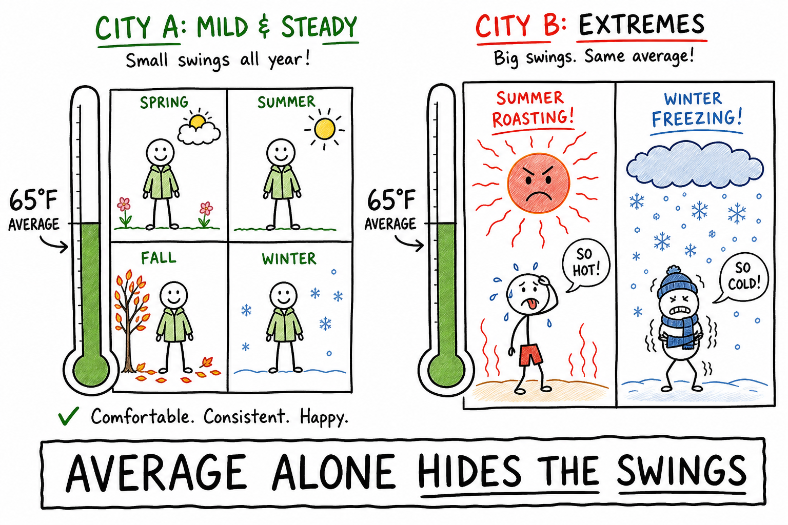
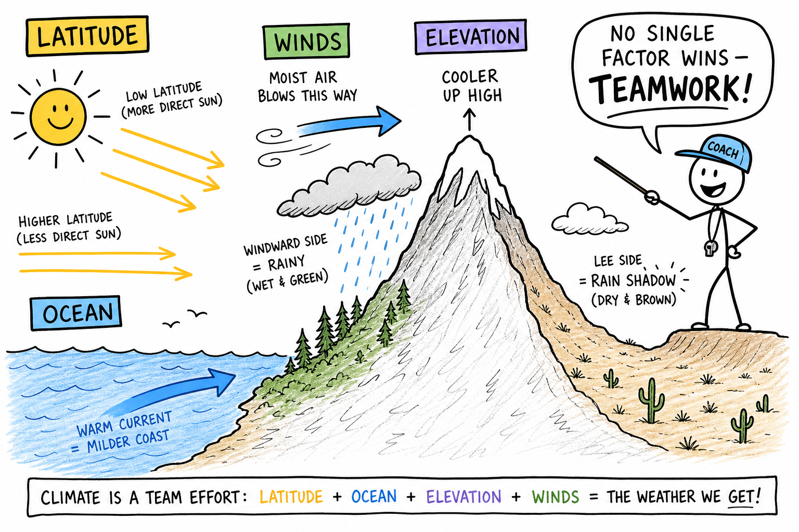
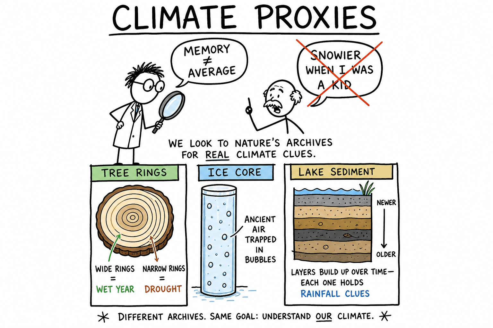
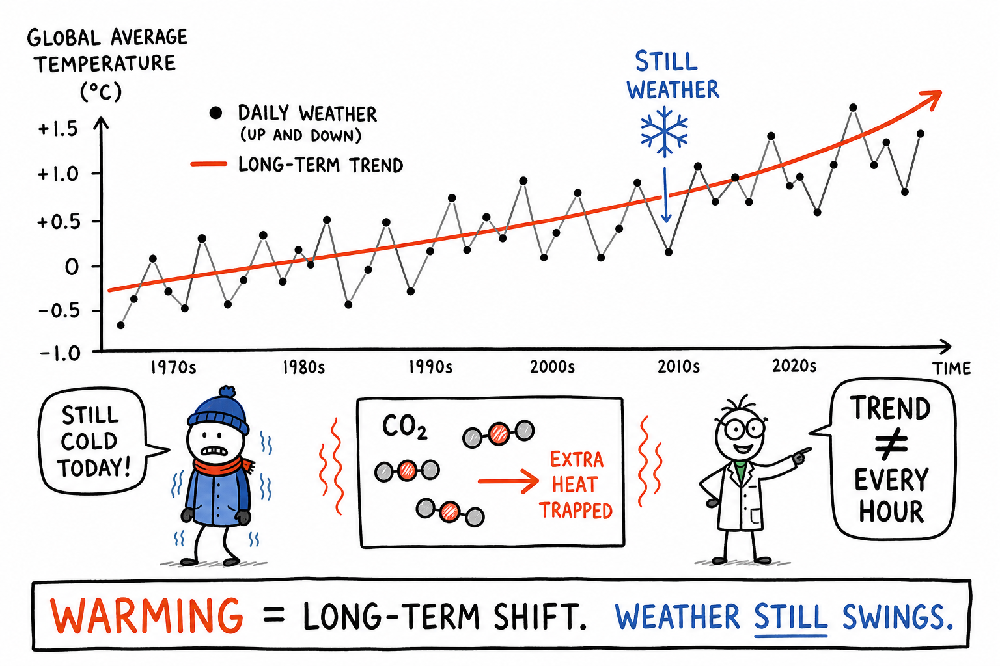

# Climate

Your travel team flies to a regional tournament in a city you have never visited. The coach texts: *Pack light — it is summer.* You show up in shorts. Day one is brutal: humid, 95°F, practice feels like running through a wet towel.

Day two a cold front rolls in. Wind. Rain. Everyone is shivering in the locker room. That is **weather** — the atmosphere doing whatever it wants this week.

If you had asked, *What is this place usually like across the whole year?* — what gear belongs in a year-round closet, when fields are muddy, whether January means parkas or rain jackets — you would have been asking about **climate**.

**Climate is the long-term pattern of weather in a region**, including typical temperatures, precipitation, wind patterns, and seasonal rhythms, plus the range of variability you can reasonably expect.

Scientists usually describe climate using **averages and records over decades**, not one afternoon at the park.

You already met **weather** in the last chapter: sun, wind, rain, and storms changing hour by hour and day by day. Climate is the bigger picture — what a place is **built for** over many years.

## Climate at a Glance

| Idea | What to remember |
|------|------------------|
| **Weather** | Short-term atmosphere — hours to days |
| **Climate** | Long-term pattern — years to decades |
| **Season** | Repeating yearly rhythm (see **seasons** chapter) |
| **Climate normal** | Often a **30-year average** (e.g., 1991–2020) |
| **Variability** | Swings, extremes, and how often records break |
| **Controls** | Latitude, ocean, elevation, winds, land cover, and more |
| **Proxies** | Tree rings, ice cores, sediments — clues from before thermometers |
| **Change** | Natural drivers **and** recent strong human influence (mainstream science) |
| **One-liner** | Weather = what you wear today. Climate = what your closet is built for. |

## Weather Is the Play-by-Play. Climate Is the Season Stats.

| | **Weather** | **Climate** |
|---|-------------|-------------|
| Time span | Hours to days | Years to decades |
| Question it answers | "What should I wear Saturday?" | "What kind of closet does this city need?" |
| Example | Today's thunderstorm cancels the game | This coast usually gets rain in winter, dry summers |
| Changes how fast? | Can flip in hours | Shifts slowly; trends need long records |

A useful line to keep:

**Weather is what you wear today. Climate is what your closet is built for over years.**

One snowy week in Michigan does not erase the fact that Michigan winters are usually cold. One heat wave in Seattle does not turn Seattle into Phoenix. Single events are **weather**. Long patterns are **climate**.

## Climate, Seasons, and "Sports Season"

Three words sound alike. Keep them separate.

**Weather** is the daily drama — the storm that ruins practice, the fog that hides the end zone.

**Season** (astronomical) is Earth's yearly sunlight rhythm — summer, winter, and the tilt that drives them. You studied that in the chapter on **seasons**.

**Sports season** is a block of games: fall football, winter basketball, spring baseball. Useful for scheduling. Not the same as climate science.

**Climate** is the long-term envelope all of those sit inside — how harsh winters *tend* to be, how dry summers *usually* run, and whether "winter gear" means snow boots or a rain shell.

A warm January afternoon is still winter. A rainy July week is still summer. Climate describes what a place is **generally like** across many years, not one weird week.

## Why Scientists Use Long Time Spans

The atmosphere is noisy. El Niño years feel different from La Niña years. Some winters dump extra snow; some summers stay mild.

If you only looked at **one month**, you might think a city is always dry — until the rainy season arrives.

If you only looked at **one cold winter**, you might think the whole planet is cooling — while the **average over 30 years** still climbs.

Climate scientists often compare data to a **climate normal** — usually a 30-year average (for example, 1991–2020 in many countries). That window is long enough to smooth out lucky streaks and weird years, but recent enough to describe the place you live in now.

The big idea:

**Short records hear noise. Long records reveal pattern.**

## Averages Tell Part of the Story — Variability Tells the Rest

Say two cities both average **65°F** for the year. Sounds identical, right?

Not necessarily.

- **City A** might stay mild all year — small swings, rare freezes.
- **City B** might roast in summer and freeze in winter — huge swings, but the average still lands near 65°F.

Modern climate descriptions include **variability**: how often heat waves hit, how long droughts last, whether big storms cluster in certain months, and whether records are breaking more often than they used to.

For an athlete or coach, variability matters as much as the average:

- A team that **trains in cool, dry air** all year may struggle in **humid heat** at an away tournament — even if both cities "average" similar yearly temperatures.
- A hiker planning a **mountain trek** needs to know not just average snow, but **when** peaks are passable and how late spring melt runs.
- A game designer building an open-world map needs believable **biomes** — deserts, tundra, and rainforests in places that make geographic sense, not scattered at random.

**Climate is not only "the average." It is the average plus the spread — and how that spread is changing.**

## What Shapes a Region's Climate

No serious scientist says climate is "only latitude." It is a woven belt of causes working together.

| Factor | What it does (simple version) | Example you might notice |
|--------|------------------------------|---------------------------|
| **Latitude** | How directly sunlight hits a place | Equator hot year-round; poles cold |
| **Distance from ocean** | Water heats and cools slower than land | Coast milder; inland more extreme |
| **Ocean currents** | Moving water carries heat | Warm current → milder coast; cold current → cooler, foggier coast |
| **Elevation** | Air cools as it rises | Denver cooler than Miami at similar latitude |
| **Prevailing winds** | Steady wind patterns move air and moisture | Rain on windward mountain slopes; dry on the lee side |
| **Mountains** | Block and lift air | Desert on one side of a range, forest on the other |
| **Land cover** | Forest, ice, desert reflect and absorb heat differently | Cities hotter than nearby fields at night |
| **Large circulation** | Jet stream, monsoons, global pressure belts | Storm tracks shift season to season |

**Continentality** is a useful word: deep inside a large continent, far from ocean, summers and winters often swing wider than on a coast.

**Monsoons** are seasonal wind and rain reversals — famous in South Asia, but the idea (wet season / dry season) appears in other regions too.

No single factor wins every battle. Climate is **teamwork** among Sun angle, geography, ocean, ice, wind, and life on land. The chapter on **latitude** is one piece of that puzzle; oceans, mountains, and winds fill in the rest.

## Climate Zones — Training Wheels, Not the Whole Map

Textbooks often show simplified **climate zones**: tropical, dry, temperate, continental, polar.

Zones are **training wheels**. They help you organize the world:

- where **deserts** cluster,
- where **rainforests** grow,
- where **winters bite** and lakes freeze,
- where you could wear shorts in January vs where you need a serious coat.

Real Earth has **blended boundaries** and local surprises. Elevation, ocean nearness, and wind can override what latitude alone suggests.

Still, zones are worth learning because they connect climate to **biomes** — the major life zones of Earth (forest, grassland, tundra, and so on). Farmers, park rangers, military planners, and video-game world builders all think in these patterns when they ask: *What usually happens here?*

In a survival or exploration game, if the map puts a jungle next to a polar ice cap with no mountains or ocean between them, players notice. Climate rules — even in fiction — make worlds feel real.

## How Scientists Measure Climate

Climate science depends on **patient measurement** — the opposite of a viral hot take.

**Modern instruments** include:

- **Weather stations** on land — temperature, rainfall, wind, pressure, year after year.
- **Rain gauges** and **snow surveys** — how much water actually reached the ground.
- **Ocean buoys** and **ship reports** — filling gaps over the seas.
- **Aircraft** and **weather balloons** — profiles through the air column.
- **Radar** and **satellites** — watching clouds, storms, ice, and vegetation from above.

Satellites are especially powerful over **oceans and deserts** where ground stations are sparse. They track sea surface temperature, ice extent, forest health, and more.

For times **before** thermometers and satellites, scientists use **proxies** — natural archives that responded to past conditions:

- **Tree rings** — wide rings often mean good growing years; narrow rings can mean drought or cold.
- **Ice cores** — trapped bubbles and chemistry preserve ancient air and temperature clues.
- **Lake sediments** and **coral chemistry** — layered records of rainfall, chemistry, and temperature.

No proxy is perfect alone. Together they build a picture far more reliable than **grandpa's memory** of "snowier winters when I was a kid." Human memory is short, selective, and great at remembering the wildest year — not the average one.

## Climate Changes — It Always Has

Earth's climate has **never** been frozen in one setting forever.

Over geologic time, climate shifted because of:

- **Volcanic eruptions** — ash and gases can cool the planet for a few years.
- **Slow changes in geography** — continents drift; mountains rise; ocean gateways open or close.
- **Orbital cycles (Milankovitch cycles)** — subtle changes in Earth's tilt and path around the Sun, pacing ice ages over tens of thousands of years.
- **The Sun's output** — varies slightly; important over long spans, though not the main story for recent rapid warming.

Natural change is real. So is the question scientists ask today: **What is driving change now, and how fast?**

## Recent Change and Human Influence

Careful measurements show the **climate system warming** over the last century-plus, with linked changes in:

- **Ice** — glaciers and polar ice shrinking in many regions.
- **Sea level** — rising as water warms and ice melts.
- **Ecosystems** — species shifting range, timing of blooms and migrations changing.
- **Extreme weather risk** — some hazards becoming more frequent or intense in many regions (exact details vary by hazard and place).

The mainstream scientific conclusion is that **human activities** — especially **burning fossil fuels** (coal, oil, gas) and **land-use changes** like deforestation — have added large amounts of **greenhouse gases** to the atmosphere. Those gases trap more heat. They have become a **dominant driver** of recent rapid change, on top of natural variability.

This chapter is not a full earth-science course. It gives honest framing:

**Climate science studies long-term patterns and their causes — natural factors and human influences together.**

Understanding the science does not mean every solution is easy. It does mean decisions about energy, forests, cities, and farms can be grounded in evidence instead of slogans.

**Warming does not mean "never cold again."** It means long-term averages and many indicators shifting — while weather still swings hot and cold day to day. Good climate literacy holds **trend** and **variability** in your head at the same time.

## Thinking Like a Climate Scientist

When you hear a bold claim about climate, run a mental checklist:

1. **What time span?** One day, one season, or 30+ years?
2. **Weather noise or long-term shift?** Is this inside normal variability or outside it?
3. **What part of the Earth system?** Air, ocean, ice, land plants, human emissions?
4. **What evidence?** One anecdote, or many independent measurements?
5. **What is uncertain?** Good science names what we know firmly and what we are still refining.

Climate is Earth's long memory of **sunlight, spin, chemistry, water, ice, and life** — written in ice, rings, sediments, and instruments.

## Climate in Your Real World

Climate shows up in choices people make:

- **Coaches and athletes** — heat-acclimation camps, altitude training, hydration plans for humid away games, knowing whether "spring break" at a beach tournament means sunburn risk or surprise cold rain.
- **Engineers** — bridges and roads designed for local freeze-thaw cycles and flood risk.
- **Farmers and food supply** — when to plant, which crops survive, how irrigation is scheduled.
- **Military and disaster planners** — bases, training ranges, and relief supplies matched to regional hazards.
- **Travel and gear** — knowing whether "winter" in your destination means rain jackets or parkas and snow boots.

Even video games that model worlds use **climate rules** — deserts, jungles, and tundra do not appear randomly if the designers want the map to feel believable.

## Common Misconceptions

**"Climate and weather are the same."** They are not. Weather is short-term; climate is the long-term pattern and variability.

**"One cold day disproves warming."** One day is weather. Long-term trends need **long records** and **many indicators** — temperature, ice, sea level, and more.

**"One heat wave proves everything about climate change."** A single event is also weather. Scientists study **frequency**, **intensity**, and **context** over time.

**"Climate cannot change naturally."** It can, and it has — for millions of years. The scientific question is what is driving change **now** and at what **speed**.

**"Climate equals season."** Seasons repeat every year. Climate is the **envelope** those seasons sit inside across many years — including how harsh or mild those seasons tend to be.

**"Scientists only use computer models."** Models are tools, but they rest on **observations** — stations, buoys, balloons, satellites, ice cores, and tree rings.

**"Average temperature is all that matters."** Two places with the same average can feel totally different because of **rainfall, humidity, extremes, and seasonality**.

**"Warming means no more snow."** Many cold places still freeze. The question is long-term patterns — how often, how deep, how long — not whether your driveway iced over last Tuesday.

## The Big Idea

Climate is the long-term pattern and variability of weather in a region, usually studied across decades.

It is shaped by latitude, geography, oceans, winds, elevation, land cover, and other Earth-system factors. It changes from both **natural** causes and, in recent times, strong **human** influences.

Weather is the play-by-play. Climate is the season stats stretched across years.

If you remember only one sentence, remember this:

**Climate is the long-term average behavior of the atmosphere and related parts of Earth — not a single day's weather.**

## Study Questions

1. What is climate?
2. What is the difference between weather and climate?
3. How is climate different from a single astronomical season?
4. Why do scientists use long time spans (such as 30-year averages) when studying climate?
5. What does variability mean in climate discussions?
6. Why can two places have the same average yearly temperature but different climates?
7. Name three factors that influence a region's climate besides "today's wind."
8. What is continentality in simple terms?
9. What are climate zones useful for, and why are they only a simplified picture?
10. Name three tools scientists use to measure modern climate.
11. What is a climate proxy? Give two examples.
12. Why are proxies important for understanding climate before modern instruments?
13. Name one natural cause of climate change over geologic time.
14. What is one human activity commonly linked to recent rapid climate change?
15. Why is one cold winter not a simple disproof of long-term warming trends?
16. Why does "warming" not mean "never cold again"?
17. What is a climate normal (such as a 30-year average) used for?
18. Give one example of how climate affects decisions athletes, farmers, or engineers might make.
19. Name one misconception about climate and correct it.
20. When you hear a climate claim, what is one question you should ask about the time span of the evidence?
21. What parts of the Earth system are connected in climate science? Name at least three.
22. Why can relying on one person's memory of "snowier winters long ago" be misleading?
23. How might video-game world builders use climate-zone ideas?
24. In your own words, explain the difference between weather noise and a long-term climate trend.
